# 01.파이썬 데이터 분석을 위한 개발 환경


### 1.1 구글 코랩

- -

## 

### Colab 개요


### 구글이 제공하는 클라우드 기반의 주피터 노트북(jupyter notebook) 환경

- 파이썬을 기반으로 한 데이터 분석, 머신러닝, 딥러닝 등의 작업에 편리

- 브라우저에서 실행

- 고성능 하드웨어를 오랜 기간 사용하려면 유료

  - 단기간 사용한다면 무료

  - 가상 머신을 제공하여 사용자가 별도로 서버를 구축하지 않고도 고성능의 하드웨어 자원을 활용

- 특징

  - 무료 GPU 지원:

  - 클라우드 기반

  - 파이썬 라이브러리 지원

  - 구글 드라이브 연동

  - 데이터 시각화
    - Matplotlib, Seaborn, Plotly 등 다양한 시각화 라이브러리를 활용 가능

---

## 

### 코랩 colab.research.google.com 접속

- 구글 코랩 사이트 https://colab.research.google.com에 접속
- 구글 계정으로 로그인 한 후, 다음 [노트 열기] 화면에서 ‘+ 새 노트’
- 구글 계정 필요


---

## 노트북 파일 이름 변경

- 원하는 이름으로 수정


---

## 코랩 엔진 연결

- 연결 클릭


- 화면 우측과 하단에 코랩 엔진 연결 정보가 표시

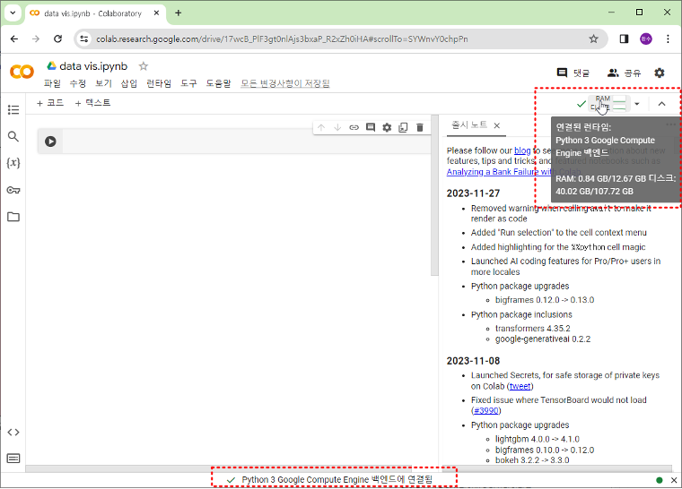

---

## 셀(cell)

코드(code Cell)과 텍스트 셀(text cell)로 구분


- 코드 셀(code cell)
  - 파이썬 코드
- 텍스트 셀(text cell)
  - 마크다운(markdown) 형식의 문서가 저장
    - markdownguide.org 참고
- ‘+ 코드 | + 텍스트’를 선택
  - 셀에서 위쪽 부분의
    - 위에 셀이 생성
- 아래 부분을 선택
  - 아래에 셀이 생성
    - 코드 셀(code cell)과 텍스트 셀(text cell)로 구분


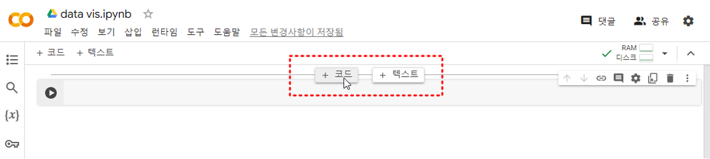


---

## 텍스트 셀

- 왼쪽의 마크다운 입력 부분과 오른쪽의 표시 부분


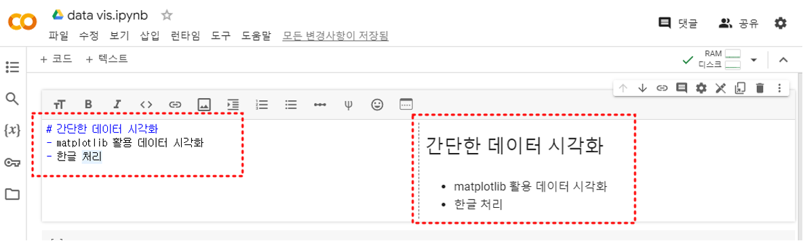


- 위 텍스트 셀의 실행 화면

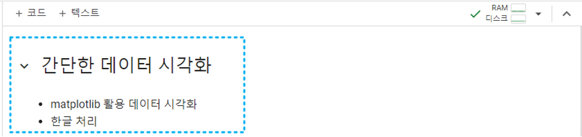


---

## 코드 셀 실행

- 코드 셀

  - 파이썬 코드를 입력 후

  - 왼쪽 상단 화살표 > 버튼이나 shift + enter를 눌러 실행


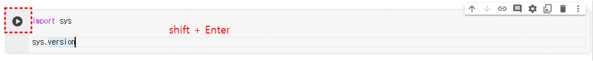


- 셀의 좌측 상단의 [1], [2] 등은 실행 순서
  - 함수 site.getsitepackages()로 출력되는 내용이 일반 지역 컴퓨터와 다름


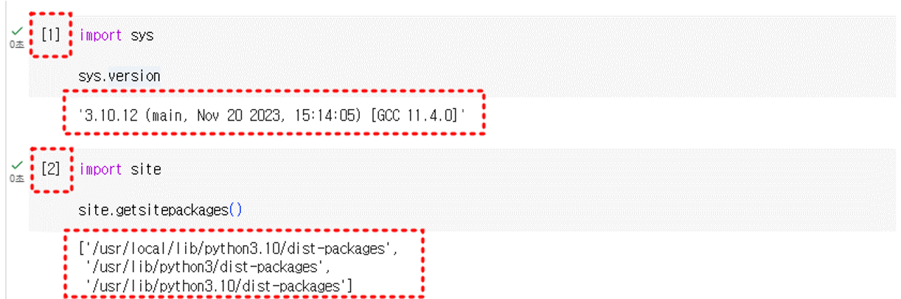

---

## numpy와 matplotlib 버전을 확인


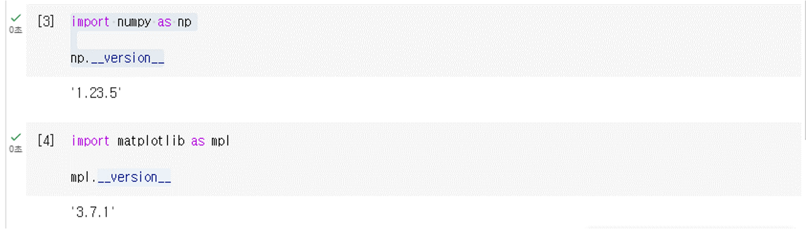


---

## 데이터 시각화 준비

- 데이터 시각화에서

  - 한글 처리를 위해 다음 필요

    - 한글 모듈 설치

    - 한글 모듈 불러오기


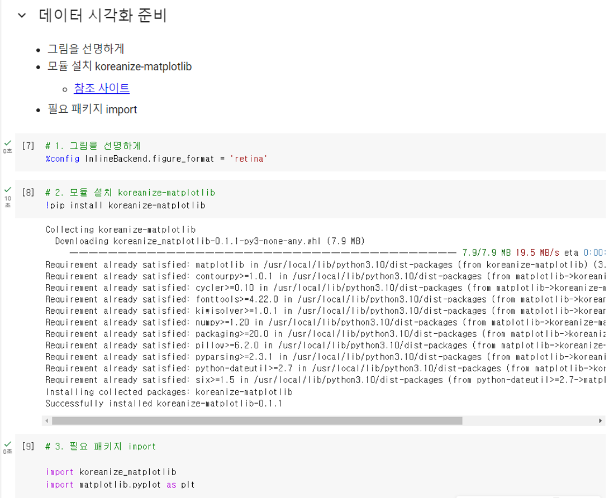


---

## 직선 그리기

- 코랩에서 제목과 그래프


```python
import matplotlib.pyplot as plt
plt.title('데이터 시각화의 한글 준비와 기본 직선 그래프')
plt.plot([10, 5, 20, 30])
plt.show()
```


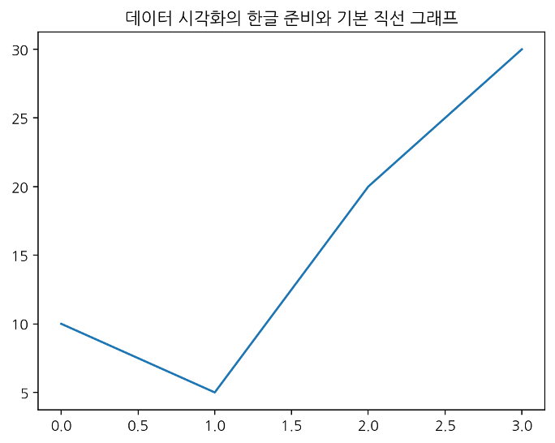


- import matplotlib.pyplot as plt
- plt.title('데이터 시각화의 한글 준비와 기본 직선 그래프')
- plt.plot([10, 5, 20, 30])
- plt.show()

---

## 파일 데이터 준비

`행전안전부 주민등록 인구통계`로 검색


- 코랩 노트북 좌측의 폴더에 드래그 드롭으로 파일을 올릴 수 있음
  - 다음 사이트에서 파일을 내려 받자.
    - 2023년 11월 도별 인구를 내려 받아 파일 202311popmonth.csv로 저장

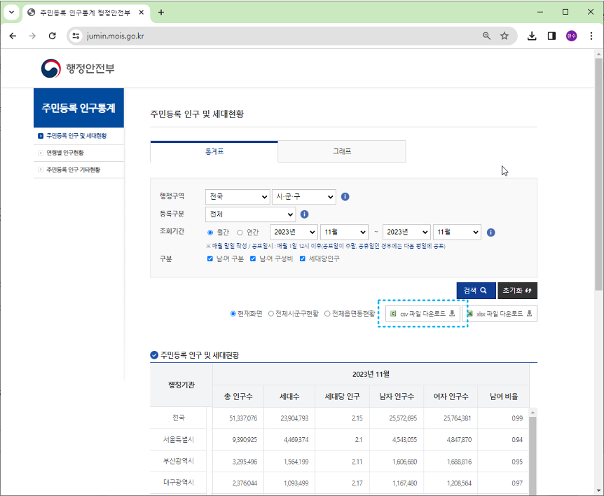

- ‘행정안전부 주민등록 인구통계’로 검색

---

## 코랩에 데이터 파일 업로드

- 코랩 왼쪽 폴더에 드래그 앤 드롭(drag & drop)으로 업로드
  - 내려 받은 파일 202311popmonth.csv

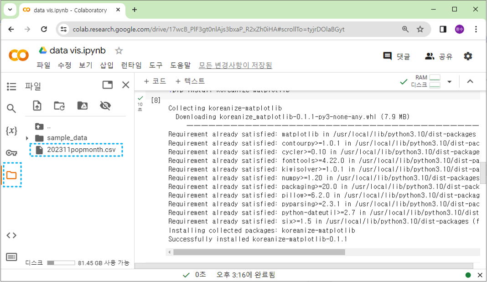


---

## 인구 데이터 전처리

- 첫 열은 index로, 콤마가 들어간 값은 정수로 파일을 읽어 pop에 저장
  - 키워드 인자 encoding='cp949', index_col=0, thousands=','를 사용

```python
import pandas as pd
pop = pd.read_csv("202311popmonth.csv", encoding='cp949', index_col=0, thousands=',')
pop

```


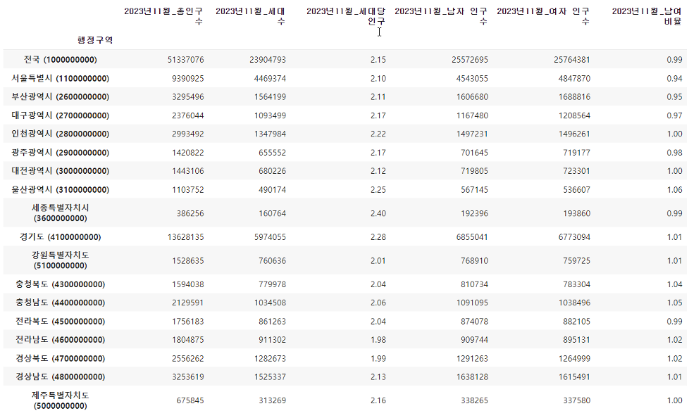

---

## 데이터프레임 pop의 열이름을 수정

- 첫 5행을 표시

```python
pop.columns = ['총인구수', '세대수', '세대당인구', '남자인구수', '여자인구수', '남여비율']
pop.head()
```


- 위 결과에서 우측 그래프 아이콘(Suggest charts)을 누르면 추천하는 그래프 표시

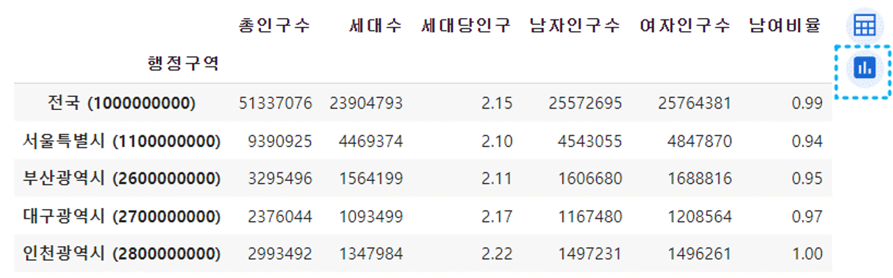


---

## 코랩이 추천하는 그래프


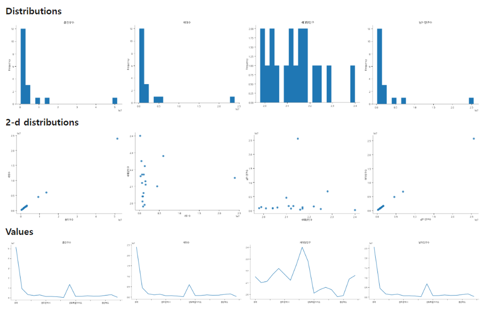


---

## pop의 index를 수정

- 도시이름만으로 구성


```python
pop.index = [pop.index[i].split()[0] for in range(len(pop))]
pop

```


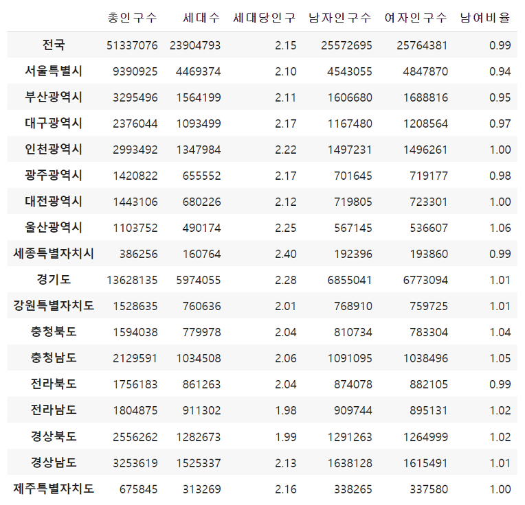


---

## 인구 데이터 시각화

### 

```python
import matplotlib.pyplot as plt
import seaborn as sns
sns.scatterplot(pop['총인구수'])
plt.xticks(rotation=90)
plt.show()
```


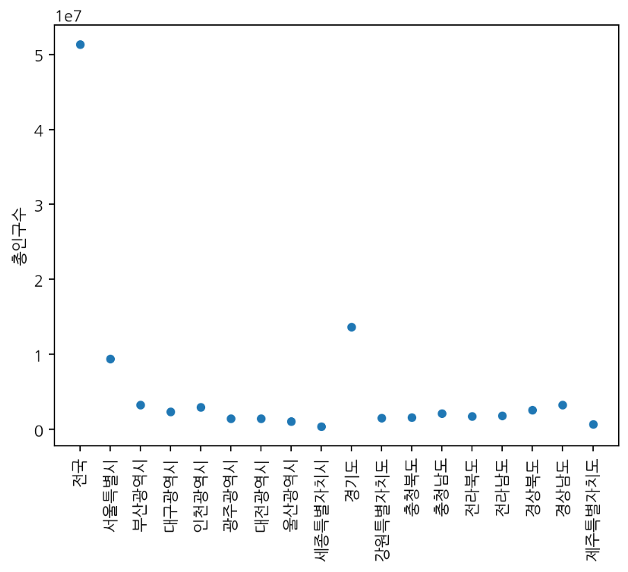


---

## ‘총인구수’로 정렬해 막대 그래프를 그린 코드


```python
import matplotlib.pyplot as plt
import seaborn as sns
pop1 = pop.sort_values('총인구수')
sns.barplot(x=pop1.index, y='총인구수', data=pop1)
plt.xticks(rotation=90)
plt.show()
```


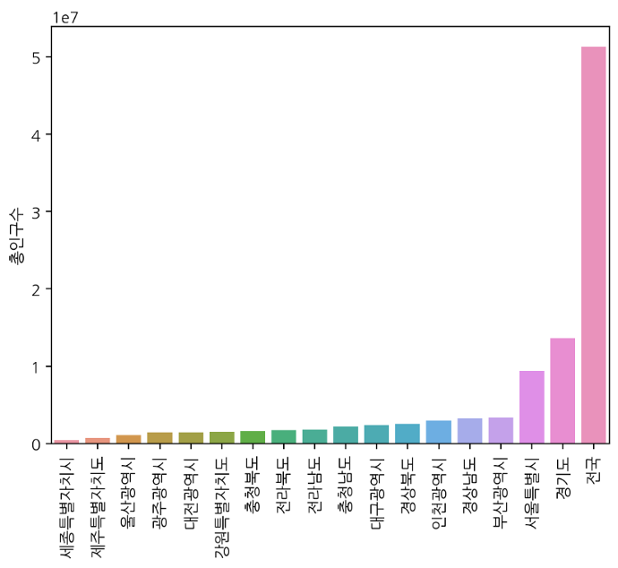


---

## 파일 저장

- 메뉴 파일 | 저장 ctrl + s

  - 작성된 노트북 파일은 자신의 구글 드라이브에 저장

  - 메뉴 ‘Drive에 사본 저장’을 누르면 ‘파일이름의 사본’으로 저장


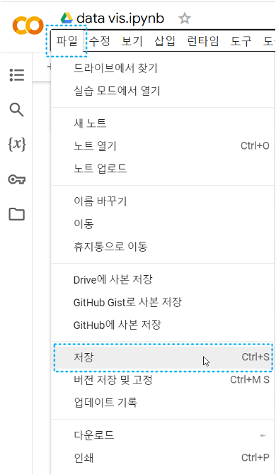


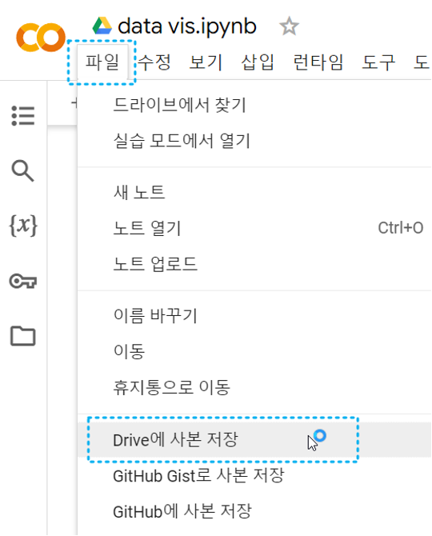


---

## 구글 드라이브 확인

- 노트북 파일은 자신의 구글 드라이브의 ‘Colab Notebooks' 폴더 하부에 저장


---

## 1.2 비주얼 스튜디오 코드

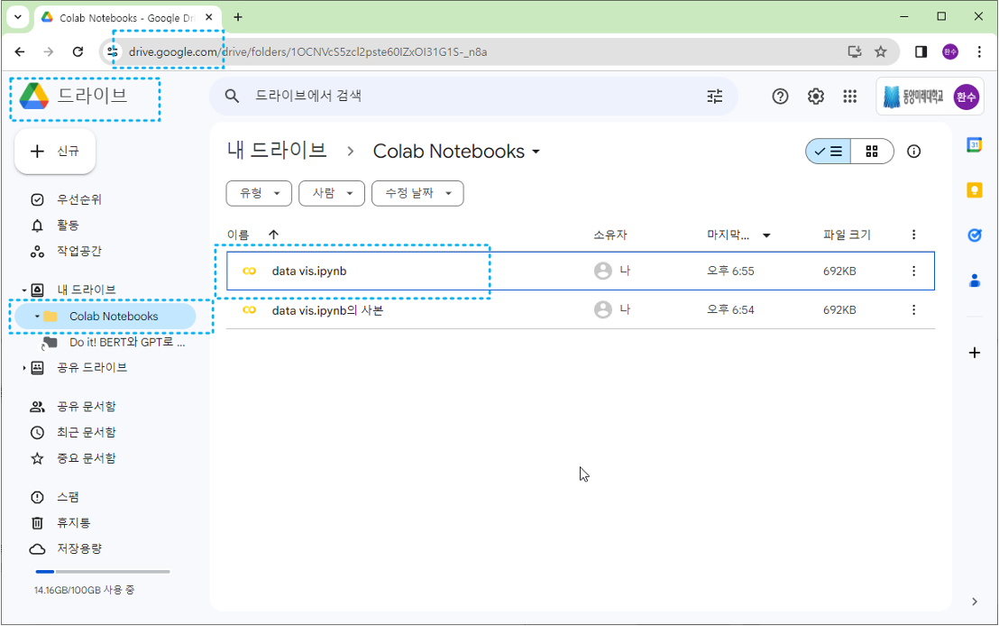

---

## 비주얼 스튜디오 코드(Visual Studio Code, 이하 vs code) 개요

마이크로소프트에서 제공하는 편집기, 통합개발환경


- 대부분의 프로그래밍 언어를 위한 개발환경을 지원
- 가볍고 확장 가능한 통합개발환경(IDE)
  - 다양한 소프트웨어 개발환경으로 사용되며, 많은 언어와 프레임워크(framework)를 지원
- 전문 텍스트 에디터로 2016년에 정식판이 처음으로 발표
  - 매우 빠른 버전 개발로 현재 호평받는 범용 코드 편집기이자 통합개발환경으로 발전


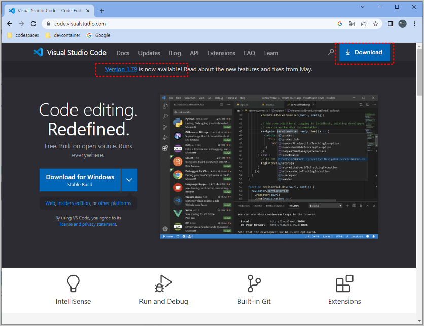


## vs code 장점과 인기

개발자들은 자신의 환경에 맞게 플러그인과 설정을 추가하여 보다 효율적인 작업을 수행


- 다양한 파이썬 코드

  - 전통 파이썬 파일 *.py

  - 대화형 쉘(interactive shell)로도 사용할 수 있는 장점

  - 노트북 파일 *.ipynb로도 활용이 가능

- 간단한 코드 에디터에서부터 복잡한 프로젝트를 지원하는 풍부한 기능을 제공

  - 최근 많은 개발자에게 인기


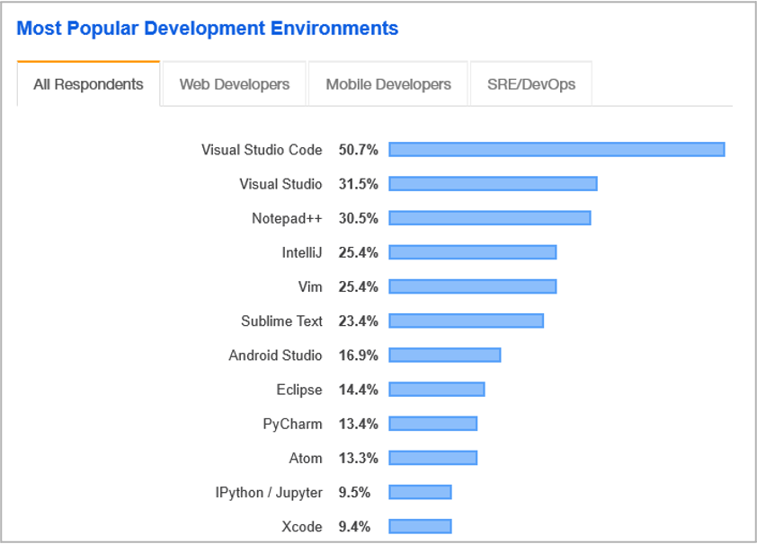

---

## vs code 설정

- vs code 기능 추가
  - 확장(extensions) 설치

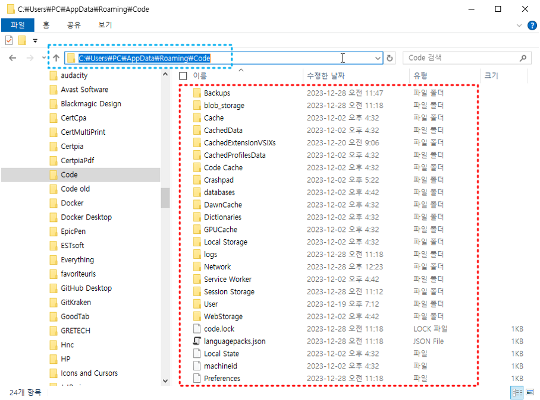

- 환경 설정이 다음 폴더

  - 다음 폴더에 이전에 설정된 모든 설정내용이 저장

    - 이전 설정을 삭제하려면 다음폴더를 삭제

    - 다음 폴더의 삭제로 vs code의초기 설정으로 되돌아갈 수 있음

- ■ C:\Users\[로그인계정]\.vscode

- ■ C:\Users\[로그인계정]\AppData\Roaming\Code

---

## vs code 실행

- vs code 첫 실행 화면
- 상단에 주 메뉴
- 왼쪽에 활동바(activity bar)인 주 메뉴 아이콘
- 가운데에는 현재 환영 창(welcome window)

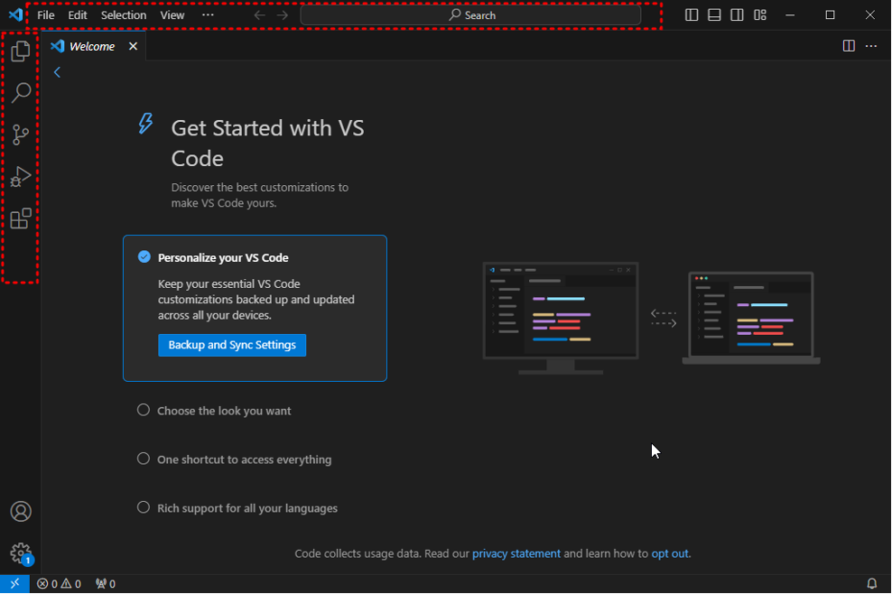

---

## 코드를 위한 폴더와 파일 생성

- 활동바에서 제일 상단 탐색기(explorer)를 눌러 ‘Open Folder'를 선택
  - code notebook처럼 원하는 폴더를 하나 만들어 선택


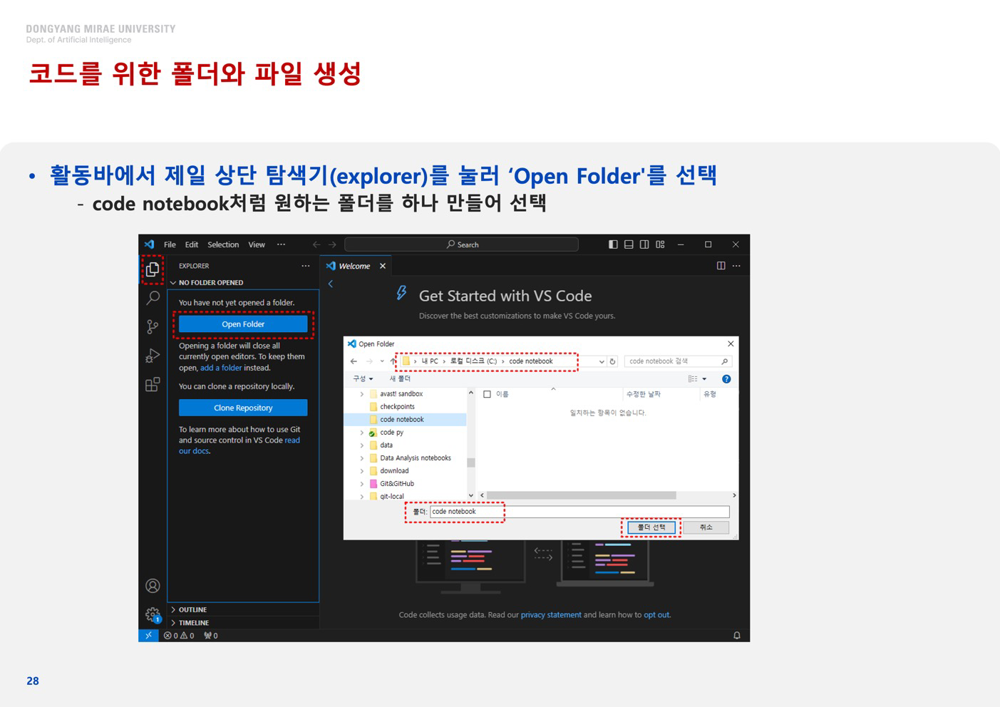

---

## 파이썬 파일을 생성

파일형식 `*.py`

- 다음으로 폴더 ’code notebook' 하부에 파이썬 파일을 생성

  - 파일 이름

  - hello.py로 생성

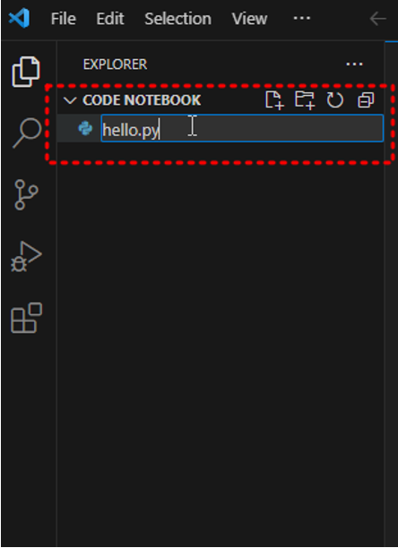


---

## 파이썬을 위한 확장 설치

- 파이썬 소스 파일 hello.py에 파이썬 코드를 기술

  - ctrl + F5로 실행

  - 이어서 표시된 다음 대화상자에서 ’Find Python extension'을 선택

- 확장에서 선택된 'Python'의 install을 눌러 설치


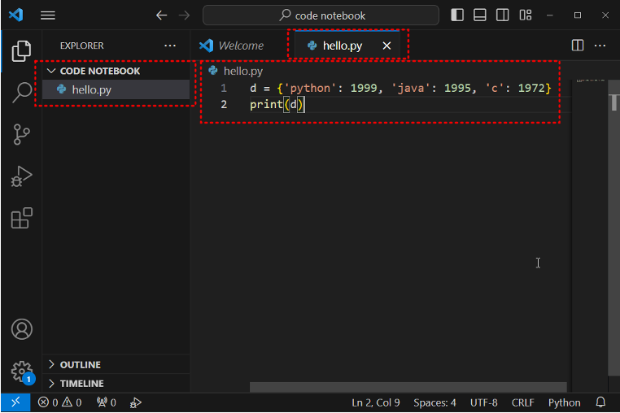


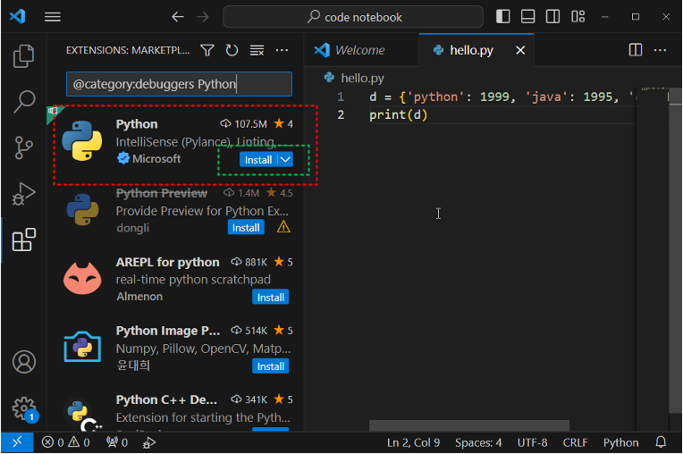


---

## 파이썬 소스 파일 실행

- 현재 소스를 실행

  - 메뉴 Run | Run Without Debugging

  - 단축 키로는 Ctrl + F5


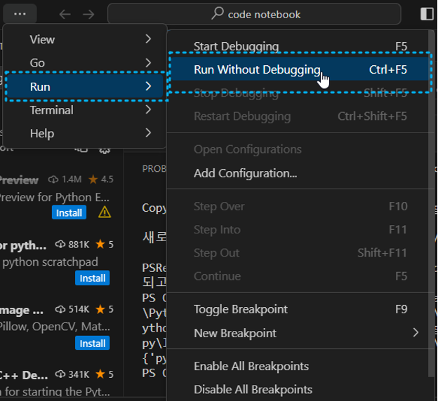


- 우측 하단에 터미널(Terminal)이 열리고
  - 내부명령 창에 파이썬 소스를 실행하는 명령과 함께 결과가 표시

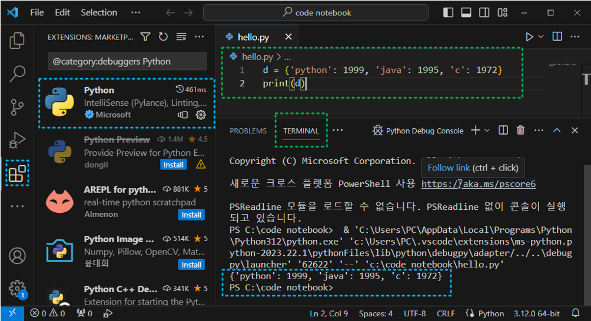

---

## 노트북 파일 생성

- 확장자 ipynb의 노트북 파일 ’pybasic.ipynb‘ 하나를 생성
  - 노트북 확장자 *.ipynb를 입력
- 생성된 노트북 파일의 우측 ’Select Kernel'을 선택


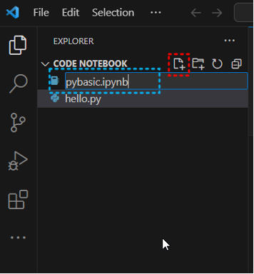


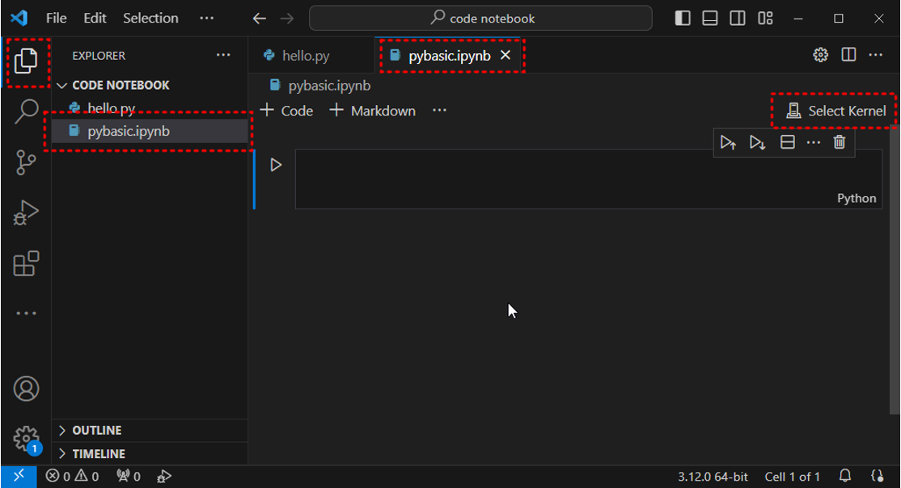


---

## 노트북 파일 실행을 위한 확장 설치

직접 선택해서 설치하지 않아도 노트북 파일에서 [select kernel]을 선택해도 설치 가능


- 명령 팔레트(command palette)에 표시
  - 'Install/Enable suggested extensions Python + Jupyter'를 누르면 필요한 확장들이 자동 설치


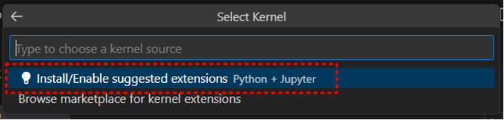


- 설치된 확장
  - 파이썬과 주피터 관련된 여러 확장이 설치


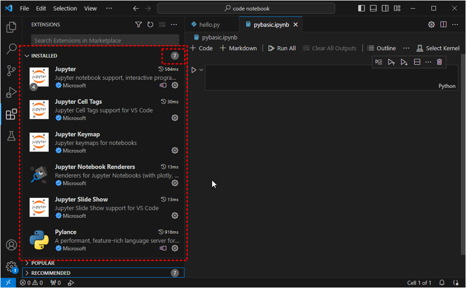


---

## 노트북 파일 인터프리터 선정

- 생성된 노트북 파일의 우측 ’Select Kernel'을 선택

- 명령 팔레트(command palette)에 표시된 목록 중에

  - 차례로 ‘Python Environments...'와 ’Anaconda3 ...'을 선택

  - 물론 표준 파이썬 등의 다른 인터프리터에 데이터 분석을 위한 패키지 numpy, pandas, matplotlib 등이 설치되었다면 해당 인터프리터를 선택 가능

- 다시 다른 노트북 파일을 만들거나 연다면 항상 이 커널 선택 과정 선행 필요


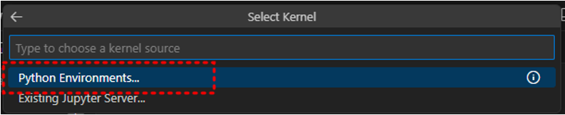


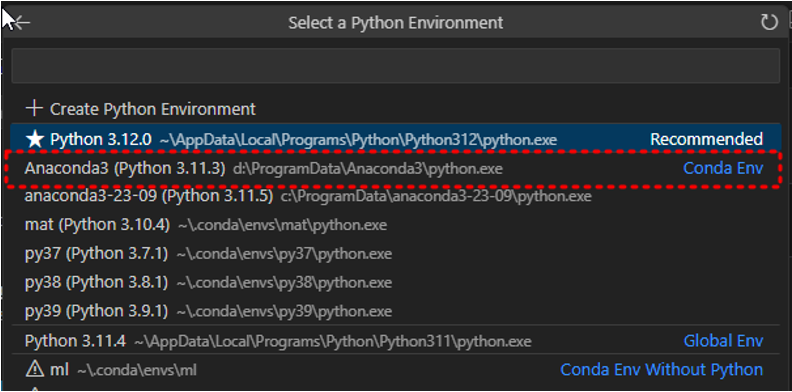


---

## 노트북 실행

- 셀에 소스를 코딩한 후 Shift + Enter로 실행
  - 셀 왼쪽의 화살표로도 실행 가능


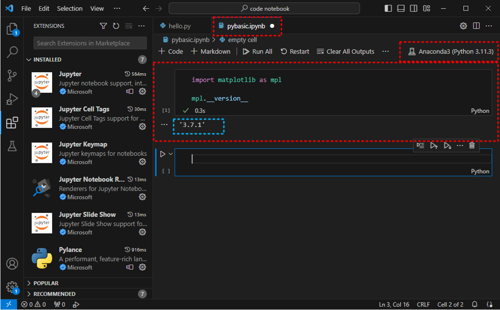

