# ch02 파이썬 기초와 자료구조.pptx

## Slide 1

- 단원 02
- 파이썬 기초와 자료구조
- 인공지능소프트웨어학과
- 강환수 교수

---

## Slide 2

### 2.1 파이썬 언어 기초

- -

---

## Slide 3

### 주석과 상수

- 주석(comments)

  - `#`아후부터 줄 마지막까지 주석

- 상수(literals)

  - 수(정수, 실수), 문자열 표시

  

- 오류 발생 표시

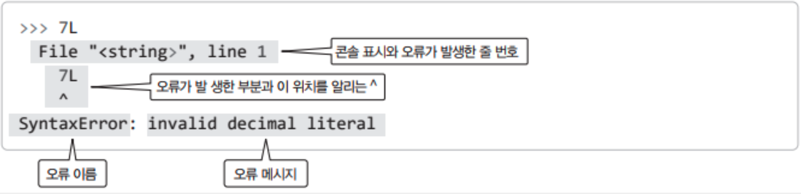

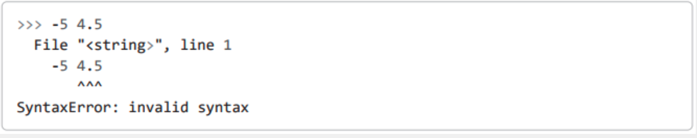

- 튜플(tuple)
  - 상수를 쉼표(또는 콤마) ,로 구분해 나열하면 괄호를 둘러싼 수의 나열이 표시

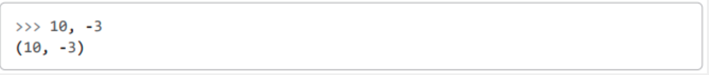

## Slide 4

### 변수와 대입

- 다양하게 변하는 값을 저장하는 변수(variables) a에 값 3을 저장해 출력
  - 변수에 값을 저장하려면 대입 연산자 =을 사용

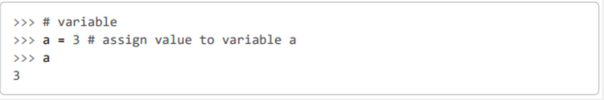

- 다중 대입 지원

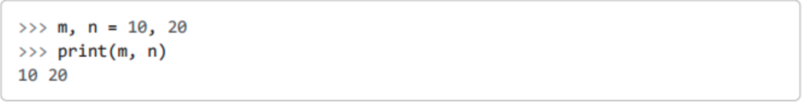

- m과 n의 값을 서로 교환

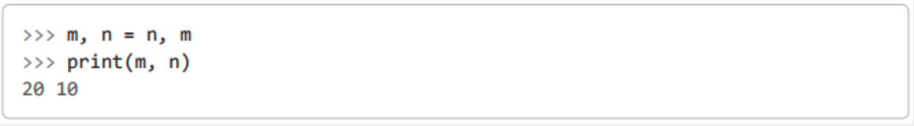

---

## Slide 5

### 변수 이름 조건

- 식별자(identifiers)

  - 프로그래밍 언어에서 프로그래머가 직접 만드는 변수나 함수 이름

- 식별자의 구성 조건

  - 영어 알파벳, 숫자, _(밑줄)을 사용하며 알파벳 대문자와 소문자는 구별

  - 첫 문자는 반드시 알파벳이나 밑줄(_)로 시작해야 하며 첫 문자로 숫자는 올 수 없음

  - 마침표 .를 사용할 수 없음
    - 객체지향 언어인 파이썬은 마침표 .를 연산자로 사용하기 때문

  - 문법에 사용되는 예약어인 키워드는 사용 불가

- 조건 정리

  - 영어 알파벳, 숫자, _(밑줄)을 사용

  - 첫 글자는 반드시 알파벳이나 밑줄(_)로 시작

  - 다양한 특수 문자(%, $, # 등)를 사용할 수 없음

  - 문법에 사용하는 if while 등의 키워드는 사용할 수 없음

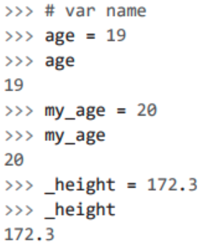

---

## Slide 6

### 파이썬 기본 자료형

프로그래밍 언어에서 자료의 종류

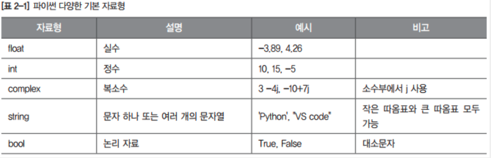

---

## Slide 7

### 자료형 코드 실습

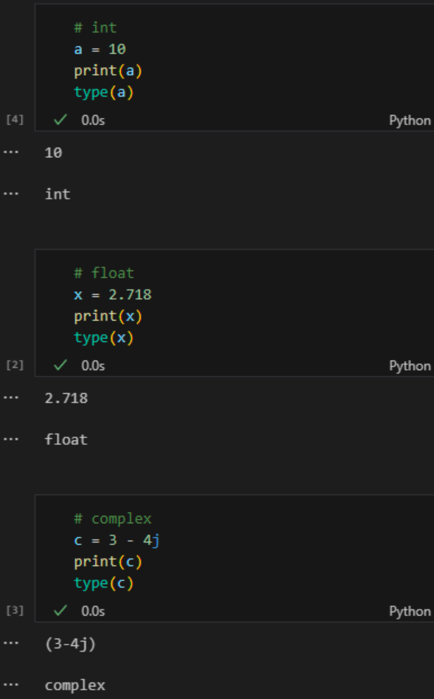

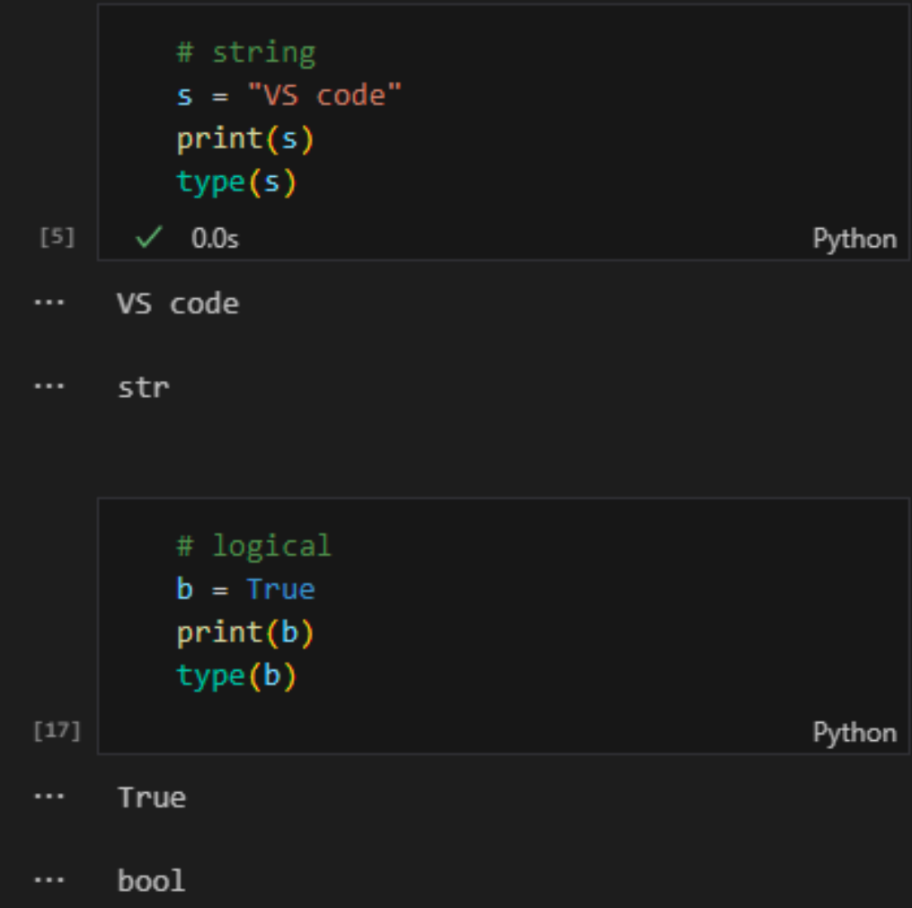

---

## Slide 8

### 파이썬의 날짜 자료형

기본 자료형이 아닌 자료형도 매우 다양

- 파이썬에서 날짜 정보는 기본 자료형이 아님

  - 코딩을 위해 먼저 모듈 datetime을 메모리에 로딩(load)

  - 구문 import datetime as dt를 사용

    - 여기서 dt를 별명(alias)

    - 모듈의 이름 datetime을 짧게 dt로 만들어서 코드를 간결하게 만들기 위해서 사용

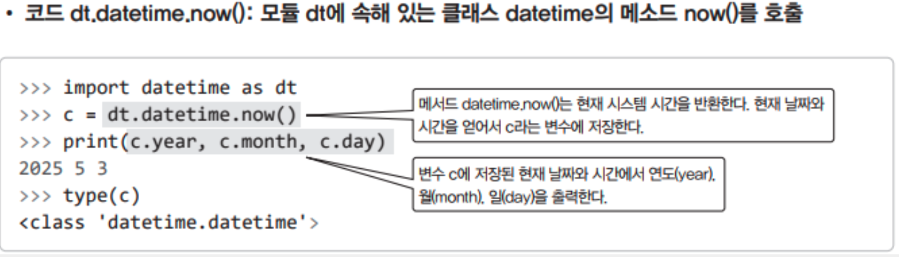

- dt.datetime.now()

  - 시스템의 현재 시간 정보를 생성해 정보를 출력

  - 모듈 datatime의 datetime 클래스 사용
    - datetime.datetime

- 마침표 .

  - ‘~에 속해 있는’의 연산자로 사용

  - 식별자의 문자로 사용할 수 없음

---

## Slide 9

### 지정한 날짜와 시간 객체 생성

- dt.datetime(2026, 3, 1) 생성자를 사용
  - 2026-03-01 날짜 정보

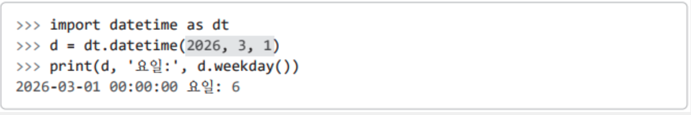

- 변수 d에 저장된 날짜와 시간을 출력하고, 그 날짜의 요일을 d.weekday()로 출력

  - 메서드 weekday()는 날짜가 무슨 요일인지를 숫자로 반환

    - 0은 월요일, 1은 화요일, ..., 6은 일요일에 해당

    - 2026년 3월 1일이 일요일

---

## Slide 10

### 다양한 연산자

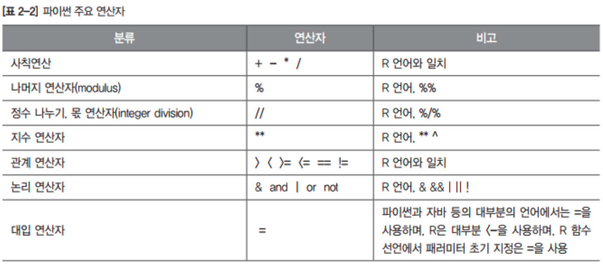

---

## Slide 11

### 내장 함수

- 파이썬을 설치하고 추가 패키지 설치 없이 사용 가능한 함수
- input(), print(), range() 등 매우 다양

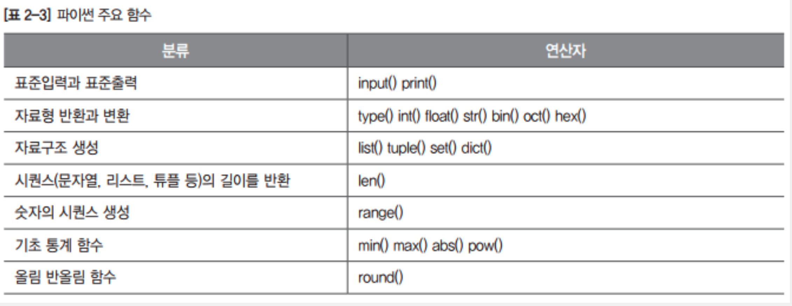

---

## Slide 12

### 도움말 함수

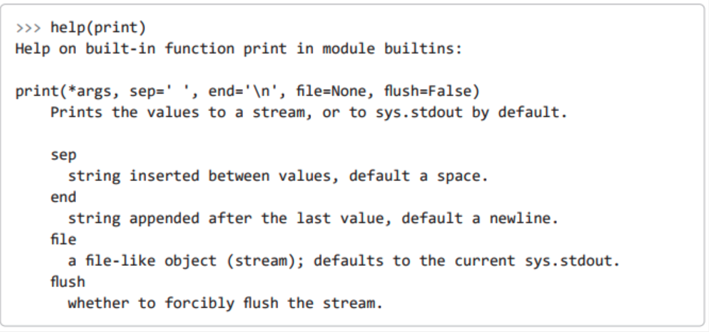

---

## Slide 13

### 함수 input() 활용

사용자로부터 키보드 입력을 받는 함수

- 입력된 값은 기본적으로 문자열 형태로 반환
  - 적절히 형 변환하여 다른 타입으로 사용

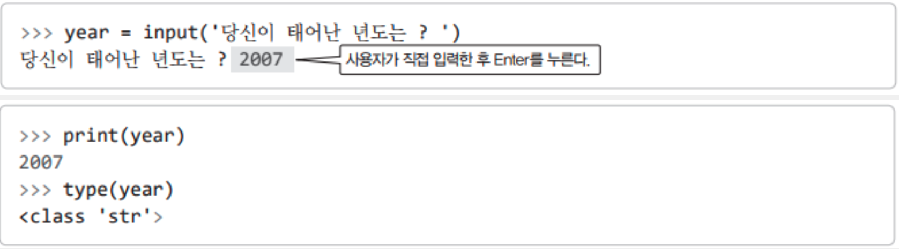

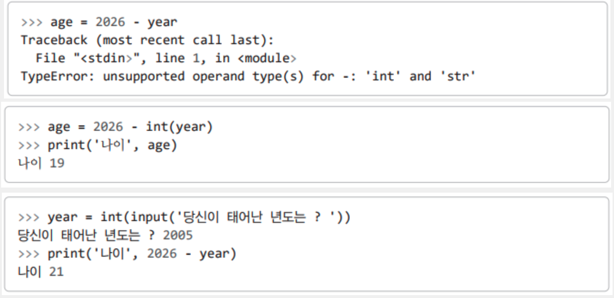

---

## Slide 14

### 다양한 함수

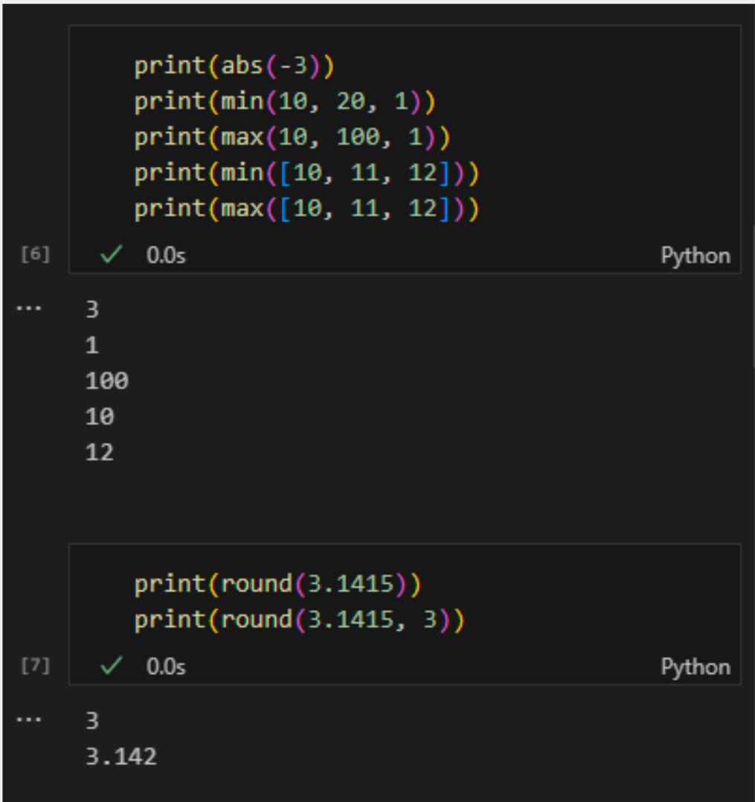

---

## Slide 15

### 내장 모듈 math 활용

- 파이썬의 모듈

  - 프로그램의 기능을 확장하기 위해 만드는 파이썬 소스 파일

- 내장 모듈

  - 따로 설치 없이 사용할 수 있는 모듈

- 대표적인 파이썬 내장 모듈 math

  - 수학 관련 상수와 함수가 정의

  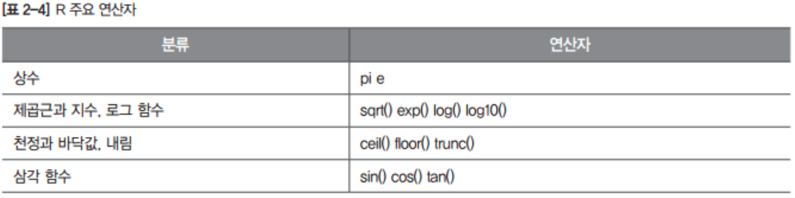

---

## Slide 16

### 패키지(package)

관련 여러 모듈(module)들의 모임

- 디렉토리 구조로 이루어져 있으며, 하위 디렉토리에는 모듈들이 위치

- 패키지 판다스(pandas)

  - 파이썬에서 테이블 형태의 데이터를 조작하고 분석하기 위한 강력한 라이브러리

  - 데이터프레임(dataframe)과 시리즈(series)라는 두 가지 핵심 데이터 구조를 제공

    - 시리즈
      - 1차원 배열과 유사

    - 데이터프레임
      - 2차원 테이블 형태의 자료구조

- 배포판인 아나콘다(anaconda)를 사용

  - 판다스는 이미 설치

  

- 표준 파이썬을 사용

  - 패키지 판다스를 다음 pip로 설치

- 먼저 표준 파이썬이 설치되어 있는 폴더 하부 Scripts에서 명령 프롬프트를 하나 실행

  - C:\Users\PC\AppData\Local\Programs\Python\Python312\Scripts>

---

## Slide 17

### 패키지(package) 설치

명령어 pip

- 명령어 pip.exe 있는 위치

  - 먼저 표준 파이썬이 설치되어 있는 폴더 하부 Scripts에서 명령 프롬프트를 하나 실행

  - C:\Users\[사용자계정]\AppData\Local\Programs\Python\Python312\Scripts>

- 명령 프롬프트에서 먼저 명령 pip show pandas로 판다스 설치 유무를 확인

- > pip show pandas

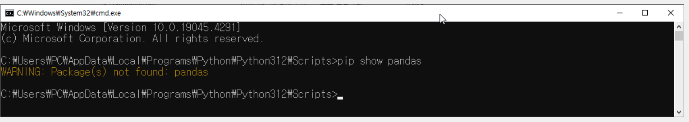

- 다음 명령으로 판다스 설치

- > pip install pandas

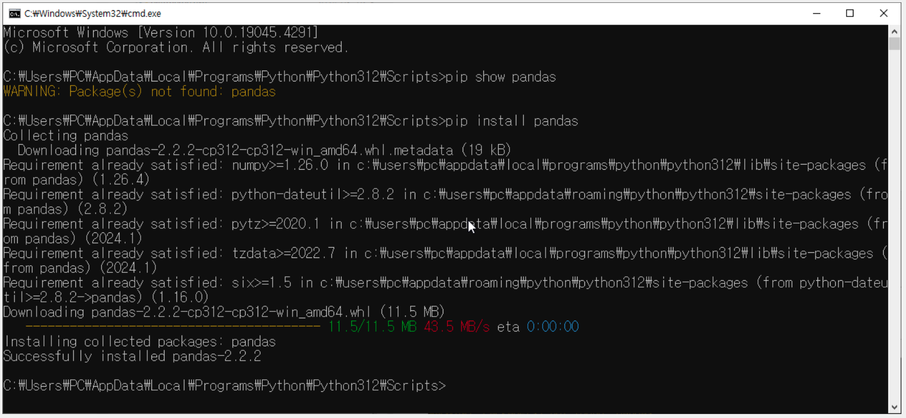

---

## Slide 18

### 패키지 numpy

- 넘파이 numpy

  - 파이썬에서 수치 계산을 빠르게 수행하는 고성능 배열과 행렬 연산을 위한 과학용 컴퓨팅 라이브러리(numpy.org)

  - 판다스를 설치하면 넘파이는 함께 설치
    - 명령 프롬프트에서 먼저 명령 pip show numpy로 넘파이 설치 유무를 확인

- > pip show numpy

---

## Slide 19

### matplotlib seaborn 

- 맷플롯립으로 읽는 패키지 matplotlib

  - 파이썬에서 2D 그래픽 그림을 생성하는 데 사용되는 데이터 시각화 라이브러리

  - 다양한 차트, 플롯, 히스토그램 등을 생성

- 패키지 시본 seaborn

  - matplotlib에 기반한 고수준 인터페이스를 제공하는 시각화 라이브러리

  - 주로 통계적 그래픽 기능을 갖추고 있어 데이터 분석에 유용하게 활용

---

## Slide 20

### 패키지 pydataset 개요

- 파이썬에서 사용할 수 있는 데이터셋(dataset)을 쉽게 메모리에 저장하고 활용

  - 언어 R 패키지인 datasets에 포함된 여러 데이터셋을 파이썬에서 바로 사용할 수 있도록 제공

  - 테스트용 데이터셋을 포함하고 있어, 데이터 분석이나 시각화 연습 등 다양한 용도로 활용

  - 이러한 데이터 셋을 장난감 데이터(toy data)라고도 부름

- 명령 > pip install seaborn pydataset

  - 한 번에 패키지 seaborn matplotlib pydataset을 설치

  - 설치는 필요한 패키지의 종속성에 따라 설치
    - 패키지 seaborn은 matplotlib을 필요로 하므로 seaborn만 설치해도 알아서 matplotlib을 설치

  - seaborn과 pydataset을 명령에 기술
    - 물론 패키지 3개를 모두 기술해도 상관없음

- > pip install seaborn pydataset

- > pip install seaborn matplotlib pydataset

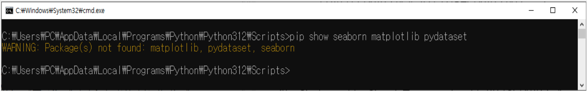

---

## Slide 21

### 패키지 pydataset 설치

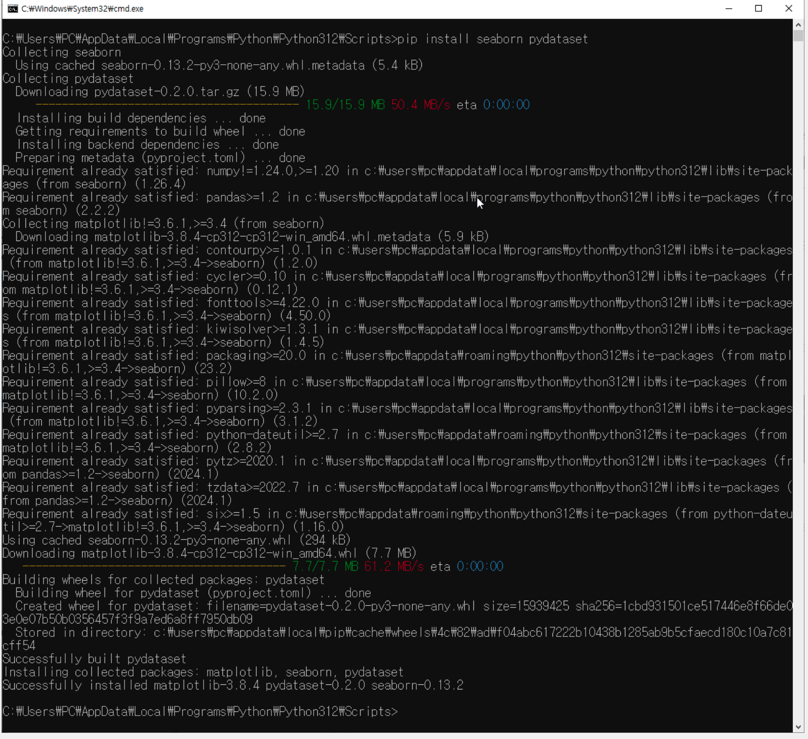

---

## Slide 22

### pydataset 활용

- 설치된 pydataset의 전체적인 정보를 얻기 위해 데이터셋 목록을 표시
- 패키지 pydataset에서 데이터를 불러와 data()로 생성
  - 데이터셋 ID(dataset_id)와 제목(title)이 포함된 데이터프레임을 반환
- 패키지 pydataset에는 757개의 샘플 데이터
  - 열 dataset_id은 데이터 셋의 식별자(id)이며 열 title은 데이터 셋 이름

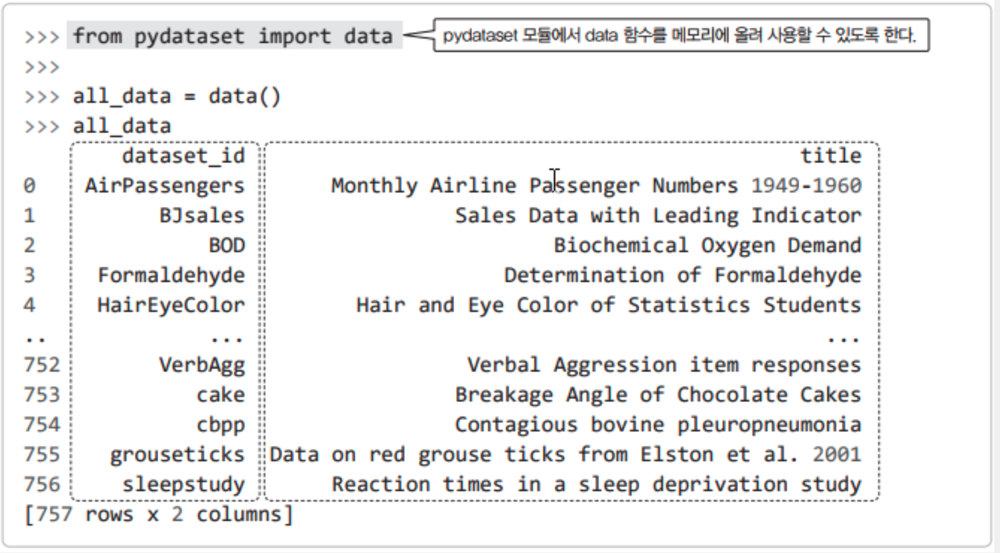

---

## Slide 23

### 패키지 pydataset 내장 데이터 cars

- 데이터 셋 cars
  - 자동차의 속도 speed와 정차 길이 dist가 있는 테이블 형태의 데이터
    - 첫 열은 각 행의 번호이며 첫 줄의 speed와 dist는 각 열 이름

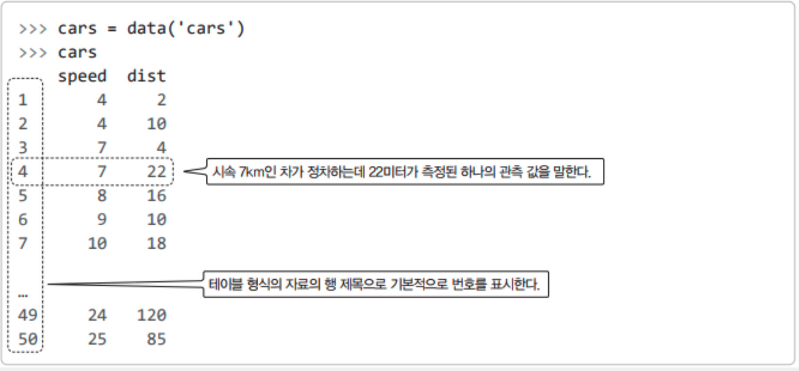

---

## Slide 24

### 산점도(scatter plot)

- 데이터 시각화 matplotlib 사용
  - plt.scatter(x = cars.speed, y = cars.dist)
    - 데이터 cars에서 50개 데이터 좌표를 작은 원으로 그린 그림

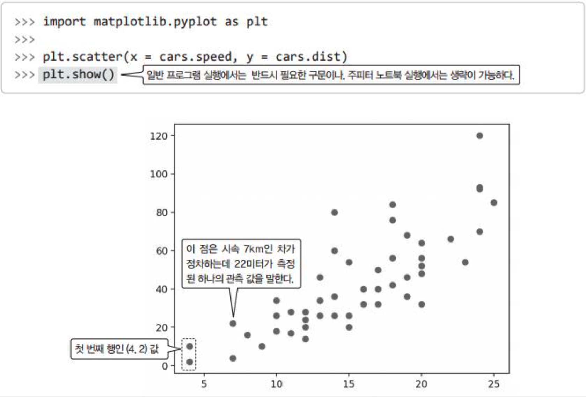

---

## Slide 25

### 패키지 seaborn의 함수 scatterplot()으로 그린 산점도

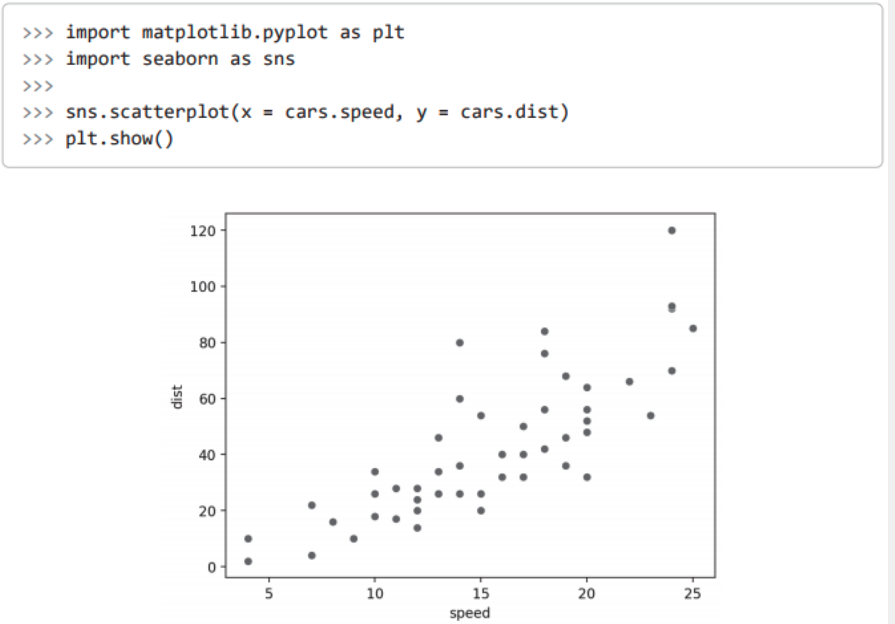

---

## Slide 26

### 주피터 노트북에서 그림을 선명하게 그리기와 한글 설정

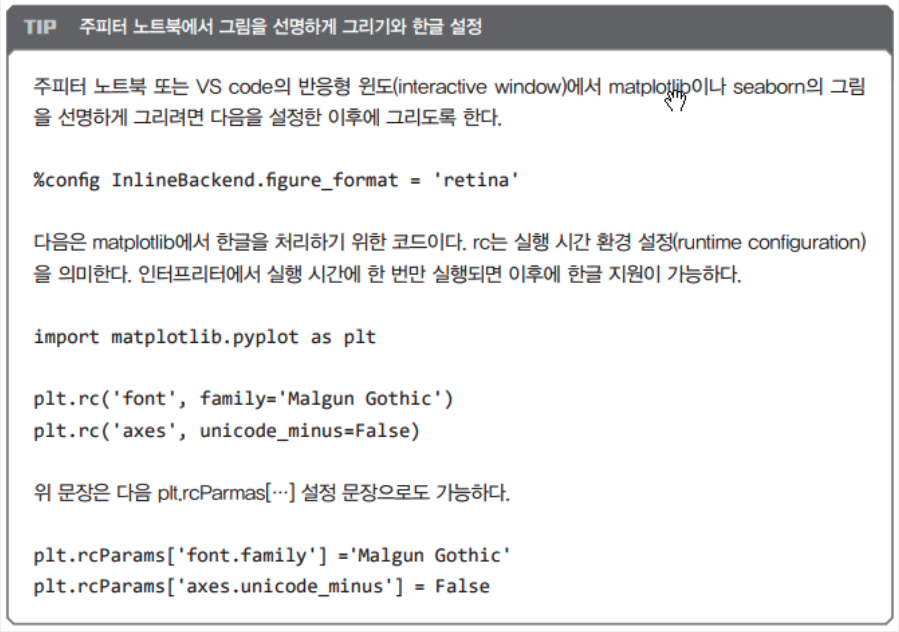

---

## Slide 27

### 데이터프레임(dataframe)

- 데이터 mpg(miles per gallon)의 데이터프레임 객체를 변수 mpg에 저장
- mpg의 메소드 head(mpg)로 mpg의 첫 5개의 행을 표시
- 판다스가 지원하는 테이블 형태의 행과 열로 구성된 자료구조

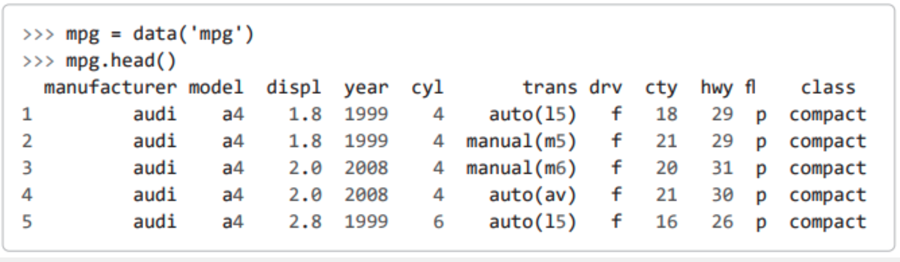

---

## Slide 28

### 메소드 mpg.info()

- mpg는 234개 자동차 모델의 정보

  - 11개의 열로 구성된 데이터프레임

    - 제조업체(열 manufacturer)와 모델 이름(열 model)

    - 도심 연비(열 cty)와 고속도로 연비(열 hwy) 등

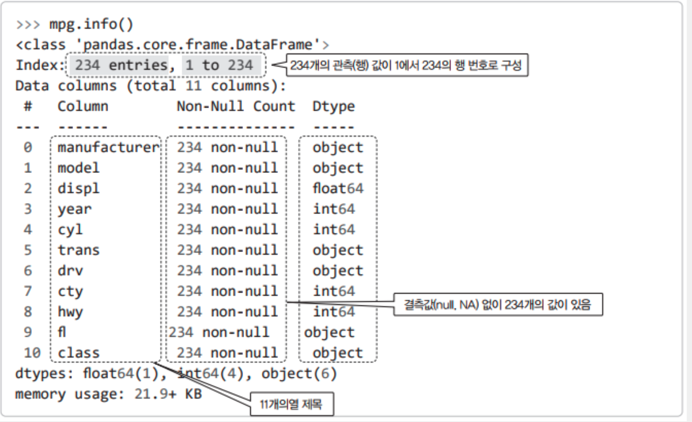

---

## Slide 29

### sns.scatterplot(x = mpg.displ, y = mpg.cty, hue = mpg.drv)

- 데이터프레임 mpg의 열 cty는 mpg.cty로 참조
- 가로 x 축인 자동차 배기량(displ: displacement)에 따른 세로 y 축 도심 연비(cty: city)를 나타내는 점
- 인자 hue = mpg.drv를 지정
- 각각의 데이터를 구동방식(drv)에 따라 구분
- 자동차 구동방식 drv
- f(front-wheel drive, 전륜), r(rear wheel drive, 후륜), 4(4wd, 4륜) 등 3 종류

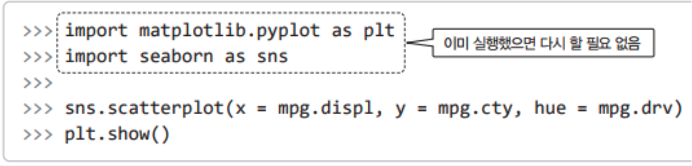

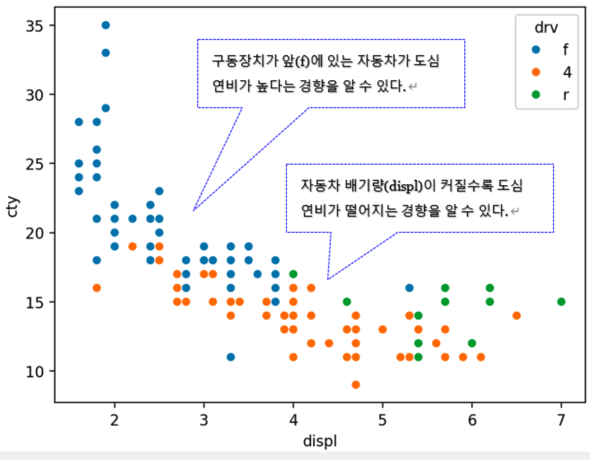

---

## Slide 30

### 2.2 제어 흐름과 함수

- -

---

## Slide 31

### 조건 if

- if 조건: 블록 문장은 조건이 True이면 들여쓰기의 블록을 실행하는 조건 문장
- 조건 이후에 콜론 :은 반드시 필요
- 들여쓰기는 빈칸으로 2개 또는 4개를 일관되게 사용
- 들여쓰기가 블록을 구성하는 문법으로 잘못 사용하면 오류가 발생하니 주의

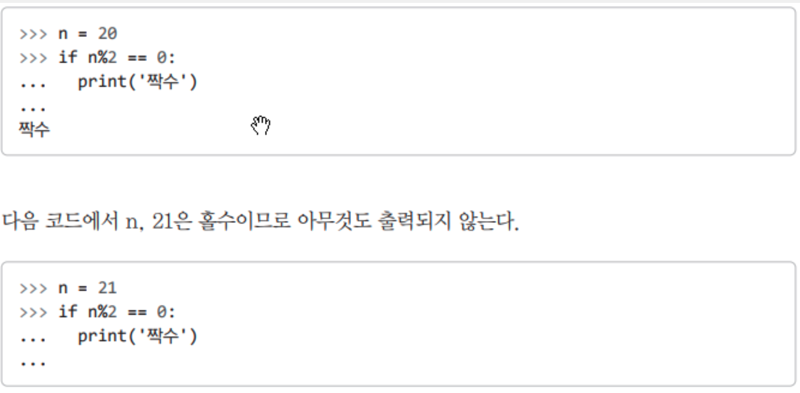

---

## Slide 32

### 조건 if else

- else:
  - else 이후에도 콜론 :이 반드시 필요

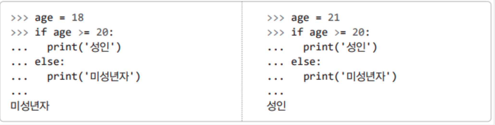

- 한 줄 조건 구문 if else

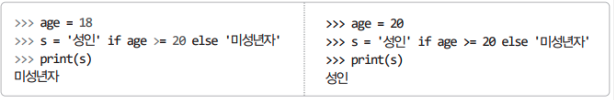

---

## Slide 33

### 반복된 조건 if elif 

- else if가 아니라 elif로 쓰며
- 마지막에 else: 사용 가능

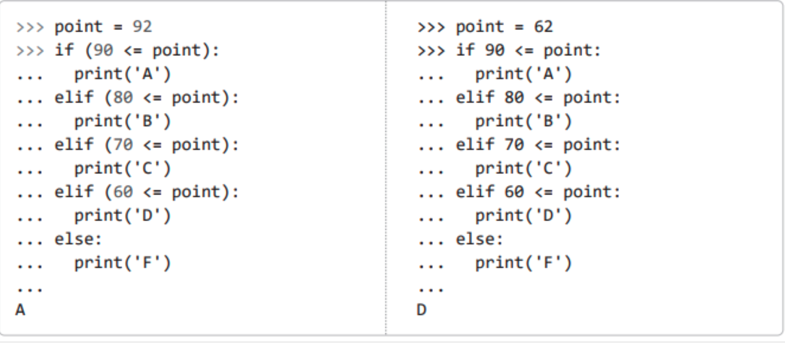

---

## Slide 34

### match 구문

- 파이썬 구문 match는 R과 자바, C 언어의 switch 구문과 비슷

- match와 case, default는 키워드

  - 연산식 또는 변수 exp의 값을 각 case의 value1, value2 등과 비교

  - 첫 번째로 일치하는 case를 찾으면 해당 valuei 이후의 블록인 statements를 실행

  - 어떤 case와도 일치하지 않으면 옵션인 case _: 이후의 블록을 실행

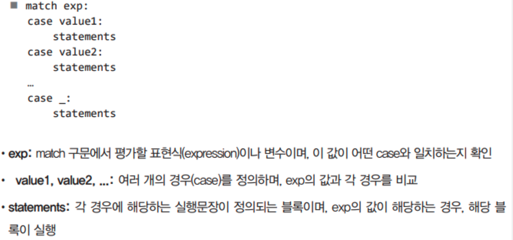

---

## Slide 35

### match 구문 사례 

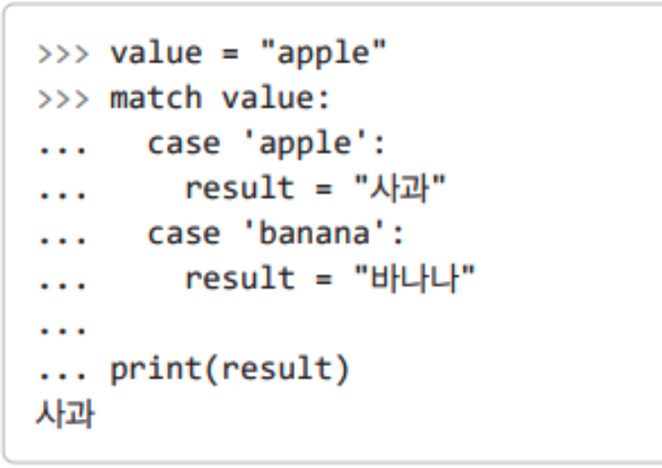

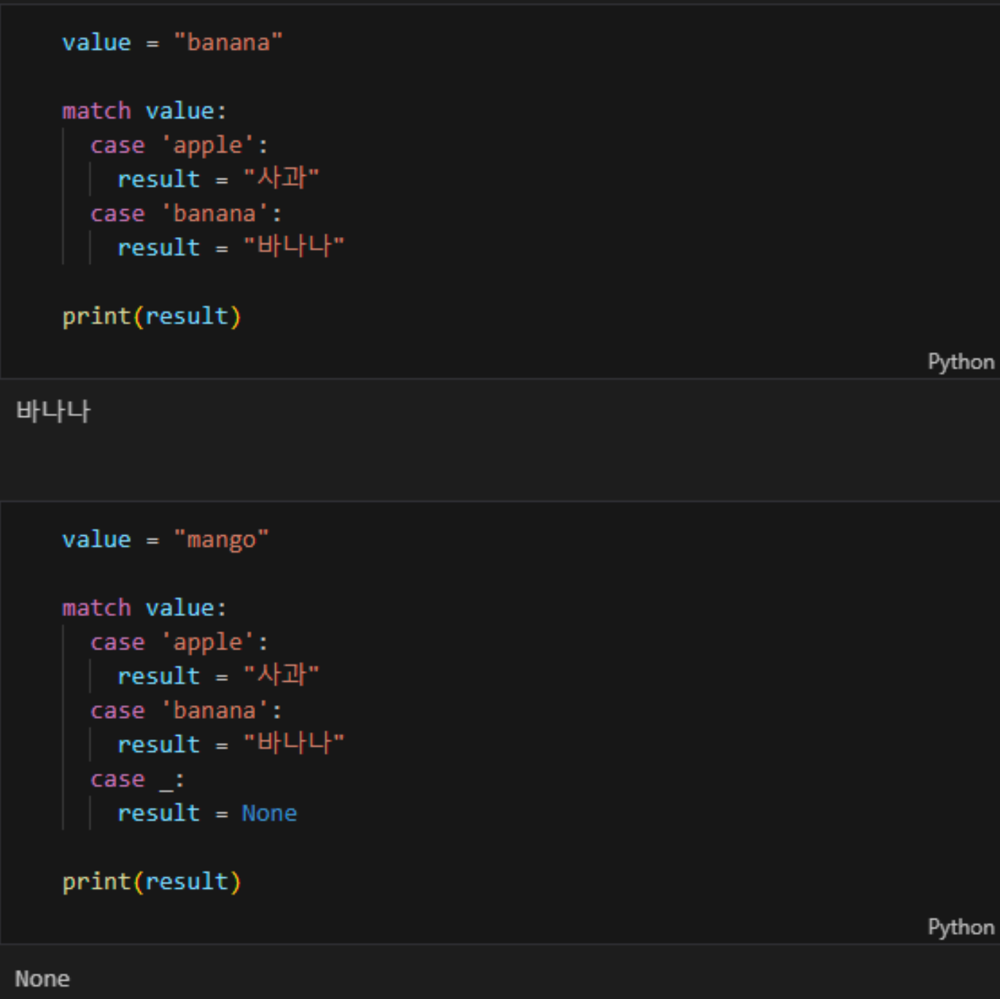

---

## Slide 36

### 반복 for 문

- for 구문
- in 이후의 리스트(list), 튜플(tuple), 사전(dictionary), 집합(set) 등의 항목이 있는 모임형으로 반복
- for 마지막 콜론 :은 반드시 필요하며 이후 반복 몸체는 들여쓰기로 블록을 구성

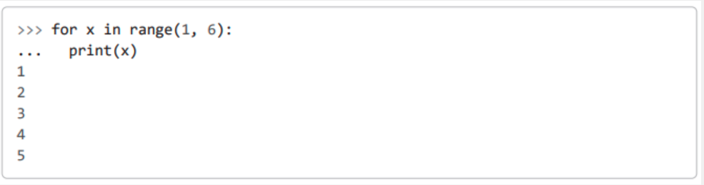

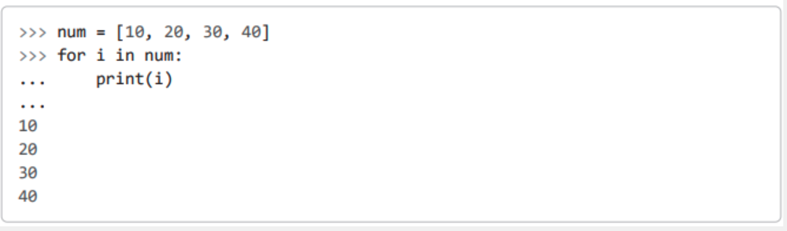

---

## Slide 37

### 반복 while 문

- while 조건: 블록 구문으로 조건이 True이면 블록을 반복하는 구문
- 다음 코드로 1부터 10까지의 합을 sum에 구해 출력

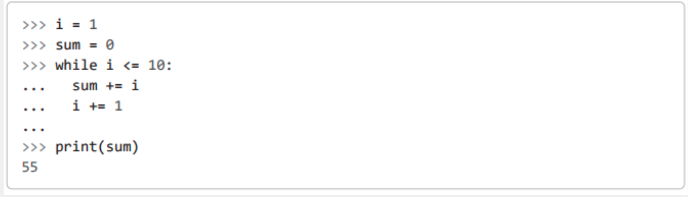

---

## Slide 38

### 함수 선언과 호출

- 특정한 기능을 수행하는 함수를 직접 정의
- 사용자 정의 함수를 선언
- 키워드 def를 사용한 다음 구문을 활용

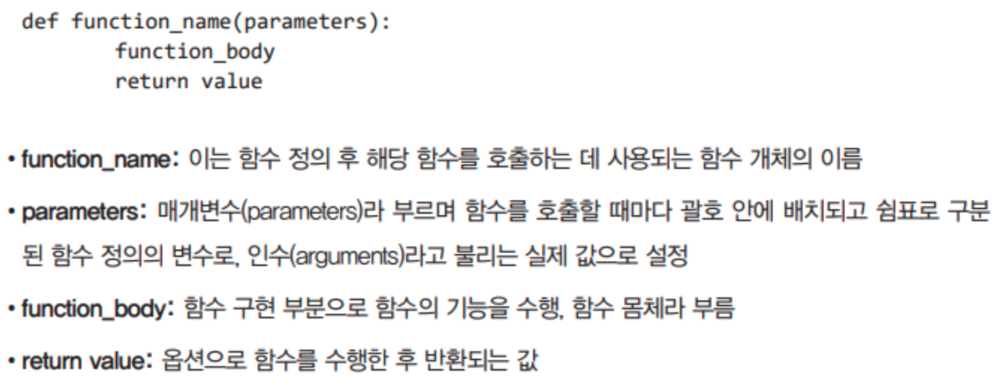

- 함수이름과 매개변수 이후에는 콜론 :이 반드시 표기
  - 다음은 들여쓰기로 사용해 함수 몸체를 구현

---

## Slide 39

### 함수 선언과 호출

- 함수 이름 이후 괄호가 없으면
- 단지 메모리에 저장된 함수 객체를 참조한다. 다음 16진수 값은 객체가 저장된 메모리 주소

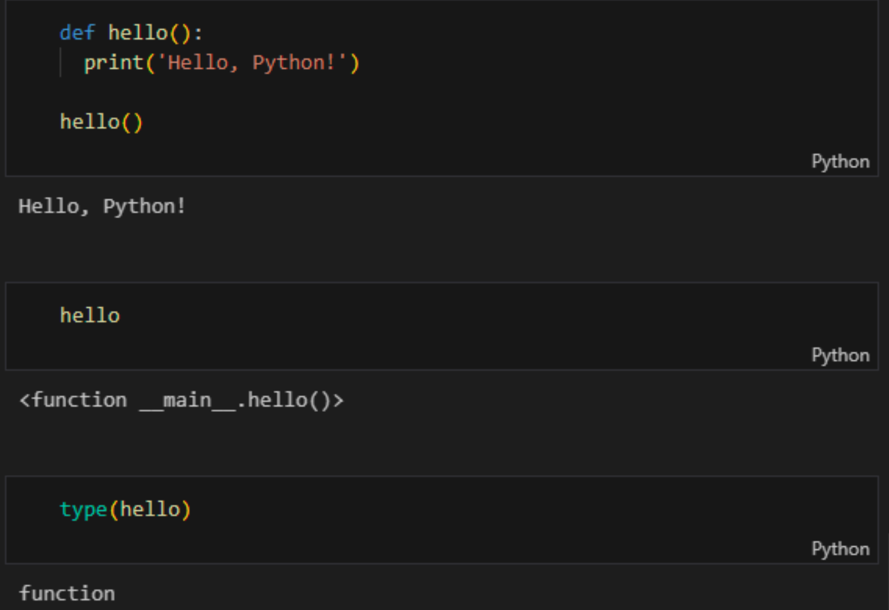

---

## Slide 40

### 함수 매개변수 기본 값

- 함수 선언에서 매개변수에 값을 대입하면 인자 없이 함수를 호출 가능
- = 연산자를 사용

- 인자없이 다음 함수 hi() 호출로 기본 인자 값으로 함수가 실행
- 함수 hi('철수') 호출로 기본 인자 값은 무시되고 인자로 지정된 철수로 함수가 실행

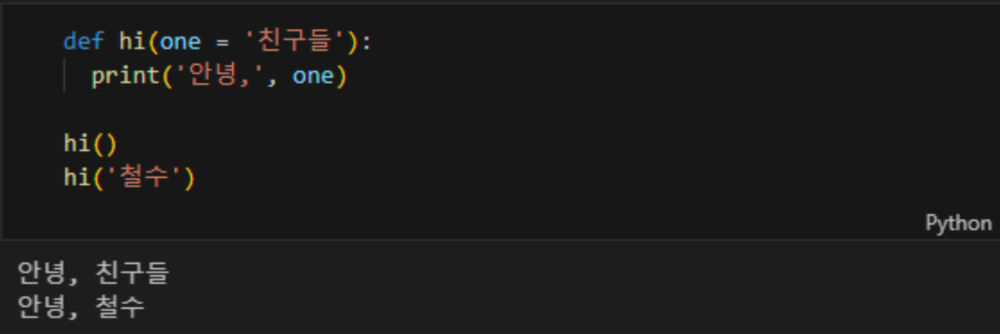

---

## Slide 41

### 함수 circle_area()

- 매개변수 기본 값으로 반지름 r을 1로 지정해 원의 면적을 구하는 함수

  - 인자 없이 함수 circle_area() 호출은 반지름 기본 값 1인 원의 면적을 구하기

  - 인자 r을 직접 지정하는 키워드 인자 지정 방식인 r = 5.6을 사용 가능

- return 문장이 없는 함수를 호출해 그 결과를 출력하면 None이 출력

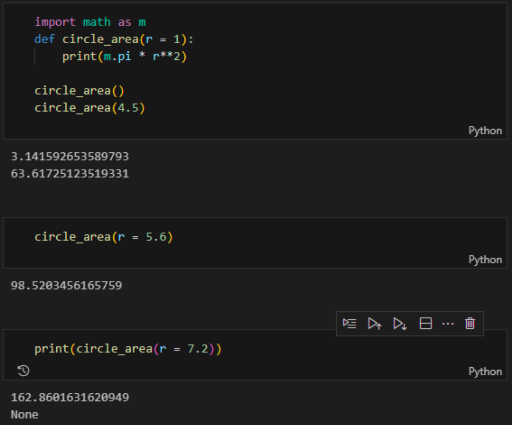

---

## Slide 42

### return 구문과 함수 매개변수 지정

- 함수 몸체에 return 구문으로 함수 결과를 반환
  - 할 수 있다. 코드 print(circle_area(r = 7.2)) 호출로 반지름이 7.2인 원의 면적을 반환 받아 출력

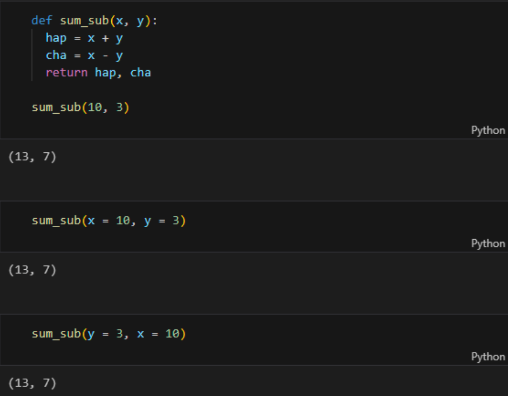

---

## Slide 43

### lambda 익명 함수 

- 함수 이름을 지정하지 않은 익명 함수(anonymous function)
- 일반적으로 다시 사용할 수 없음
- 람다 함수를 선언하면서 이후에 인자를 (3, 4)를 적용해 호출

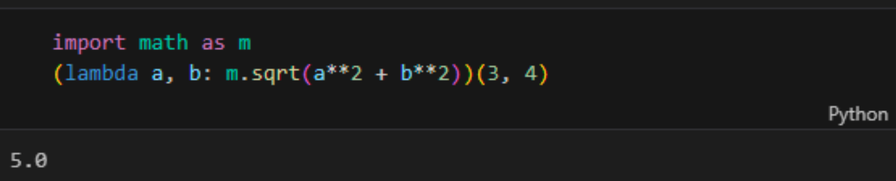

---

## Slide 44

### 2.3 표준 파이썬 기본 자료 구조

- -

---

## Slide 45

### 리스트(list)

- 여러 요소(elements)를 담을 수 있는 가변(mutable)한 데이터 구조

  - 리스트는 목록이라고도 부르며 리스트의 구성 요소는 항목 또는 원소라고도 부름
    - 원소는 순서를 가지고 있음

  - 리스트는 대괄호 [ ]로 표현되며, 요소들은 쉼표 , 로 구분해 기술

- 대괄호를 사용하여 리스트를 생성
- 리스트의 자료형은 class list

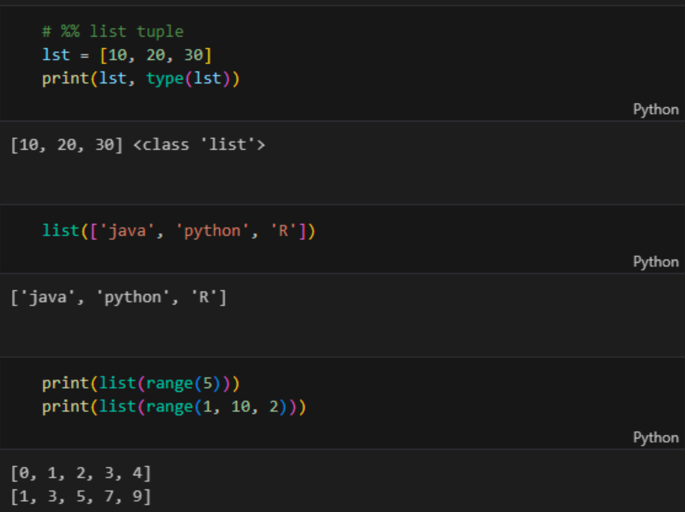

---

## Slide 46

### 리스트 참조

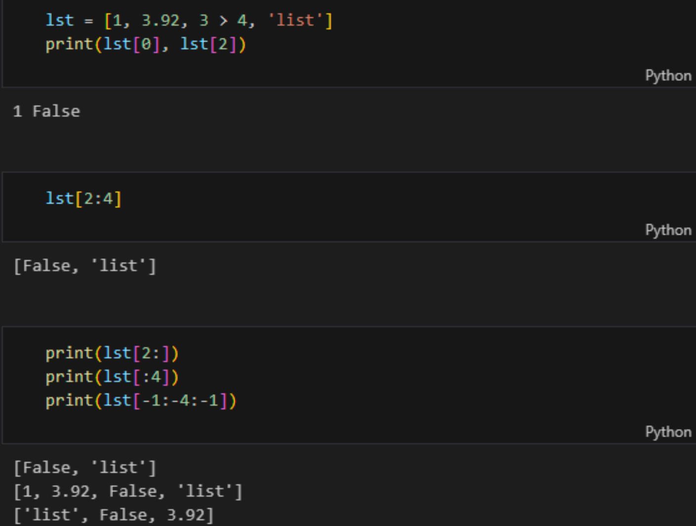

---

## Slide 47

### 메소드 append() insert()

- 리스트는 어떠한 자료형도 항목으로 구성 가능
- 리스트의 메소드 append()
  - 리스트에 새로운 요소를 마지막에 추가

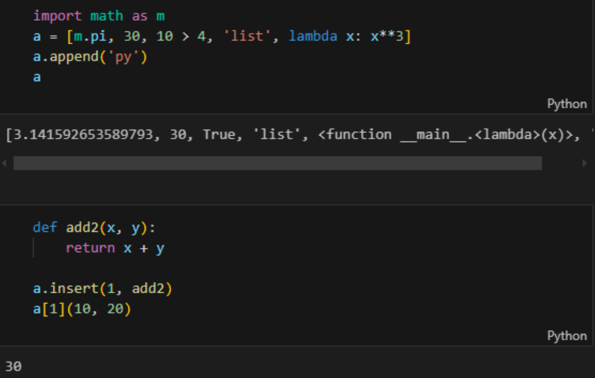

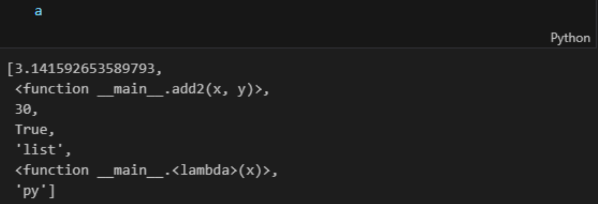

---

## Slide 48

### 메소드 remove() pop()

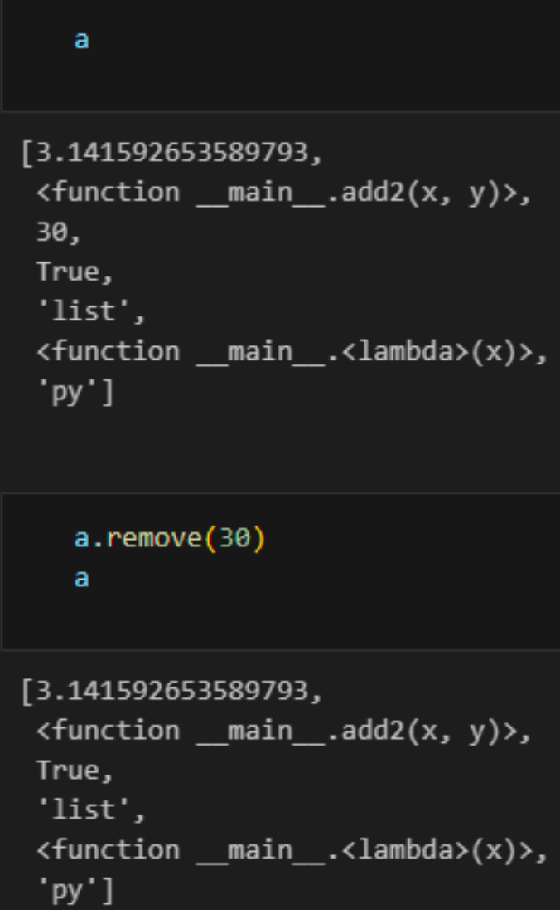

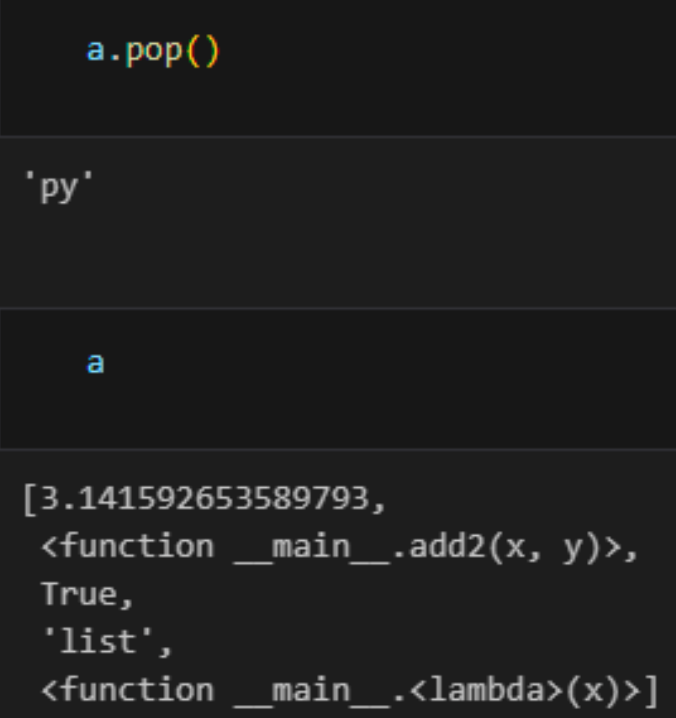

---

## Slide 49

### 리스트 컴프리헨션

- 파이썬에서 리스트를 간결하게 생성하는 방법 중 하나

  - 반복문과 조건문을 사용하여 리스트를 생성하는 표현식

  - 리스트 컴프리헨션 구조

    [expression for item in iterable if condition]

    - expression: 각 요소를 생성하는 표현식

    - item: iterable에서 가져온 요소

    - iterable: 반복 가능한 객체 (예: 리스트, 튜플, 범위 등)

    - condition (선택사항): 요소를 선택하는 조건

- 리스트 컴프리헨션 장점

  - 간결함
    - 반복문을 사용하는 일반적인 방법보다 훨씬 간결하고 가독성이 좋은 코드를 작성

  - 속도
    - 내부적으로 최적화되어 있어, 일반적으로 반복문보다 더 빠르게 실행

  - 효율성

    - 리스트 컴프리헨션은 한 줄에 표현되기 때문에 코드를 작성하고 이해하기가 훨씬 용이

    - 한 줄에 모든 로직을 포함하기 때문에 변수의 스코프와 관련된 오류를 줄일 수 있음

---

## Slide 50

### 리스트 컴프리헨션 활용

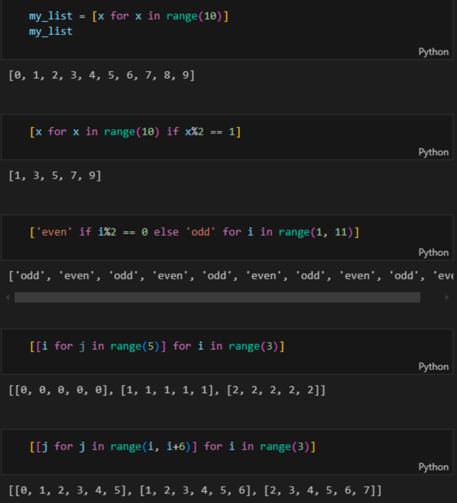

---

## Slide 51

### 사전(dictionary) 개요와 생성 

키(key)와 값(value)의 쌍을 저장하는 자료형

- 쉼표로 구분된 키:값 쌍 목록을 중괄호 { }로 묶어 사전을 정의

  - 중괄호 { }로 둘러싸여 있으며, 각 쌍은 쉼표 ,로 구분
    - 콜론 :은 각 키를 연관된 값을 구분

  

- { key1: value1, key2: value2, …, keyn: valuen }

  - 키: 값 형태로 키와 값은 콜론 :으로 구분하며 항목들은 쉼표 ,로 구분
    - 메소드 items()로 (키, 값) 항목의 목록 형태인 dict_items를 반환

  - key1, key2, …, keyn: 키는 수정불가능(또는 불변, immutable, hashable)한 자료형만 가능

  - 메소드 keys()로 키의 목록 형태인 dict_keys를 반환
    - value1, value2, …, valuen: 값은 모든 자료형이 가능

  - 메소드 values()로 값의 목록 형태인 dict_values를 반환

- 사전의 특성

  - 데이터 조직화
    - 키와 값의 쌍을 사용하여 데이터를 구조화하고 관리 가능

  - 빠른 검색
    - 키를 사용하여 값을 빠르게 찾을 수 있음

  중복 제거

  ​	- 사전은 키가 고유하므로 중복된 데이터를 쉽게 제거

---

## Slide 52

### 사전 코드

- 사전은 키를 사용하여 값을 참조

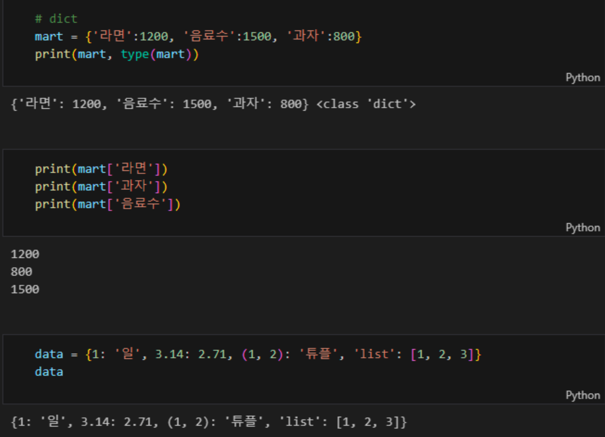

---

## Slide 53

### 사전 코드

- Unhashable type
  - 키로 사용 불가능

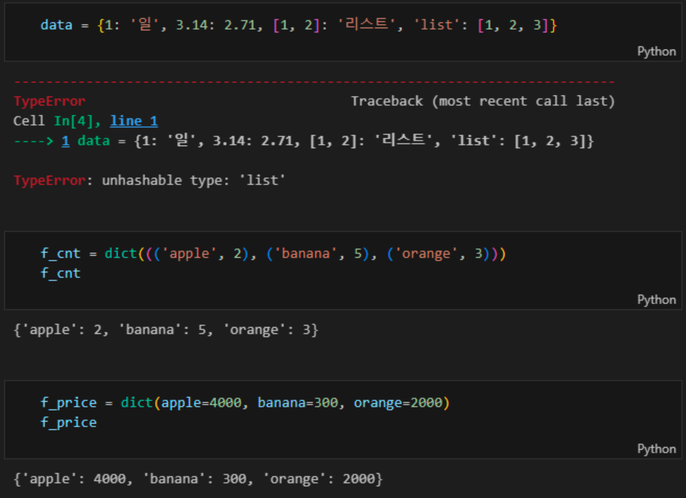

---

## Slide 54

### 항목 추가와 메소드 items()

- 사전에 없는 항목을 참조해 값을 대입
- 새로운 키: 값의 항목이 추가
- mart['삼각김밥'] = 1700
- 키 '삼각김밥'의 값 1700을 저장

- 이미 있는 항목을 참조해 값을 저장
- 이전 값이 수정

- 사전의 메소드 keys()
- 사전의 모든 키를 자료형 dict_keys로 반환

- 사전의 메소드 values()
- 사전의 모든 값을 자료형 dict_values로 반환

- 메소드 items()
- 사전의 모든 키와 값의 쌍을 자료형 dict_items로 반환

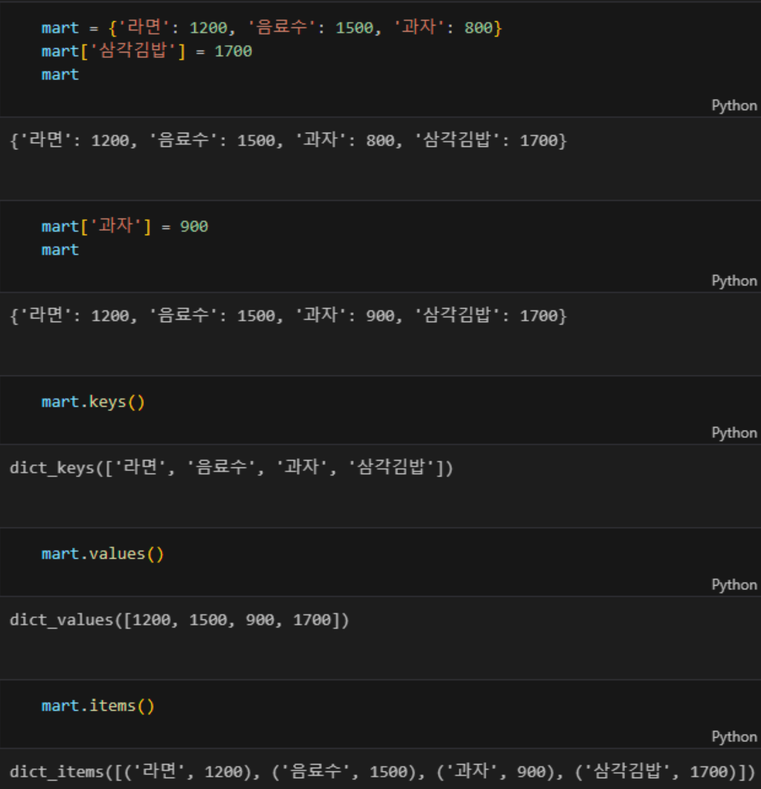

---

## Slide 55

### 튜플 개요

- 튜플

  - 변경할 수 없는(immutable, 불변의) 시퀀스 자료형

  - 여러 항목을 담을 수 있으며, 대괄호 대신 소괄호로 둘러싸 표현

- 튜플의 필요성

  - 불변성(immutable)
    - 한 번 생성된 튜플은 수정할 수 없기 때문에, 데이터 무결성을 보장하고 의도치 않은 변경을 방지

  - 성능
    - 리스트보다 메모리 사용이 적고, 읽기 속도가 빠름
  - 해시 가능성(hashable)
    - 튜플은 딕셔너리의 키나 집합의 원소로 사용될 수 있음

---

## Slide 56

### 튜플 활용

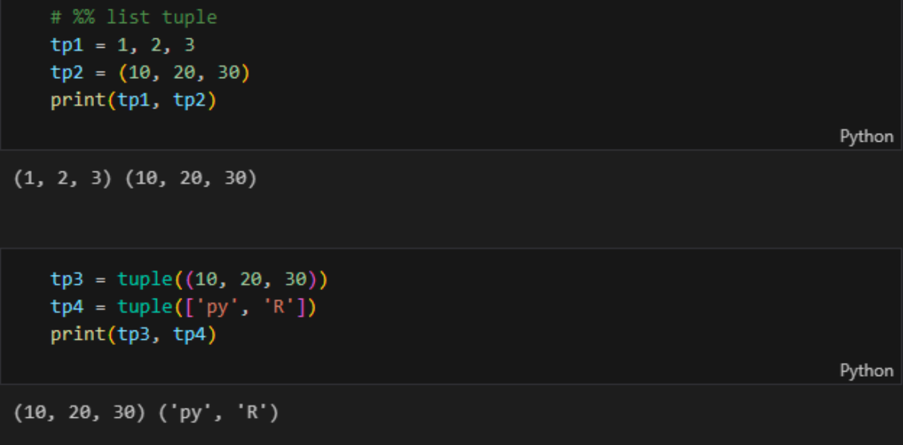

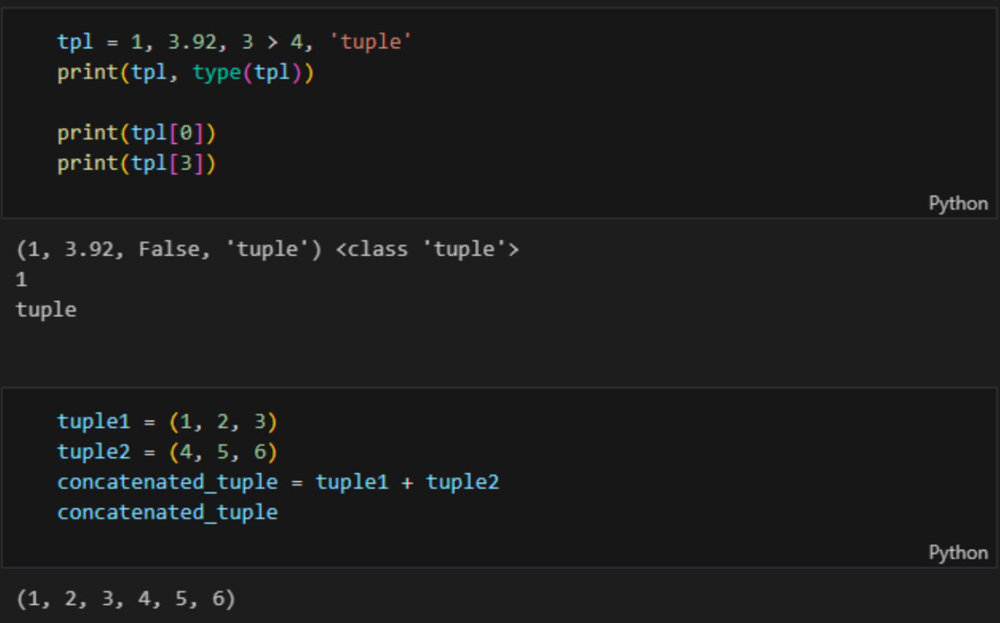

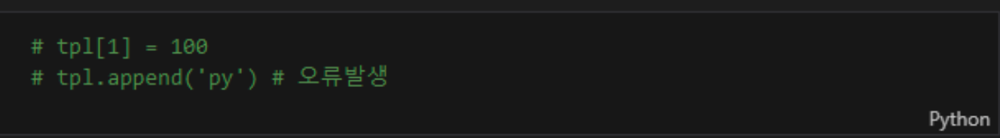

---

## Slide 57

### 집합 개요

- 중복된 원소가 없는 순서가 없는 자료형

  - 중괄호 { } 안에 쉼표 ,로 구분된 값을 넣어 생성

  - 수정 불가능한 집합 원소는 추가나 삭제가 가능

  - 집합 자체는 수정 가능

  - 집합의 원소는 중복을 불허
    - 멤버쉽 검사와 중복 제거에 주로 사용될 수 있음
    - 중복된 데이터를 제거하는 데 유용

- { element0, element1, element2, …, elementn }

  - 원소인 elementi는 고유한(unique) 값으로 중복을 허용하지 않으며

  - 원소의 순서는 의미가 없으며

  - 원소는 int, float, str, tuple 등 수정 불가능(immutable, hashable)한 것이어야 함

## Slide 58

### 집합 활용

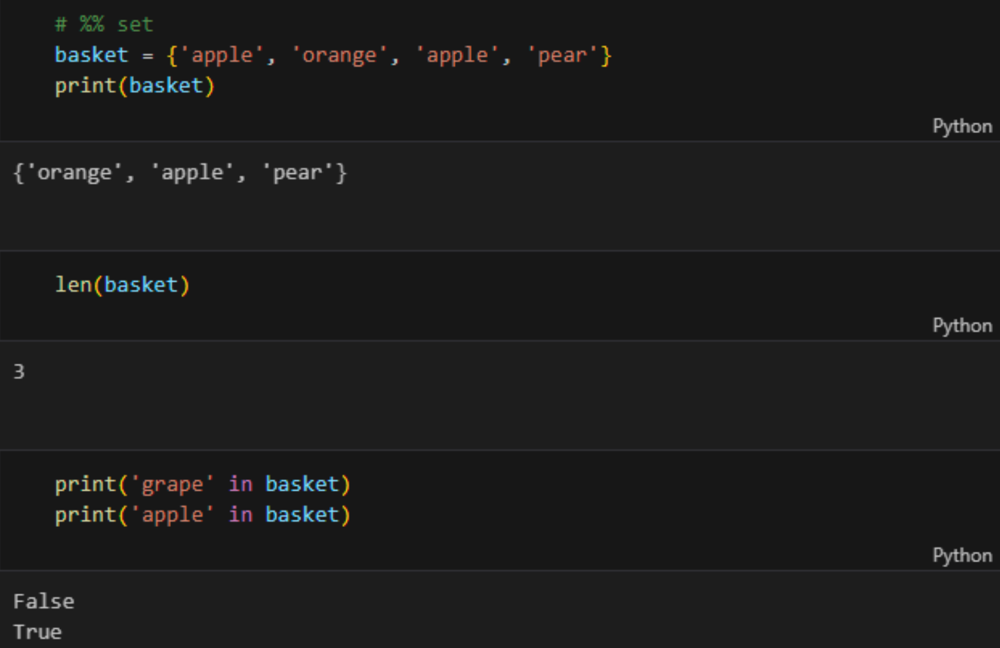

---

## Slide 59

### 다양한 집합 연산

- 합집합, 교집합, 차집합, 여집합

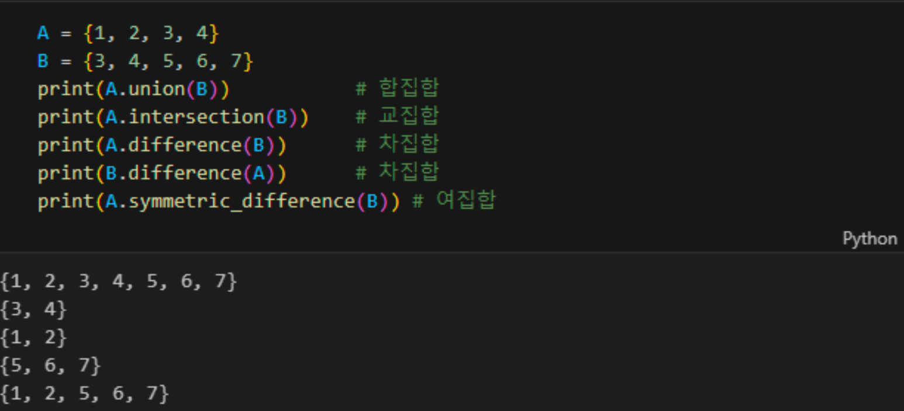

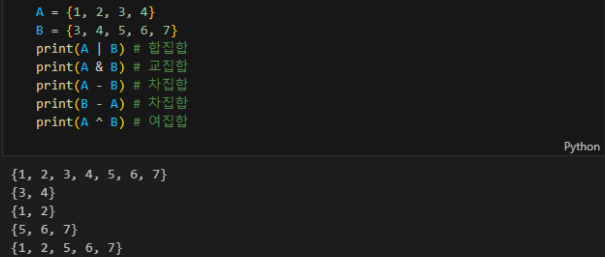

---

## Slide 60

### 집합에 추가할 원소: 수정불가능한 객체

- 집합 메소드 add(item)

  - 튜플, 삽입 가능

  - (1, 2)와 같은 수정불가능한 튜플은 집합의 원소가 될 수 있음

- 집합 메소드 remove(item)

  - item을 삭제

  - [1, 2]와 같은 수정가능한 리스트는 집합의 원소가 될 수 없음

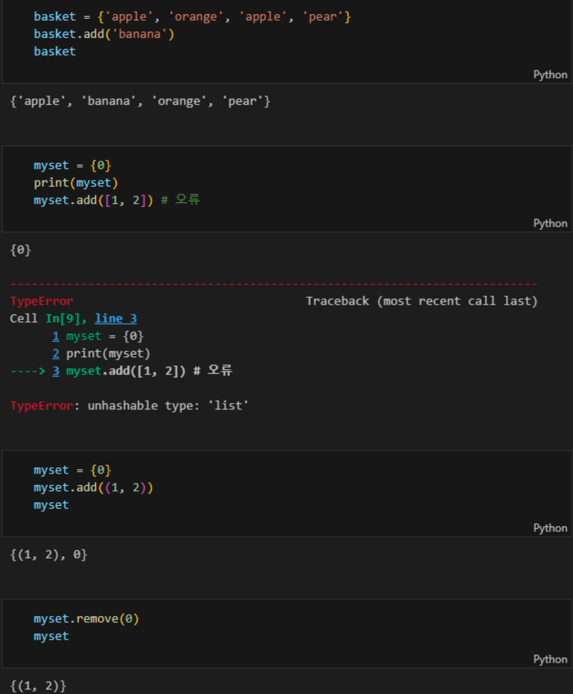

---

## Slide 61

### 수정불가능 immutable

수정 불가능하다는 immutable(불변)은 변경할 수 없는 객체를 가리킴

- immutable 객체

  - 생성된 후에 그 값을 변경 불가능

  - 정수(int), 부동소수점(float), 문자열(str), 튜플(tuple) 등은 immutable한 객체

  - 한 번 생성되면 값을 변경할 수 없으며, 변경하려고 하면 새로운 객체가 생성

- immutable의 특성

  - 객체의 안전성과 불변성을 보장하여 예상치 못한 변경으로부터 객체를 보호

  - 해시 가능한 객체만

    - 딕셔너리(dict)의 키가 가능

    - 집합(set)의 원소로 가능

---

## Slide 62

### 내장 함수 hash(obj)

- 주어진 객체 obj의 해시 값을 반환

  - 해시 값은 정수

  - 객체의 내용에 기반하여 생성

  - 동일한 입력에 대해서 항상 동일한 해시 값을 반환

  - 동일한 값이면 항상 동일한 해시 값

  - 해시 값의 고유성은 데이터 구조에서 빠른 검색 및 비교를 위한 핵심 요소 중 하나

- 사전이나 리스트, 집합

  - 수정 가능한 객체

  - hash() 값을 가질 수 없음

- 기본 자료형과 튜플

  - 수정 불가능한 객체

  - 고유한 hash() 값

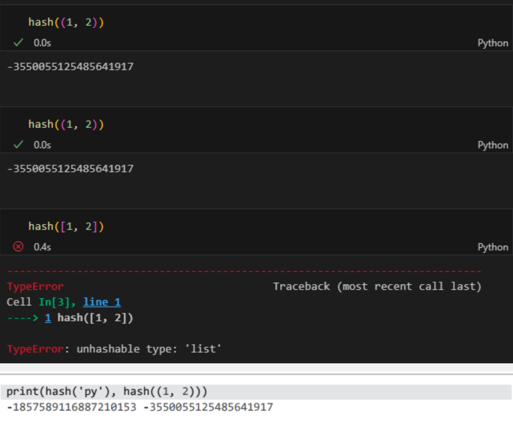

---

## Slide 63

### 수정 불가능한 immutable 객체와 함수 id()

- 파이썬에서 객체의 고유 식별자(unique identifier)를 이해하는 데 중요한 역할

- immutable 객체는 변경할 수 없는 객체

  - 이러한 객체는 생성된 후에 그 값을 변경할 수 없으며,

  - 변경하려고 하면 새로운 객체가 생성

  - 결국 id() 값이 달라짐

- 함수 id()

  - 모든 객체의 고유 식별자(unique identifier)를 반환
    - 식별자는 객체가 메모리 상에서의 위치를 나타내는 정수 값

  - id() 함수를 사용하면
    - 두 개의 객체가 동일한 메모리 위치를 가리키는지 여부를 확인 가능

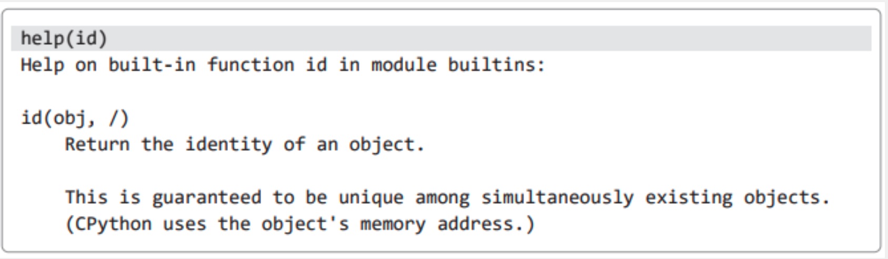

---

## Slide 64

### 두 객체의 id()가 동일

- 두 객체는 동일한 메모리 위치를가리키고 있음을 의미
  - 따라서 두 객체는 동일한 것

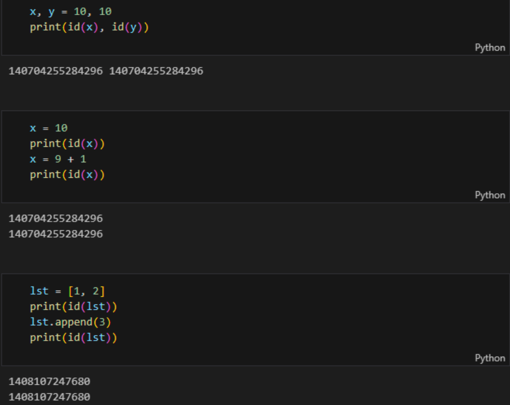

