# ch05 Matplotlib를 활용한 데이터 시각화 기초.pptx

## Slide 1

- 단원 05
- Matplotlib를 활용한
- 데이터 시각화 기초
- 인공지능소프트웨어학과
- 강환수 교수

---

## Slide 2

### 5.1 데이터 시각화 기초

- -

---

## Slide 3
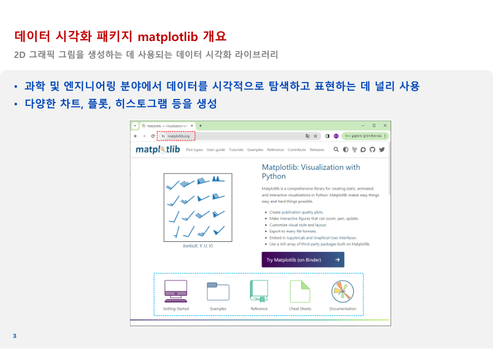

### 데이터 시각화 패키지 matplotlib 개요

- 과학 및 엔지니어링 분야에서 데이터를 시각적으로 탐색하고 표현하는 데 널리 사용
- 다양한 차트, 플롯, 히스토그램 등을 생성
- 2D 그래픽 그림을 생성하는 데 사용되는 데이터 시각화 라이브러리

---

## Slide 4
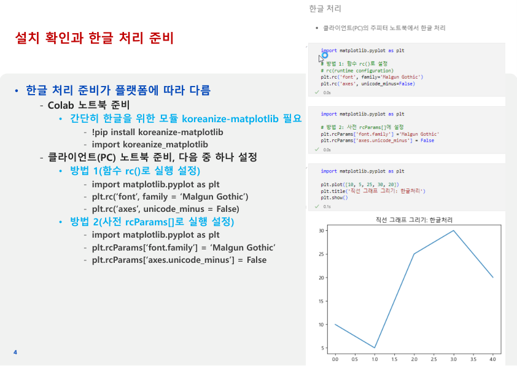

### 설치 확인과 한글 처리 준비

- 한글 처리 준비가 플랫폼에 따라 다름
- Colab 노트북 준비
- 간단히 한글을 위한 모듈 koreanize-matplotlib 필요
- !pip install koreanize-matplotlib
- import koreanize_matplotlib
- 클라이언트(PC) 노트북 준비, 다음 중 하나 설정
- 방법 1(함수 rc()로 실행 설정)
- import matplotlib.pyplot as plt
- plt.rc(‘font’, family = ‘Malgun Gothic’)
- plt.rc(‘axes’, unicode_minus = False)
- 방법 2(사전 rcParams[]로 실행 설정)
- import matplotlib.pyplot as plt
- plt.rcParams[‘font.family’] = ‘Malgun Gothic’
- plt.rcParams[‘axes.unicode_minus’] = False

---

## Slide 5
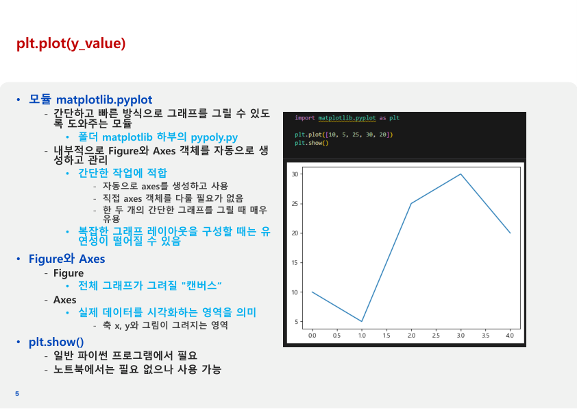

### plt.plot(y_value)

- 모듈 matplotlib.pyplot
- 간단하고 빠른 방식으로 그래프를 그릴 수 있도록 도와주는 모듈
- 폴더 matplotlib 하부의 pypoly.py
- 내부적으로 Figure와 Axes 객체를 자동으로 생성하고 관리
- 간단한 작업에 적합
- 자동으로 axes를 생성하고 사용
- 직접 axes 객체를 다룰 필요가 없음
- 한 두 개의 간단한 그래프를 그릴 때 매우 유용
- 복잡한 그래프 레이아웃을 구성할 때는 유연성이 떨어질 수 있음
- Figure와 Axes
- Figure
- 전체 그래프가 그려질 "캔버스“
- Axes
- 실제 데이터를 시각화하는 영역을 의미
- 축 x, y와 그림이 그려지는 영역
- plt.show()
- 일반 파이썬 프로그램에서 필요
- 노트북에서는 필요 없으나 사용 가능

---

## Slide 6
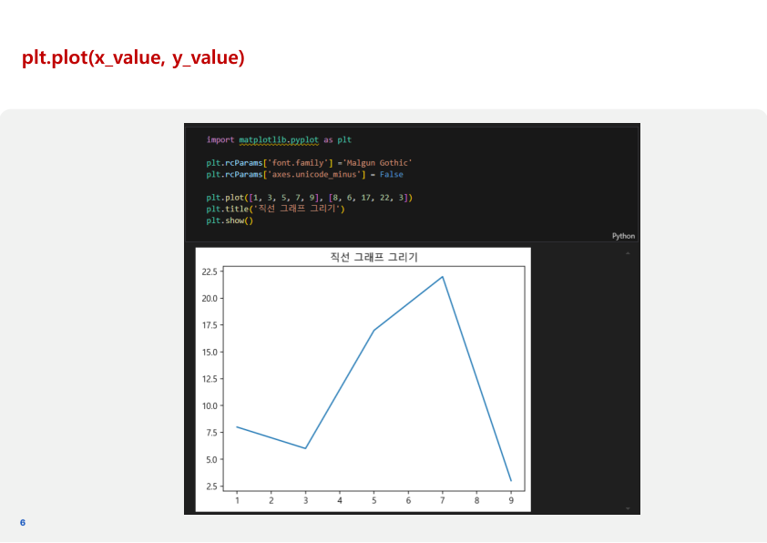

### plt.plot(x_value, y_value)

---

## Slide 7
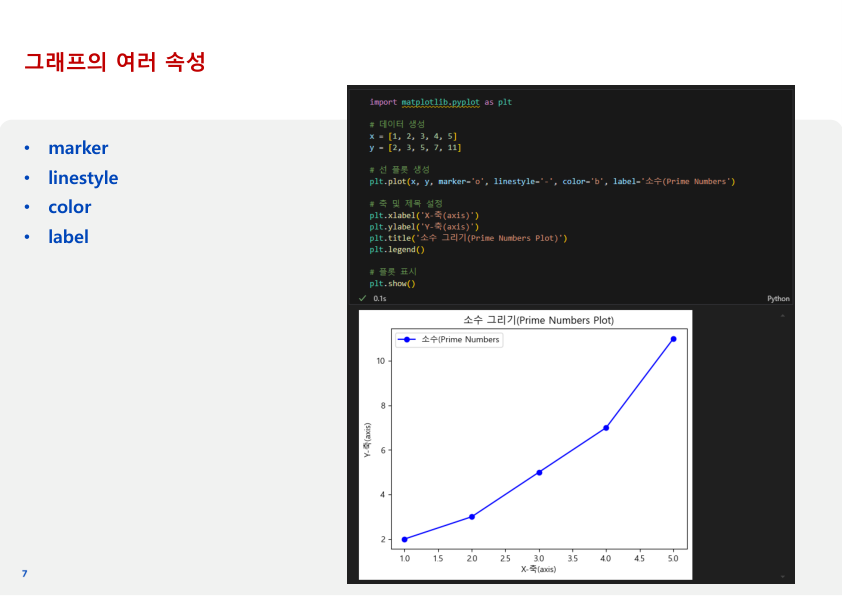

### 그래프의 여러 속성

- marker
- linestyle
- color
- label

---

## Slide 8
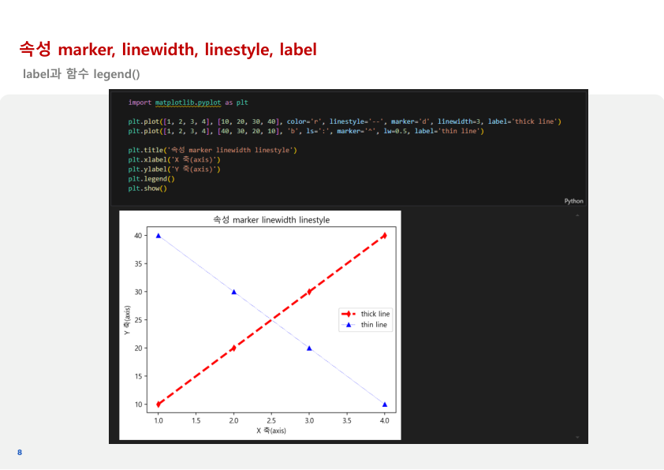

### 속성 marker, linewidth, linestyle, label

- label과 함수 legend()

---

## Slide 9
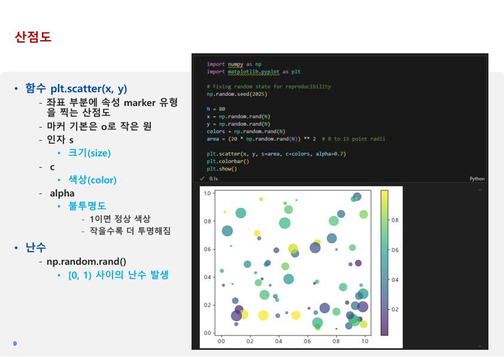

### 산점도

- 함수 plt.scatter(x, y)
- 좌표 부분에 속성 marker 유형을 찍는 산점도
- 마커 기본은 o로 작은 원
- 인자 s
- 크기(size)
- c
- 색상(color)
- alpha
- 불투명도
- 1이면 정상 색상
- 작을수록 더 투명해짐
- 난수
- np.random.rand()
- [0, 1) 사이의 난수 발생

---

## Slide 10
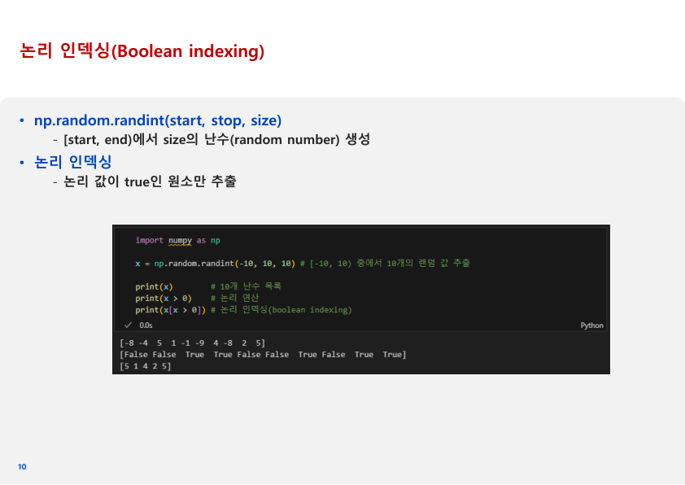

### 논리 인덱싱(Boolean indexing)

- np.random.randint(start, stop, size)
- [start, end)에서 size의 난수(random number) 생성
- 논리 인덱싱
- 논리 값이 true인 원소만 추출

---

## Slide 11
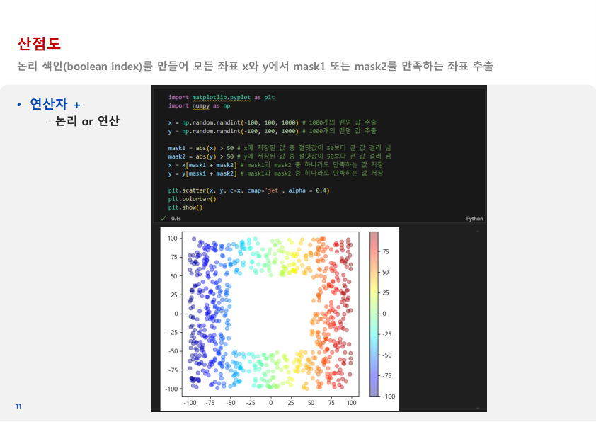

### 산점도

- 연산자 +
- 논리 or 연산
- 논리 색인(boolean index)를 만들어 모든 좌표 x와 y에서 mask1 또는 mask2를 만족하는 좌표 추출

---

## Slide 12
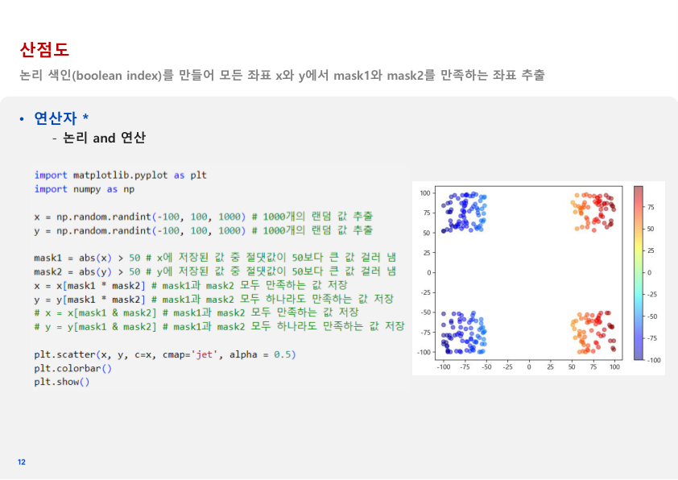

### 산점도

- 연산자 *
- 논리 and 연산
- 논리 색인(boolean index)를 만들어 모든 좌표 x와 y에서 mask1와 mask2를 만족하는 좌표 추출

---

## Slide 13
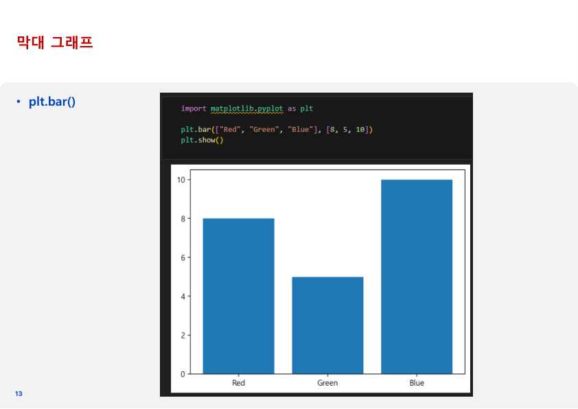

### 막대 그래프

- plt.bar()

---

## Slide 14
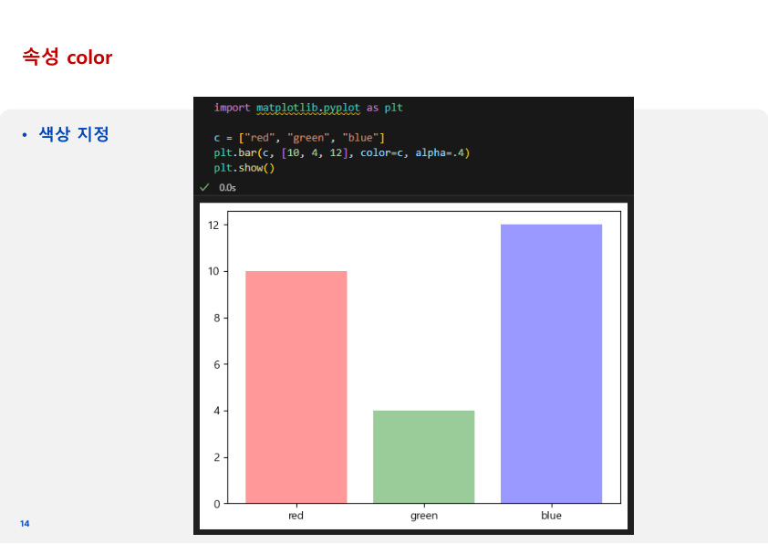

### 속성 color 

- 색상 지정

---

## Slide 15
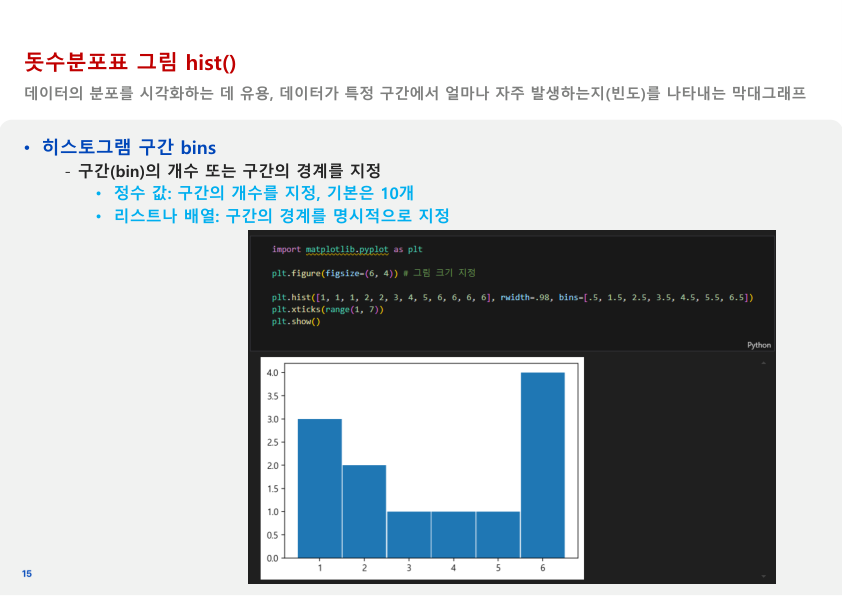

### 돗수분포표 그림 hist()

- 히스토그램 구간 bins
- 구간(bin)의 개수 또는 구간의 경계를 지정
- 정수 값: 구간의 개수를 지정, 기본은 10개
- 리스트나 배열: 구간의 경계를 명시적으로 지정
- 데이터의 분포를 시각화하는 데 유용, 데이터가 특정 구간에서 얼마나 자주 발생하는지(빈도)를 나타내는 막대그래프

---

## Slide 16
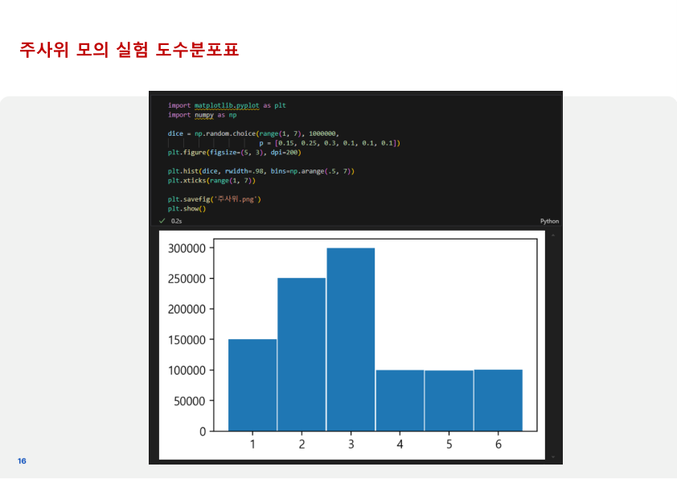

### 주사위 모의 실험 도수분포표

---

## Slide 17
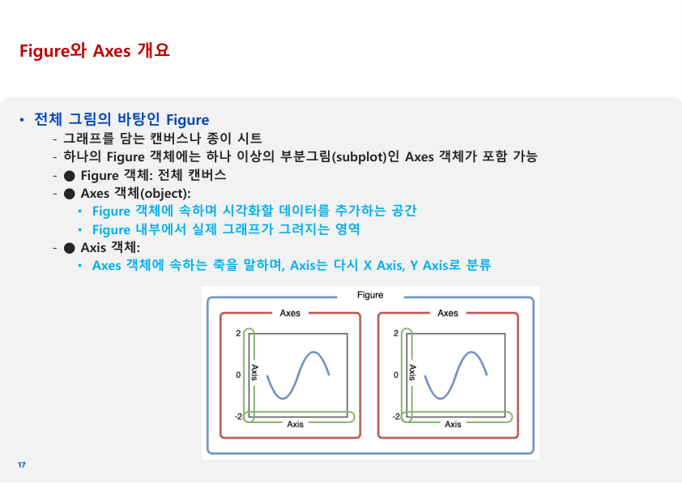

### Figure와 Axes 개요

- 전체 그림의 바탕인 Figure
- 그래프를 담는 캔버스나 종이 시트
- 하나의 Figure 객체에는 하나 이상의 부분그림(subplot)인 Axes 객체가 포함 가능
- ● Figure 객체: 전체 캔버스
- ● Axes 객체(object):
- Figure 객체에 속하며 시각화할 데이터를 추가하는 공간
- Figure 내부에서 실제 그래프가 그려지는 영역
- ● Axis 객체:
- Axes 객체에 속하는 축을 말하며, Axis는 다시 X Axis, Y Axis로 분류

---

## Slide 18
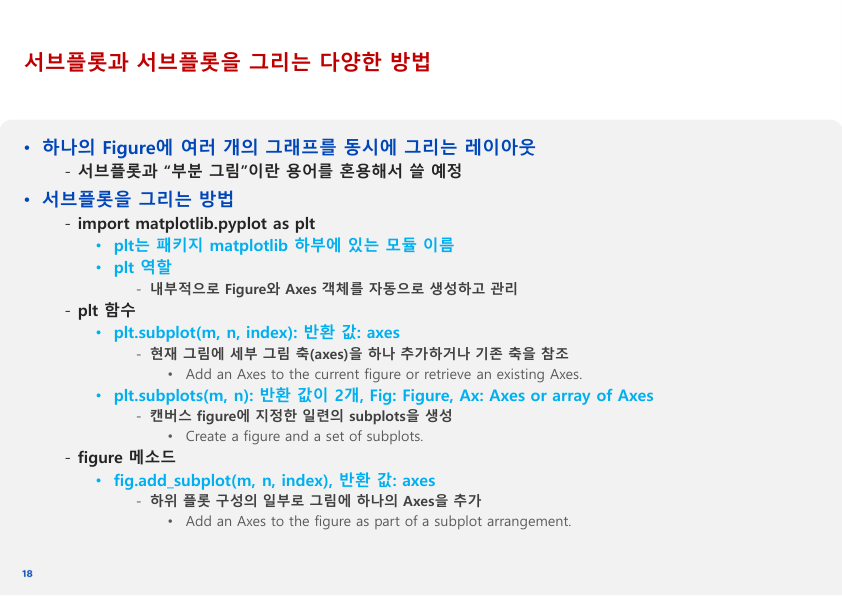

### 서브플롯과 서브플롯을 그리는 다양한 방법

- 하나의 Figure에 여러 개의 그래프를 동시에 그리는 레이아웃
- 서브플롯과 “부분 그림”이란 용어를 혼용해서 쓸 예정
- 서브플롯을 그리는 방법
- import matplotlib.pyplot as plt
- plt는 패키지 matplotlib 하부에 있는 모듈 이름
- plt 역할
- 내부적으로 Figure와 Axes 객체를 자동으로 생성하고 관리
- plt 함수
- plt.subplot(m, n, index): 반환 값: axes
- 현재 그림에 세부 그림 축(axes)을 하나 추가하거나 기존 축을 참조
- Add an Axes to the current figure or retrieve an existing Axes.
- plt.subplots(m, n): 반환 값이 2개, Fig: Figure, Ax: Axes or array of Axes
- 캔버스 figure에 지정한 일련의 subplots을 생성
- Create a figure and a set of subplots.
- figure 메소드
- fig.add_subplot(m, n, index), 반환 값: axes
- 하위 플롯 구성의 일부로 그림에 하나의 Axes을 추가
- Add an Axes to the figure as part of a subplot arrangement.

---

## Slide 19
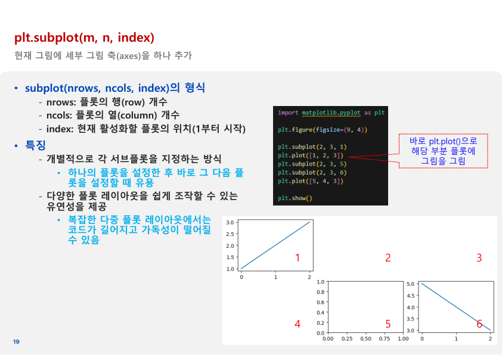

### plt.subplot(m, n, index)

- subplot(nrows, ncols, index)의 형식
- nrows: 플롯의 행(row) 개수
- ncols: 플롯의 열(column) 개수
- index: 현재 활성화할 플롯의 위치(1부터 시작)
- 특징
- 개별적으로 각 서브플롯을 지정하는 방식
- 하나의 플롯을 설정한 후 바로 그 다음 플롯을 설정할 때 유용
- 다양한 플롯 레이아웃을 쉽게 조작할 수 있는 유연성을 제공
- 복잡한 다중 플롯 레이아웃에서는코드가 길어지고 가독성이 떨어질수 있음
- 현재 그림에 세부 그림 축(axes)을 하나 추가
- 바로 plt.plot()으로 해당 부분 플롯에 그림을 그림
- 1
- 2
- 3
- 4
- 5
- 6

---

## Slide 20
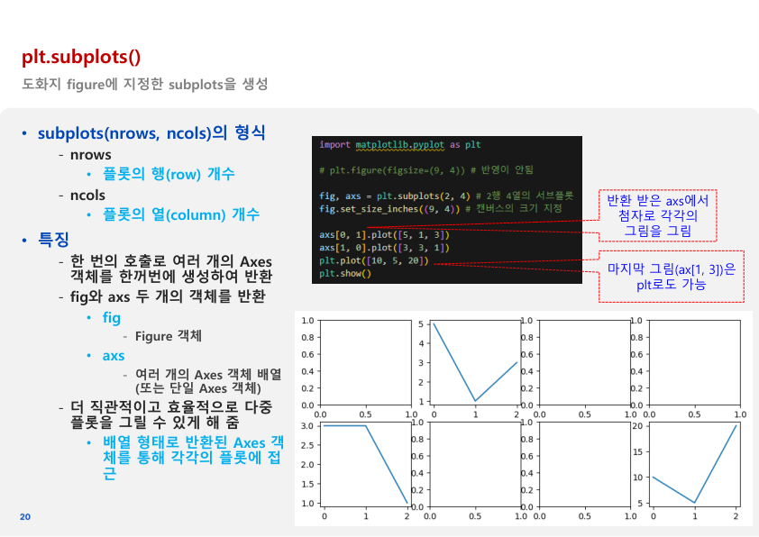

### plt.subplots()

- subplots(nrows, ncols)의 형식
- nrows
- 플롯의 행(row) 개수
- ncols
- 플롯의 열(column) 개수
- 특징
- 한 번의 호출로 여러 개의 Axes 객체를 한꺼번에 생성하여 반환
- fig와 axs 두 개의 객체를 반환
- fig
- Figure 객체
- axs
- 여러 개의 Axes 객체 배열(또는 단일 Axes 객체)
- 더 직관적이고 효율적으로 다중 플롯을 그릴 수 있게 해 줌
- 배열 형태로 반환된 Axes 객체를 통해 각각의 플롯에 접근
- 도화지 figure에 지정한 subplots을 생성
- 반환 받은 axs에서 첨자로 각각의 그림을 그림
- 마지막 그림(ax[1, 3])은 plt로도 가능

---

## Slide 21
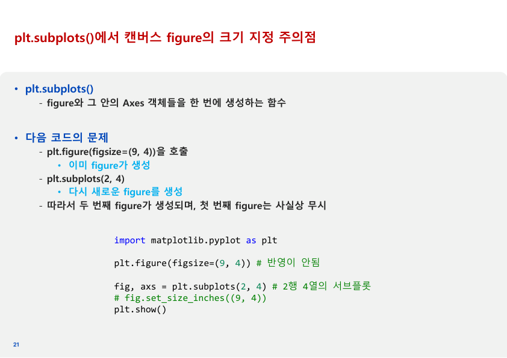

### plt.subplots()에서 캔버스 figure의 크기 지정 주의점

- plt.subplots()
- figure와 그 안의 Axes 객체들을 한 번에 생성하는 함수
- 다음 코드의 문제
- plt.figure(figsize=(9, 4))을 호출
- 이미 figure가 생성
- plt.subplots(2, 4)
- 다시 새로운 figure를 생성
- 따라서 두 번째 figure가 생성되며, 첫 번째 figure는 사실상 무시
- import matplotlib.pyplot as plt
- plt.figure(figsize=(9, 4)) # 반영이 안됨
- fig, axs = plt.subplots(2, 4) # 2행 4열의 서브플롯
- # fig.set_size_inches((9, 4))
- plt.show()

---

## Slide 22
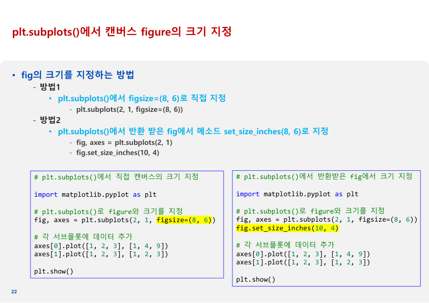

### plt.subplots()에서 캔버스 figure의 크기 지정

- fig의 크기를 지정하는 방법
- 방법1
- plt.subplots()에서 figsize=(8, 6)로 직접 지정
- plt.subplots(2, 1, figsize=(8, 6))
- 방법2
- plt.subplots()에서 반환 받은 fig에서 메소드 set_size_inches(8, 6)로 지정
- fig, axes = plt.subplots(2, 1)
- fig.set_size_inches(10, 4)
- # plt.subplots()에서 반환받은 fig에서 크기 지정
- import matplotlib.pyplot as plt
- # plt.subplots()로 figure와 크기를 지정
- fig, axes = plt.subplots(2, 1, figsize=(8, 6))
- fig.set_size_inches(10, 4)
- # 각 서브플롯에 데이터 추가
- axes[0].plot([1, 2, 3], [1, 4, 9])
- axes[1].plot([1, 2, 3], [1, 2, 3])
- plt.show()
- # plt.subplots()에서 직접 캔버스의 크기 지정
- import matplotlib.pyplot as plt
- # plt.subplots()로 figure와 크기를 지정
- fig, axes = plt.subplots(2, 1, figsize=(8, 6))
- # 각 서브플롯에 데이터 추가
- axes[0].plot([1, 2, 3], [1, 4, 9])
- axes[1].plot([1, 2, 3], [1, 2, 3])
- plt.show()

---

## Slide 23
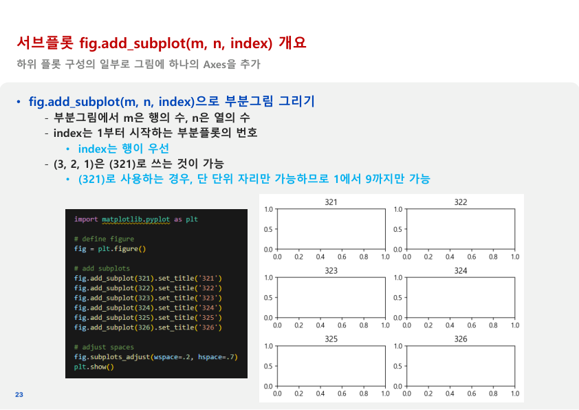

### 서브플롯 fig.add_subplot(m, n, index) 개요

- fig.add_subplot(m, n, index)으로 부분그림 그리기
- 부분그림에서 m은 행의 수, n은 열의 수
- index는 1부터 시작하는 부분플롯의 번호
- index는 행이 우선
- (3, 2, 1)은 (321)로 쓰는 것이 가능
- (321)로 사용하는 경우, 단 단위 자리만 가능하므로 1에서 9까지만 가능
- 하위 플롯 구성의 일부로 그림에 하나의 Axes을 추가

---

## Slide 24
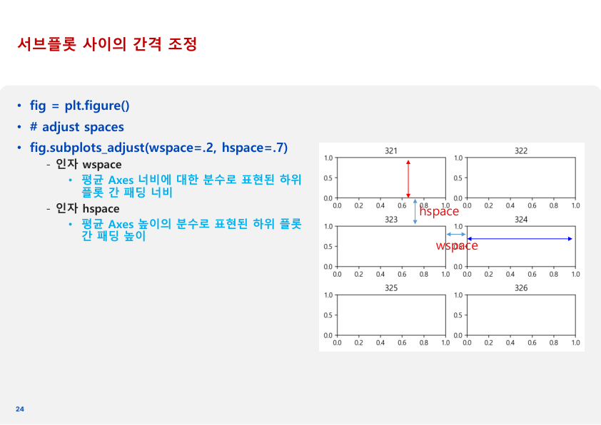

### 서브플롯 사이의 간격 조정

- fig = plt.figure()
- # adjust spaces
- fig.subplots_adjust(wspace=.2, hspace=.7)
- 인자 wspace
- 평균 Axes 너비에 대한 분수로 표현된 하위 플롯 간 패딩 너비
- 인자 hspace
- 평균 Axes 높이의 분수로 표현된 하위 플롯 간 패딩 높이
- hspace
- wspace

---

## Slide 25
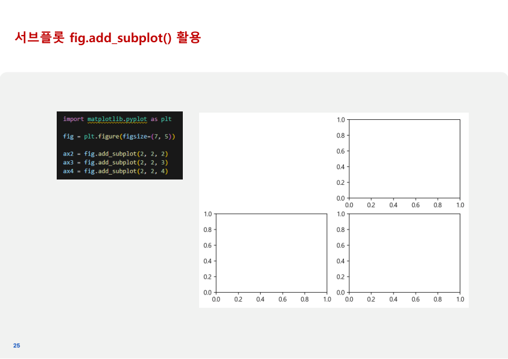

### 서브플롯 fig.add_subplot() 활용 

---

## Slide 26
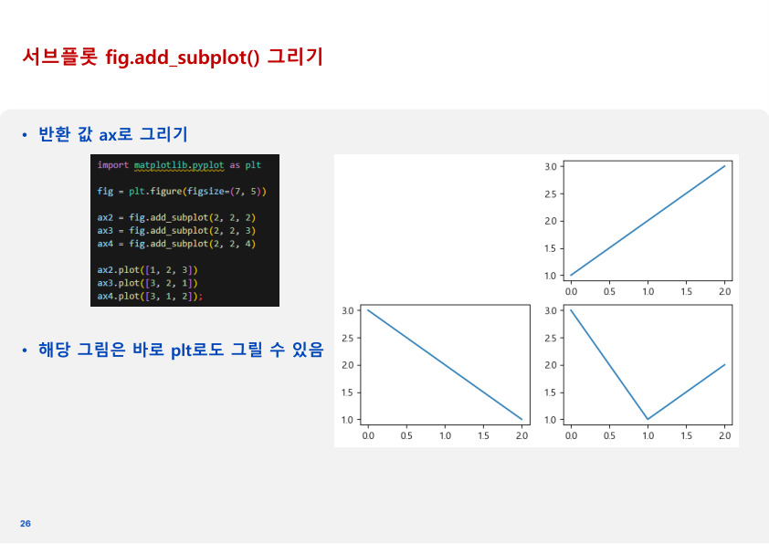

### 서브플롯 fig.add_subplot() 그리기

- 반환 값 ax로 그리기
- 해당 그림은 바로 plt로도 그릴 수 있음

---

## Slide 27
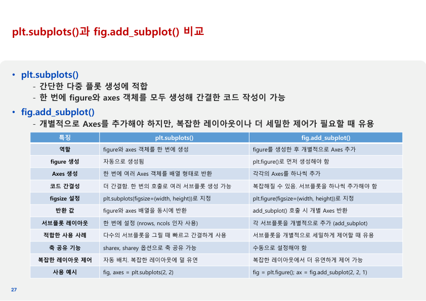

### plt.subplots()과 fig.add_subplot() 비교 

- plt.subplots()
- 간단한 다중 플롯 생성에 적합
- 한 번에 figure와 axes 객체를 모두 생성해 간결한 코드 작성이 가능
- fig.add_subplot()
- 개별적으로 Axes를 추가해야 하지만, 복잡한 레이아웃이나 더 세밀한 제어가 필요할 때 유용

---

## Slide 28

### 5.2 맞춤형 figure 레이아웃 서브플롯

- -

---

## Slide 29
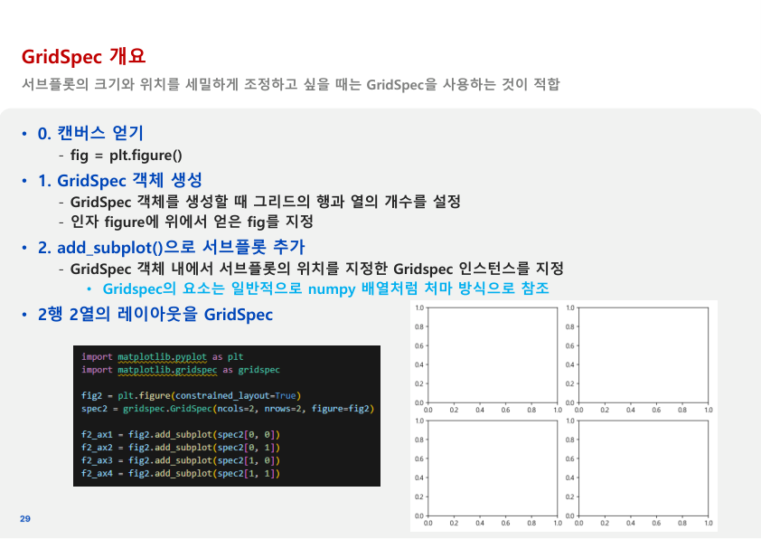

### GridSpec 개요

- 0. 캔버스 얻기
- fig = plt.figure()
- 1. GridSpec 객체 생성
- GridSpec 객체를 생성할 때 그리드의 행과 열의 개수를 설정
- 인자 figure에 위에서 얻은 fig를 지정
- 2. add_subplot()으로 서브플롯 추가
- GridSpec 객체 내에서 서브플롯의 위치를 지정한 Gridspec 인스턴스를 지정
- Gridspec의 요소는 일반적으로 numpy 배열처럼 처마 방식으로 참조
- 2행 2열의 레이아웃을 GridSpec
- 서브플롯의 크기와 위치를 세밀하게 조정하고 싶을 때는 GridSpec을 사용하는 것이 적합

---

## Slide 30
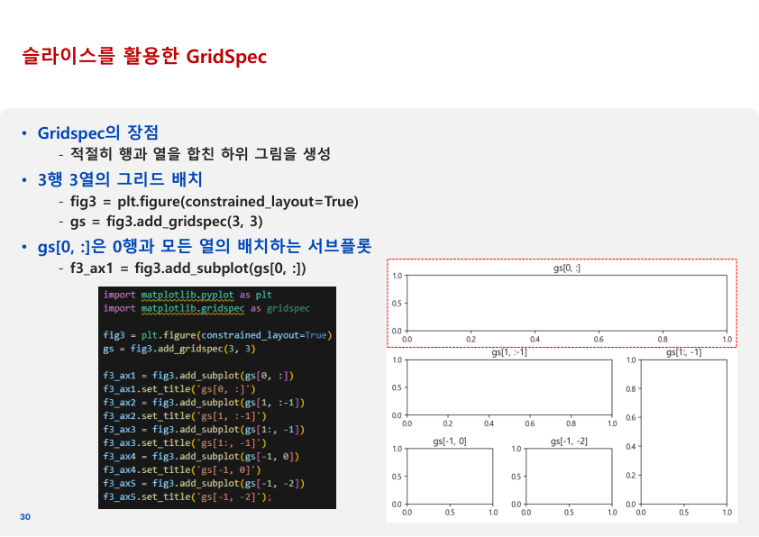

### 슬라이스를 활용한 GridSpec

- Gridspec의 장점
- 적절히 행과 열을 합친 하위 그림을 생성
- 3행 3열의 그리드 배치
- fig3 = plt.figure(constrained_layout=True)
- gs = fig3.add_gridspec(3, 3)
- gs[0, :]은 0행과 모든 열의 배치하는 서브플롯
- f3_ax1 = fig3.add_subplot(gs[0, :])

---

## Slide 31
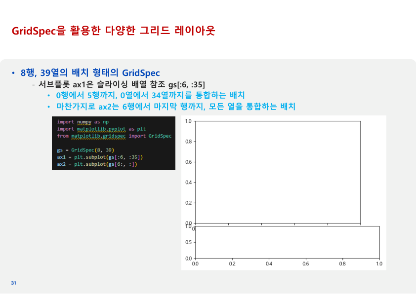

### GridSpec을 활용한 다양한 그리드 레이아웃

- 8행, 39열의 배치 형태의 GridSpec
- 서브플롯 ax1은 슬라이싱 배열 참조 gs[:6, :35]
- 0행에서 5행까지, 0열에서 34열까지를 통합하는 배치
- 마찬가지로 ax2는 6행에서 마지막 행까지, 모든 열을 통합하는 배치

---

## Slide 32
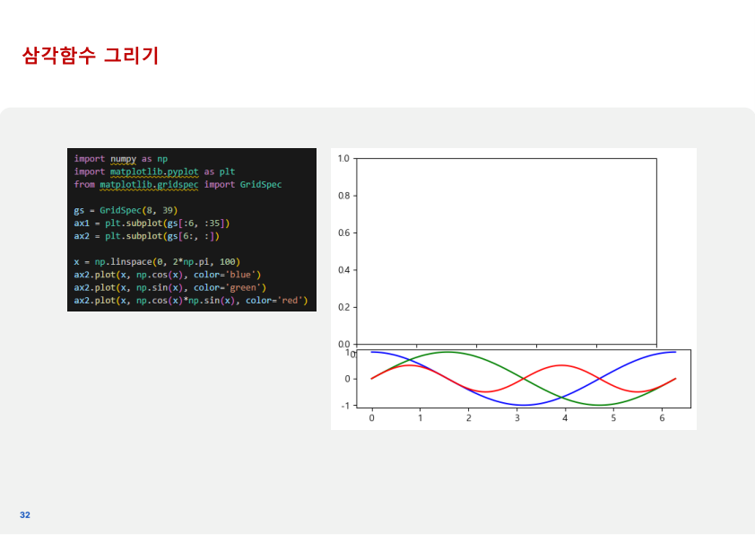

### 삼각함수 그리기

---

## Slide 33
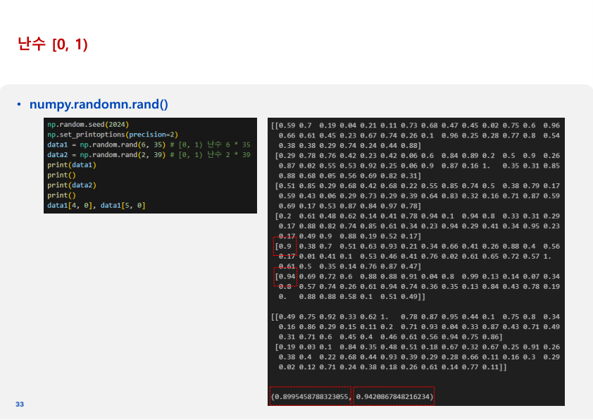

### 난수 [0, 1)

- numpy.randomn.rand()

---

## Slide 34
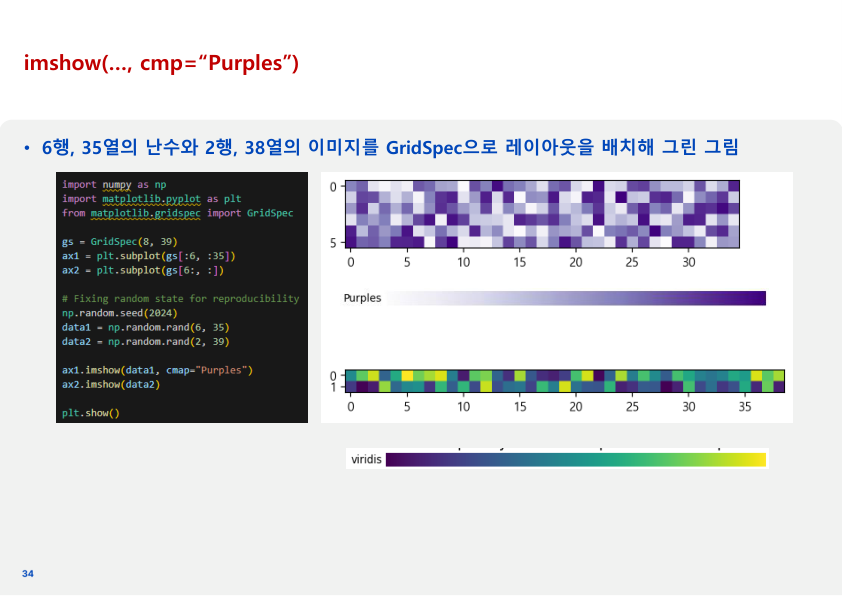

### imshow(…, cmp=“Purples”)

- 6행, 35열의 난수와 2행, 38열의 이미지를 GridSpec으로 레이아웃을 배치해 그린 그림

---

## Slide 35
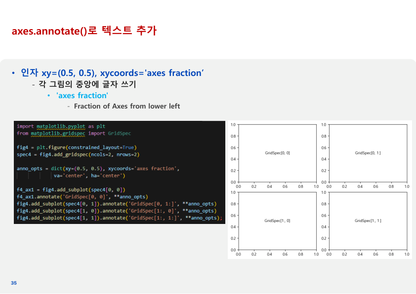

### axes.annotate()로 텍스트 추가

- 인자 xy=(0.5, 0.5), xycoords='axes fraction’
- 각 그림의 중앙에 글자 쓰기
- 'axes fraction'
- Fraction of Axes from lower left

---

## Slide 36
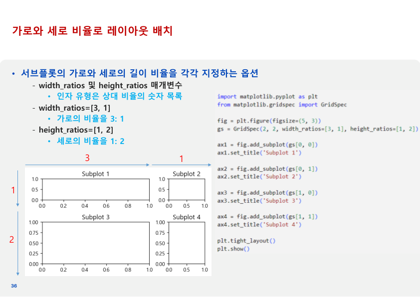

### 가로와 세로 비율로 레이아웃 배치

- 서브플롯의 가로와 세로의 길이 비율을 각각 지정하는 옵션
- width_ratios 및 height_ratios 매개변수
- 인자 유형은 상대 비율의 숫자 목록
- width_ratios=[3, 1]
- 가로의 비율을 3: 1
- height_ratios=[1, 2]
- 세로의 비율을 1: 2
- 1
- 2
- 3
- 1

---

## Slide 37
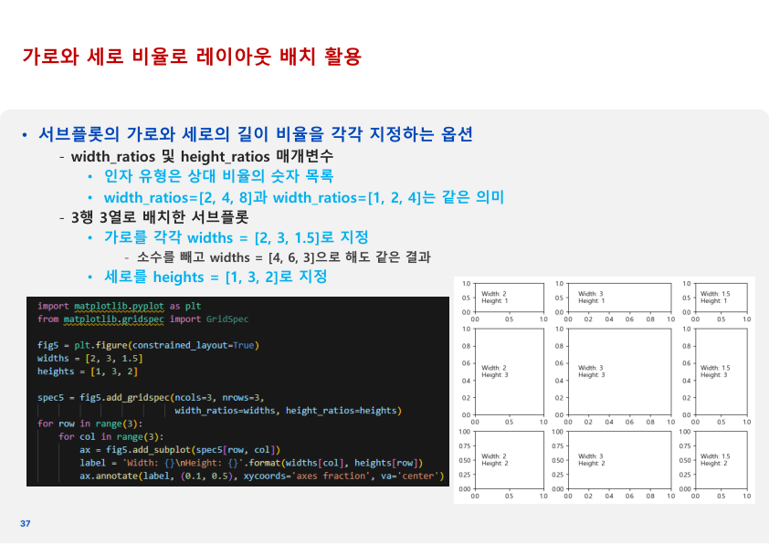

### 가로와 세로 비율로 레이아웃 배치 활용

- 서브플롯의 가로와 세로의 길이 비율을 각각 지정하는 옵션
- width_ratios 및 height_ratios 매개변수
- 인자 유형은 상대 비율의 숫자 목록
- width_ratios=[2, 4, 8]과 width_ratios=[1, 2, 4]는 같은 의미
- 3행 3열로 배치한 서브플롯
- 가로를 각각 widths = [2, 3, 1.5]로 지정
- 소수를 빼고 widths = [4, 6, 3]으로 해도 같은 결과
- 세로를 heights = [1, 3, 2]로 지정

---

## Slide 38
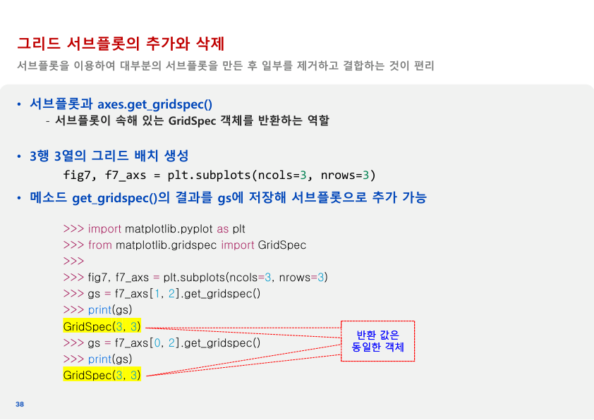

### 그리드 서브플롯의 추가와 삭제

- 서브플롯과 axes.get_gridspec()
- 서브플롯이 속해 있는 GridSpec 객체를 반환하는 역할
- 3행 3열의 그리드 배치 생성
- 메소드 get_gridspec()의 결과를 gs에 저장해 서브플롯으로 추가 가능
- 서브플롯을 이용하여 대부분의 서브플롯을 만든 후 일부를 제거하고 결합하는 것이 편리
- fig7, f7_axs = plt.subplots(ncols=3, nrows=3)
- >>> import matplotlib.pyplot as plt
- >>> from matplotlib.gridspec import GridSpec
- >>>
- >>> fig7, f7_axs = plt.subplots(ncols=3, nrows=3)
- >>> gs = f7_axs[1, 2].get_gridspec()
- >>> print(gs)
- GridSpec(3, 3)
- >>> gs = f7_axs[0, 2].get_gridspec()
- >>> print(gs)
- GridSpec(3, 3)
- 반환 값은 동일한 객체
- 반환 값은 동일한 객체

---

## Slide 39
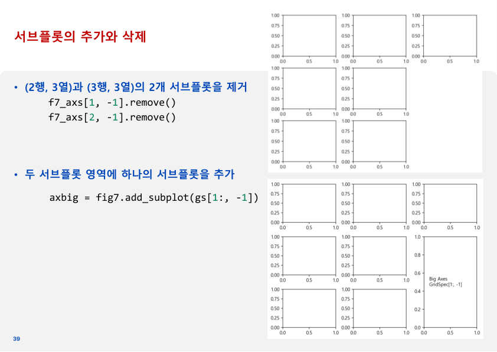

### 서브플롯의 추가와 삭제

- (2행, 3열)과 (3행, 3열)의 2개 서브플롯을 제거
- 두 서브플롯 영역에 하나의 서브플롯을 추가
- axbig = fig7.add_subplot(gs[1:, -1])
- f7_axs[1, -1].remove()
- f7_axs[2, -1].remove()

---

## Slide 40
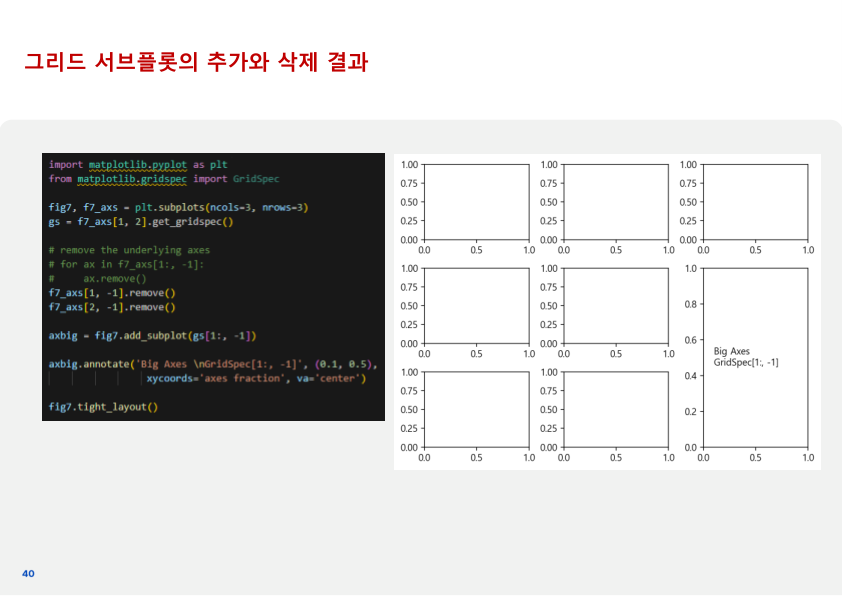

### 그리드 서브플롯의 추가와 삭제 결과

---

## Slide 41
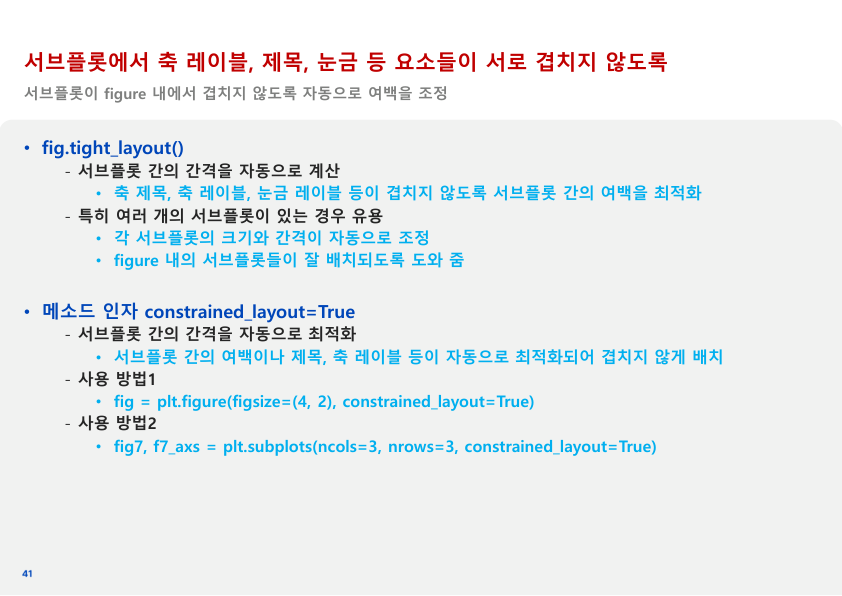

### 서브플롯에서 축 레이블, 제목, 눈금 등 요소들이 서로 겹치지 않도록

- fig.tight_layout()
- 서브플롯 간의 간격을 자동으로 계산
- 축 제목, 축 레이블, 눈금 레이블 등이 겹치지 않도록 서브플롯 간의 여백을 최적화
- 특히 여러 개의 서브플롯이 있는 경우 유용
- 각 서브플롯의 크기와 간격이 자동으로 조정
- figure 내의 서브플롯들이 잘 배치되도록 도와 줌
- 메소드 인자 constrained_layout=True
- 서브플롯 간의 간격을 자동으로 최적화
- 서브플롯 간의 여백이나 제목, 축 레이블 등이 자동으로 최적화되어 겹치지 않게 배치
- 사용 방법1
- fig = plt.figure(figsize=(4, 2), constrained_layout=True)
- 사용 방법2
- fig7, f7_axs = plt.subplots(ncols=3, nrows=3, constrained_layout=True)
- 서브플롯이 figure 내에서 겹치지 않도록 자동으로 여백을 조정

---

## Slide 42
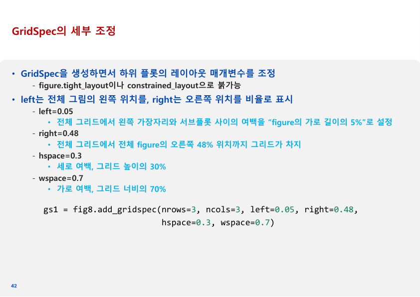

### GridSpec의 세부 조정

- GridSpec을 생성하면서 하위 플롯의 레이아웃 매개변수를 조정
- figure.tight_layout이나 constrained_layout으로 붉가능
- left는 전체 그림의 왼쪽 위치를, right는 오른쪽 위치를 비율로 표시
- left=0.05
- 전체 그리드에서 왼쪽 가장자리와 서브플롯 사이의 여백을 “figure의 가로 길이의 5%”로 설정
- right=0.48
- 전체 그리드에서 전체 figure의 오른쪽 48% 위치까지 그리드가 차지
- hspace=0.3
- 세로 여백, 그리드 높이의 30%
- wspace=0.7
- 가로 여백, 그리드 너비의 70%
- gs1 = fig8.add_gridspec(nrows=3, ncols=3, left=0.05, right=0.48,
- hspace=0.3, wspace=0.7)

---

## Slide 43
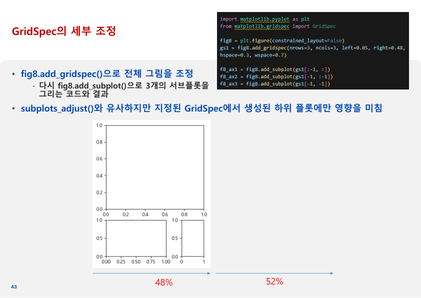

### GridSpec의 세부 조정

- fig8.add_gridspec()으로 전체 그림을 조정
- 다시 fig8.add_subplot()으로 3개의 서브플롯을그리는 코드와 결과
- subplots_adjust()와 유사하지만 지정된 GridSpec에서 생성된 하위 플롯에만 영향을 미침
- 48%
- 52%

---

## Slide 44
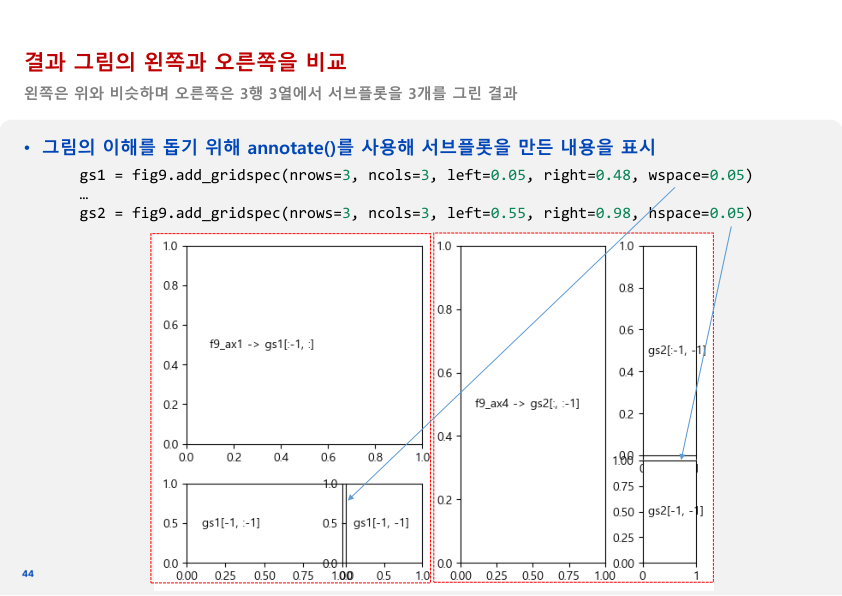

### 결과 그림의 왼쪽과 오른쪽을 비교

- 그림의 이해를 돕기 위해 annotate()를 사용해 서브플롯을 만든 내용을 표시
- 왼쪽은 위와 비슷하며 오른쪽은 3행 3열에서 서브플롯을 3개를 그린 결과
- gs1 = fig9.add_gridspec(nrows=3, ncols=3, left=0.05, right=0.48, wspace=0.05)
- …
- gs2 = fig9.add_gridspec(nrows=3, ncols=3, left=0.55, right=0.98, hspace=0.05)

---

## Slide 45
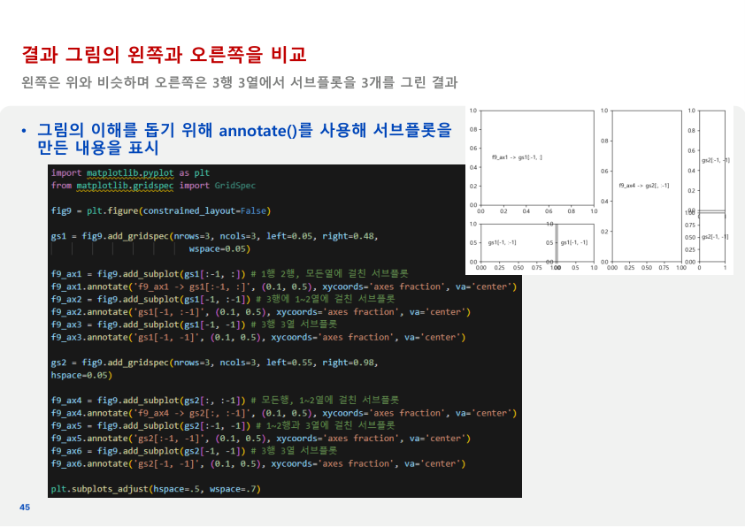

### 결과 그림의 왼쪽과 오른쪽을 비교

- 그림의 이해를 돕기 위해 annotate()를 사용해 서브플롯을만든 내용을 표시
- 왼쪽은 위와 비슷하며 오른쪽은 3행 3열에서 서브플롯을 3개를 그린 결과

---

## Slide 46
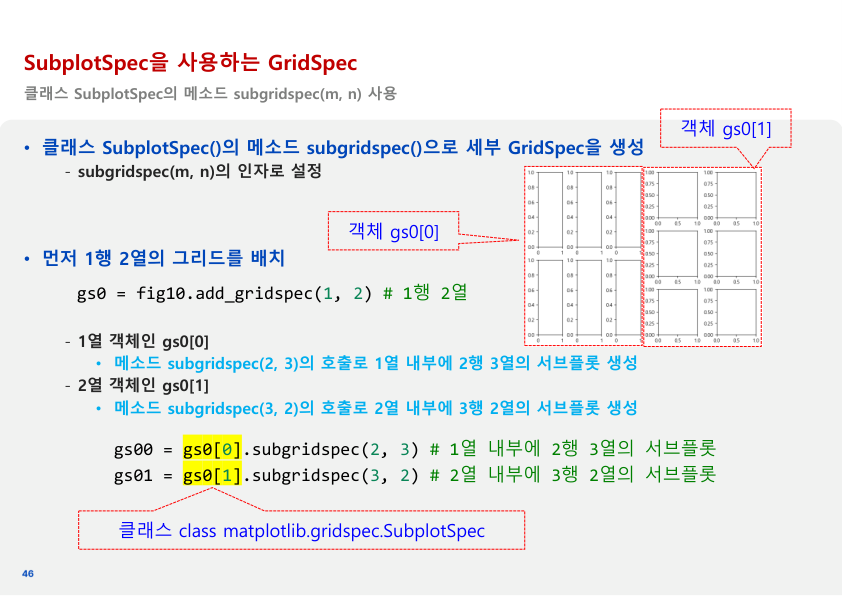

### SubplotSpec을 사용하는 GridSpec

- 클래스 SubplotSpec()의 메소드 subgridspec()으로 세부 GridSpec을 생성
- subgridspec(m, n)의 인자로 설정
- 먼저 1행 2열의 그리드를 배치
- 1열 객체인 gs0[0]
- 메소드 subgridspec(2, 3)의 호출로 1열 내부에 2행 3열의 서브플롯 생성
- 2열 객체인 gs0[1]
- 메소드 subgridspec(3, 2)의 호출로 2열 내부에 3행 2열의 서브플롯 생성
- 클래스 SubplotSpec의 메소드 subgridspec(m, n) 사용
- gs0 = fig10.add_gridspec(1, 2) # 1행 2열
- gs00 = gs0[0].subgridspec(2, 3) # 1열 내부에 2행 3열의 서브플롯
- gs01 = gs0[1].subgridspec(3, 2) # 2열 내부에 3행 2열의 서브플롯
- 클래스 class matplotlib.gridspec.SubplotSpec
- 객체 gs0[0]
- 객체 gs0[1]

---

## Slide 47
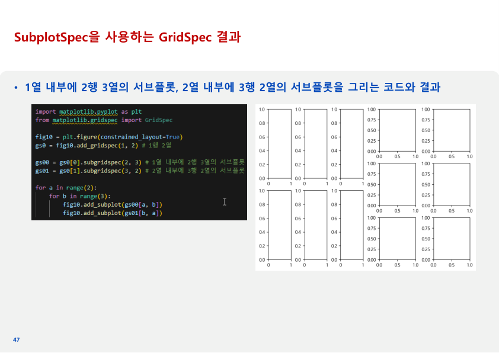

### SubplotSpec을 사용하는 GridSpec 결과

- 1열 내부에 2행 3열의 서브플롯, 2열 내부에 3행 2열의 서브플롯을 그리는 코드와 결과

---

## Slide 48
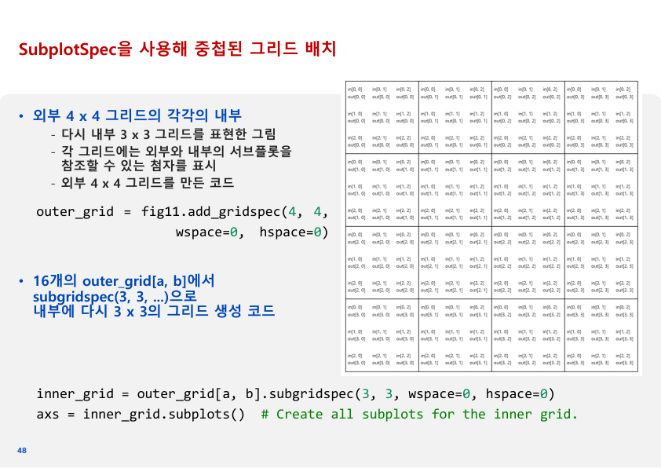

### SubplotSpec을 사용해 중첩된 그리드 배치

- 외부 4 x 4 그리드의 각각의 내부
- 다시 내부 3 x 3 그리드를 표현한 그림
- 각 그리드에는 외부와 내부의 서브플롯을참조할 수 있는 첨자를 표시
- 외부 4 x 4 그리드를 만든 코드
- 16개의 outer_grid[a, b]에서 subgridspec(3, 3, ...)으로 내부에 다시 3 x 3의 그리드 생성 코드
- outer_grid = fig11.add_gridspec(4, 4,
- wspace=0, hspace=0)
- inner_grid = outer_grid[a, b].subgridspec(3, 3, wspace=0, hspace=0)
- axs = inner_grid.subplots()  # Create all subplots for the inner grid.

---

## Slide 49
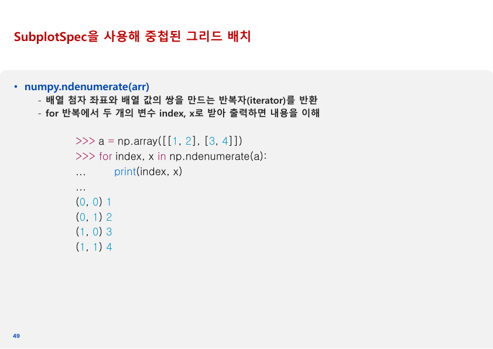

### SubplotSpec을 사용해 중첩된 그리드 배치

- numpy.ndenumerate(arr)
- 배열 첨자 좌표와 배열 값의 쌍을 만드는 반복자(iterator)를 반환
- for 반복에서 두 개의 변수 index, x로 받아 출력하면 내용을 이해
- >>> a = np.array([[1, 2], [3, 4]])
- >>> for index, x in np.ndenumerate(a):
- ...        print(index, x)
- ...
- (0, 0) 1
- (0, 1) 2
- (1, 0) 3
- (1, 1) 4

---

## Slide 50
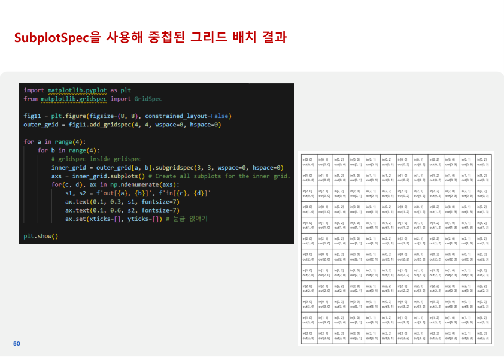

### SubplotSpec을 사용해 중첩된 그리드 배치 결과 

---

## Slide 51
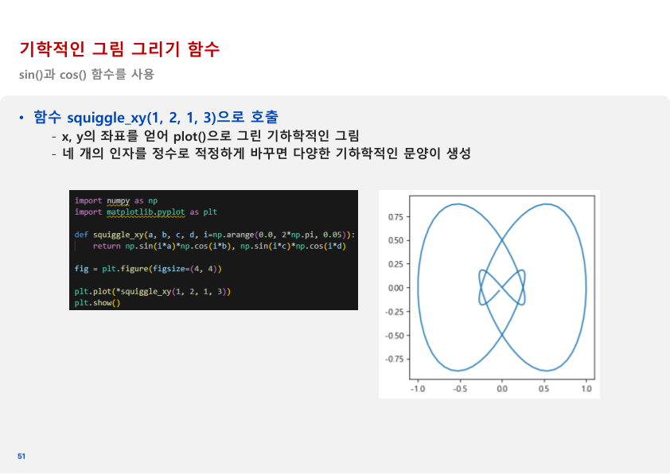

### 기학적인 그림 그리기 함수

- 함수 squiggle_xy(1, 2, 1, 3)으로 호출
- x, y의 좌표를 얻어 plot()으로 그린 기하학적인 그림
- 네 개의 인자를 정수로 적정하게 바꾸면 다양한 기하학적인 문양이 생성
- sin()과 cos() 함수를 사용

---

## Slide 52
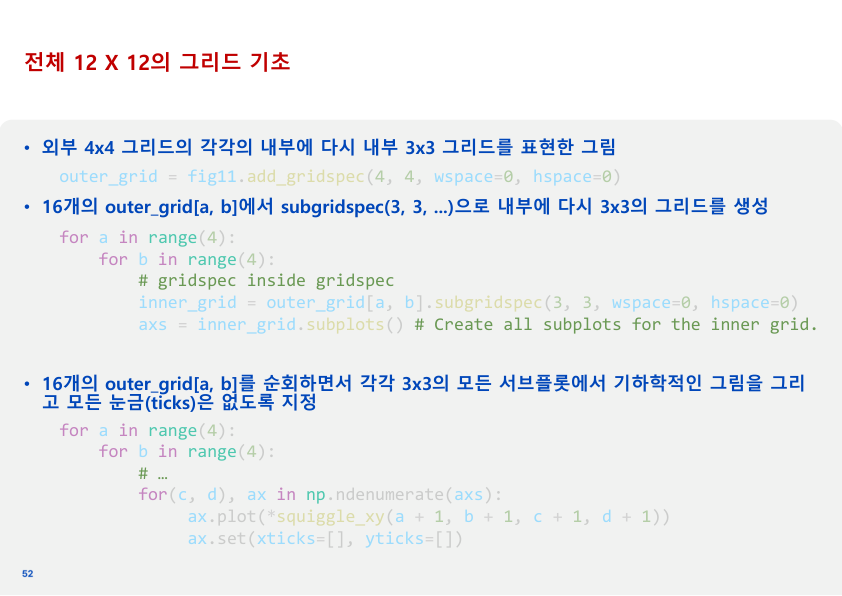

### 전체 12 X 12의 그리드 기초

- 외부 4x4 그리드의 각각의 내부에 다시 내부 3x3 그리드를 표현한 그림
- 16개의 outer_grid[a, b]에서 subgridspec(3, 3, ...)으로 내부에 다시 3x3의 그리드를 생성
- 16개의 outer_grid[a, b]를 순회하면서 각각 3x3의 모든 서브플롯에서 기하학적인 그림을 그리고 모든 눈금(ticks)은 없도록 지정
- outer_grid = fig11.add_gridspec(4, 4, wspace=0, hspace=0)
- for a in range(4):
- for b in range(4):
- # …
- for(c, d), ax in np.ndenumerate(axs):
- ax.plot(*squiggle_xy(a + 1, b + 1, c + 1, d + 1))
- ax.set(xticks=[], yticks=[])
- for a in range(4):
- for b in range(4):
- # gridspec inside gridspec
- inner_grid = outer_grid[a, b].subgridspec(3, 3, wspace=0, hspace=0)
- axs = inner_grid.subplots() # Create all subplots for the inner grid.

---

## Slide 53
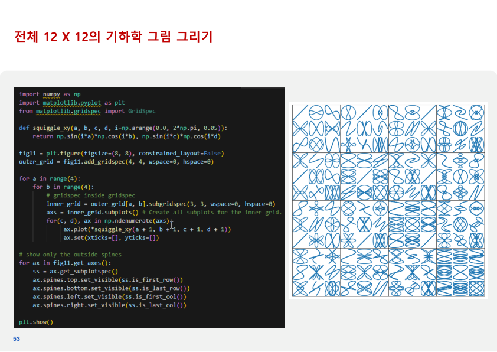

### 전체 12 X 12의 기하학 그림 그리기

---

## Slide 54
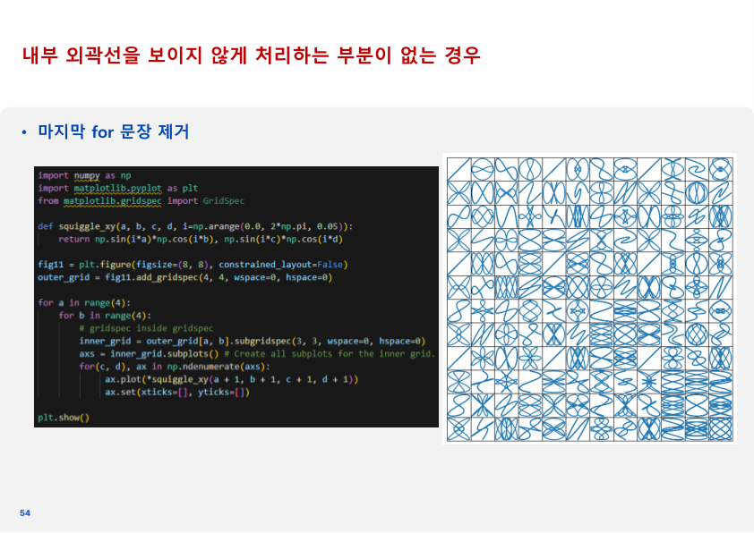

### 내부 외곽선을 보이지 않게 처리하는 부분이 없는 경우

- 마지막 for 문장 제거

---

