# ch06 테이블 분석 패키지 pandas.pptx

## Slide 1

- 단원 06
- 테이블 분석 패키지 pandas
- 인공지능소프트웨어학과
- 강환수 교수

---

## Slide 2

### 6.1 pandas 개요

- -

---

## Slide 3
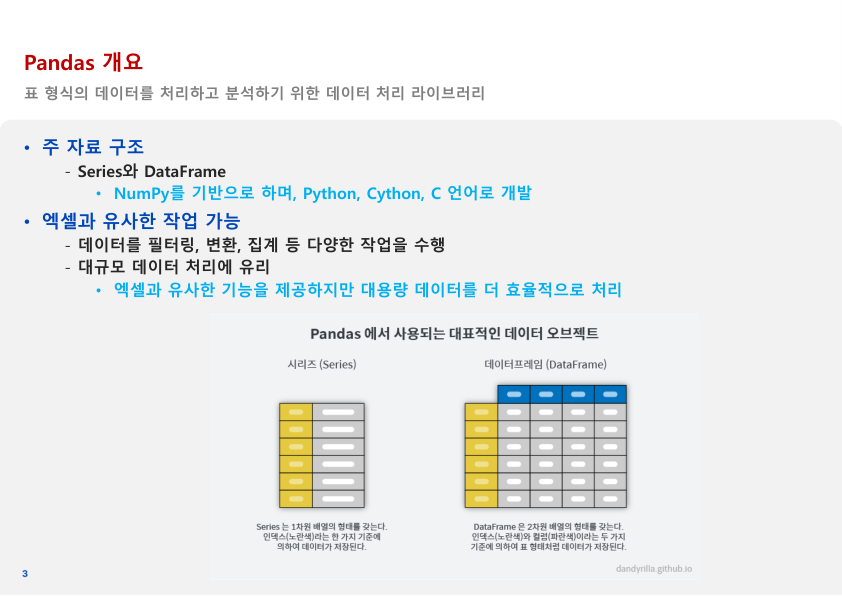

### Pandas 개요

- 주 자료 구조
- Series와 DataFrame
- NumPy를 기반으로 하며, Python, Cython, C 언어로 개발
- 엑셀과 유사한 작업 가능
- 데이터를 필터링, 변환, 집계 등 다양한 작업을 수행
- 대규모 데이터 처리에 유리
- 엑셀과 유사한 기능을 제공하지만 대용량 데이터를 더 효율적으로 처리
- 표 형식의 데이터를 처리하고 분석하기 위한 데이터 처리 라이브러리

---

## Slide 4
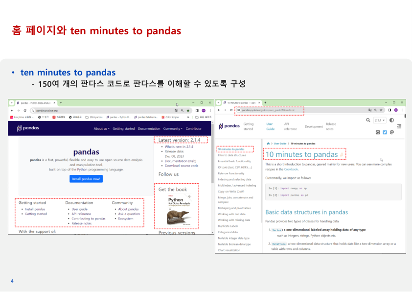

### 홈 페이지와 ten minutes to pandas

- ten minutes to pandas
- 150여 개의 판다스 코드로 판다스를 이해할 수 있도록 구성

---

## Slide 5
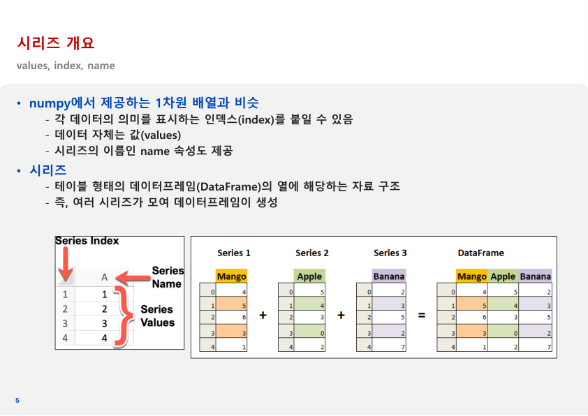

### 시리즈 개요

- numpy에서 제공하는 1차원 배열과 비슷
- 각 데이터의 의미를 표시하는 인덱스(index)를 붙일 수 있음
- 데이터 자체는 값(values)
- 시리즈의 이름인 name 속성도 제공
- 시리즈
- 테이블 형태의 데이터프레임(DataFrame)의 열에 해당하는 자료 구조
- 즉, 여러 시리즈가 모여 데이터프레임이 생성
- values, index, name

---

## Slide 6
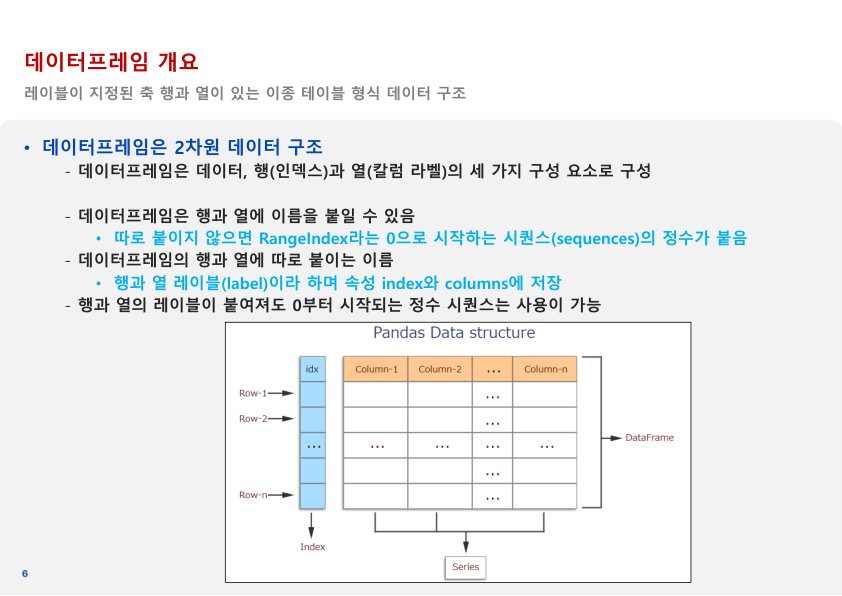

### 데이터프레임 개요

- 데이터프레임은 2차원 데이터 구조
- 데이터프레임은 데이터, 행(인덱스)과 열(칼럼 라벨)의 세 가지 구성 요소로 구성
- 데이터프레임은 행과 열에 이름을 붙일 수 있음
- 따로 붙이지 않으면 RangeIndex라는 0으로 시작하는 시퀀스(sequences)의 정수가 붙음
- 데이터프레임의 행과 열에 따로 붙이는 이름
- 행과 열 레이블(label)이라 하며 속성 index와 columns에 저장
- 행과 열의 레이블이 붙여져도 0부터 시작되는 정수 시퀀스는 사용이 가능
- 레이블이 지정된 축 행과 열이 있는 이종 테이블 형식 데이터 구조

---

## Slide 7
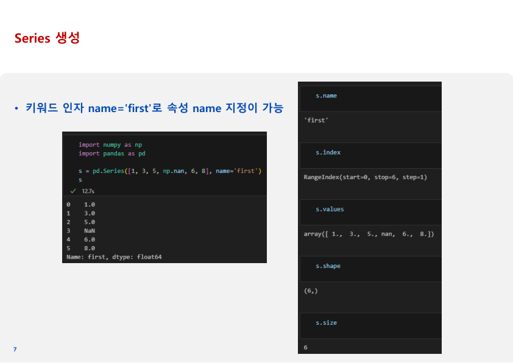

### Series 생성

- 키워드 인자 name='first'로 속성 name 지정이 가능

---

## Slide 8
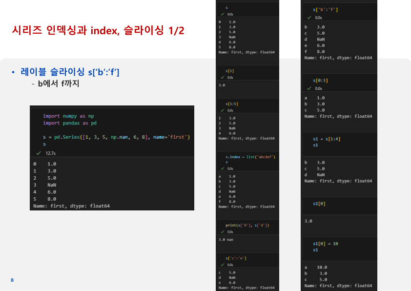

### 시리즈 인덱싱과 index, 슬라이싱 1/2

- 레이블 슬라이싱 s[‘b’:’f’]
- b에서 f까지

---

## Slide 9
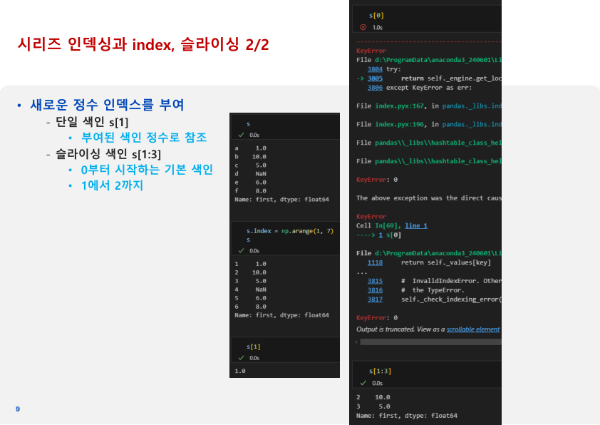

### 시리즈 인덱싱과 index, 슬라이싱 2/2

- 새로운 정수 인덱스를 부여
- 단일 색인 s[1]
- 부여된 색인 정수로 참조
- 슬라이싱 색인 s[1:3]
- 0부터 시작하는 기본 색인
- 1에서 2까지

---

## Slide 10
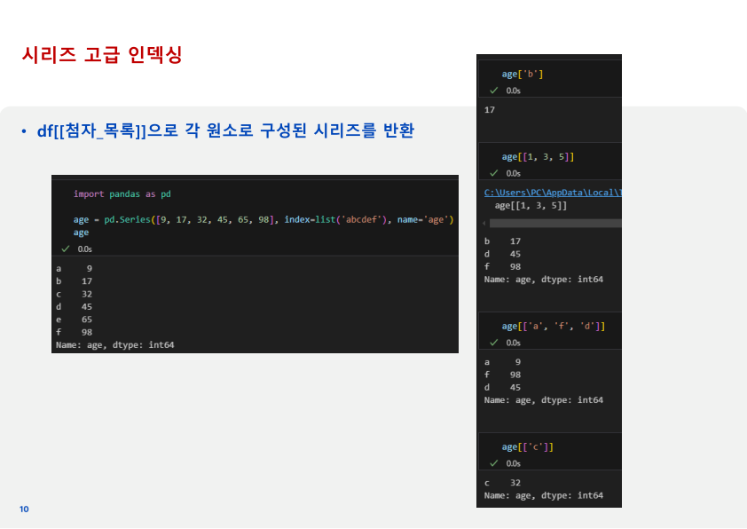

### 시리즈 고급 인덱싱

- df[[첨자_목록]]으로 각 원소로 구성된 시리즈를 반환

---

## Slide 11
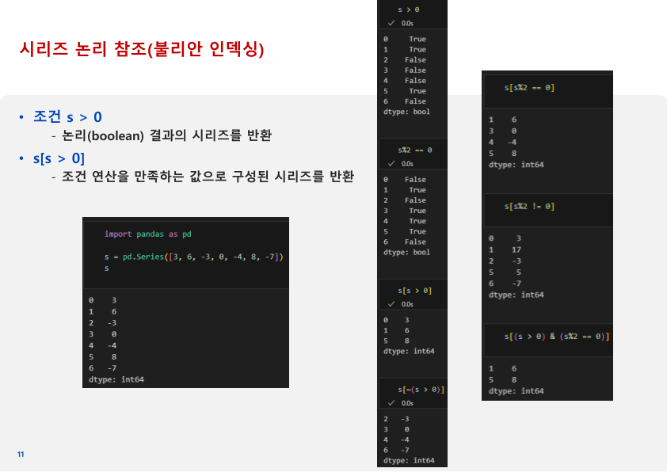

### 시리즈 논리 참조(불리안 인덱싱)

- 조건 s > 0
- 논리(boolean) 결과의 시리즈를 반환
- s[s > 0]
- 조건 연산을 만족하는 값으로 구성된 시리즈를 반환

---

## Slide 12
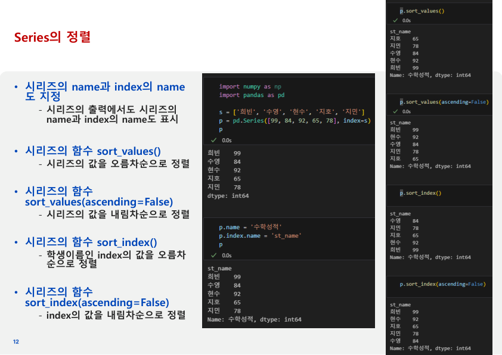

### Series의 정렬

- 시리즈의 name과 index의 name도 지정
- 시리즈의 출력에서도 시리즈의 name과 index의 name도 표시
- 시리즈의 함수 sort_values()
- 시리즈의 값을 오름차순으로 정렬
- 시리즈의 함수 sort_values(ascending=False)
- 시리즈의 값을 내림차순으로 정렬
- 시리즈의 함수 sort_index()
- 학생이름인 index의 값을 오름차순으로 정렬
- 시리즈의 함수 sort_index(ascending=False)
- index의 값을 내림차순으로 정렬

---

## Slide 13
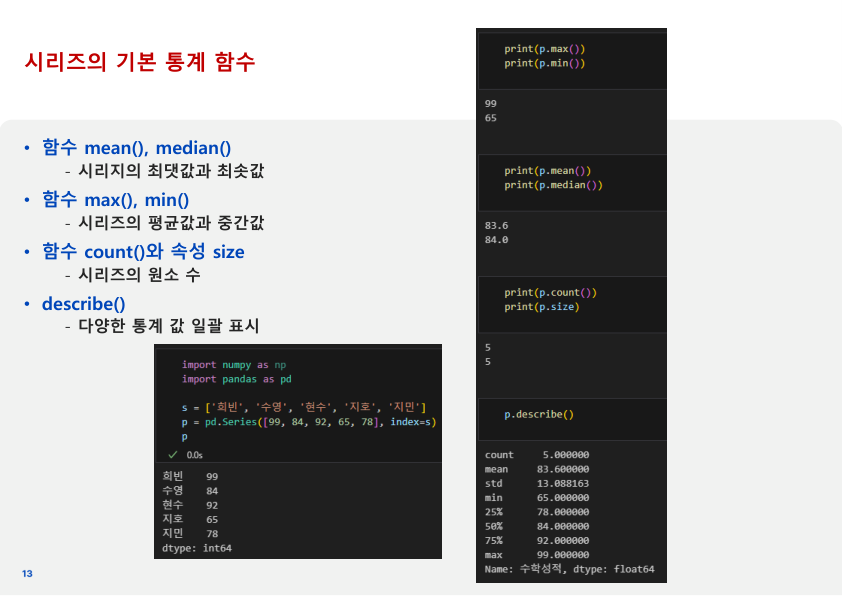

### 시리즈의 기본 통계 함수

- 함수 mean(), median()
- 시리지의 최댓값과 최솟값
- 함수 max(), min()
- 시리즈의 평균값과 중간값
- 함수 count()와 속성 size
- 시리즈의 원소 수
- describe()
- 다양한 통계 값 일괄 표시

---

## Slide 14
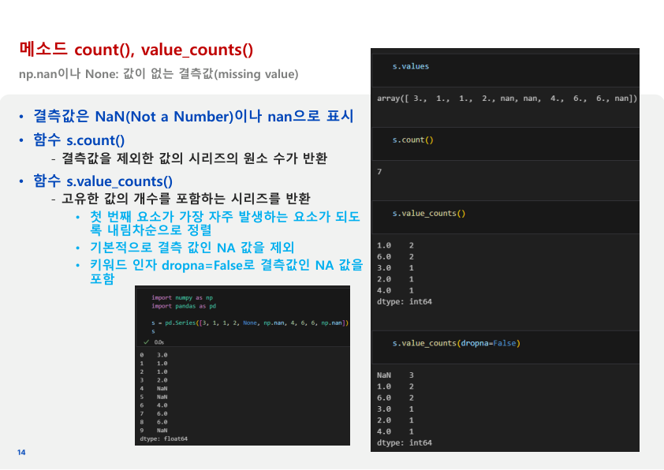

### 메소드 count(), value_counts()

- 결측값은 NaN(Not a Number)이나 nan으로 표시
- 함수 s.count()
- 결측값을 제외한 값의 시리즈의 원소 수가 반환
- 함수 s.value_counts()
- 고유한 값의 개수를 포함하는 시리즈를 반환
- 첫 번째 요소가 가장 자주 발생하는 요소가 되도록 내림차순으로 정렬
- 기본적으로 결측 값인 NA 값을 제외
- 키워드 인자 dropna=False로 결측값인 NA 값을 포함
- np.nan이나 None: 값이 없는 결측값(missing value)

---

## Slide 15
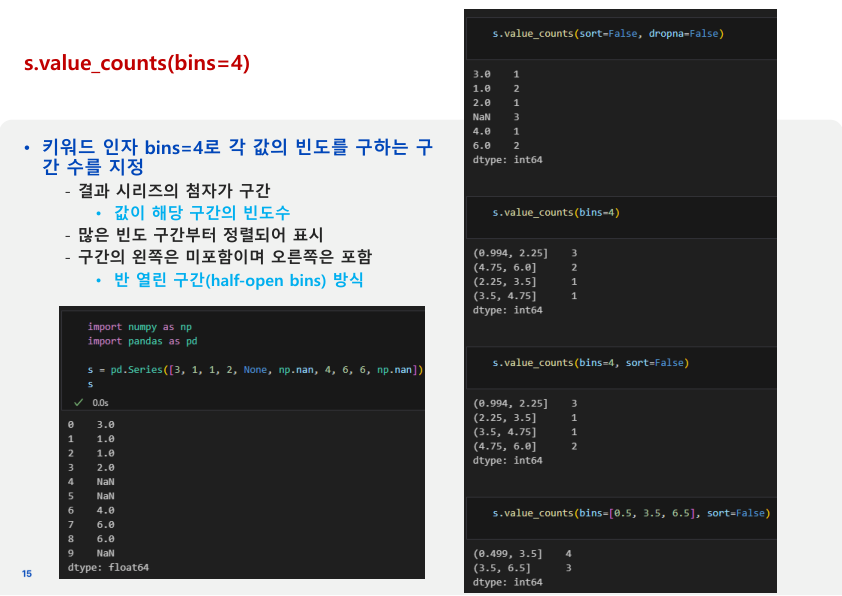

### s.value_counts(bins=4)

- 키워드 인자 bins=4로 각 값의 빈도를 구하는 구간 수를 지정
- 결과 시리즈의 첨자가 구간
- 값이 해당 구간의 빈도수
- 많은 빈도 구간부터 정렬되어 표시
- 구간의 왼쪽은 미포함이며 오른쪽은 포함
- 반 열린 구간(half-open bins) 방식

---

## Slide 16

### 6.2 데이터프레임 생성

- -

---

## Slide 17
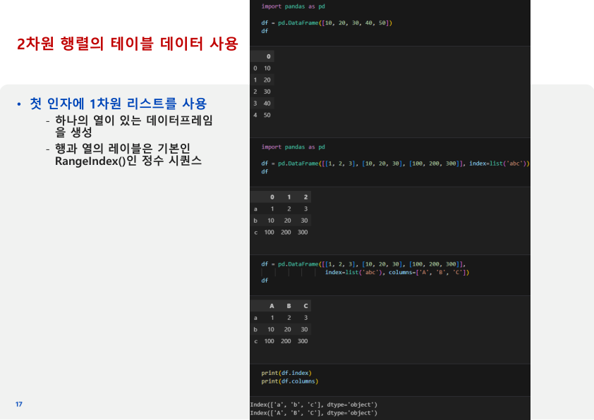

### 2차원 행렬의 테이블 데이터 사용

- 첫 인자에 1차원 리스트를 사용
- 하나의 열이 있는 데이터프레임을 생성
- 행과 열의 레이블은 기본인 RangeIndex()인 정수 시퀀스

---

## Slide 18
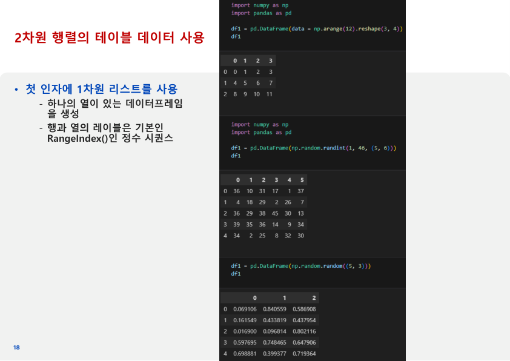

### 2차원 행렬의 테이블 데이터 사용

- 첫 인자에 1차원 리스트를 사용
- 하나의 열이 있는 데이터프레임을 생성
- 행과 열의 레이블은 기본인 RangeIndex()인 정수 시퀀스

---

## Slide 19
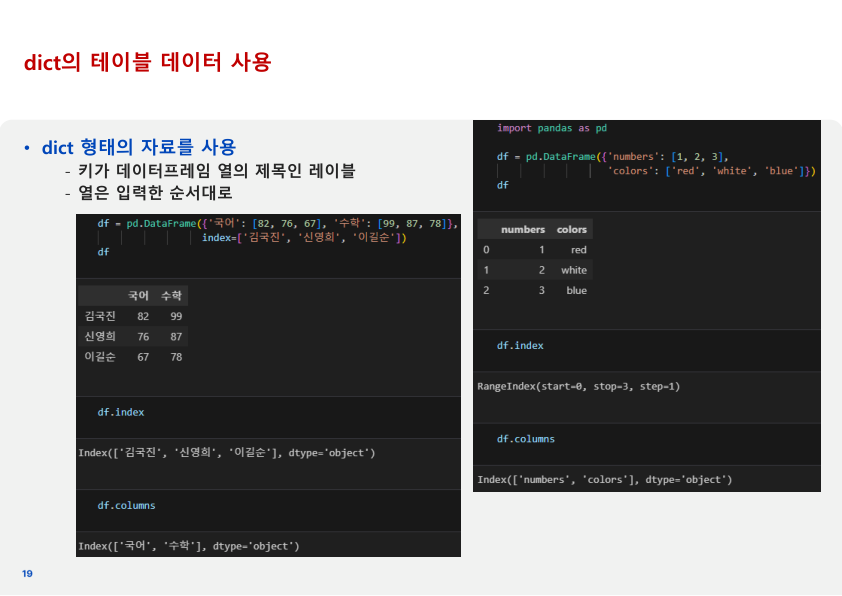

### dict의 테이블 데이터 사용

- dict 형태의 자료를 사용
- 키가 데이터프레임 열의 제목인 레이블
- 열은 입력한 순서대로

---

## Slide 20
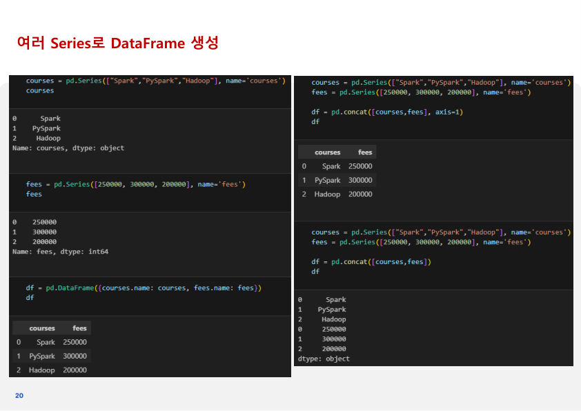

### 여러 Series로 DataFrame 생성

---

## Slide 21
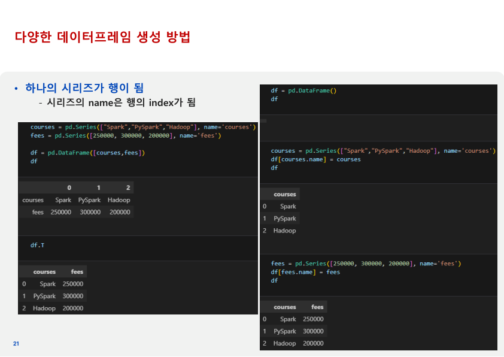

### 다양한 데이터프레임 생성 방법

- 하나의 시리즈가 행이 됨
- 시리즈의 name은 행의 index가 됨

---

## Slide 22
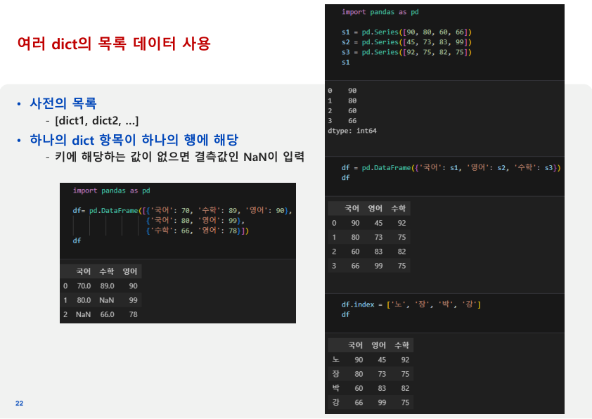

### 여러 dict의 목록 데이터 사용

- 사전의 목록
- [dict1, dict2, …]
- 하나의 dict 항목이 하나의 행에 해당
- 키에 해당하는 값이 없으면 결측값인 NaN이 입력

---

## Slide 23
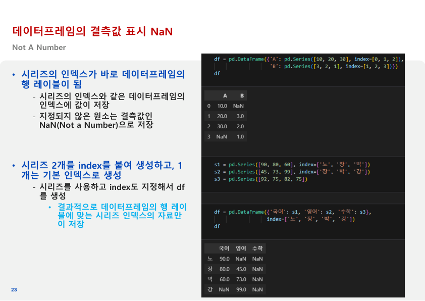

### 데이터프레임의 결측값 표시 NaN

- 시리즈의 인덱스가 바로 데이터프레임의 행 레이블이 됨
- 시리즈의 인덱스와 같은 데이터프레임의 인덱스에 값이 저장
- 지정되지 않은 원소는 결측값인 NaN(Not a Number)으로 저장
- 시리즈 2개를 index를 붙여 생성하고, 1개는 기본 인덱스로 생성
- 시리즈를 사용하고 index도 지정해서 df를 생성
- 결과적으로 데이터프레임의 행 레이블에 맞는 시리즈 인덱스의 자료만이 저장
- Not A Number

---

## Slide 24
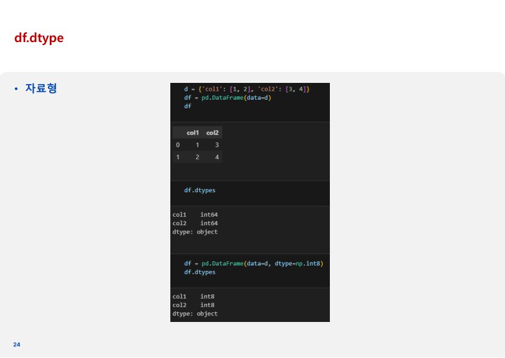

### df.dtype 

- 자료형

---

## Slide 25
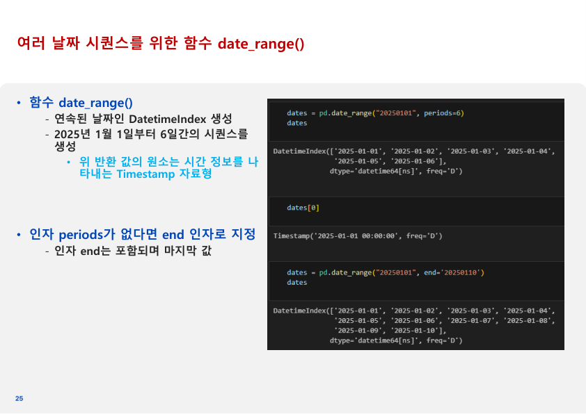

### 여러 날짜 시퀀스를 위한 함수 date_range()

- 함수 date_range()
- 연속된 날짜인 DatetimeIndex 생성
- 2025년 1월 1일부터 6일간의 시퀀스를 생성
- 위 반환 값의 원소는 시간 정보를 나타내는 Timestamp 자료형
- 인자 periods가 없다면 end 인자로 지정
- 인자 end는 포함되며 마지막 값

---

## Slide 26
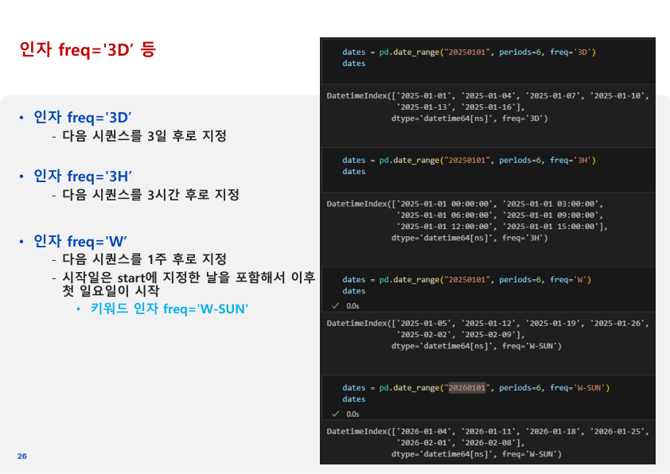

### 인자 freq='3D’ 등

- 인자 freq='3D’
- 다음 시퀀스를 3일 후로 지정
- 인자 freq='3H’
- 다음 시퀀스를 3시간 후로 지정
- 인자 freq='W’
- 다음 시퀀스를 1주 후로 지정
- 시작일은 start에 지정한 날을 포함해서 이후 첫 일요일이 시작
- 키워드 인자 freq='W-SUN'

---

## Slide 27
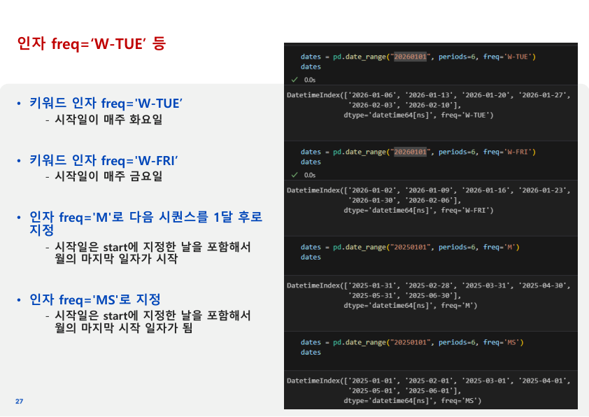

### 인자 freq=‘W-TUE’ 등

- 키워드 인자 freq='W-TUE’
- 시작일이 매주 화요일
- 키워드 인자 freq='W-FRI’
- 시작일이 매주 금요일
- 인자 freq='M'로 다음 시퀀스를 1달 후로 지정
- 시작일은 start에 지정한 날을 포함해서 월의 마지막 일자가 시작
- 인자 freq='MS'로 지정
- 시작일은 start에 지정한 날을 포함해서 월의 마지막 시작 일자가 됨

---

## Slide 28
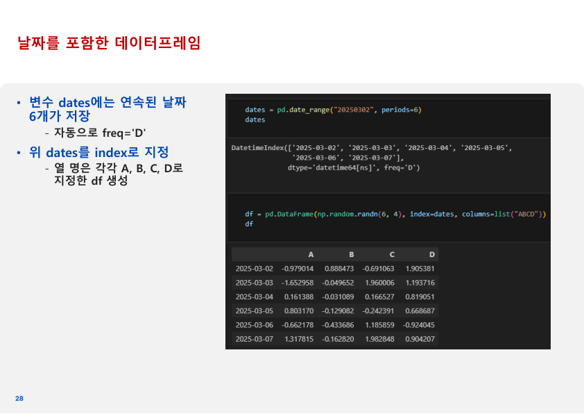

### 날짜를 포함한 데이터프레임

- 변수 dates에는 연속된 날짜 6개가 저장
- 자동으로 freq='D'
- 위 dates를 index로 지정
- 열 명은 각각 A, B, C, D로 지정한 df 생성

---

## Slide 29
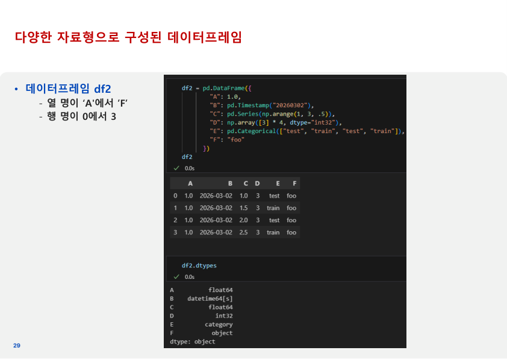

### 다양한 자료형으로 구성된 데이터프레임

- 데이터프레임 df2
- 열 명이 ‘A'에서 ’F’
- 행 명이 0에서 3

---

## Slide 30

### 6.3 DataFrame의 다양한 참조

- -

---

## Slide 31
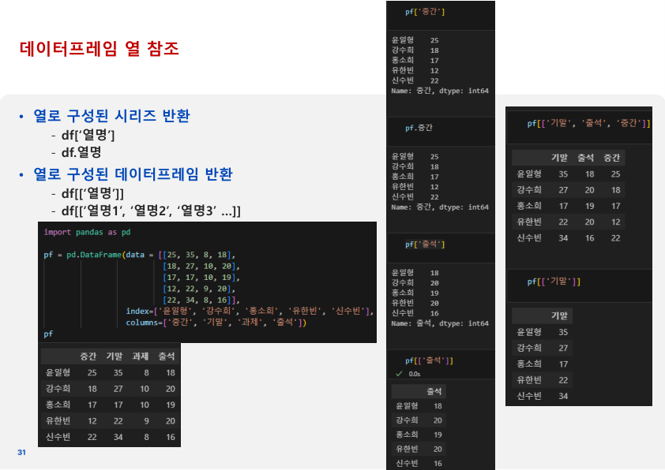

### 데이터프레임 열 참조

- 열로 구성된 시리즈 반환
- df[‘열명’]
- df.열명
- 열로 구성된 데이터프레임 반환
- df[[‘열명’]]
- df[[‘열명1’, ‘열명2’, ‘열명3’ …]]

---

## Slide 32
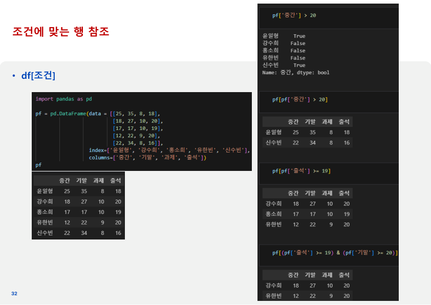

### 조건에 맞는 행 참조

- df[조건]

---

## Slide 33
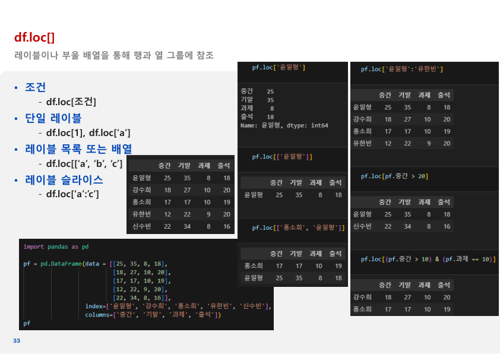

### df.loc[]

- 조건
- df.loc[조건]
- 단일 레이블
- df.loc[1], df.loc[‘a’]
- 레이블 목록 또는 배열
- df.loc[[‘a’, ‘b’, ‘c’]
- 레이블 슬라이스
- df.loc[‘a’:’c’]
- 레이블이나 부울 배열을 통해 행과 열 그룹에 참조

---

## Slide 34
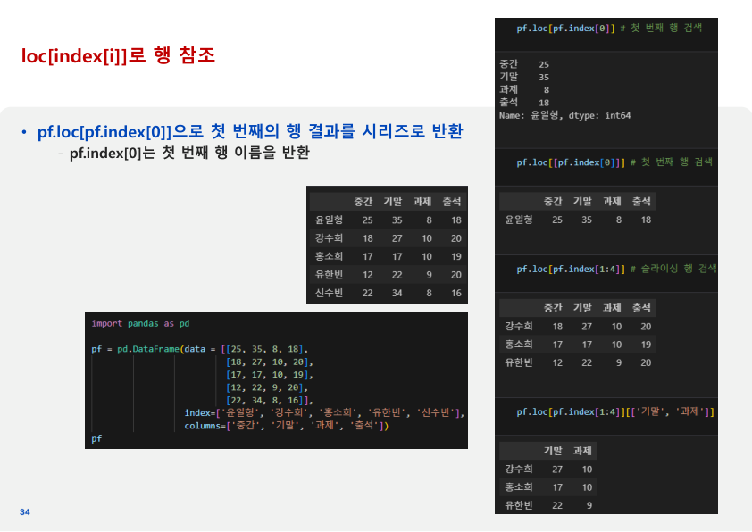

### loc[index[i]]로 행 참조

- pf.loc[pf.index[0]]으로 첫 번째의 행 결과를 시리즈로 반환
- pf.index[0]는 첫 번째 행 이름을 반환

---

## Slide 35
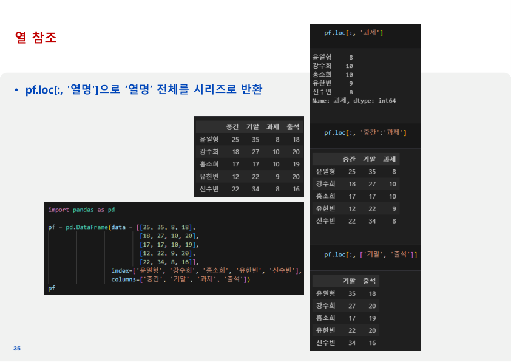

### 열 참조

- pf.loc[:, '열명']으로 ‘열명’ 전체를 시리즈로 반환

---

## Slide 36
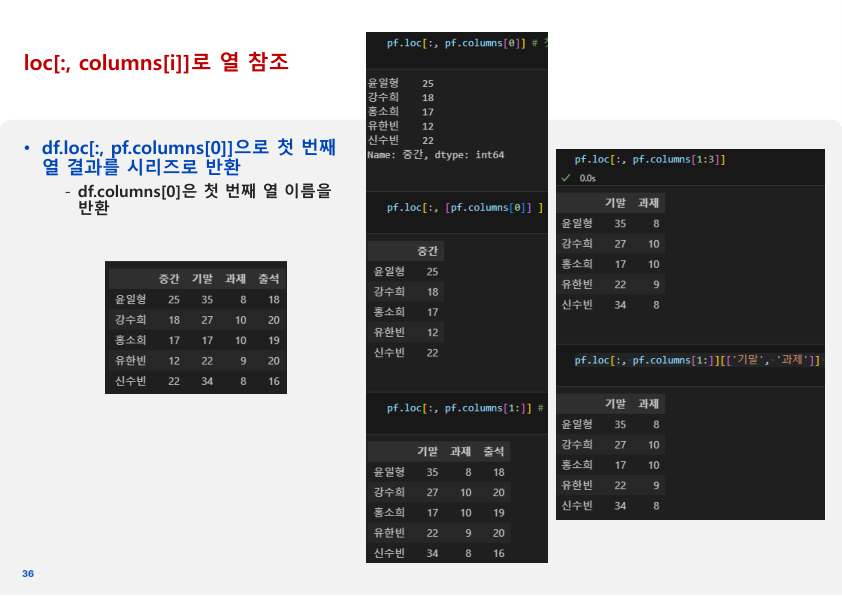

### loc[:, columns[i]]로 열 참조

- df.loc[:, pf.columns[0]]으로 첫 번째 열 결과를 시리즈로 반환
- df.columns[0]은 첫 번째 열 이름을 반환

---

## Slide 37
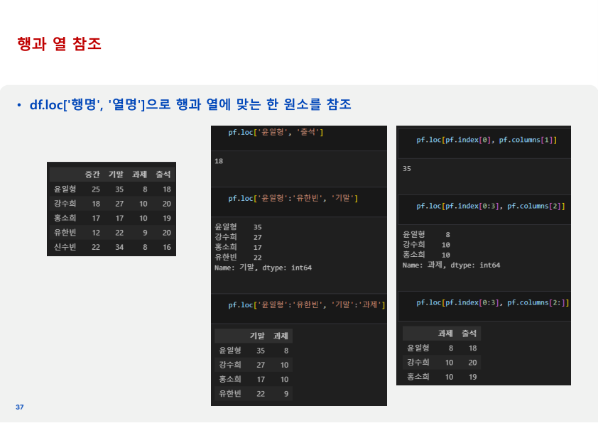

### 행과 열 참조

- df.loc['행명', '열명']으로 행과 열에 맞는 한 원소를 참조

---

## Slide 38
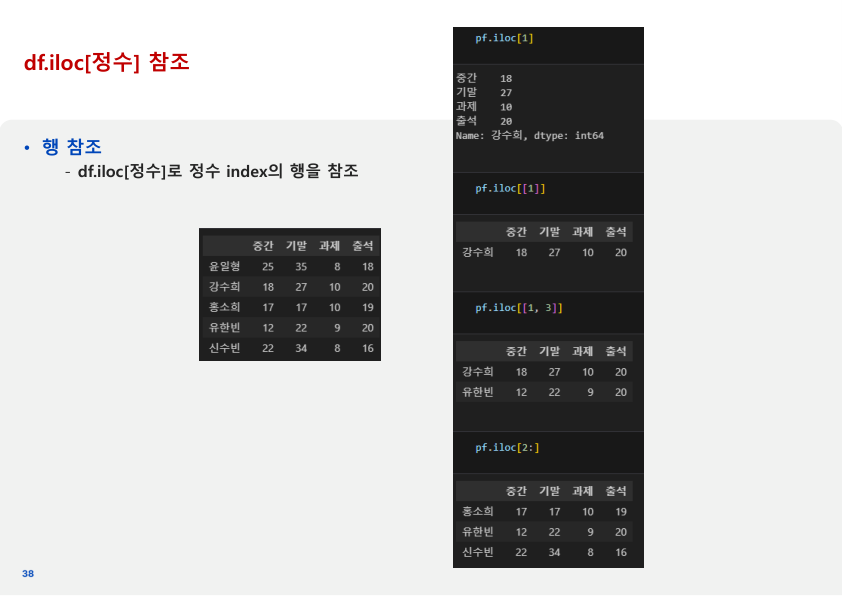

### df.iloc[정수] 참조

- 행 참조
- df.iloc[정수]로 정수 index의 행을 참조

---

## Slide 39
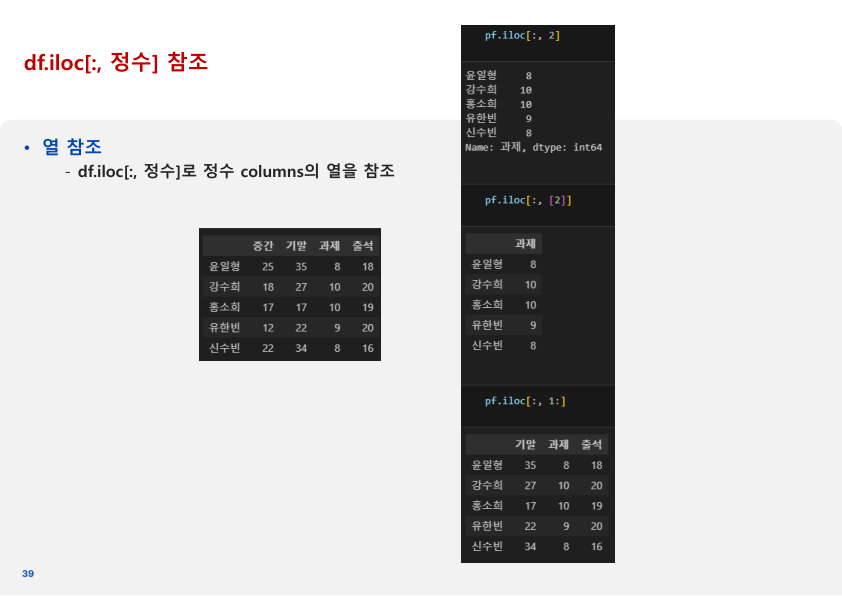

### df.iloc[:, 정수] 참조

- 열 참조
- df.iloc[:, 정수]로 정수 columns의 열을 참조

---

## Slide 40
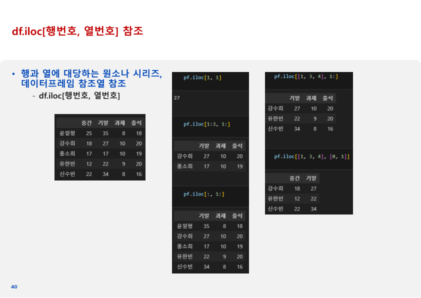

### df.iloc[행번호, 열번호] 참조

- 행과 열에 대당하는 원소나 시리즈, 데이터프레임 참조열 참조
- df.iloc[행번호, 열번호]

---

## Slide 41
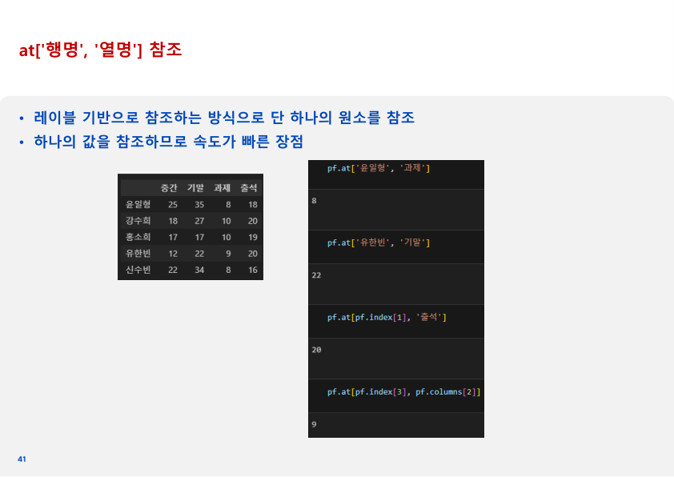

### at['행명', '열명'] 참조

- 레이블 기반으로 참조하는 방식으로 단 하나의 원소를 참조
- 하나의 값을 참조하므로 속도가 빠른 장점

---

## Slide 42
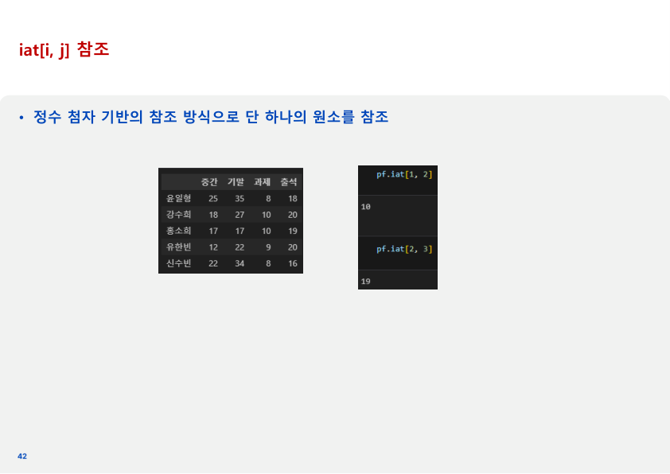

### iat[i, j] 참조

- 정수 첨자 기반의 참조 방식으로 단 하나의 원소를 참조

---

