# ch07 데이터프레임 정보와 검색 활용.pptx

## Slide 1

- 단원 07
- 데이터프레임 정보와
- 검색 활용
- 인공지능소프트웨어학과
- 강환수 교수

---

## Slide 2

### 7.1 데이터프레임 정보와 조건 검색

- -

---

## Slide 3
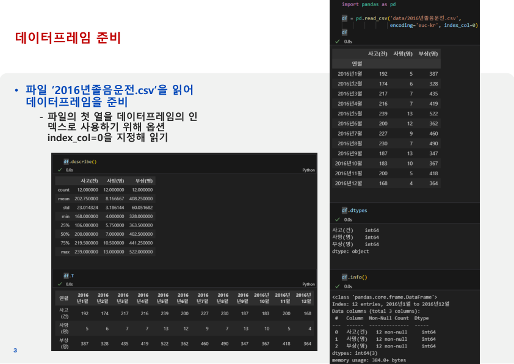

### 데이터프레임 준비

- 파일 ‘2016년졸음운전.csv’을 읽어 데이터프레임을 준비
- 파일의 첫 열을 데이터프레임의 인덱스로 사용하기 위해 옵션 index_col=0을 지정해 읽기

---

## Slide 4
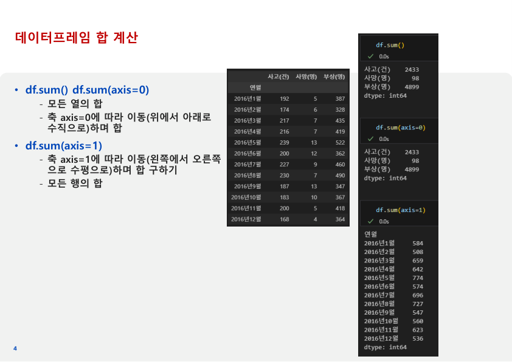

### 데이터프레임 합 계산

- df.sum() df.sum(axis=0)
- 모든 열의 합
- 축 axis=0에 따라 이동(위에서 아래로 수직으로)하며 합
- df.sum(axis=1)
- 축 axis=1에 따라 이동(왼쪽에서 오른쪽으로 수평으로)하며 합 구하기
- 모든 행의 합

---

## Slide 5
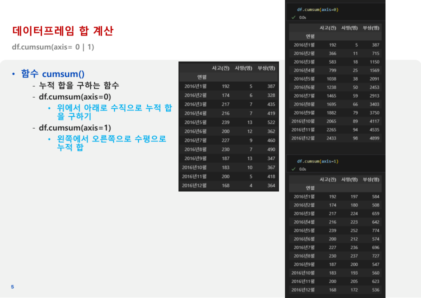

### 데이터프레임 합 계산

- 함수 cumsum()
- 누적 합을 구하는 함수
- df.cumsum(axis=0)
- 위에서 아래로 수직으로 누적 합을 구하기
- df.cumsum(axis=1)
- 왼쪽에서 오른쪽으로 수평으로 누적 합
- df.cumsum(axis= 0 | 1)

---

## Slide 6
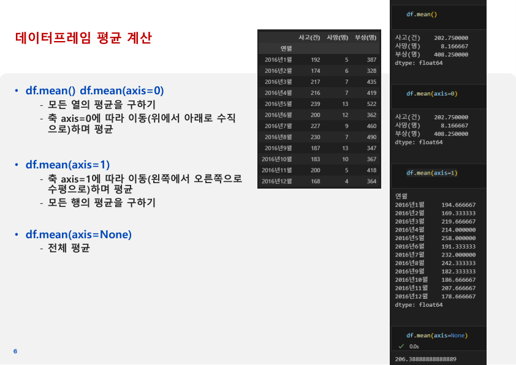

### 데이터프레임 평균 계산

- df.mean() df.mean(axis=0)
- 모든 열의 평균을 구하기
- 축 axis=0에 따라 이동(위에서 아래로 수직으로)하며 평균
- df.mean(axis=1)
- 축 axis=1에 따라 이동(왼쪽에서 오른쪽으로 수평으로)하며 평균
- 모든 행의 평균을 구하기
- df.mean(axis=None)
- 전체 평균

---

## Slide 7
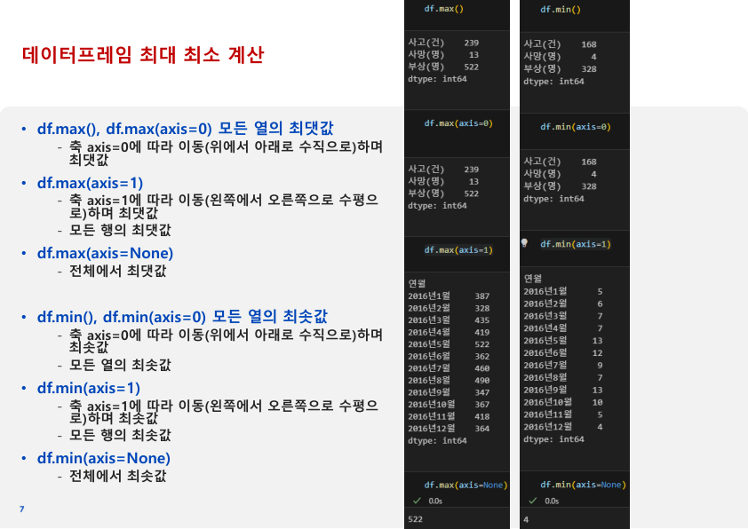

### 데이터프레임 최대 최소 계산

- df.max(), df.max(axis=0) 모든 열의 최댓값
- 축 axis=0에 따라 이동(위에서 아래로 수직으로)하며 최댓값
- df.max(axis=1)
- 축 axis=1에 따라 이동(왼쪽에서 오른쪽으로 수평으로)하며 최댓값
- 모든 행의 최댓값
- df.max(axis=None)
- 전체에서 최댓값
- df.min(), df.min(axis=0) 모든 열의 최솟값
- 축 axis=0에 따라 이동(위에서 아래로 수직으로)하며 최솟값
- 모든 열의 최솟값
- df.min(axis=1)
- 축 axis=1에 따라 이동(왼쪽에서 오른쪽으로 수평으로)하며 최솟값
- 모든 행의 최솟값
- df.min(axis=None)
- 전체에서 최솟값

---

## Slide 8
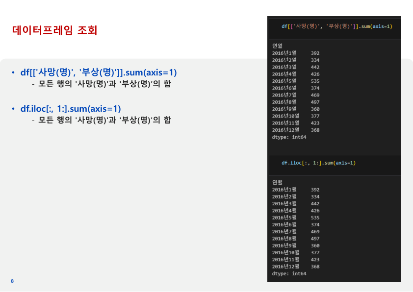

### 데이터프레임 조회

- df[['사망(명)', '부상(명)']].sum(axis=1)
- 모든 행의 '사망(명)'과 '부상(명)’의 합
- df.iloc[:, 1:].sum(axis=1)
- 모든 행의 '사망(명)'과 '부상(명)'의 합

---

## Slide 9
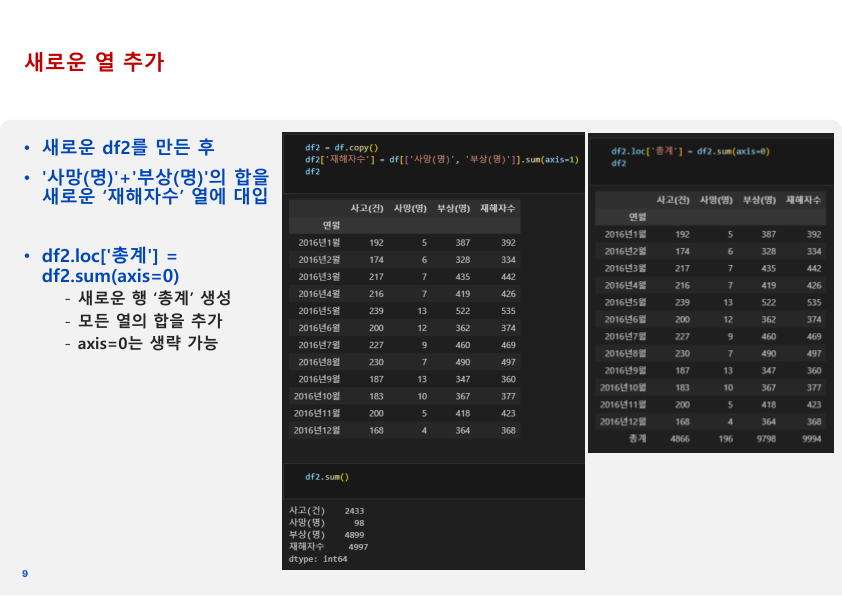

### 새로운 열 추가

- 새로운 df2를 만든 후
- '사망(명)'+'부상(명)'의 합을 새로운 ‘재해자수’ 열에 대입
- df2.loc['총계'] = df2.sum(axis=0)
- 새로운 행 ‘총계’ 생성
- 모든 열의 합을 추가
- axis=0는 생략 가능

---

## Slide 10
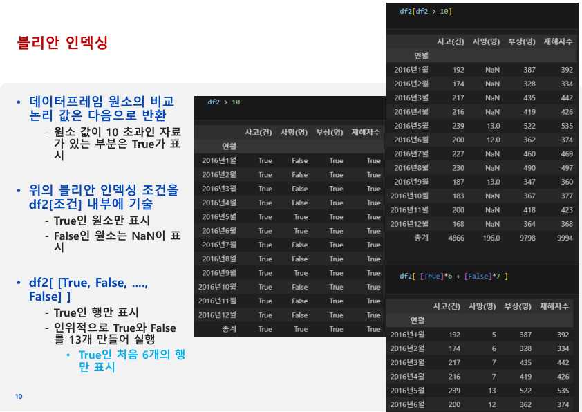

### 블리안 인덱싱

- 데이터프레임 원소의 비교 논리 값은 다음으로 반환
- 원소 값이 10 초과인 자료가 있는 부분은 True가 표시
- 위의 블리안 인덱싱 조건을 df2[조건] 내부에 기술
- True인 원소만 표시
- False인 원소는 NaN이 표시
- df2[ [True, False, ...., False] ]
- True인 행만 표시
- 인위적으로 True와 False를 13개 만들어 실행
- True인 처음 6개의 행만 표시

---

## Slide 11
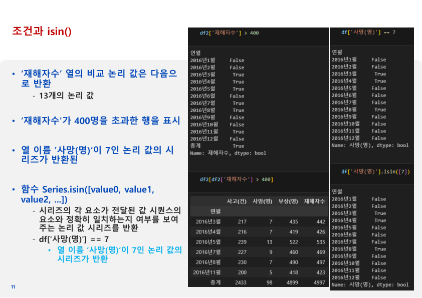

### 조건과 isin()

- ‘재해자수’ 열의 비교 논리 값은 다음으로 반환
- 13개의 논리 값
- ‘재해자수'가 400명을 초과한 행을 표시
- 열 이름 ’사망(명)‘이 7인 논리 값의 시리즈가 반환된
- 함수 Series.isin([value0, value1, value2, ...])
- 시리즈의 각 요소가 전달된 값 시퀀스의 요소와 정확히 일치하는지 여부를 보여주는 논리 값 시리즈를 반환
- df['사망(명)'] == 7
- 열 이름 ’사망(명)‘이 7인 논리 값의 시리즈가 반환

---

## Slide 12
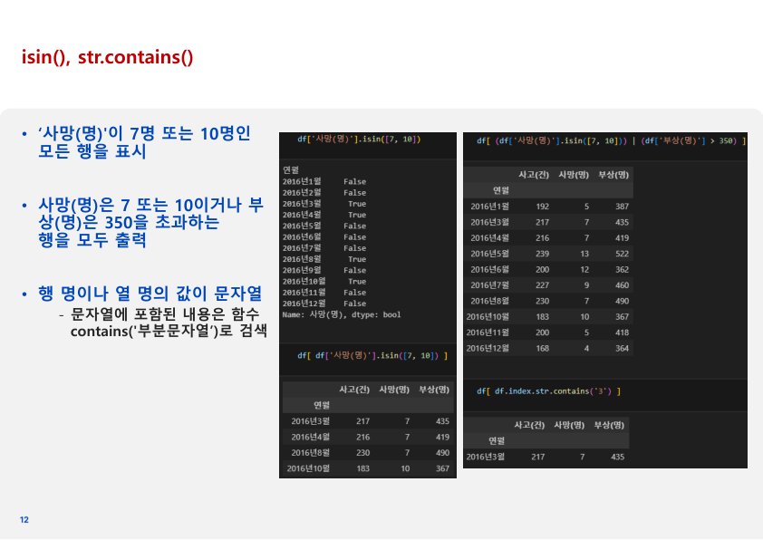

### isin(), str.contains()

- ‘사망(명)'이 7명 또는 10명인 모든 행을 표시
- 사망(명)은 7 또는 10이거나 부상(명)은 350을 초과하는행을 모두 출력
- 행 명이나 열 명의 값이 문자열
- 문자열에 포함된 내용은 함수 contains('부분문자열’)로 검색

---

## Slide 13
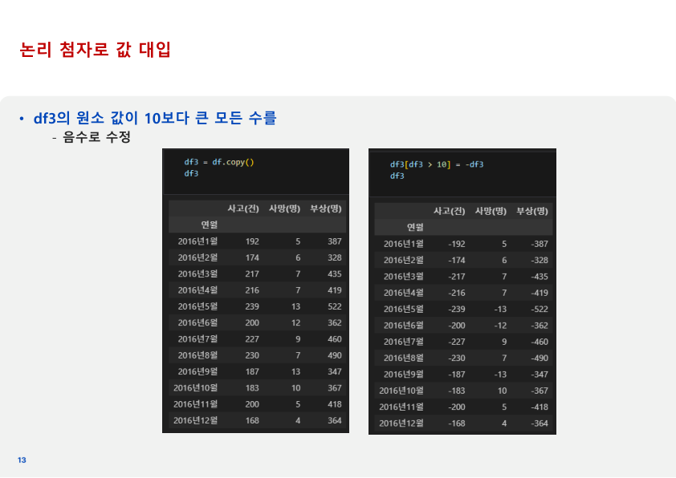

### 논리 첨자로 값 대입

- df3의 원소 값이 10보다 큰 모든 수를
- 음수로 수정

---

## Slide 14
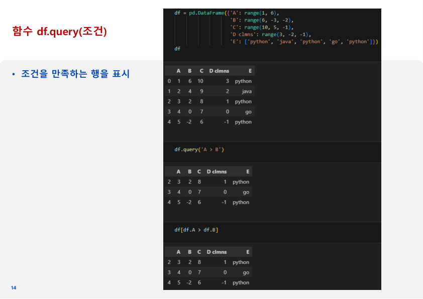

### 함수 df.query(조건)

- 조건을 만족하는 행을 표시

---

## Slide 15
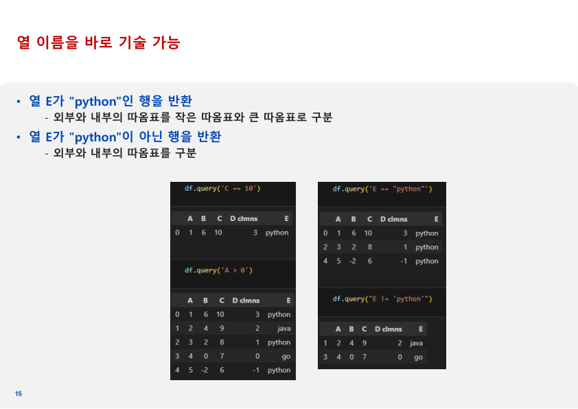

### 열 이름을 바로 기술 가능

- 열 E가 "python"인 행을 반환
- 외부와 내부의 따옴표를 작은 따옴표와 큰 따옴표로 구분
- 열 E가 "python"이 아닌 행을 반환
- 외부와 내부의 따옴표를 구분

---

## Slide 16
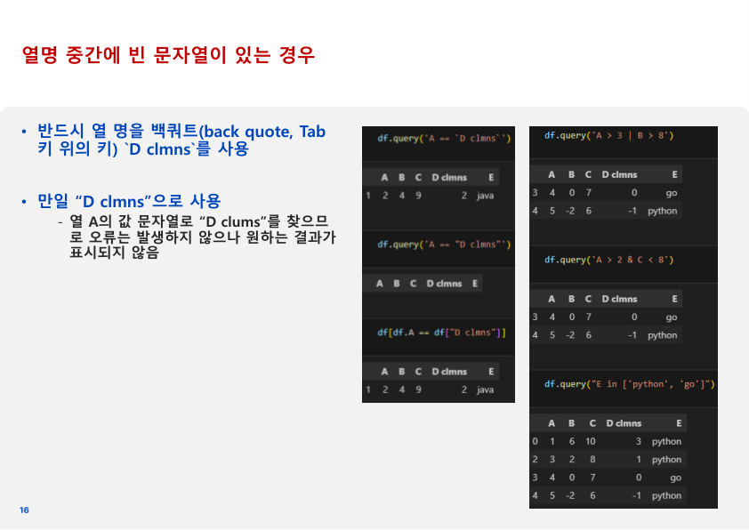

### 열명 중간에 빈 문자열이 있는 경우

- 반드시 열 명을 백쿼트(back quote, Tab 키 위의 키) `D clmns`를 사용
- 만일 “D clmns”으로 사용
- 열 A의 값 문자열로 “D clums”를 찾으므로 오류는 발생하지 않으나 원하는 결과가 표시되지 않음

---

## Slide 17
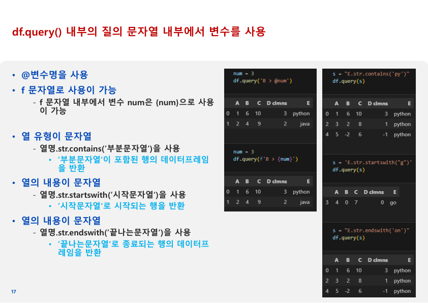

### df.query() 내부의 질의 문자열 내부에서 변수를 사용

- @변수명을 사용
- f 문자열로 사용이 가능
- f 문자열 내부에서 변수 num은 {num}으로 사용이 가능
- 열 유형이 문자열
- 열명.str.contains(’부분문자열‘)을 사용
- ’부분문자열‘이 포함된 행의 데이터프레임을 반환
- 열의 내용이 문자열
- 열명.str.startswith(’시작문자열‘)을 사용
- ’시작문자열‘로 시작되는 행을 반환
- 열의 내용이 문자열
- 열명.str.endswith(’끝나는문자열‘)을 사용
- ’끝나는문자열‘로 종료되는 행의 데이터프레임을 반환

---

## Slide 18

### 7.2 데이터프레임 정렬과 수정

- -

---

## Slide 19
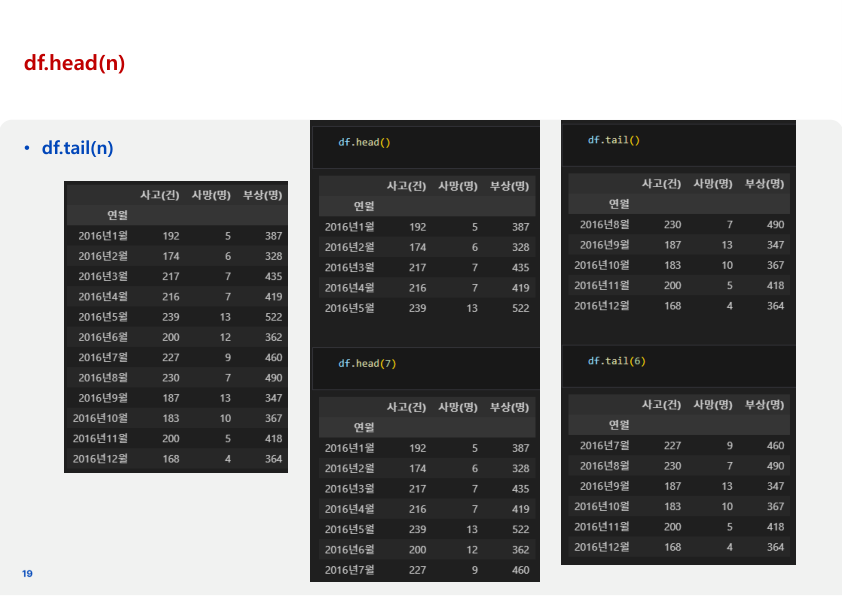

### df.head(n)

- df.tail(n)

---

## Slide 20
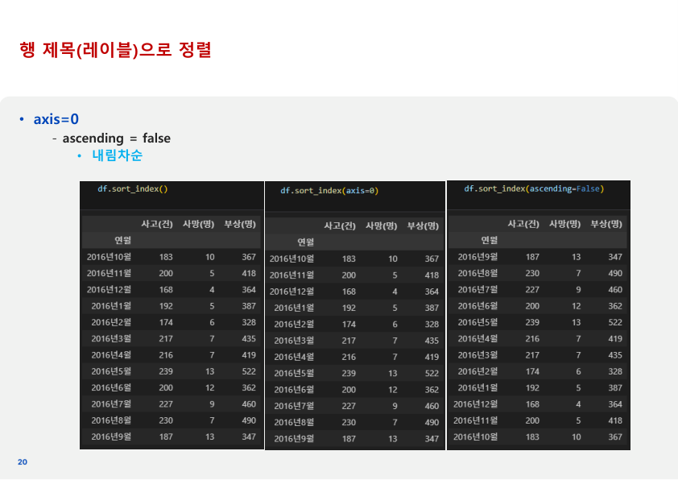

### 행 제목(레이블)으로 정렬

- axis=0
- ascending = false
- 내림차순

---

## Slide 21
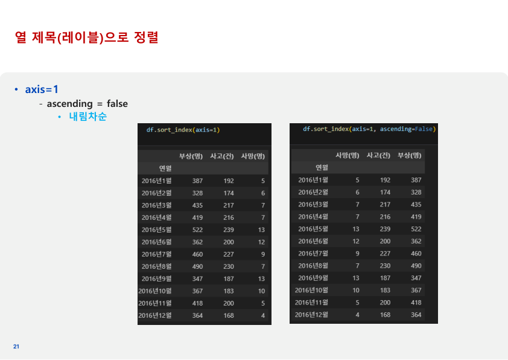

### 열 제목(레이블)으로 정렬

- axis=1
- ascending = false
- 내림차순

---

## Slide 22
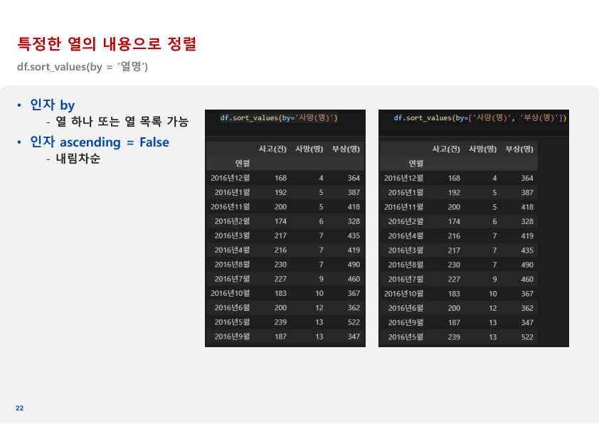

### 특정한 열의 내용으로 정렬

- 인자 by
- 열 하나 또는 열 목록 가능
- 인자 ascending = False
- 내림차순
- df.sort_values(by = ‘열명')

---

## Slide 23
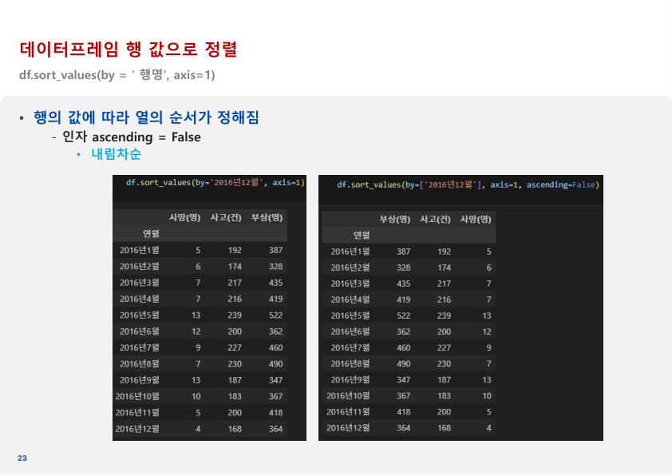

### 데이터프레임 행 값으로 정렬

- 행의 값에 따라 열의 순서가 정해짐
- 인자 ascending = False
- 내림차순
- df.sort_values(by =＇행명', axis=1)

---

## Slide 24
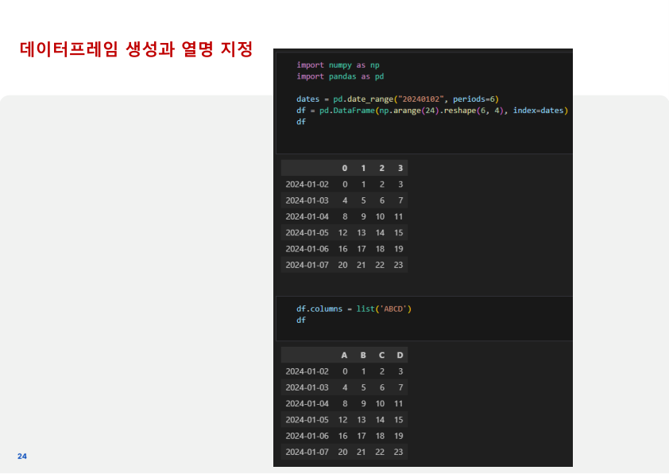

### 데이터프레임 생성과 열명 지정

---

## Slide 25
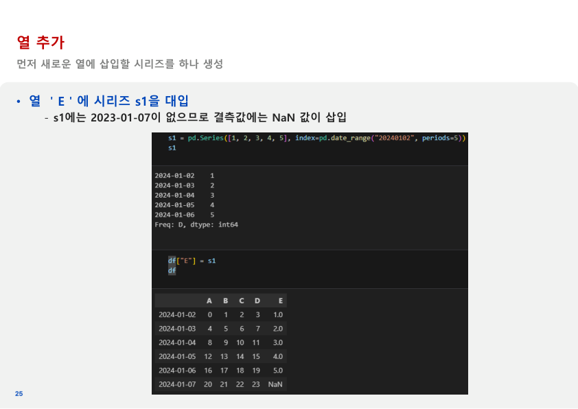

### 열 추가

- 열 ＇E＇에 시리즈 s1을 대입
- s1에는 2023-01-07이 없으므로 결측값에는 NaN 값이 삽입
- 먼저 새로운 열에 삽입할 시리즈를 하나 생성

---

## Slide 26
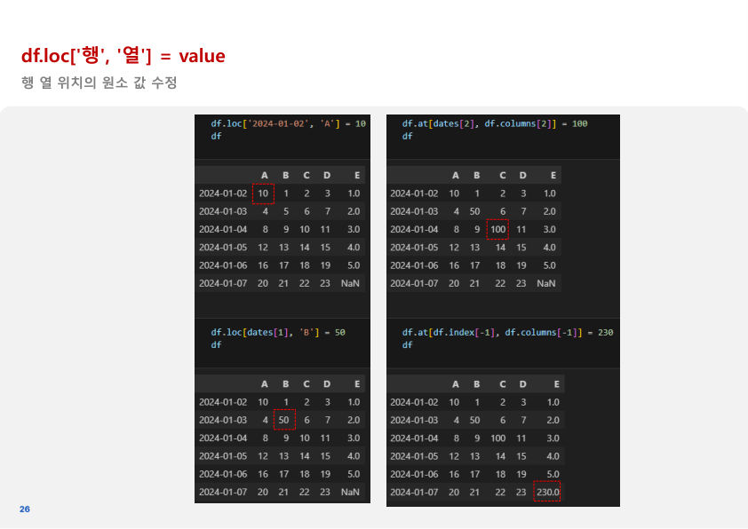

### df.loc['행', '열'] = value

- 행 열 위치의 원소 값 수정

---

## Slide 27
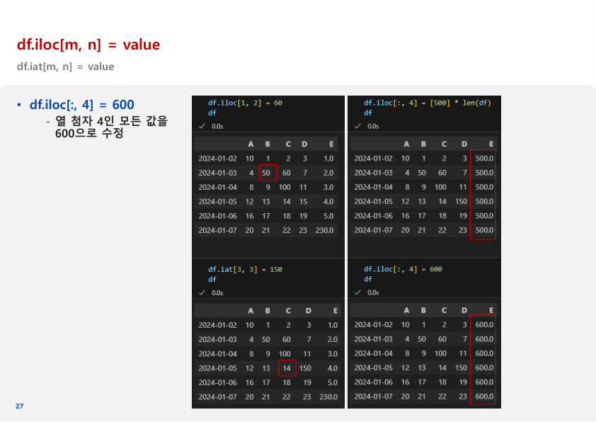

### df.iloc[m, n] = value

- df.iloc[:, 4] = 600
- 열 첨자 4인 모든 값을600으로 수정
- df.iat[m, n] = value

---

## Slide 28
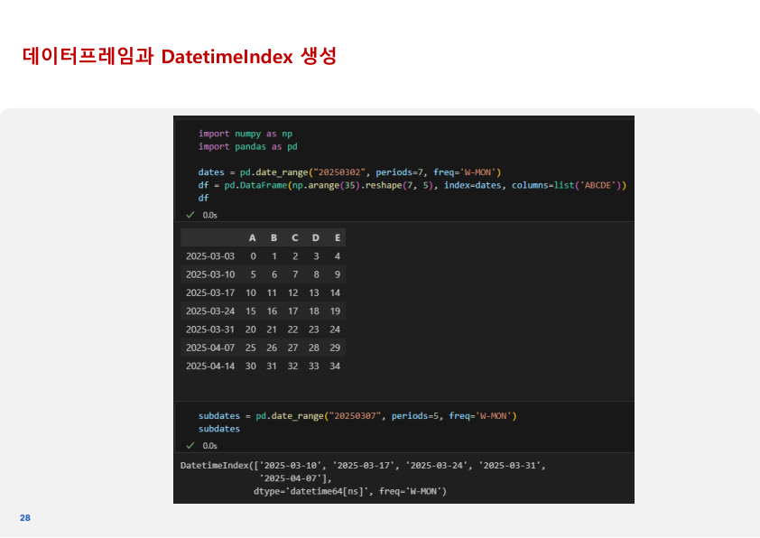

### 데이터프레임과 DatetimeIndex 생성

---

## Slide 29
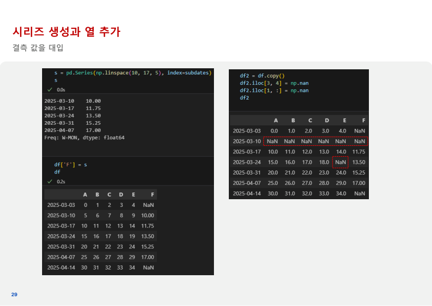

### 시리즈 생성과 열 추가

- 결측 값을 대입

---

## Slide 30
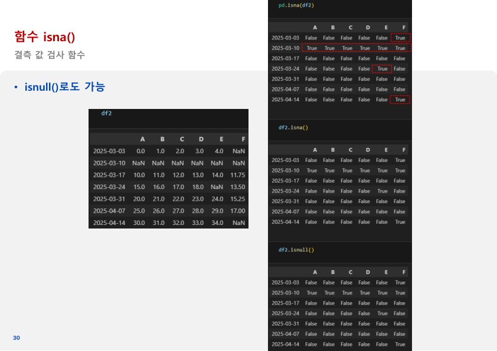

### 함수 isna()

- isnull()로도 가능
- 결측 값 검사 함수

---

## Slide 31
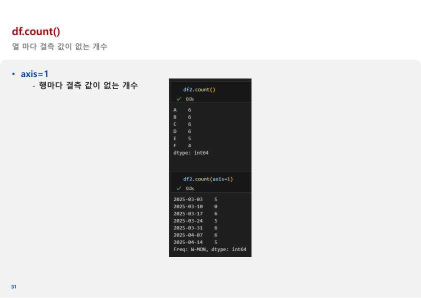

### df.count()

- axis=1
- 행마다 결측 값이 없는 개수
- 열 마다 결측 값이 없는 개수

---

## Slide 32
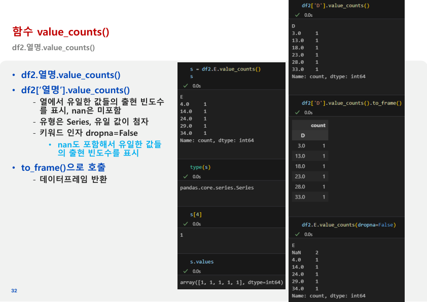

### 함수 value_counts()

- df2.열명.value_counts()
- df2[‘열명’].value_counts()
- 열에서 유일한 값들의 출현 빈도수를 표시, nan은 미포함
- 유형은 Series, 유일 값이 첨자
- 키워드 인자 dropna=False
- nan도 포함해서 유일한 값들의 출현 빈도수를 표시
- to_frame()으로 호출
- 데이터프레임 반환
- df2.열명.value_counts()

---

## Slide 33
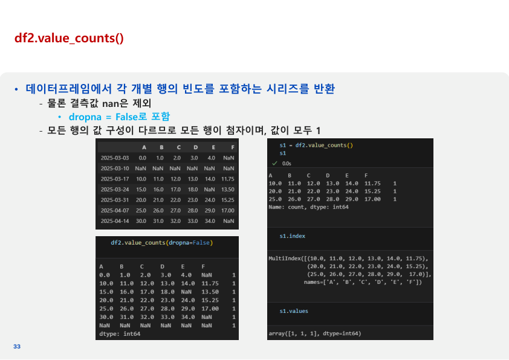

### df2.value_counts()

- 데이터프레임에서 각 개별 행의 빈도를 포함하는 시리즈를 반환
- 물론 결측값 nan은 제외
- dropna = False로 포함
- 모든 행의 값 구성이 다르므로 모든 행이 첨자이며, 값이 모두 1

---

## Slide 34
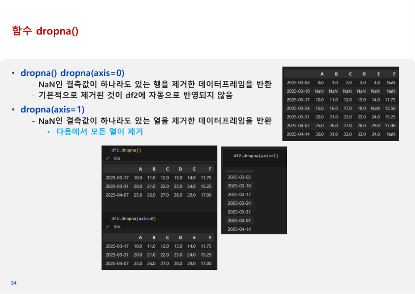

### 함수 dropna()

- dropna() dropna(axis=0)
- NaN인 결측값이 하나라도 있는 행을 제거한 데이터프레임을 반환
- 기본적으로 제거된 것이 df2에 자동으로 반영되지 않음
- dropna(axis=1)
- NaN인 결측값이 하나라도 있는 열을 제거한 데이터프레임을 반환
- 다음에서 모든 열이 제거

---

## Slide 35
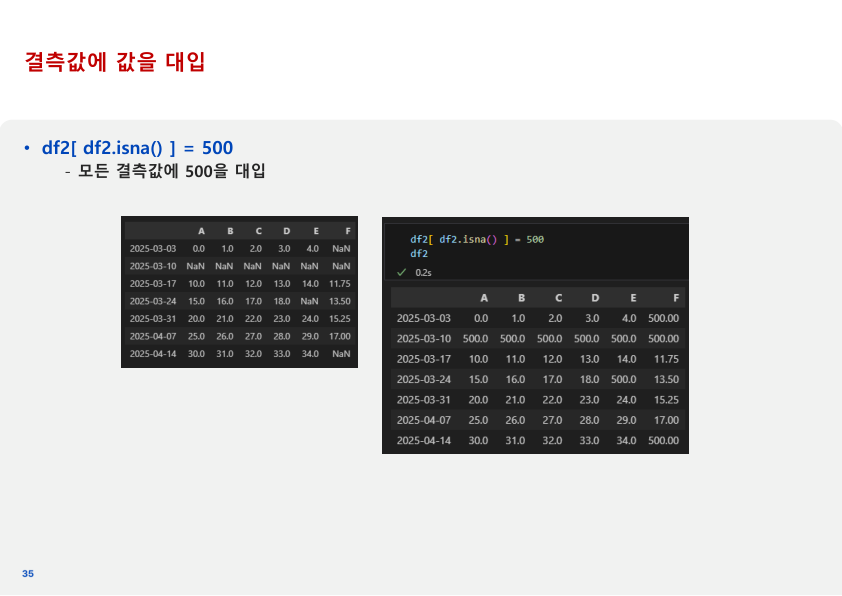

### 결측값에 값을 대입

- df2[ df2.isna() ] = 500
- 모든 결측값에 500을 대입

---

## Slide 36
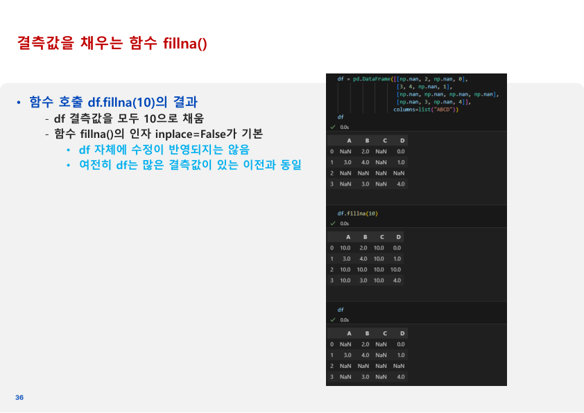

### 결측값을 채우는 함수 fillna()

- 함수 호출 df.fillna(10)의 결과
- df 결측값을 모두 10으로 채움
- 함수 fillna()의 인자 inplace=False가 기본
- df 자체에 수정이 반영되지는 않음
- 여전히 df는 많은 결측값이 있는 이전과 동일

---

## Slide 37
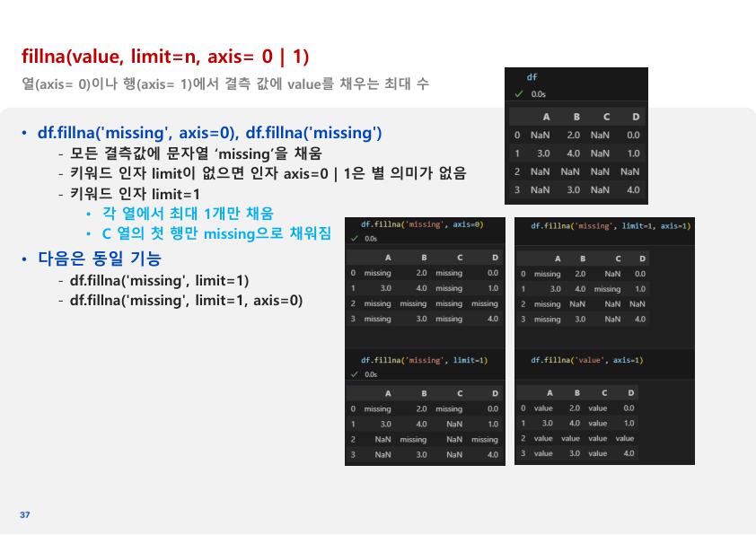

### fillna(value, limit=n, axis= 0 | 1)

- df.fillna('missing', axis=0), df.fillna('missing')
- 모든 결측값에 문자열 ‘missing’을 채움
- 키워드 인자 limit이 없으면 인자 axis=0 | 1은 별 의미가 없음
- 키워드 인자 limit=1
- 각 열에서 최대 1개만 채움
- C 열의 첫 행만 missing으로 채워짐
- 다음은 동일 기능
- df.fillna('missing', limit=1)
- df.fillna('missing', limit=1, axis=0)
- 열(axis= 0)이나 행(axis= 1)에서 결측 값에 value를 채우는 최대 수

---

## Slide 38
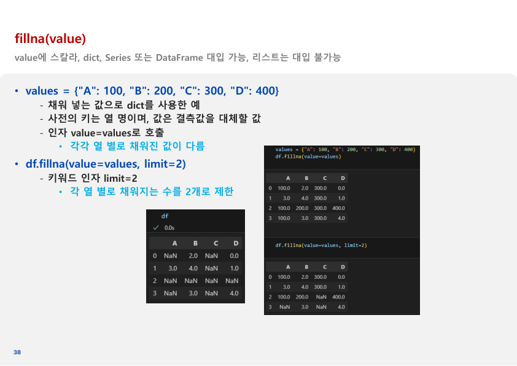

### fillna(value)

- values = {"A": 100, "B": 200, "C": 300, "D": 400}
- 채워 넣는 값으로 dict를 사용한 예
- 사전의 키는 열 명이며, 값은 결측값을 대체할 값
- 인자 value=values로 호출
- 각각 열 별로 채워진 값이 다름
- df.fillna(value=values, limit=2)
- 키워드 인자 limit=2
- 각 열 별로 채워지는 수를 2개로 제한
- value에 스칼라, dict, Series 또는 DataFrame 대입 가능, 리스트는 대입 불가능

---

## Slide 39
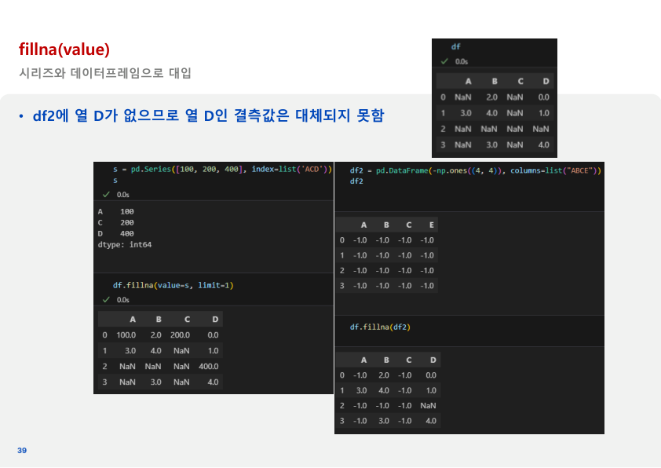

### fillna(value)

- df2에 열 D가 없으므로 열 D인 결측값은 대체되지 못함
- 시리즈와 데이터프레임으로 대입

---

## Slide 40
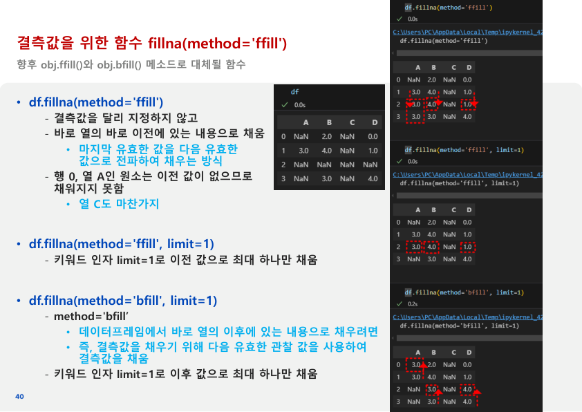

### 결측값을 위한 함수 fillna(method='ffill')

- df.fillna(method='ffill')
- 결측값을 달리 지정하지 않고
- 바로 열의 바로 이전에 있는 내용으로 채움
- 마지막 유효한 값을 다음 유효한값으로 전파하여 채우는 방식
- 행 0, 열 A인 원소는 이전 값이 없으므로채워지지 못함
- 열 C도 마찬가지
- df.fillna(method='ffill', limit=1)
- 키워드 인자 limit=1로 이전 값으로 최대 하나만 채움
- df.fillna(method='bfill', limit=1)
- method='bfill’
- 데이터프레임에서 바로 열의 이후에 있는 내용으로 채우려면
- 즉, 결측값을 채우기 위해 다음 유효한 관찰 값을 사용하여 결측값을 채움
- 키워드 인자 limit=1로 이후 값으로 최대 하나만 채움
- 향후 obj.ffill()와 obj.bfill() 메소드로 대체될 함수

---

## Slide 41
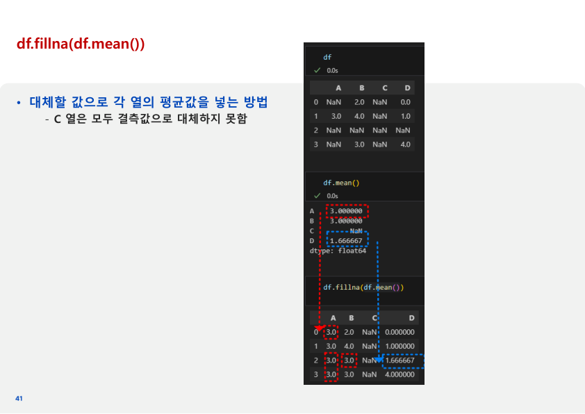

### df.fillna(df.mean())

- 대체할 값으로 각 열의 평균값을 넣는 방법
- C 열은 모두 결측값으로 대체하지 못함

---

## Slide 42
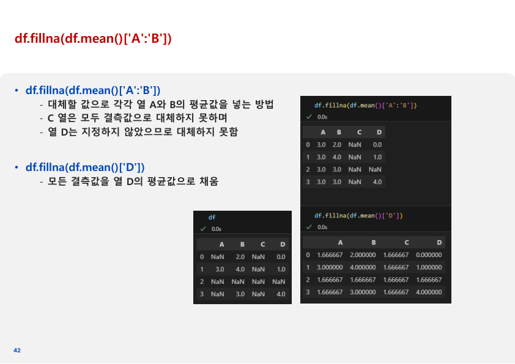

### df.fillna(df.mean()['A':'B'])

- df.fillna(df.mean()['A':'B'])
- 대체할 값으로 각각 열 A와 B의 평균값을 넣는 방법
- C 열은 모두 결측값으로 대체하지 못하며
- 열 D는 지정하지 않았으므로 대체하지 못함
- df.fillna(df.mean()['D'])
- 모든 결측값을 열 D의 평균값으로 채움

---

## Slide 43
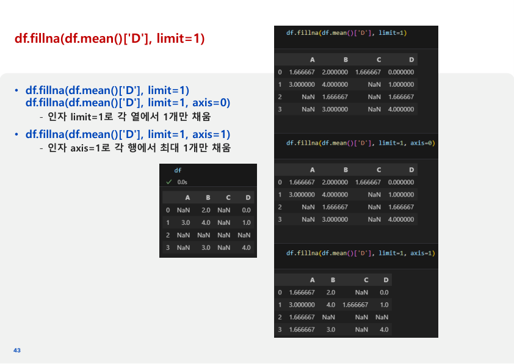

### df.fillna(df.mean()['D'], limit=1)

- df.fillna(df.mean()['D'], limit=1)df.fillna(df.mean()['D'], limit=1, axis=0)
- 인자 limit=1로 각 열에서 1개만 채움
- df.fillna(df.mean()['D'], limit=1, axis=1)
- 인자 axis=1로 각 행에서 최대 1개만 채움

---

