# ch08 패키지 pydataset과 다양한 데이터 파일 활용.pptx

## Slide 1

- 단원 08
- 패키지 pydataset과
- 다양한 데이터 파일 활용
- 인공지능소프트웨어학과
- 강환수 교수

---

## Slide 2

### 8.1 패키지 pydataset 활용

- -

---

## Slide 3
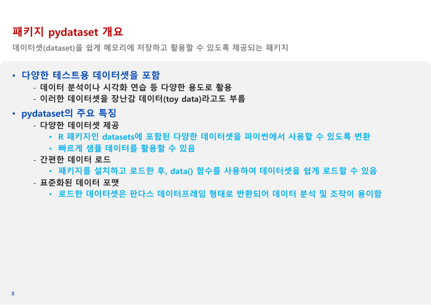

### 패키지 pydataset 개요

- 다양한 테스트용 데이터셋을 포함
- 데이터 분석이나 시각화 연습 등 다양한 용도로 활용
- 이러한 데이터셋을 장난감 데이터(toy data)라고도 부름
- pydataset의 주요 특징
- 다양한 데이터셋 제공
- R 패키지인 datasets에 포함된 다양한 데이터셋을 파이썬에서 사용할 수 있도록 변환
- 빠르게 샘플 데이터를 활용할 수 있음
- 간편한 데이터 로드
- 패키지를 설치하고 로드한 후, data() 함수를 사용하여 데이터셋을 쉽게 로드할 수 있음
- 표준화된 데이터 포맷
- 로드한 데이터셋은 판다스 데이터프레임 형태로 반환되어 데이터 분석 및 조작이 용이함
- 데이터셋(dataset)을 쉽게 메모리에 저장하고 활용할 수 있도록 제공되는 패키지

---

## Slide 4
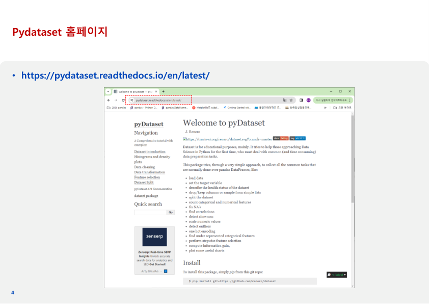

### Pydataset 홈페이지

- https://pydataset.readthedocs.io/en/latest/

---

## Slide 5
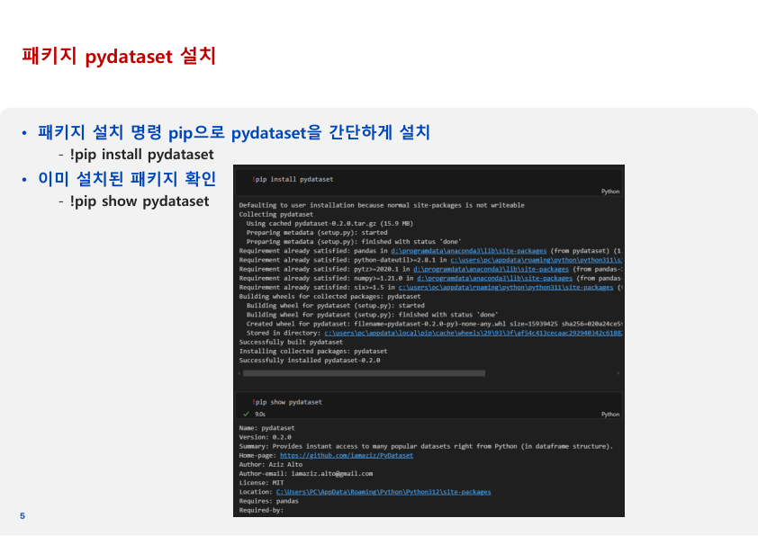

### 패키지 pydataset 설치

- 패키지 설치 명령 pip으로 pydataset을 간단하게 설치
- !pip install pydataset
- 이미 설치된 패키지 확인
- !pip show pydataset

---

## Slide 6
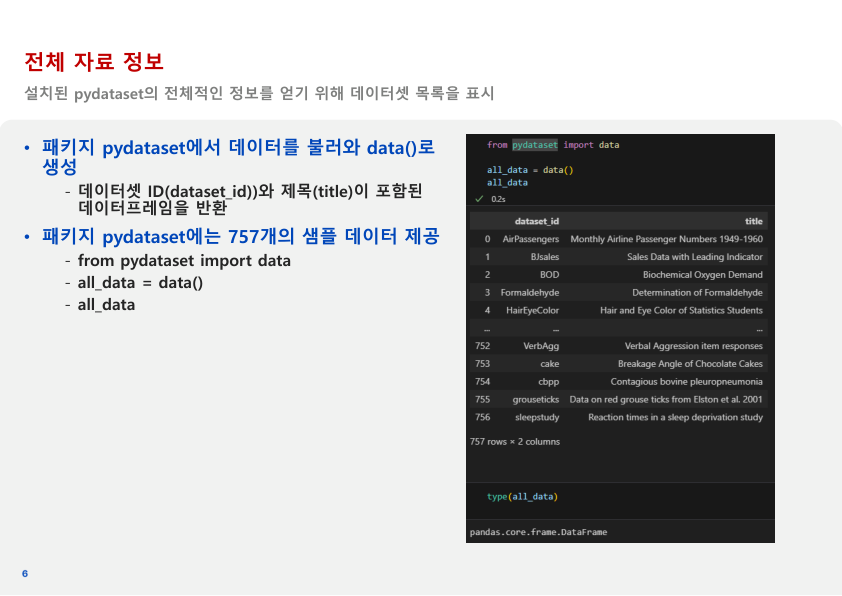

### 전체 자료 정보

- 패키지 pydataset에서 데이터를 불러와 data()로 생성
- 데이터셋 ID(dataset_id))와 제목(title)이 포함된데이터프레임을 반환
- 패키지 pydataset에는 757개의 샘플 데이터 제공
- from pydataset import data
- all_data = data()
- all_data
- 설치된 pydataset의 전체적인 정보를 얻기 위해 데이터셋 목록을 표시

---

## Slide 7
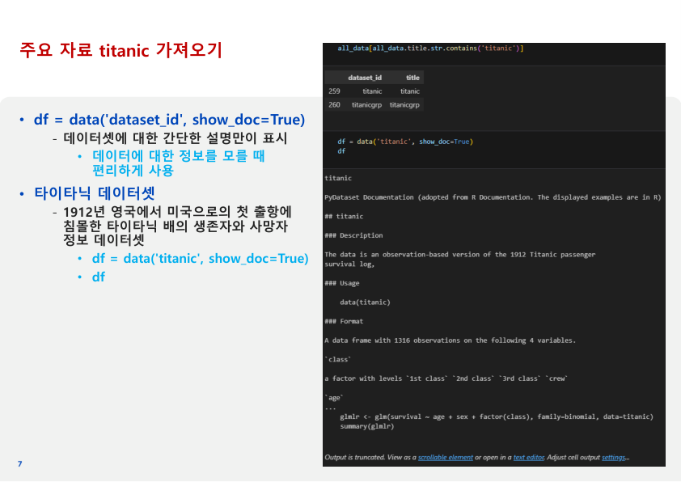

### 주요 자료 titanic 가져오기 

- df = data('dataset_id', show_doc=True)
- 데이터셋에 대한 간단한 설명만이 표시
- 데이터에 대한 정보를 모를 때편리하게 사용
- 타이타닉 데이터셋
- 1912년 영국에서 미국으로의 첫 출항에침몰한 타이타닉 배의 생존자와 사망자정보 데이터셋
- df = data('titanic', show_doc=True)
- df

---

## Slide 8
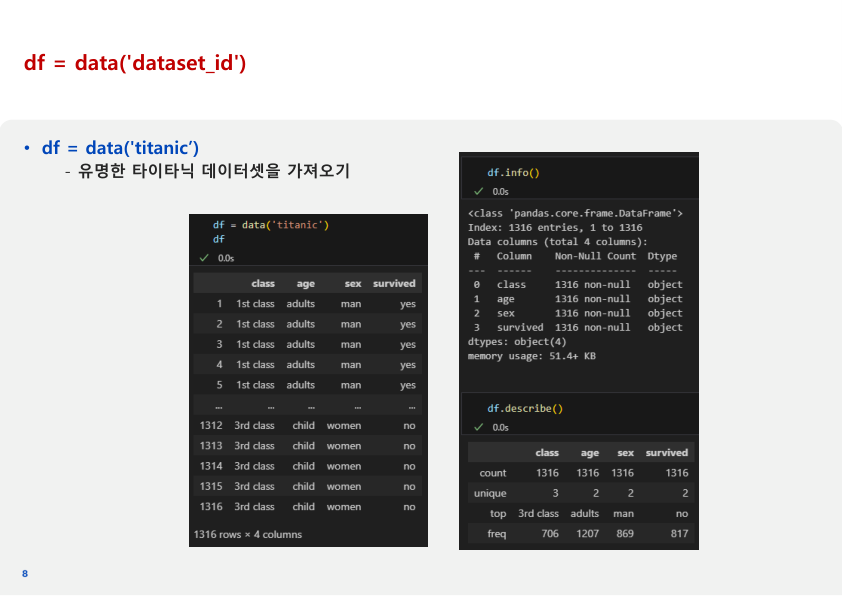

### df = data('dataset_id')

- df = data('titanic’)
- 유명한 타이타닉 데이터셋을 가져오기

---

## Slide 9
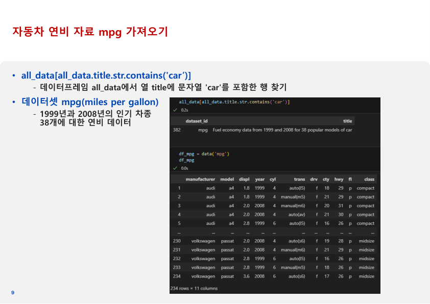

### 자동차 연비 자료 mpg 가져오기 

- all_data[all_data.title.str.contains('car’)]
- 데이터프레임 all_data에서 열 title에 문자열 'car'를 포함한 행 찾기
- 데이터셋 mpg(miles per gallon)
- 1999년과 2008년의 인기 차종38개에 대한 연비 데이터

---

## Slide 10
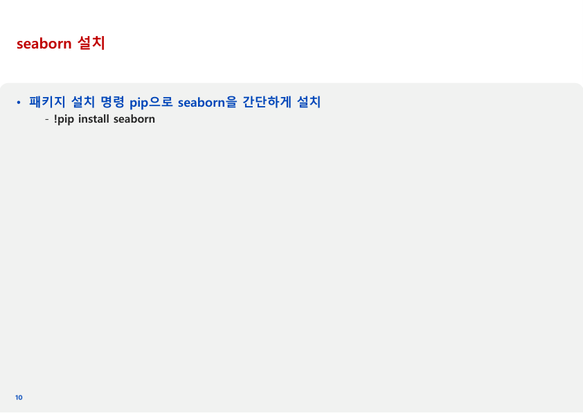

### seaborn 설치

- 패키지 설치 명령 pip으로 seaborn을 간단하게 설치
- !pip install seaborn

---

## Slide 11
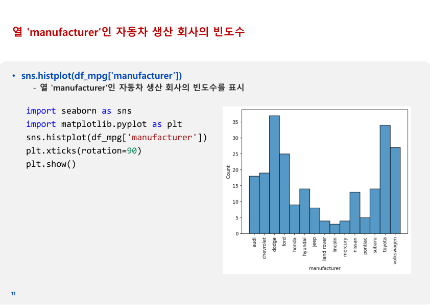

### 열 'manufacturer'인 자동차 생산 회사의 빈도수

- sns.histplot(df_mpg['manufacturer’])
- 열 'manufacturer'인 자동차 생산 회사의 빈도수를 표시
- import seaborn as sns
- import matplotlib.pyplot as plt
- sns.histplot(df_mpg['manufacturer'])
- plt.xticks(rotation=90)
- plt.show()

---

## Slide 12

### 8.2 외부 파일 활용

- -

---

## Slide 13
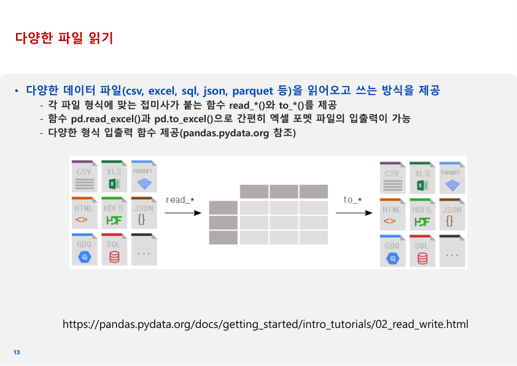

### 다양한 파일 읽기

- 다양한 데이터 파일(csv, excel, sql, json, parquet 등)을 읽어오고 쓰는 방식을 제공
- 각 파일 형식에 맞는 접미사가 붙는 함수 read_*()와 to_*()를 제공
- 함수 pd.read_excel()과 pd.to_excel()으로 간편히 엑셀 포멧 파일의 입출력이 가능
- 다양한 형식 입출력 함수 제공(pandas.pydata.org 참조)
- https://pandas.pydata.org/docs/getting_started/intro_tutorials/02_read_write.html

---

## Slide 14
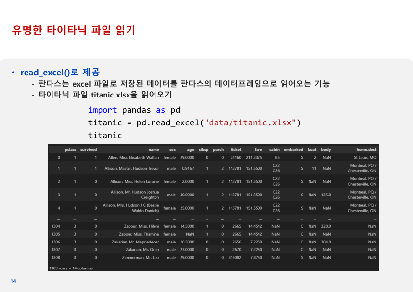

### 유명한 타이타닉 파일 읽기

- read_excel()로 제공
- 판다스는 excel 파일로 저장된 데이터를 판다스의 데이터프레임으로 읽어오는 기능
- 타이타닉 파일 titanic.xlsx을 읽어오기
- import pandas as pd
- titanic = pd.read_excel("data/titanic.xlsx")
- titanic

---

## Slide 15
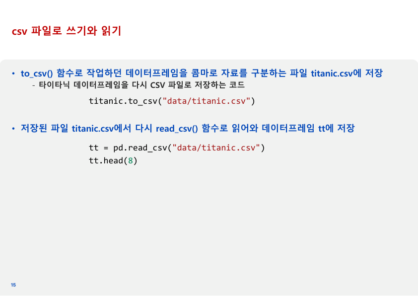

### csv 파일로 쓰기와 읽기

- to_csv() 함수로 작업하던 데이터프레임을 콤마로 자료를 구분하는 파일 titanic.csv에 저장
- 타이타닉 데이터프레임을 다시 CSV 파일로 저장하는 코드
- 저장된 파일 titanic.csv에서 다시 read_csv() 함수로 읽어와 데이터프레임 tt에 저장
- titanic.to_csv("data/titanic.csv")
- tt = pd.read_csv("data/titanic.csv")
- tt.head(8)

---

## Slide 16
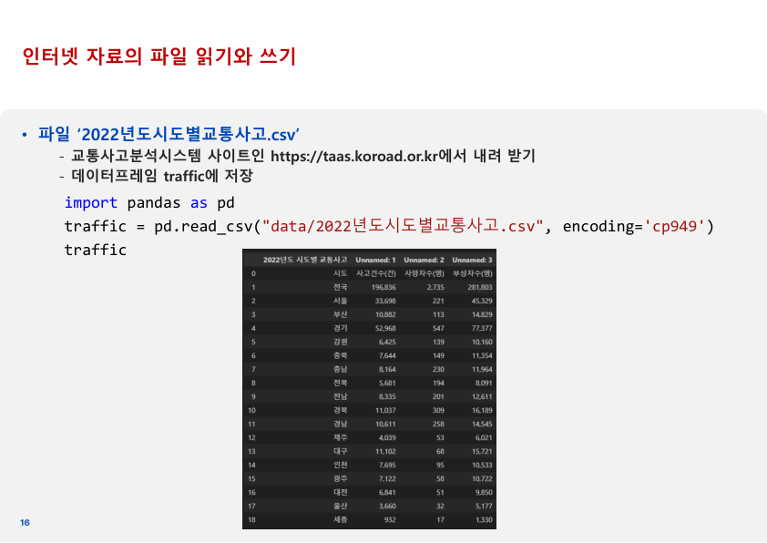

### 인터넷 자료의 파일 읽기와 쓰기

- 파일 ‘2022년도시도별교통사고.csv’
- 교통사고분석시스템 사이트인 https://taas.koroad.or.kr에서 내려 받기
- 데이터프레임 traffic에 저장
- import pandas as pd
- traffic = pd.read_csv("data/2022년도시도별교통사고.csv", encoding='cp949')
- traffic

---

## Slide 17
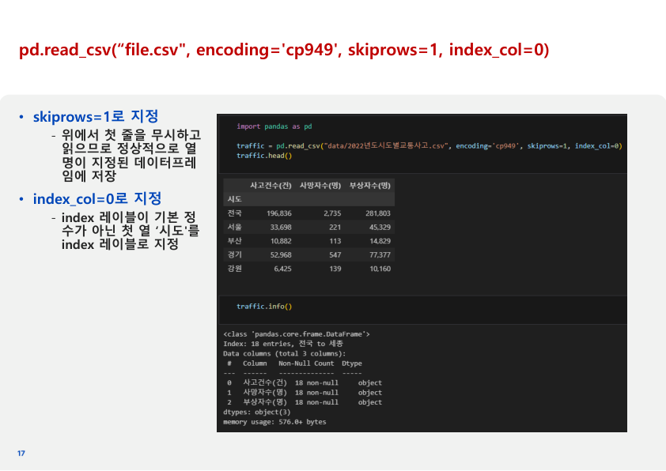

### pd.read_csv(“file.csv", encoding='cp949', skiprows=1, index_col=0)

- skiprows=1로 지정
- 위에서 첫 줄을 무시하고 읽으므로 정상적으로 열 명이 지정된 데이터프레임에 저장
- index_col=0로 지정
- index 레이블이 기본 정수가 아닌 첫 열 ‘시도'를 index 레이블로 지정

---

## Slide 18
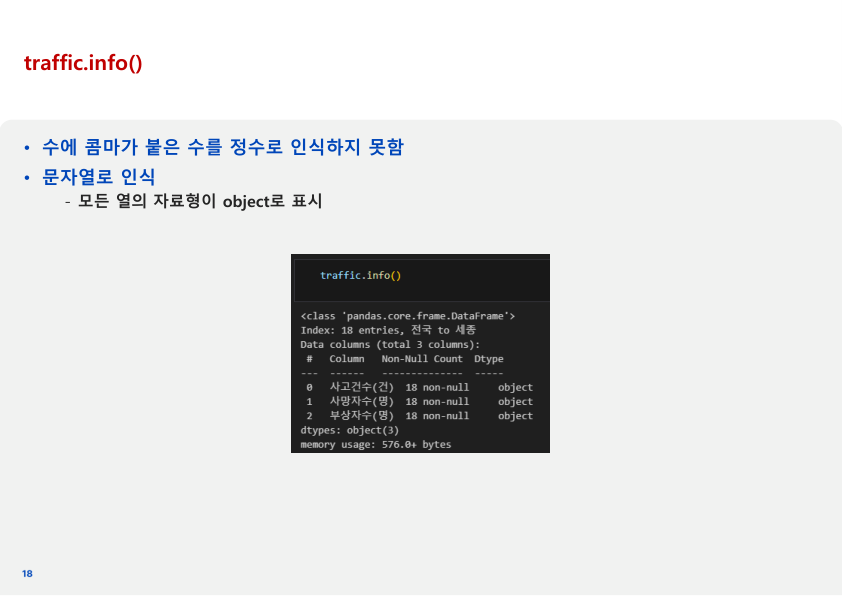

### traffic.info()

- 수에 콤마가 붙은 수를 정수로 인식하지 못함
- 문자열로 인식
- 모든 열의 자료형이 object로 표시

---

## Slide 19
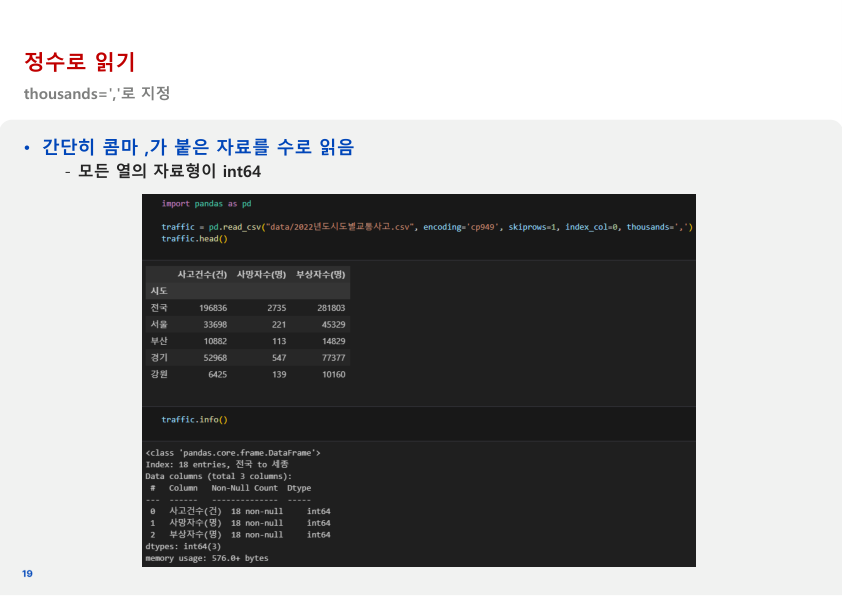

### 정수로 읽기

- 간단히 콤마 ,가 붙은 자료를 수로 읽음
- 모든 열의 자료형이 int64
- thousands=','로 지정

---

## Slide 20
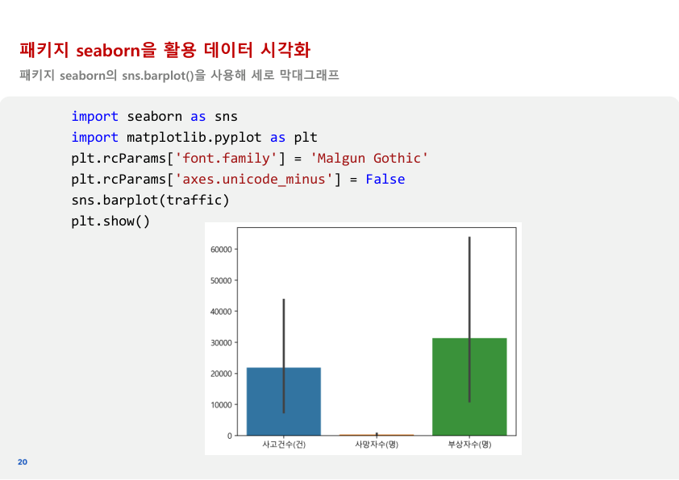

### 패키지 seaborn을 활용 데이터 시각화

- 패키지 seaborn의 sns.barplot()을 사용해 세로 막대그래프
- import seaborn as sns
- import matplotlib.pyplot as plt
- plt.rcParams['font.family'] = 'Malgun Gothic'
- plt.rcParams['axes.unicode_minus'] = False
- sns.barplot(traffic)
- plt.show()

---

## Slide 21
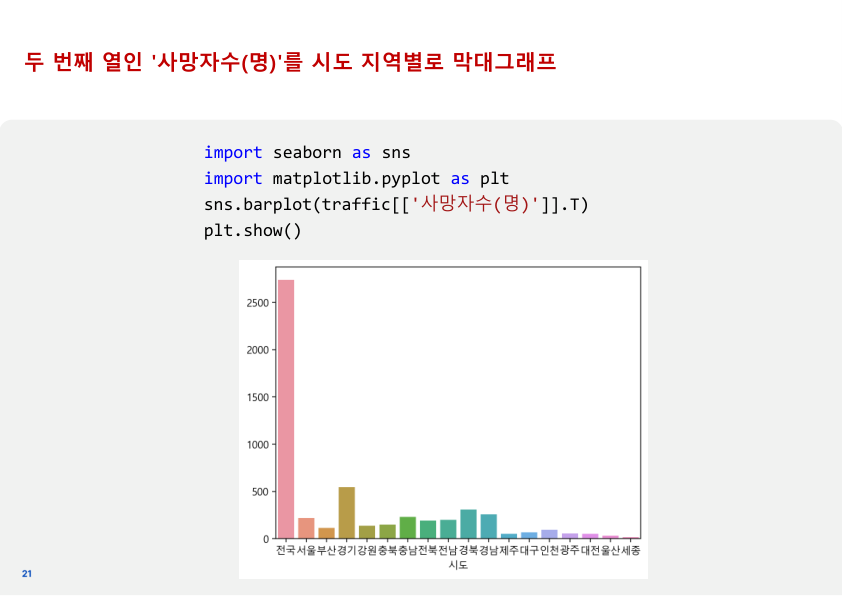

### 두 번째 열인 '사망자수(명)'를 시도 지역별로 막대그래프

- import seaborn as sns
- import matplotlib.pyplot as plt
- sns.barplot(traffic[['사망자수(명)']].T)
- plt.show()

---

## Slide 22
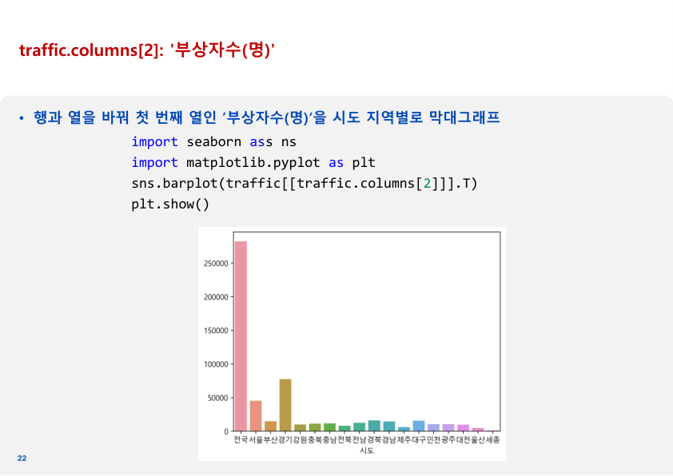

### traffic.columns[2]: '부상자수(명)'

- 행과 열을 바꿔 첫 번째 열인 ’부상자수(명)‘을 시도 지역별로 막대그래프
- import seaborn ass ns
- import matplotlib.pyplot as plt
- sns.barplot(traffic[[traffic.columns[2]]].T)
- plt.show()

---

