# ch09 파이썬 데이터 시각화.pptx

## Slide 1

- 단원 09
- 파이썬 데이터 시각화
- 인공지능소프트웨어학과
- 강환수 교수

---

## Slide 2

### 9.1 산점도와 막대 그래프

- -

---

## Slide 3
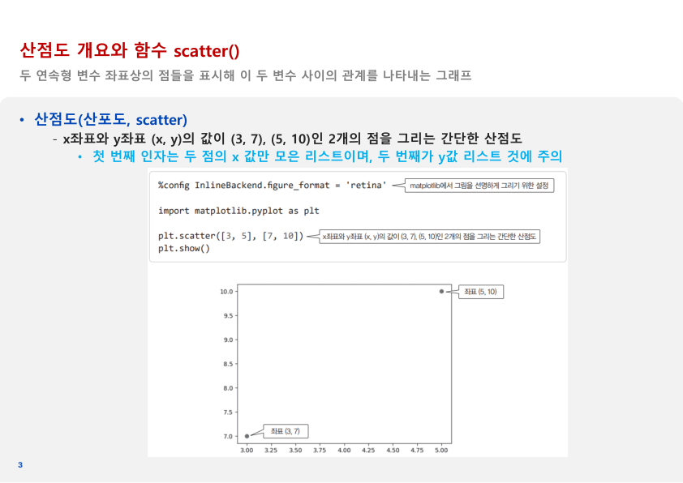

### 산점도 개요와 함수 scatter() 

- 산점도(산포도, scatter)
- x좌표와 y좌표 (x, y)의 값이 (3, 7), (5, 10)인 2개의 점을 그리는 간단한 산점도
- 첫 번째 인자는 두 점의 x 값만 모은 리스트이며, 두 번째가 y값 리스트 것에 주의
- 두 연속형 변수 좌표상의 점들을 표시해 이 두 변수 사이의 관계를 나타내는 그래프

---

## Slide 4
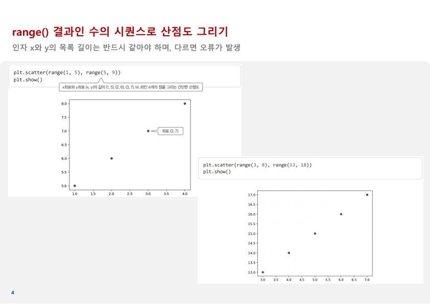

### range() 결과인 수의 시퀀스로 산점도 그리기

- 인자 x와 y의 목록 길이는 반드시 같아야 하며, 다르면 오류가 발생

---

## Slide 5
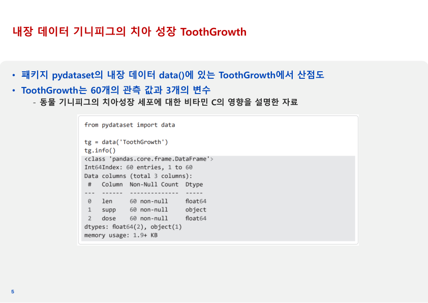

### 내장 데이터 기니피그의 치아 성장 ToothGrowth

- 패키지 pydataset의 내장 데이터 data()에 있는 ToothGrowth에서 산점도
- ToothGrowth는 60개의 관측 값과 3개의 변수
- 동물 기니피그의 치아성장 세포에 대한 비타민 C의 영향을 설명한 자료

---

## Slide 6
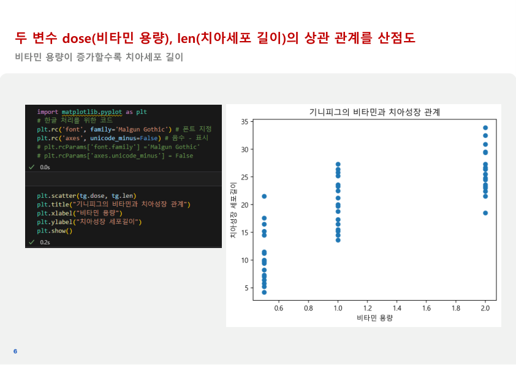

### 두 변수 dose(비타민 용량), len(치아세포 길이)의 상관 관계를 산점도

- 비타민 용량이 증가할수록 치아세포 길이

---

## Slide 7
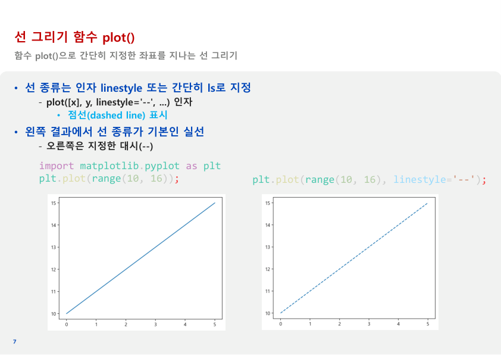

### 선 그리기 함수 plot()

- 선 종류는 인자 linestyle 또는 간단히 ls로 지정
- plot([x], y, linestyle='--', ...) 인자
- 점선(dashed line) 표시
- 왼쪽 결과에서 선 종류가 기본인 실선
- 오른쪽은 지정한 대시(--)
- 함수 plot()으로 간단히 지정한 좌표를 지나는 선 그리기
- import matplotlib.pyplot as plt
- plt.plot(range(10, 16));
- plt.plot(range(10, 16), linestyle='--');

---

## Slide 8
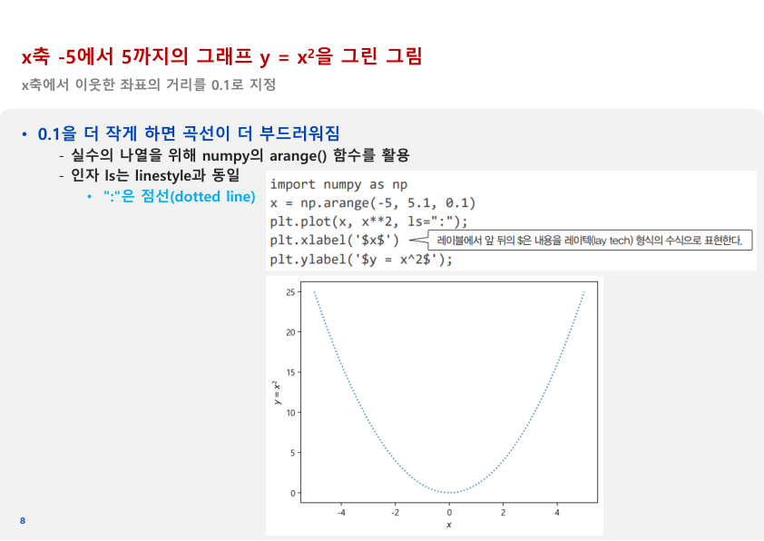

### x축 -5에서 5까지의 그래프 y = x2을 그린 그림

- 0.1을 더 작게 하면 곡선이 더 부드러워짐
- 실수의 나열을 위해 numpy의 arange() 함수를 활용
- 인자 ls는 linestyle과 동일
- ":"은 점선(dotted line)
- x축에서 이웃한 좌표의 거리를 0.1로 지정

---

## Slide 9
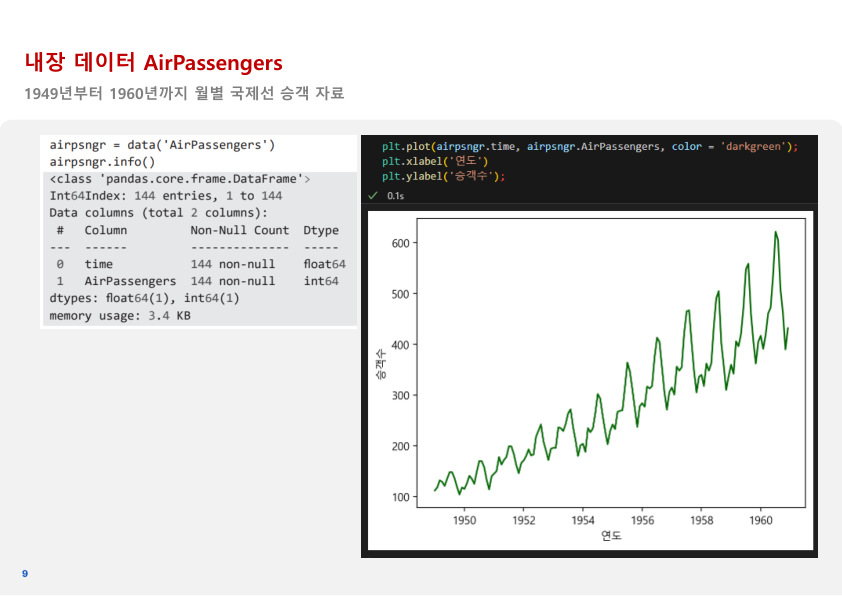

### 내장 데이터 AirPassengers

- 1949년부터 1960년까지 월별 국제선 승객 자료

---

## Slide 10
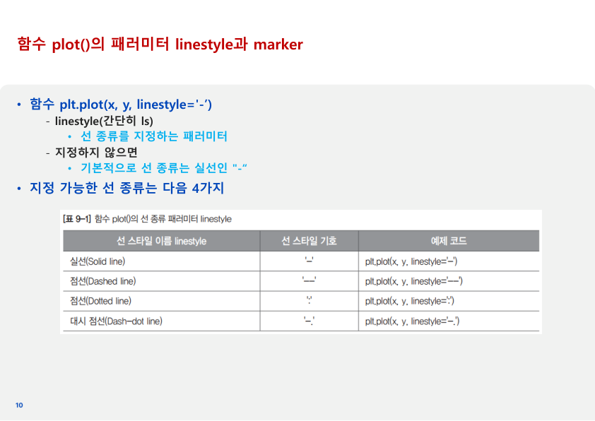

### 함수 plot()의 패러미터 linestyle과 marker

- 함수 plt.plot(x, y, linestyle='-’)
- linestyle(간단히 ls)
- 선 종류를 지정하는 패러미터
- 지정하지 않으면
- 기본적으로 선 종류는 실선인 "-“
- 지정 가능한 선 종류는 다음 4가지

---

## Slide 11
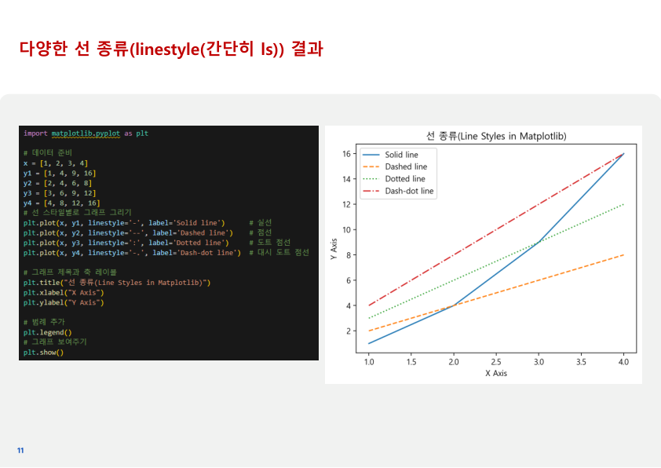

### 다양한 선 종류(linestyle(간단히 ls)) 결과

---

## Slide 12
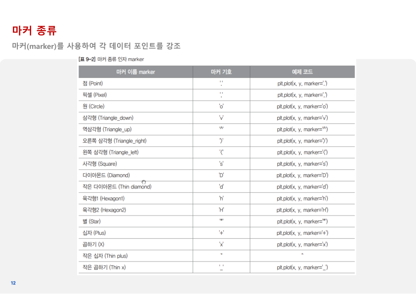

### 마커 종류

- 마커(marker)를 사용하여 각 데이터 포인트를 강조

---

## Slide 13
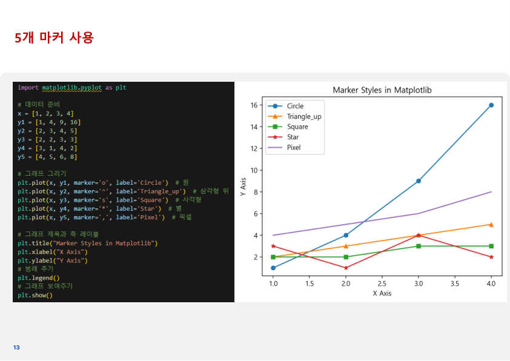

### 5개 마커 사용

---

## Slide 14
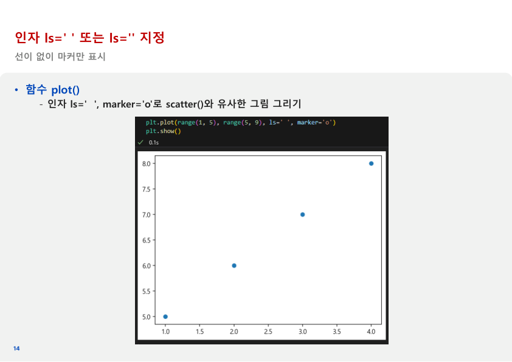

### 인자 ls=' ' 또는 ls='' 지정

- 함수 plot()
- 인자 ls='  ', marker='o'로 scatter()와 유사한 그림 그리기
- 선이 없이 마커만 표시

---

## Slide 15
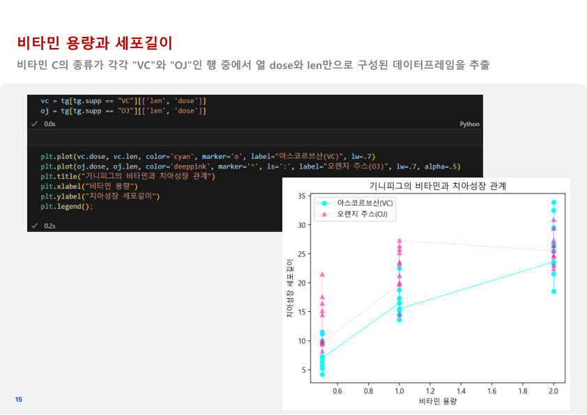

### 비타민 용량과 세포길이

- 비타민 C의 종류가 각각 "VC"와 "OJ"인 행 중에서 열 dose와 len만으로 구성된 데이터프레임을 추출

---

## Slide 16
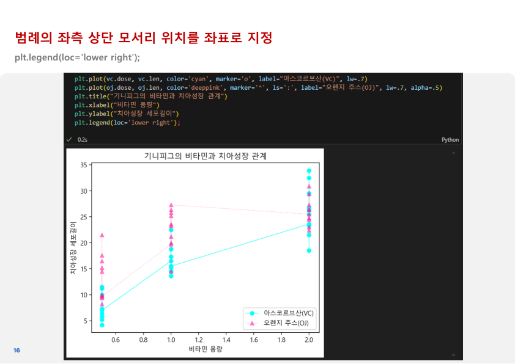

### 범례의 좌측 상단 모서리 위치를 좌표로 지정

- plt.legend(loc='lower right');

---

## Slide 17
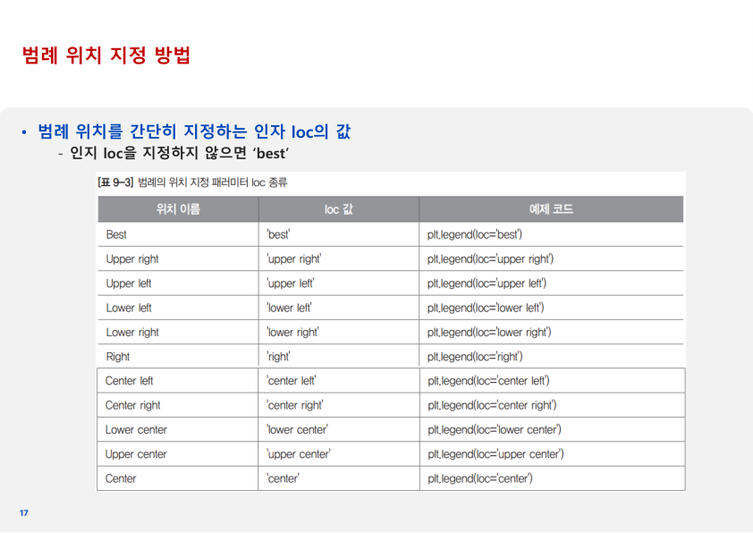

### 범례 위치 지정 방법

- 범례 위치를 간단히 지정하는 인자 loc의 값
- 인지 loc을 지정하지 않으면 ‘best’

---

## Slide 18
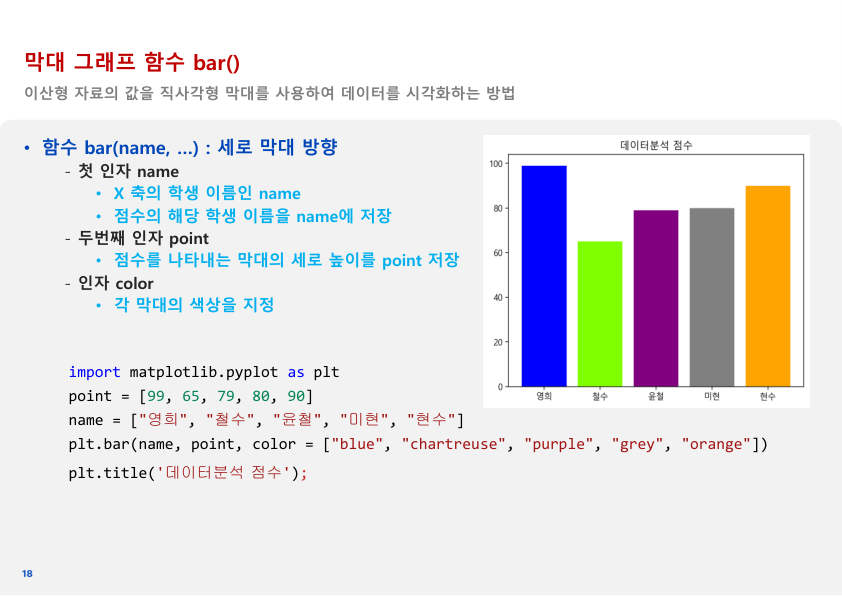

### 막대 그래프 함수 bar()

- 함수 bar(name, …) : 세로 막대 방향
- 첫 인자 name
- X 축의 학생 이름인 name
- 점수의 해당 학생 이름을 name에 저장
- 두번째 인자 point
- 점수를 나타내는 막대의 세로 높이를 point 저장
- 인자 color
- 각 막대의 색상을 지정
- 이산형 자료의 값을 직사각형 막대를 사용하여 데이터를 시각화하는 방법
- import matplotlib.pyplot as plt
- point = [99, 65, 79, 80, 90]
- name = ["영희", "철수", "윤철", "미현", "현수"]
- plt.bar(name, point, color = ["blue", "chartreuse", "purple", "grey", "orange"])
- plt.title('데이터분석 점수');

---

## Slide 19
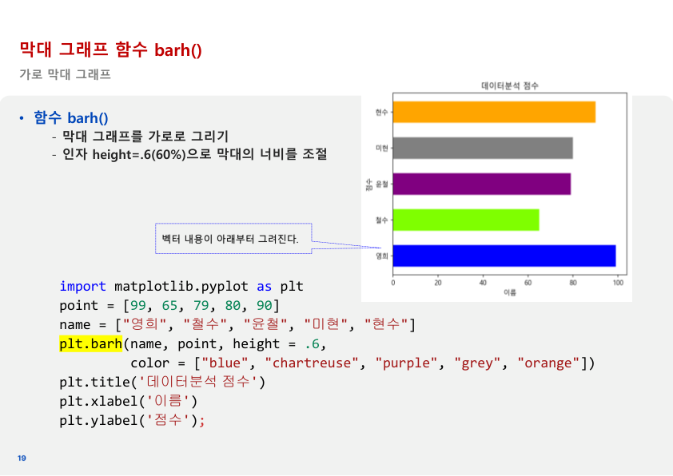

### 막대 그래프 함수 barh()

- 함수 barh()
- 막대 그래프를 가로로 그리기
- 인자 height=.6(60%)으로 막대의 너비를 조절
- 가로 막대 그래프
- import matplotlib.pyplot as plt
- point = [99, 65, 79, 80, 90]
- name = ["영희", "철수", "윤철", "미현", "현수"]
- plt.barh(name, point, height = .6,
- color = ["blue", "chartreuse", "purple", "grey", "orange"])
- plt.title('데이터분석 점수')
- plt.xlabel('이름')
- plt.ylabel('점수');
- 벡터 내용이 아래부터 그려진다.

---

## Slide 20
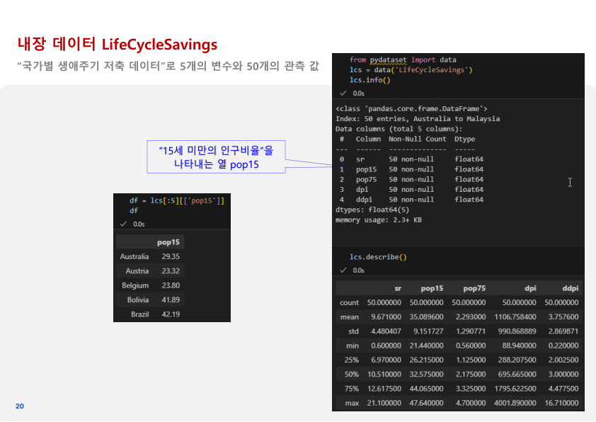

### 내장 데이터 LifeCycleSavings

- “국가별 생애주기 저축 데이터”로 5개의 변수와 50개의 관측 값
- “15세 미만의 인구비율”을 나타내는 열 pop15

---

## Slide 21
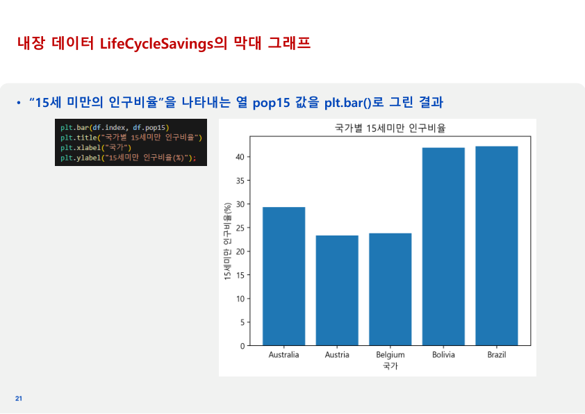

### 내장 데이터 LifeCycleSavings의 막대 그래프

- “15세 미만의 인구비율”을 나타내는 열 pop15 값을 plt.bar()로 그린 결과

---

## Slide 22
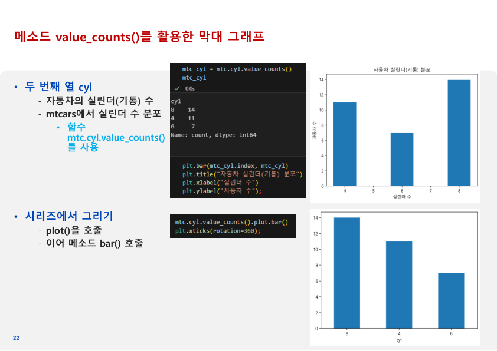

### 메소드 value_counts()를 활용한 막대 그래프

- 두 번째 열 cyl
- 자동차의 실린더(기통) 수
- mtcars에서 실린더 수 분포
- 함수 mtc.cyl.value_counts()를 사용
- 시리즈에서 그리기
- plot()을 호출
- 이어 메소드 bar() 호출

---

## Slide 23
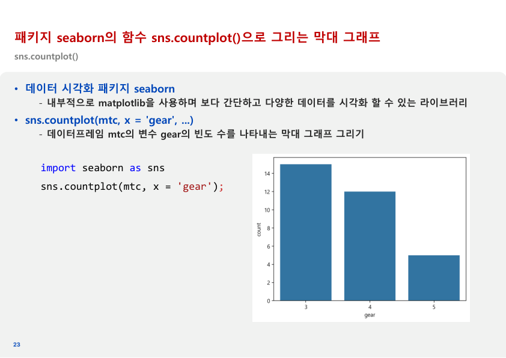

### 패키지 seaborn의 함수 sns.countplot()으로 그리는 막대 그래프

- 데이터 시각화 패키지 seaborn
- 내부적으로 matplotlib을 사용하며 보다 간단하고 다양한 데이터를 시각화 할 수 있는 라이브러리
- sns.countplot(mtc, x = 'gear', ...)
- 데이터프레임 mtc의 변수 gear의 빈도 수를 나타내는 막대 그래프 그리기
- sns.countplot()
- import seaborn as sns
- sns.countplot(mtc, x = 'gear');

---

## Slide 24
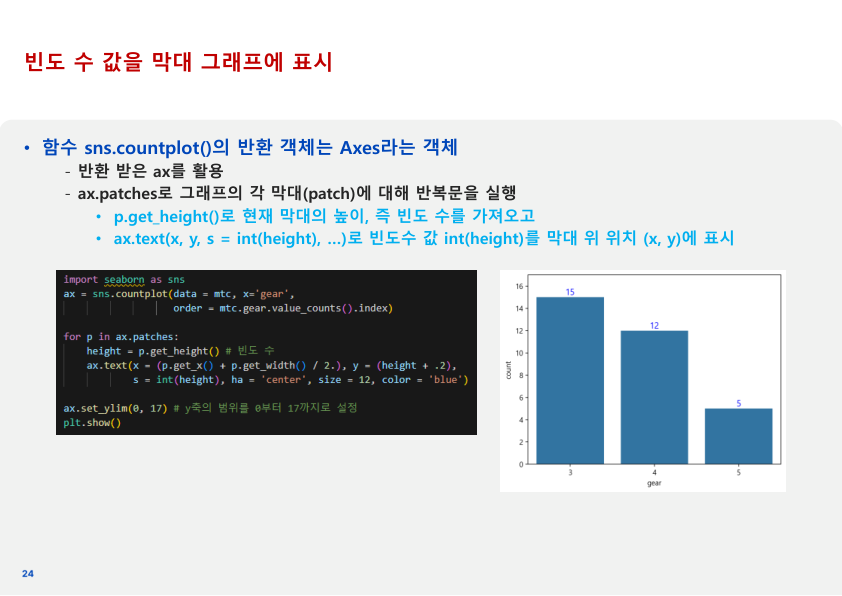

### 빈도 수 값을 막대 그래프에 표시

- 함수 sns.countplot()의 반환 객체는 Axes라는 객체
- 반환 받은 ax를 활용
- ax.patches로 그래프의 각 막대(patch)에 대해 반복문을 실행
- p.get_height()로 현재 막대의 높이, 즉 빈도 수를 가져오고
- ax.text(x, y, s = int(height), …)로 빈도수 값 int(height)를 막대 위 위치 (x, y)에 표시

---

## Slide 25
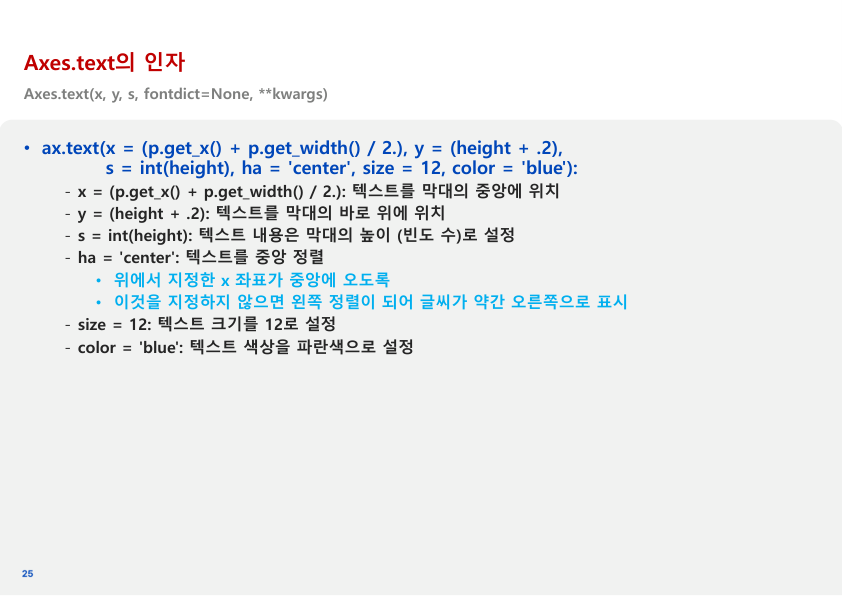

### Axes.text의 인자

- ax.text(x = (p.get_x() + p.get_width() / 2.), y = (height + .2),           s = int(height), ha = 'center', size = 12, color = 'blue'):
- x = (p.get_x() + p.get_width() / 2.): 텍스트를 막대의 중앙에 위치
- y = (height + .2): 텍스트를 막대의 바로 위에 위치
- s = int(height): 텍스트 내용은 막대의 높이 (빈도 수)로 설정
- ha = 'center': 텍스트를 중앙 정렬
- 위에서 지정한 x 좌표가 중앙에 오도록
- 이것을 지정하지 않으면 왼쪽 정렬이 되어 글씨가 약간 오른쪽으로 표시
- size = 12: 텍스트 크기를 12로 설정
- color = 'blue': 텍스트 색상을 파란색으로 설정
- Axes.text(x, y, s, fontdict=None, **kwargs)

---

## Slide 26

### 9.2 상자그림과 히스토그램

- -

---

## Slide 27
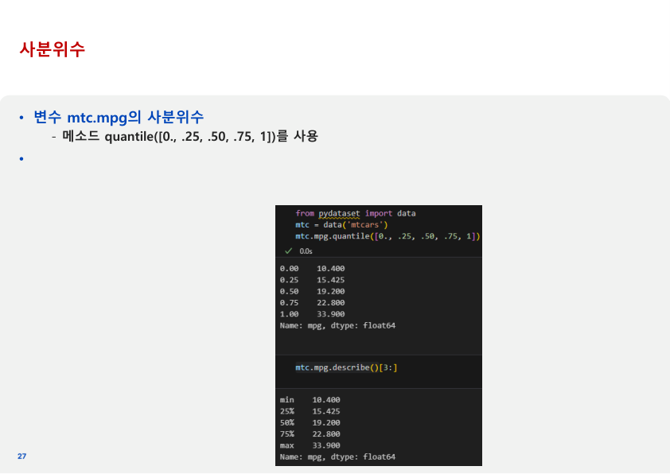

### 사분위수

- 변수 mtc.mpg의 사분위수
- 메소드 quantile([0., .25, .50, .75, 1])를 사용

---

## Slide 28
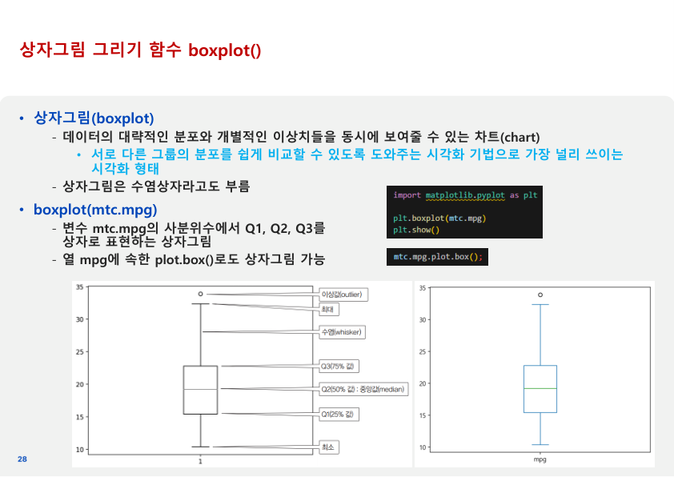

### 상자그림 그리기 함수 boxplot()

- 상자그림(boxplot)
- 데이터의 대략적인 분포와 개별적인 이상치들을 동시에 보여줄 수 있는 차트(chart)
- 서로 다른 그룹의 분포를 쉽게 비교할 수 있도록 도와주는 시각화 기법으로 가장 널리 쓰이는 시각화 형태
- 상자그림은 수염상자라고도 부름
- boxplot(mtc.mpg)
- 변수 mtc.mpg의 사분위수에서 Q1, Q2, Q3를상자로 표현하는 상자그림
- 열 mpg에 속한 plot.box()로도 상자그림 가능

---

## Slide 29
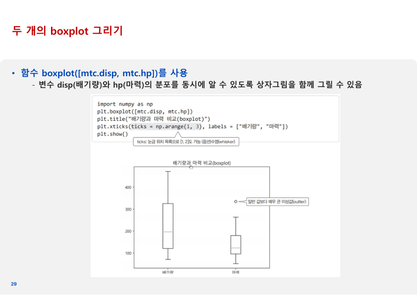

### 두 개의 boxplot 그리기

- 함수 boxplot([mtc.disp, mtc.hp])를 사용
- 변수 disp(배기량)와 hp(마력)의 분포를 동시에 알 수 있도록 상자그림을 함께 그릴 수 있음

---

## Slide 30
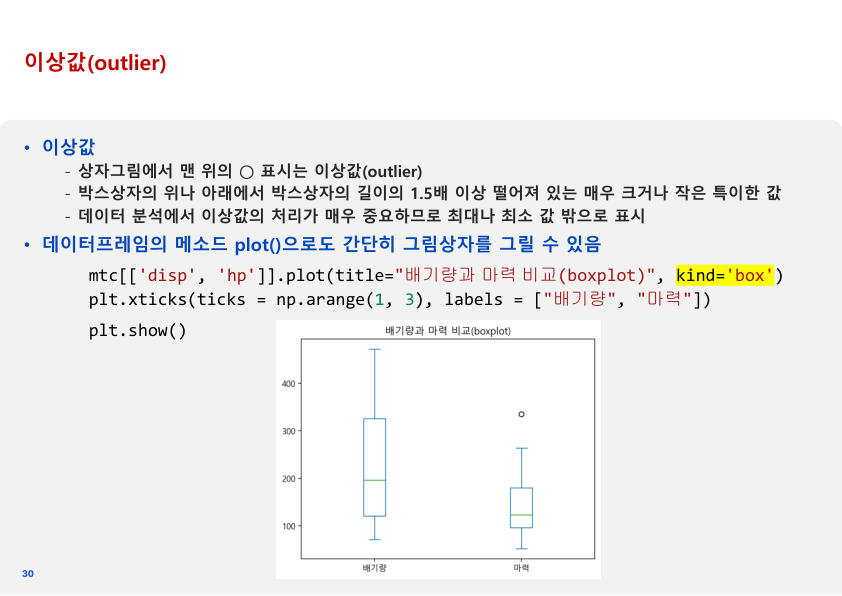

### 이상값(outlier)

- 이상값
- 상자그림에서 맨 위의 ○ 표시는 이상값(outlier)
- 박스상자의 위나 아래에서 박스상자의 길이의 1.5배 이상 떨어져 있는 매우 크거나 작은 특이한 값
- 데이터 분석에서 이상값의 처리가 매우 중요하므로 최대나 최소 값 밖으로 표시
- 데이터프레임의 메소드 plot()으로도 간단히 그림상자를 그릴 수 있음
- mtc[['disp', 'hp']].plot(title="배기량과 마력 비교(boxplot)", kind='box')
- plt.xticks(ticks = np.arange(1, 3), labels = ["배기량", "마력"])
- plt.show()

---

## Slide 31
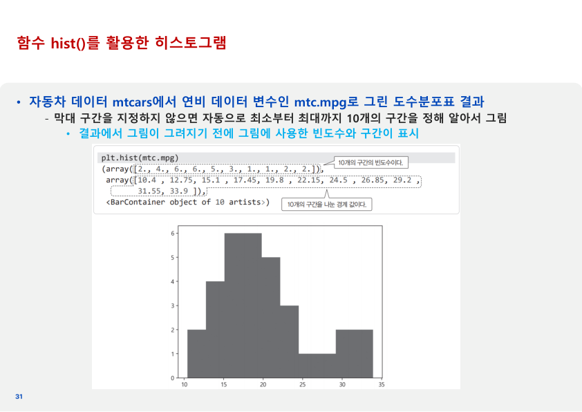

### 함수 hist()를 활용한 히스토그램

- 자동차 데이터 mtcars에서 연비 데이터 변수인 mtc.mpg로 그린 도수분포표 결과
- 막대 구간을 지정하지 않으면 자동으로 최소부터 최대까지 10개의 구간을 정해 알아서 그림
- 결과에서 그림이 그려지기 전에 그림에 사용한 빈도수와 구간이 표시

---

## Slide 32
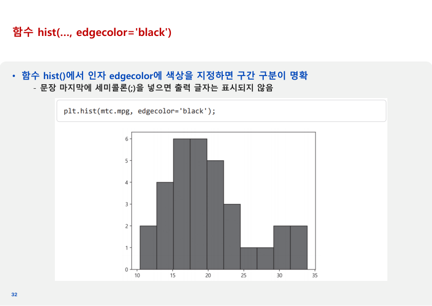

### 함수 hist(…, edgecolor='black')

- 함수 hist()에서 인자 edgecolor에 색상을 지정하면 구간 구분이 명확
- 문장 마지막에 세미콜론(;)을 넣으면 출력 글자는 표시되지 않음

---

## Slide 33
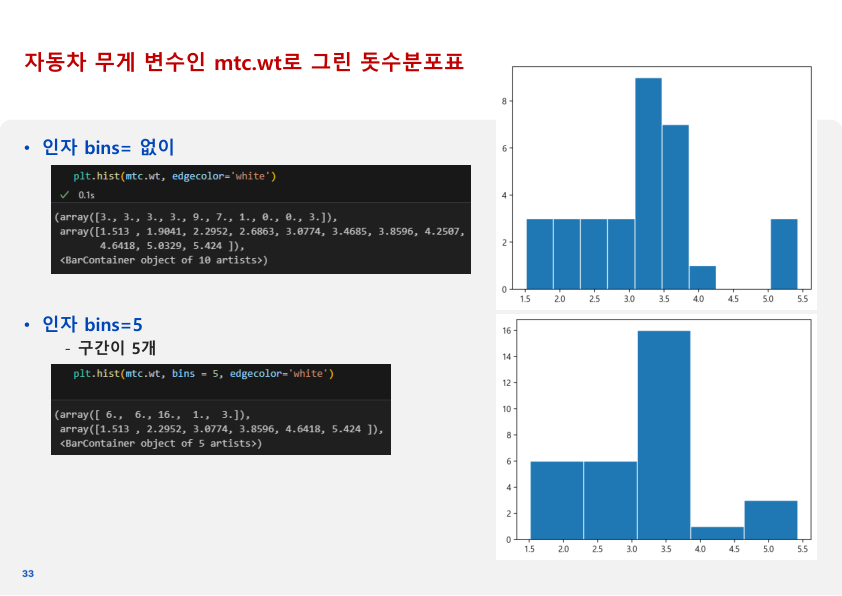

### 자동차 무게 변수인 mtc.wt로 그린 돗수분포표

- 인자 bins= 없이
- 인자 bins=5
- 구간이 5개

---

## Slide 34
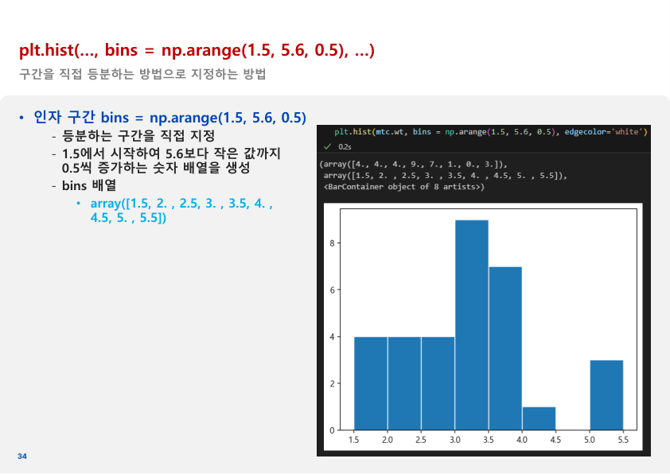

### plt.hist(…, bins = np.arange(1.5, 5.6, 0.5), …)

- 인자 구간 bins = np.arange(1.5, 5.6, 0.5)
- 등분하는 구간을 직접 지정
- 1.5에서 시작하여 5.6보다 작은 값까지0.5씩 증가하는 숫자 배열을 생성
- bins 배열
- array([1.5, 2. , 2.5, 3. , 3.5, 4. , 4.5, 5. , 5.5])
- 구간을 직접 등분하는 방법으로 지정하는 방법

---

## Slide 35
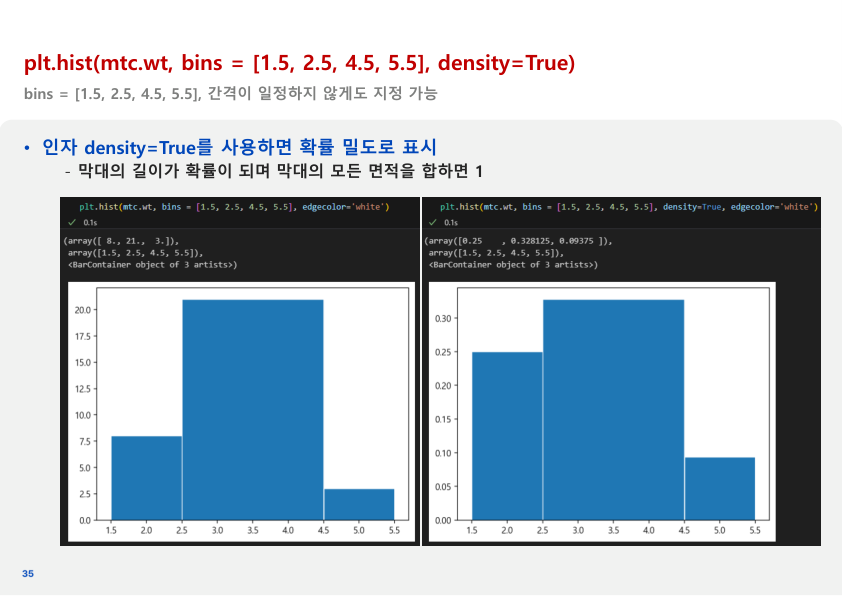

### plt.hist(mtc.wt, bins = [1.5, 2.5, 4.5, 5.5], density=True)

- 인자 density=True를 사용하면 확률 밀도로 표시
- 막대의 길이가 확률이 되며 막대의 모든 면적을 합하면 1
- bins = [1.5, 2.5, 4.5, 5.5], 간격이 일정하지 않게도 지정 가능

---

## Slide 36
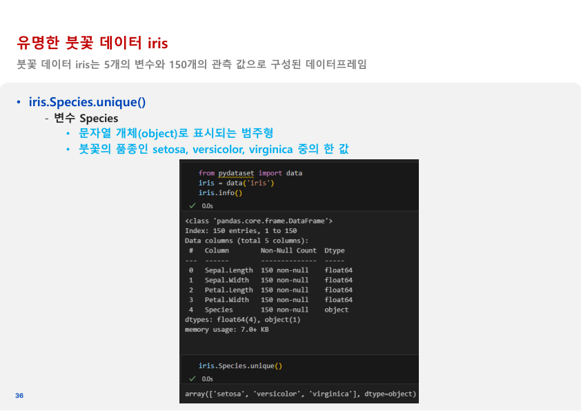

### 유명한 붓꽃 데이터 iris 

- iris.Species.unique()
- 변수 Species
- 문자열 개체(object)로 표시되는 범주형
- 붓꽃의 품종인 setosa, versicolor, virginica 중의 한 값
- 붓꽃 데이터 iris는 5개의 변수와 150개의 관측 값으로 구성된 데이터프레임

---

## Slide 37
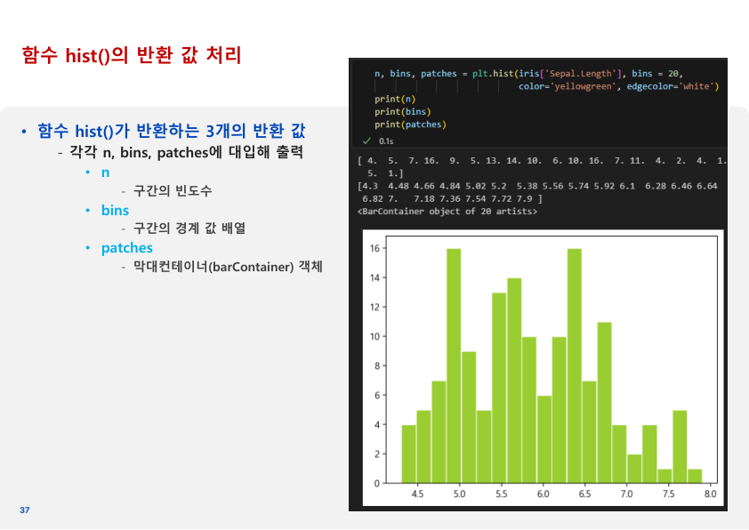

### 함수 hist()의 반환 값 처리

- 함수 hist()가 반환하는 3개의 반환 값
- 각각 n, bins, patches에 대입해 출력
- n
- 구간의 빈도수
- bins
- 구간의 경계 값 배열
- patches
- 막대컨테이너(barContainer) 객체

---

## Slide 38
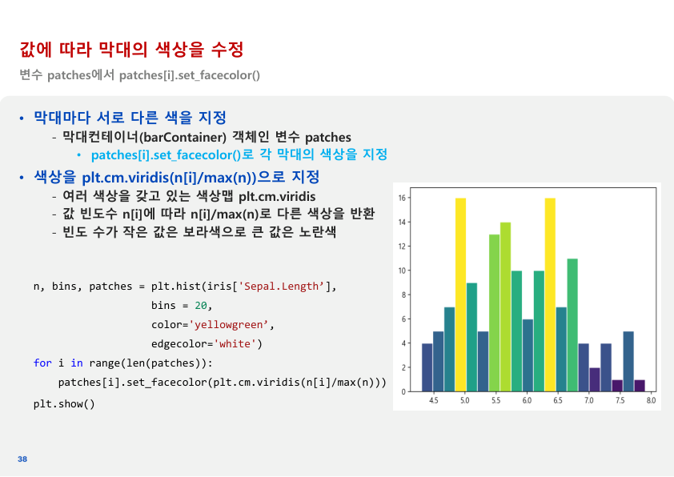

### 값에 따라 막대의 색상을 수정 

- 막대마다 서로 다른 색을 지정
- 막대컨테이너(barContainer) 객체인 변수 patches
- patches[i].set_facecolor()로 각 막대의 색상을 지정
- 색상을 plt.cm.viridis(n[i]/max(n))으로 지정
- 여러 색상을 갖고 있는 색상맵 plt.cm.viridis
- 값 빈도수 n[i]에 따라 n[i]/max(n)로 다른 색상을 반환
- 빈도 수가 작은 값은 보라색으로 큰 값은 노란색
- 변수 patches에서 patches[i].set_facecolor()
- n, bins, patches = plt.hist(iris['Sepal.Length’],
- bins = 20,
- color='yellowgreen’,
- edgecolor='white')
- for i in range(len(patches)):
- patches[i].set_facecolor(plt.cm.viridis(n[i]/max(n)))
- plt.show()

---

## Slide 39
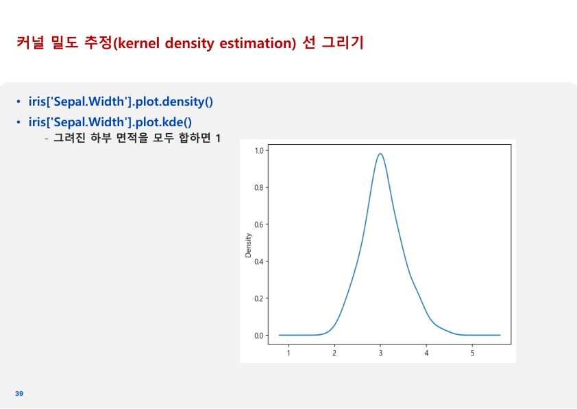

### 커널 밀도 추정(kernel density estimation) 선 그리기

- iris['Sepal.Width'].plot.density()
- iris['Sepal.Width'].plot.kde()
- 그려진 하부 면적을 모두 합하면 1

---

## Slide 40
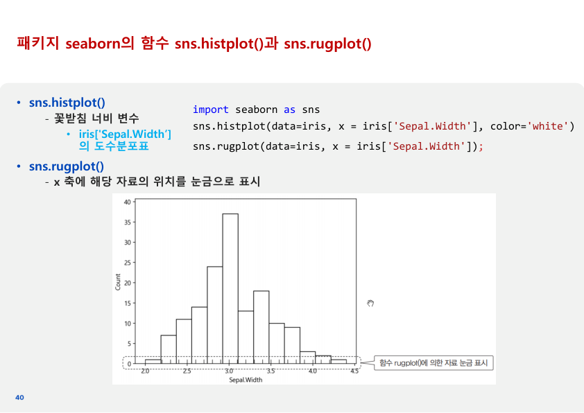

### 패키지 seaborn의 함수 sns.histplot()과 sns.rugplot()

- sns.histplot()
- 꽃받침 너비 변수
- iris['Sepal.Width’]의 도수분포표
- sns.rugplot()
- x 축에 해당 자료의 위치를 눈금으로 표시
- import seaborn as sns
- sns.histplot(data=iris, x = iris['Sepal.Width'], color='white')
- sns.rugplot(data=iris, x = iris['Sepal.Width']);

---

## Slide 41
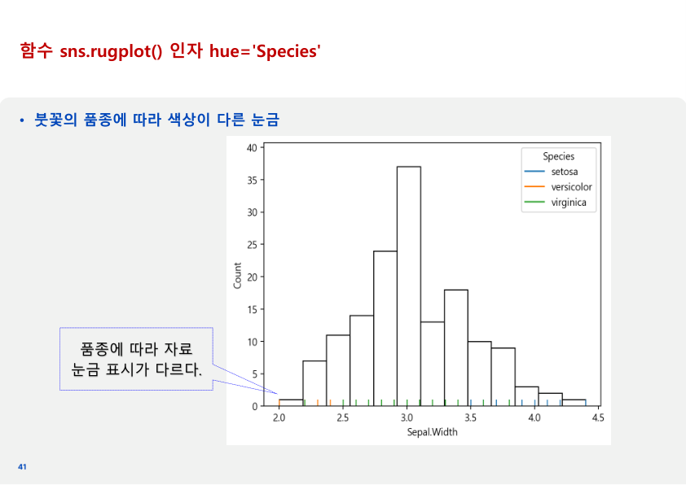

### 함수 sns.rugplot() 인자 hue='Species'

- 붓꽃의 품종에 따라 색상이 다른 눈금
- 품종에 따라 자료 눈금 표시가 다르다.

---

## Slide 42
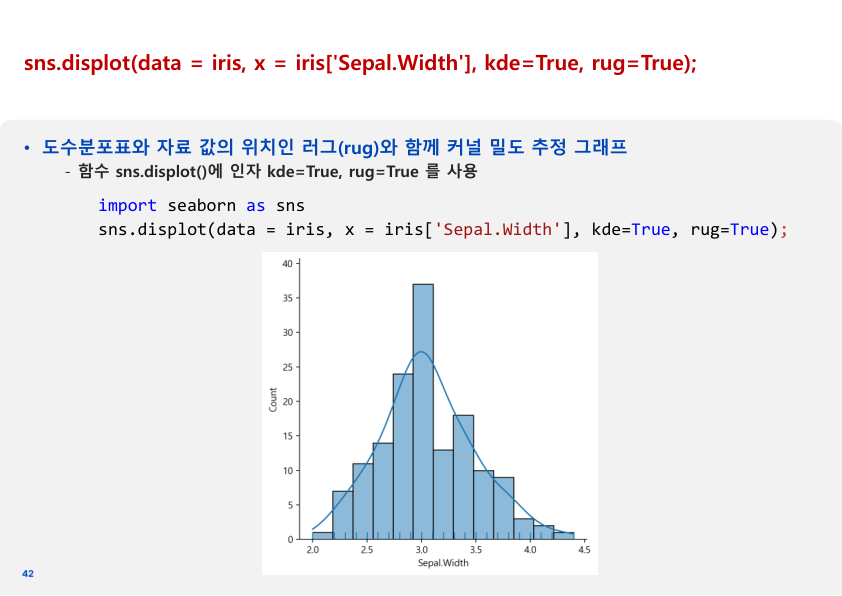

### sns.displot(data = iris, x = iris['Sepal.Width'], kde=True, rug=True);

- 도수분포표와 자료 값의 위치인 러그(rug)와 함께 커널 밀도 추정 그래프
- 함수 sns.displot()에 인자 kde=True, rug=True 를 사용
- import seaborn as sns
- sns.displot(data = iris, x = iris['Sepal.Width'], kde=True, rug=True);

---

## Slide 43
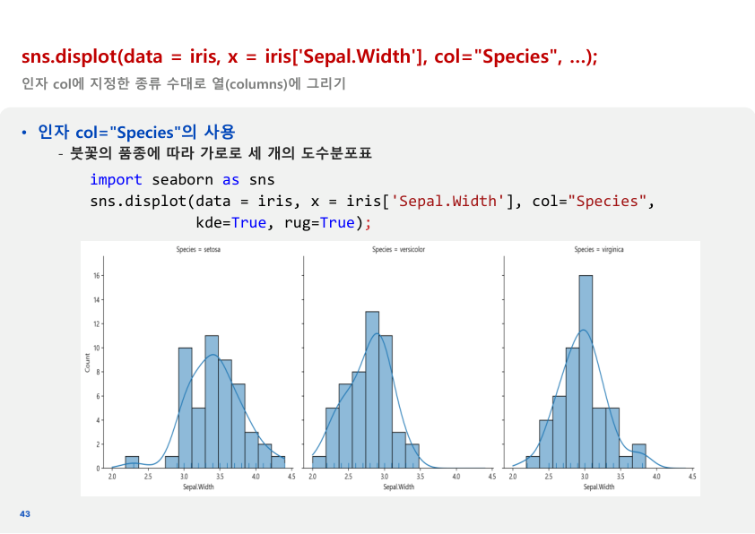

### sns.displot(data = iris, x = iris['Sepal.Width'], col="Species", …);

- 인자 col="Species"의 사용
- 붓꽃의 품종에 따라 가로로 세 개의 도수분포표
- 인자 col에 지정한 종류 수대로 열(columns)에 그리기
- import seaborn as sns
- sns.displot(data = iris, x = iris['Sepal.Width'], col="Species",
- kde=True, rug=True);

---

## Slide 44
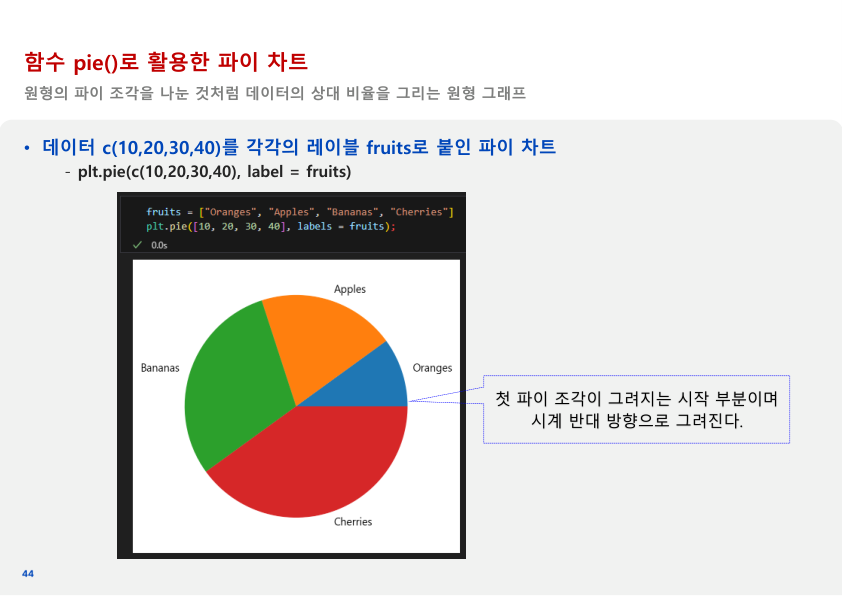

### 함수 pie()로 활용한 파이 차트

- 데이터 c(10,20,30,40)를 각각의 레이블 fruits로 붙인 파이 차트
- plt.pie(c(10,20,30,40), label = fruits)
- 원형의 파이 조각을 나눈 것처럼 데이터의 상대 비율을 그리는 원형 그래프
- 첫 파이 조각이 그려지는 시작 부분이며 시계 반대 방향으로 그려진다.

---

## Slide 45
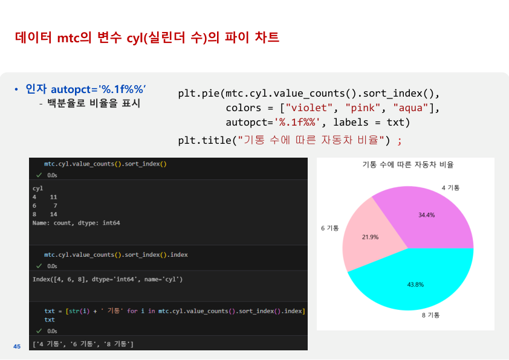

### 데이터 mtc의 변수 cyl(실린더 수)의 파이 차트

- 인자 autopct='%.1f%%’
- 백분율로 비율을 표시
- plt.pie(mtc.cyl.value_counts().sort_index(),
- colors = ["violet", "pink", "aqua"],
- autopct='%.1f%%', labels = txt)
- plt.title("기통 수에 따른 자동차 비율") ;

---

## Slide 46
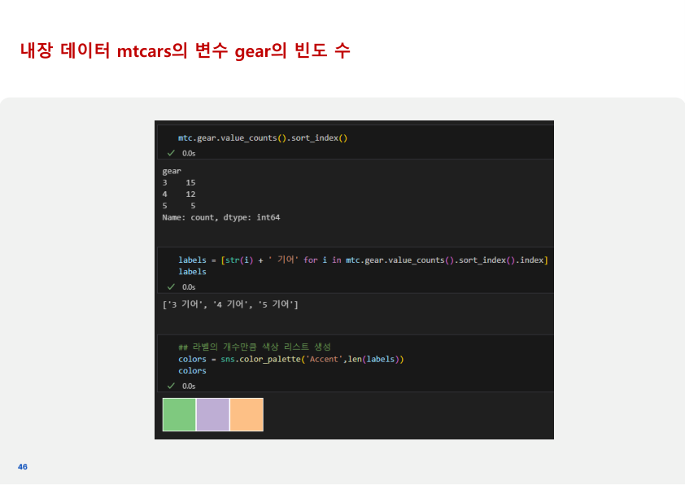

### 내장 데이터 mtcars의 변수 gear의 빈도 수

---

## Slide 47
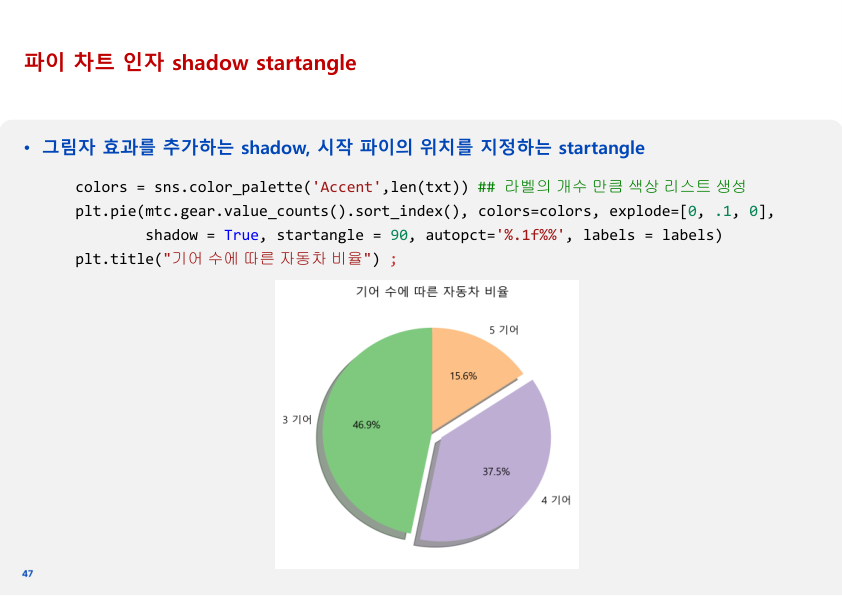

### 파이 차트 인자 shadow startangle

- 그림자 효과를 추가하는 shadow, 시작 파이의 위치를 지정하는 startangle
- colors = sns.color_palette('Accent',len(txt)) ## 라벨의 개수 만큼 색상 리스트 생성
- plt.pie(mtc.gear.value_counts().sort_index(), colors=colors, explode=[0, .1, 0],
- shadow = True, startangle = 90, autopct='%.1f%%', labels = labels)
- plt.title("기어 수에 따른 자동차 비율") ;

---

## Slide 48

### 9.3 바이올린과 상관관계 시각화

- -

---

## Slide 49
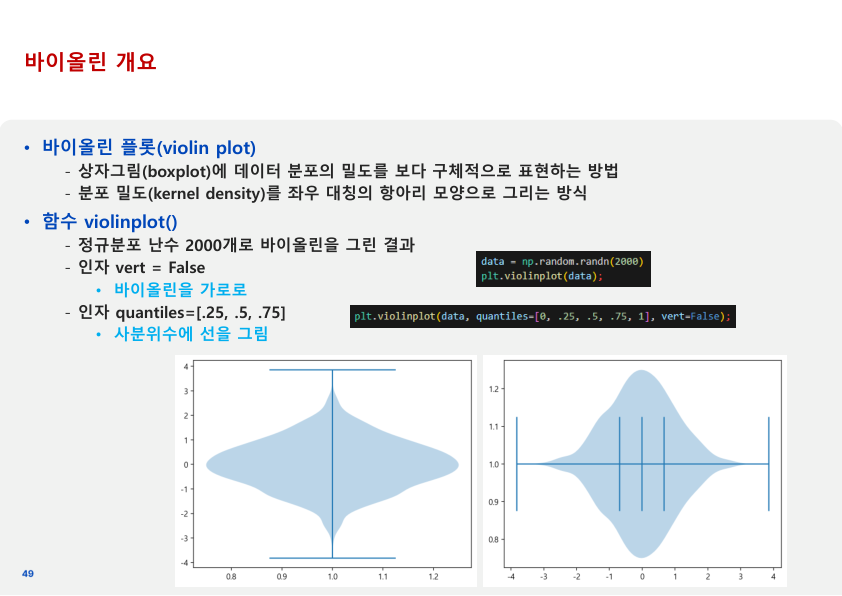

### 바이올린 개요

- 바이올린 플롯(violin plot)
- 상자그림(boxplot)에 데이터 분포의 밀도를 보다 구체적으로 표현하는 방법
- 분포 밀도(kernel density)를 좌우 대칭의 항아리 모양으로 그리는 방식
- 함수 violinplot()
- 정규분포 난수 2000개로 바이올린을 그린 결과
- 인자 vert = False
- 바이올린을 가로로
- 인자 quantiles=[.25, .5, .75]
- 사분위수에 선을 그림

---

## Slide 50
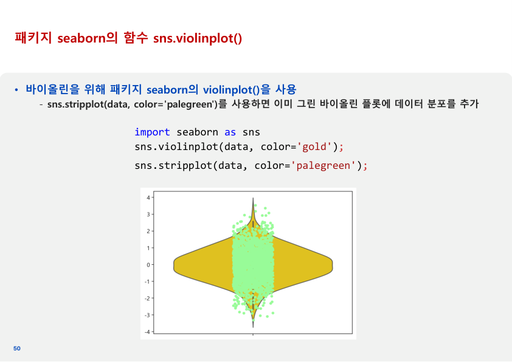

### 패키지 seaborn의 함수 sns.violinplot()

- 바이올린을 위해 패키지 seaborn의 violinplot()을 사용
- sns.stripplot(data, color='palegreen')를 사용하면 이미 그린 바이올린 플롯에 데이터 분포를 추가
- import seaborn as sns
- sns.violinplot(data, color='gold');
- sns.stripplot(data, color='palegreen');

---

## Slide 51
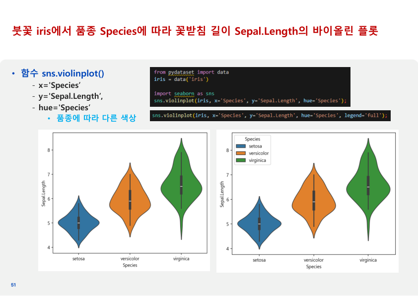

### 붓꽃 iris에서 품종 Species에 따라 꽃받침 길이 Sepal.Length의 바이올린 플롯

- 함수 sns.violinplot()
- x='Species’
- y='Sepal.Length’,
- hue='Species’
- 품종에 따라 다른 색상

---

## Slide 52
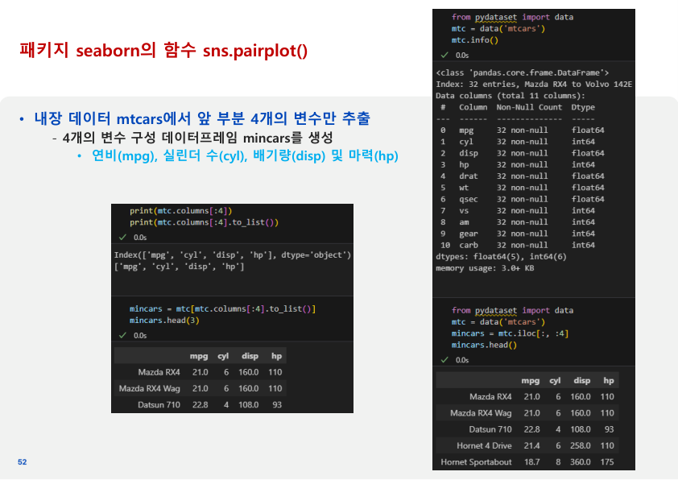

### 패키지 seaborn의 함수 sns.pairplot()

- 내장 데이터 mtcars에서 앞 부분 4개의 변수만 추출
- 4개의 변수 구성 데이터프레임 mincars를 생성
- 연비(mpg), 실린더 수(cyl), 배기량(disp) 및 마력(hp)

---

## Slide 53
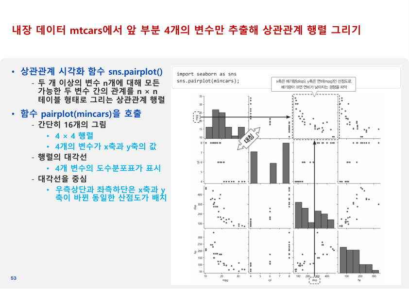

### 내장 데이터 mtcars에서 앞 부분 4개의 변수만 추출해 상관관계 행렬 그리기

- 상관관계 시각화 함수 sns.pairplot()
- 두 개 이상의 변수 n개에 대해 모든 가능한 두 변수 간의 관계를 n × n 테이블 형태로 그리는 상관관계 행렬
- 함수 pairplot(mincars)을 호출
- 간단히 16개의 그림
- 4 × 4 행렬
- 4개의 변수가 x축과 y축의 값
- 행렬의 대각선
- 4개 변수의 도수분포표가 표시
- 대각선을 중심
- 우측상단과 좌측하단은 x축과 y축이 바뀐 동일한 산점도가 배치

---

## Slide 54
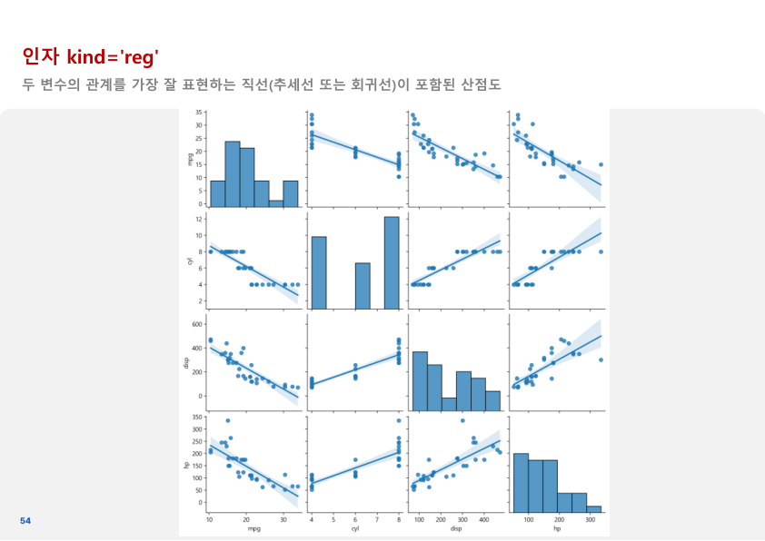

### 인자 kind='reg'

- 두 변수의 관계를 가장 잘 표현하는 직선(추세선 또는 회귀선)이 포함된 산점도

---

## Slide 55
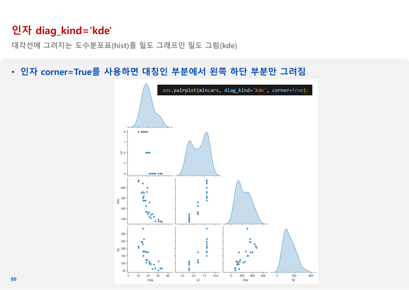

### 인자 diag_kind='kde'

- 인자 corner=True를 사용하면 대칭인 부분에서 왼쪽 하단 부분만 그려짐
- 대각선에 그려지는 도수분포표(hist)를 밀도 그래프인 밀도 그림(kde)

---

## Slide 56
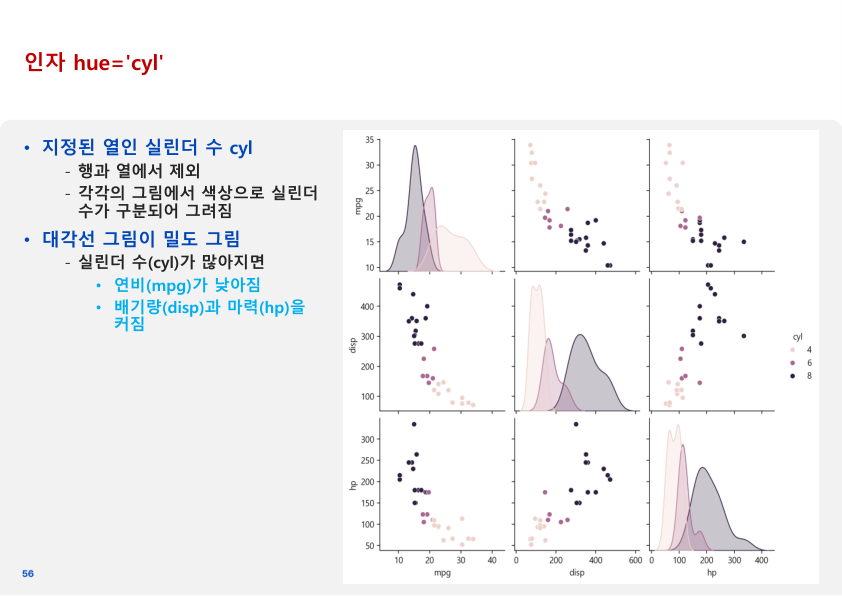

### 인자 hue='cyl'

- 지정된 열인 실린더 수 cyl
- 행과 열에서 제외
- 각각의 그림에서 색상으로 실린더 수가 구분되어 그려짐
- 대각선 그림이 밀도 그림
- 실린더 수(cyl)가 많아지면
- 연비(mpg)가 낮아짐
- 배기량(disp)과 마력(hp)을 커짐

---

## Slide 57
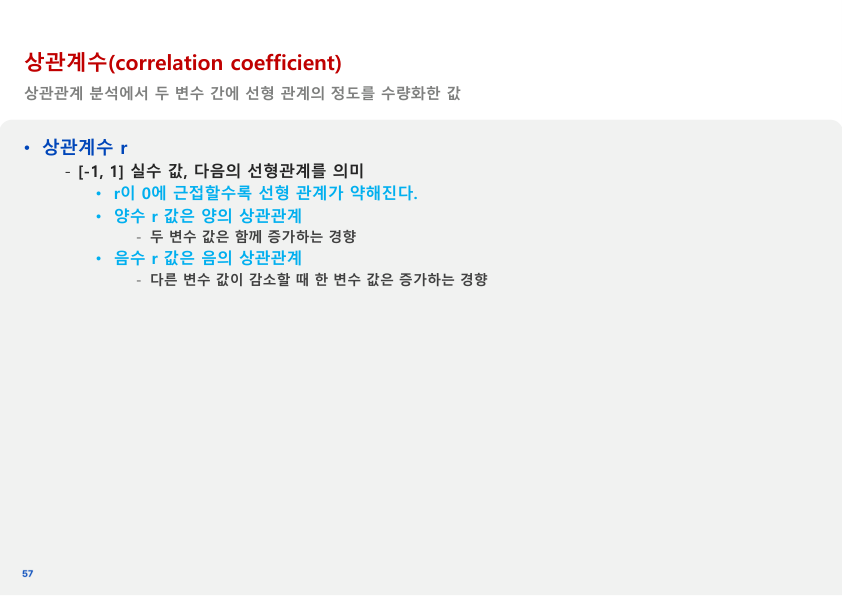

### 상관계수(correlation coefficient)

- 상관계수 r
- [-1, 1] 실수 값, 다음의 선형관계를 의미
- r이 0에 근접할수록 선형 관계가 약해진다.
- 양수 r 값은 양의 상관관계
- 두 변수 값은 함께 증가하는 경향
- 음수 r 값은 음의 상관관계
- 다른 변수 값이 감소할 때 한 변수 값은 증가하는 경향
- 상관관계 분석에서 두 변수 간에 선형 관계의 정도를 수량화한 값

---

## Slide 58
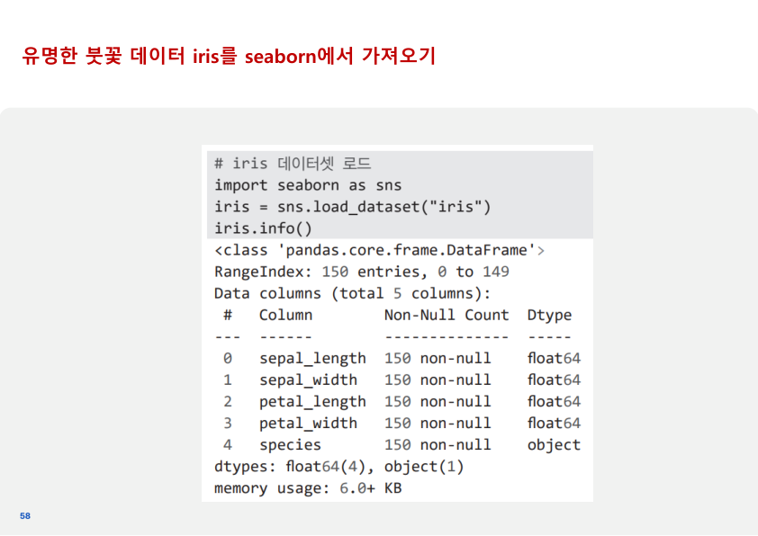

### 유명한 붓꽃 데이터 iris를 seaborn에서 가져오기

---

## Slide 59
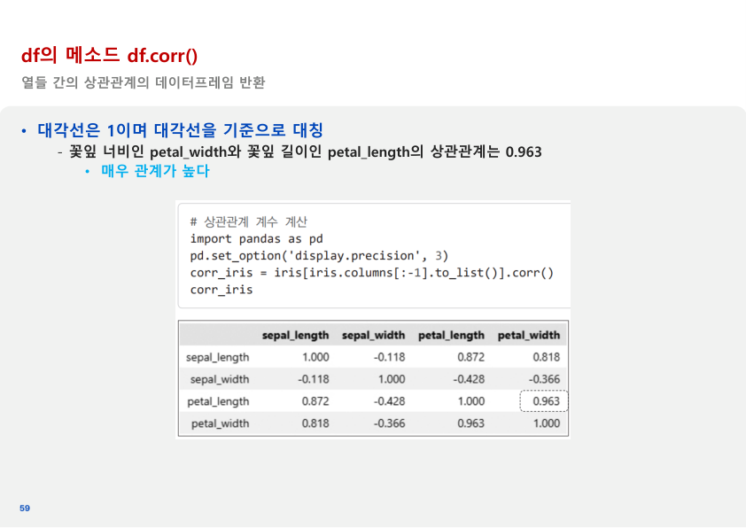

### df의 메소드 df.corr()

- 대각선은 1이며 대각선을 기준으로 대칭
- 꽃잎 너비인 petal_width와 꽃잎 길이인 petal_length의 상관관계는 0.963
- 매우 관계가 높다
- 열들 간의 상관관계의 데이터프레임 반환

---

## Slide 60
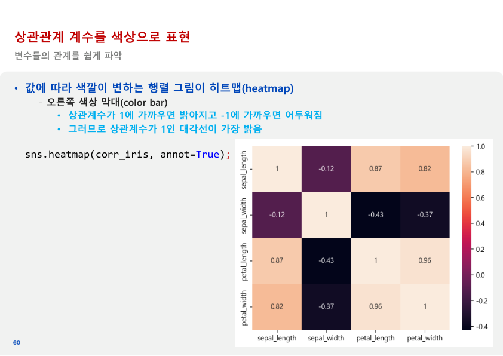

### 상관관계 계수를 색상으로 표현

- 값에 따라 색깔이 변하는 행렬 그림이 히트맵(heatmap)
- 오른쪽 색상 막대(color bar)
- 상관계수가 1에 가까우면 밝아지고 -1에 가까우면 어두워짐
- 그러므로 상관계수가 1인 대각선이 가장 밝음
- 변수들의 관계를 쉽게 파악
- sns.heatmap(corr_iris, annot=True);

---

## Slide 61
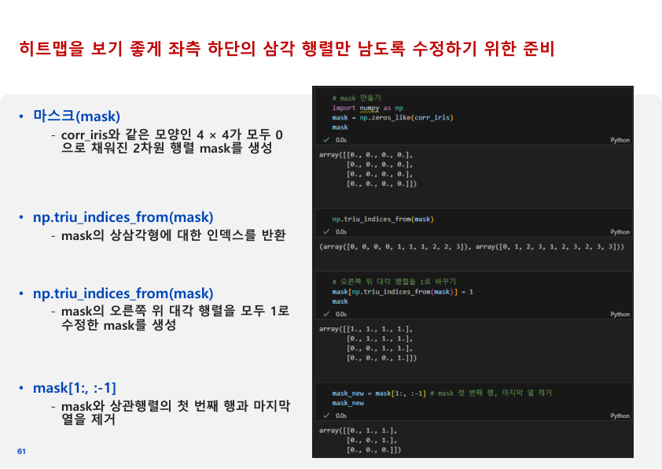

### 히트맵을 보기 좋게 좌측 하단의 삼각 행렬만 남도록 수정하기 위한 준비

- 마스크(mask)
- corr_iris와 같은 모양인 4 × 4가 모두 0으로 채워진 2차원 행렬 mask를 생성
- np.triu_indices_from(mask)
- mask의 상삼각형에 대한 인덱스를 반환
- np.triu_indices_from(mask)
- mask의 오른쪽 위 대각 행렬을 모두 1로 수정한 mask를 생성
- mask[1:, :-1]
- mask와 상관행렬의 첫 번째 행과 마지막 열을 제거

---

## Slide 62
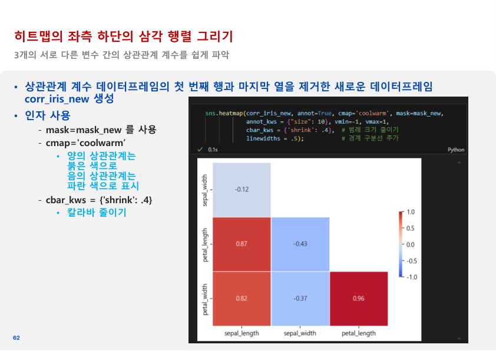

### 히트맵의 좌측 하단의 삼각 행렬 그리기

- 상관관계 계수 데이터프레임의 첫 번째 행과 마지막 열을 제거한 새로운 데이터프레임 corr_iris_new 생성
- 인자 사용
- mask=mask_new 를 사용
- cmap='coolwarm’
- 양의 상관관계는 붉은 색으로 음의 상관관계는파란 색으로 표시
- cbar_kws = {'shrink': .4}
- 칼라바 줄이기
- 3개의 서로 다른 변수 간의 상관관계 계수를 쉽게 파악

---

## Slide 63
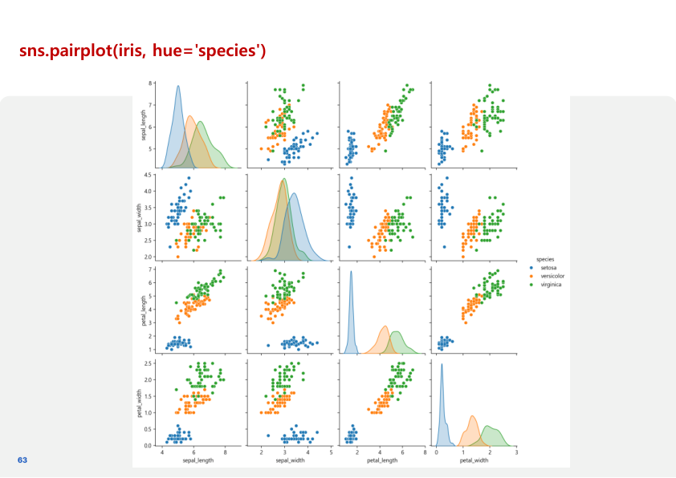

### sns.pairplot(iris, hue='species')

---

## Slide 64
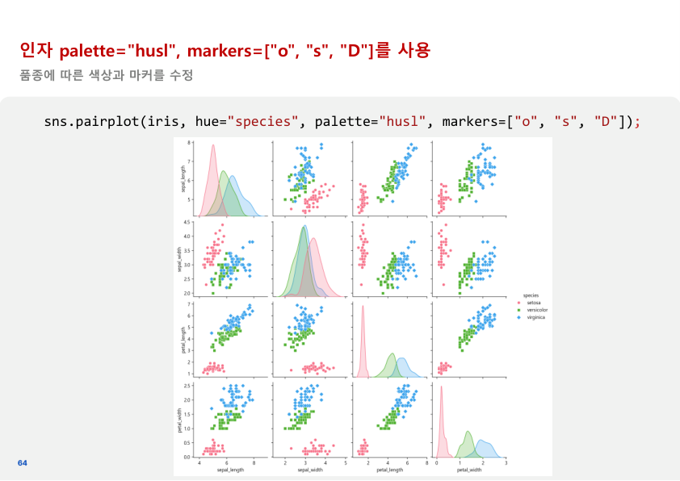

### 인자 palette="husl", markers=["o", "s", "D"]를 사용

- 품종에 따른 색상과 마커를 수정
- sns.pairplot(iris, hue="species", palette="husl", markers=["o", "s", "D"]);

---

## Slide 65
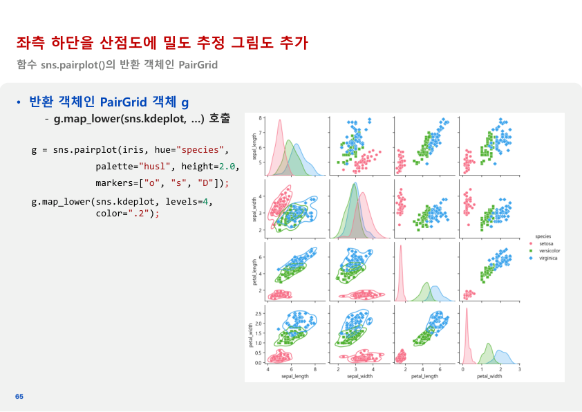

### 좌측 하단을 산점도에 밀도 추정 그림도 추가

- 반환 객체인 PairGrid 객체 g
- g.map_lower(sns.kdeplot, …) 호출
- 함수 sns.pairplot()의 반환 객체인 PairGrid
- g = sns.pairplot(iris, hue="species",
- palette="husl", height=2.0,
- markers=["o", "s", "D"]);
- g.map_lower(sns.kdeplot, levels=4,
- color=".2");

---

