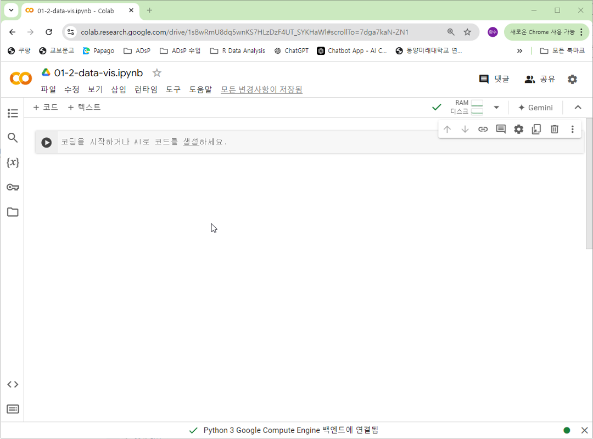
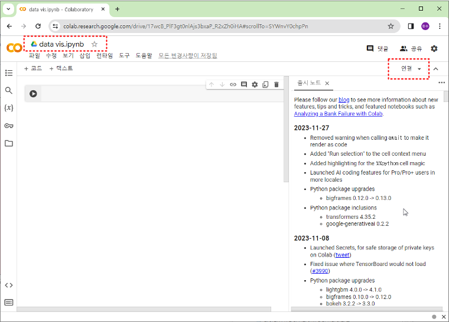

# 1주차 환경설정: Google Colab 가이드

> **학습목표**: 클라우드 기반 분석 환경인 Google Colab의 특징을 이해하고, 기본적인 사용법과 데이터 연동 방법을 익힙니다.

## 1.2.1. Google Colab 완전 정복

> **Google Colab (Colaboratory)**: 구글이 제공하는 클라우드 기반의 주피터 노트북(Jupyter Notebook) 개발 환경입니다. 별도의 설치 없이 브라우저에서 바로 파이썬 코드를 작성하고 실행할 수 있습니다.

### 1.2.1.1. 주요 특징 및 장점 (Key Features)
왜 전 세계 데이터 분석가들이 Colab을 사랑할까요?

1.  **접근성 (Accessibility)**: 인터넷만 되면 어디서든(카페, 학교, 집) 코딩이 가능합니다. 태블릿이나 스마트폰에서도 코드를 확인할 수 있습니다.
2.  **무료 컴퓨팅 자원 (Free GPU/TPU)**:
    - 딥러닝 학습에는 고성능 그래픽 카드(GPU)가 필수적인데, Colab은 이를 무료로 제공합니다.
    - 마치 "고사양 게이밍 PC"를 원격으로 빌려 쓰는 것과 같습니다.
3.  **협업 용이성 (Collaboration)**:
    - 구글 문서를 공유하듯이 동료와 코드를 실시간으로 공유하고 댓글을 남길 수 있습니다.
    - "짝 프로그래밍"에 최적화된 도구입니다.
4.  **라이브러리 사전 설치**:
    - Pandas, Numpy, Matplotlib, Scikit-learn, TensorFlow 등 데이터 분석에 필요한 대부분의 도구가 이미 설치되어 있습니다. `import`만 하면 바로 쓸 수 있죠!

### 1.2.1.2. Colab 시작하기 (Getting Started)
1.  **접속**: [Google Colab](https://colab.research.google.com/) 사이트에 접속합니다. (구글 계정 로그인 필요)
2.  **새 노트 생성**:
    - 우측 하단의 `새 노트(New Notebook)` 버튼을 클릭합니다.
    - 또는 파일 메뉴에서 `파일 > 새 노트`를 선택합니다.

    

3.  **파일 이름 변경**:
    - 좌측 상단의 `Untitled0.ipynb`를 클릭하여 `Week01_Practice.ipynb`로 변경합니다.

    

4.  **런타임 연결**:
    - 우측 상단의 `연결` 버튼을 클릭하여 할당된 자원(RAM, 디스크)을 연결합니다.

    

### 1.2.1.3. 코드 작성 및 실행 (Basic Usage)
Colab은 **셀(Cell)** 단위로 작동합니다. 레고 블록처럼 셀을 쌓아서 프로그램을 만듭니다.


-   **코드 셀 (Code Cell)**:
    -   파이썬 코드를 작성하는 공간입니다.
    -   실행: `Shift + Enter` (실행 후 다음 셀로 이동) 또는 `Ctrl + Enter` (실행 후 제자리).
    -   예시:
        ```python
        print("Hello, Colab!")
        ```
-   **텍스트 셀 (Text Cell)**:
    -   설명, 메모, 이미지를 넣는 공간입니다.
    -   **마크다운(Markdown)** 문법을 지원하여 예쁘게 문서를 꾸밀 수 있습니다. (제목, 리스트, 볼드체 등)

### 1.2.1.4. 파일 업로드 및 데이터 처리
로컬 컴퓨터에 있는 엑셀 파일이나 이미지(csv, xlsx, jpg 등)를 Colab으로 올려서 분석할 수 있습니다.

1.  좌측 사이드바의 **폴더 아이콘(파일)**을 클릭합니다.
2.  **업로드 아이콘**(종이에 위로 화살표)을 클릭하여 파일을 선택하거나, 파일을 드래그 앤 드롭합니다.

    

3.  코드로 불러오기:
    ```python
    import pandas as pd
    
    # 'data.csv' 파일을 업로드했다고 가정
    # df = pd.read_csv('data.csv')
    # print(df.head())
    ```
    > **주의**: 이렇게 업로드한 파일은 런타임이 종료(브라우저 종료 후 일정 시간 경과)되면 **삭제**됩니다. 중요한 데이터는 구글 드라이브에 저장해야 합니다.

### 1.2.1.5. 구글 드라이브 연동 (Google Drive Mount)
데이터를 안전하게 보관하고, 지속적으로 사용하려면 구글 드라이브를 현재 노트북에 "연결(Mount)"해야 합니다.

1.  **방법 1: 아이콘 클릭**
    -   좌측 파일 탭에서 **드라이브 마운트** 아이콘(폴더에 구글 드라이브 로고)을 클릭합니다.
    -   팝업 창에서 권한을 허용합니다.

2.  **방법 2: 코드 실행**
    ```python
    from google.colab import drive
    drive.mount('/content/drive')
    ```
    -   실행하면 `/content/drive/MyDrive/` 경로에 내 구글 드라이브의 모든 파일이 나타납니다.
    -   이제 드라이브에 있는 파일을 불러오거나, 분석 결과를 드라이브에 영구 저장할 수 있습니다.

### 1.2.1.6. 노트북 저장 및 내보내기 (Saving & Exporting)
열심히 짠 코드를 잃어버리면 안 되겠죠?

-   **자동 저장**: 구글 문서처럼 Colab은 작업 내용을 주기적으로 구글 드라이브에 자동 저장합니다. (`파일 > 저장`으로 수동 저장도 가능)
-   **GitHub 사본 저장**:
    -   `파일 > GitHub에 사본 저장`을 선택하면 내 GitHub 리포지토리에 바로 커밋할 수 있습니다. 포트폴리오 관리에 유용합니다.
-   **다운로드**:
    -   `파일 > 다운로드 > .ipynb 다운로드`: 주피터 노트북 파일로 저장 (VS Code 등에서 실행 가능).
    -   `파일 > 다운로드 > .py 다운로드`: 순수 파이썬 스크립트로 저장.
