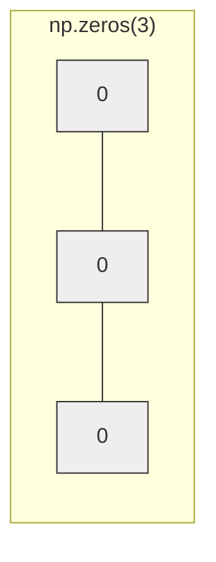
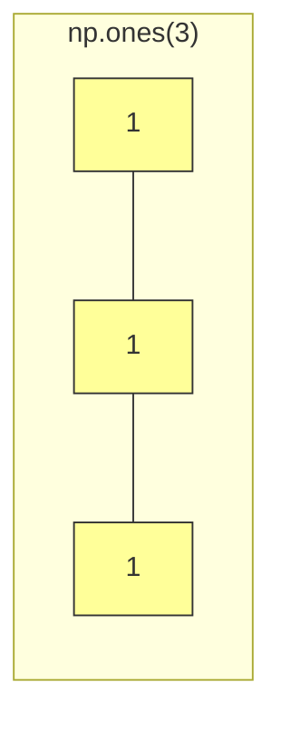
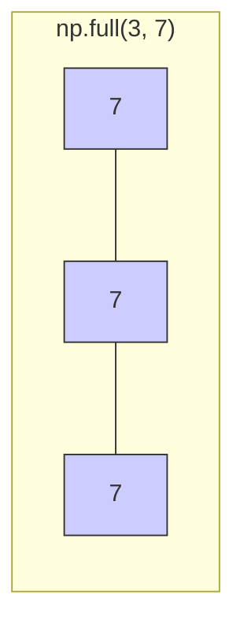

# 3주차 2강: 배열 생성 심화 (Array Creation Deep Dive)

> **학습목표**: 파이썬 리스트를 Numpy 배열로 변환하는 기초부터, `zeros`, `ones`, `arange`, `linspace` 등 다양한 함수를 활용하여 효율적으로 배열을 초기화하는 방법을 마스터합니다.

## 3.2.1. 리스트로 배열 만들기 (From List)

가장 기본적인 방법은 기존의 파이썬 리스트를 넘파이 배열로 변환하는 것입니다.


<br>

---

<br>

### [그림 1] 리스트 vs 넘파이 배열
리스트는 다양한 물건을 담는 **가방**이라면, 넘파이 배열은 규격화된 화물을 싣는 **컨테이너 트럭**입니다.

```python
import numpy as np

# 1. 파이썬 리스트 (아이템 가방)
my_list = [1, 2, 3, 4, 5]

# 2. 넘파이 배열 (화물 트럭 적재)
my_arr = np.array(my_list)

print(my_arr)       # [1 2 3 4 5] (쉼표가 사라짐!)
print(type(my_arr)) # <class 'numpy.ndarray'>
```


<br>

---

<br>

### 3.2.1.1. 넘파이의 핵심: ndarray
`ndarray`는 **N-Dimension Array(N차원 배열)**의 줄임말입니다. 파이썬 리스트와는 근본부터 다릅니다.

*   **동일한 데이터 타입 (Homogeneous)**: 리스트는 숫자, 문자, 객체를 막 섞을 수 있지만, `ndarray`는 오직 **한 종류**만 담아야 합니다. (그래야 계산이 빠릅니다!)
*   **연속된 메모리 배치 (Contiguous Memory)**: 데이터가 메모리에 빈틈없이 붙어있어, CPU가 순식간에 읽어들일 수 있습니다.

> **주의**: 배열에는 **동일한 타입**의 데이터만 들어갈 수 있습니다. 숫자와 문자를 섞으면 모두 문자로 변해버립니다!


<br>

---

<br>

### 3.2.1.2. ndarray의 주요 속성 (Attributes)
배열의 '신상 정보'를 확인하는 필수 속성들입니다.

*   `ndim`: 차원의 수 (Number of Dimensions) -> 1, 2, 3...
*   `shape`: 배열의 모양 (행, 열) -> (2, 3) 등 튜플로 표시
*   `dtype`: 데이터 타입 (Data Type) -> `int64`, `float64`, `<U32` 등

```python
print(my_arr.ndim)   # 1 (1차원)
print(my_arr.shape)  # (5,) (원소 5개짜리 1차원 배열)
print(my_arr.dtype)  # int64 (64비트 정수)
```

> **Q. `<U32`가 뭔가요?**
> *   숫자와 문자가 섞여서 **문자열(String)**로 변했을 때 자주 보이는 타입입니다.
> *   **`<`**: 리틀 엔디안(Little Endian) 방식 (메모리 저장 순서)
> *   **`U`**: 유니코드(Unicode) 문자열
> *   **`32`**: 최대 32글자까지 저장 가능 (가장 긴 문자열 기준)
> *   즉, **"최대 32글자짜리 유니코드 문자열"**이라는 뜻입니다.

<br>

---

<br>

## 3.2.2. 초기화 함수 완전 정복 (Zeros, Ones, Full)

배열을 만들 때 값을 미리 채워서 만들 수도 있습니다. 게임 맵을 초기화하거나, 이미지를 처리할 때 필수적입니다.


### 3.2.2.1. 0으로 채우기: `np.zeros()`
아직 아무것도 없는 빈 땅(초기화된 맵)을 만들 때 가장 많이 사용합니다.


*   **기계학습**: 초기 가중치(Weight)를 0으로 설정할 때
*   **이미지 처리**: 검은색 배경을 만들 때 (0 = 검은색)

```python
# 0으로 채워진 길이 5의 벡터 (Float 타입이 기본)
zero_vector = np.zeros(5)
print(zero_vector)  # [0. 0. 0. 0. 0.]

# 2x3 크기의 행렬 (2행 3열)
zero_matrix = np.zeros((2, 3))
print(zero_matrix)
# [[0. 0. 0.]
#  [0. 0. 0.]]
```


<br>

---

<br>

### 3.2.2.2. 1로 채우기: `np.ones()`
모든 값을 1로 초기화합니다. 곱셈 연산의 항등원(곱해도 값이 변하지 않음)이 필요한 경우 사용합니다.



```python
one_matrix = np.ones((3, 3))
print(one_matrix)
```


<br>

---

<br>

### 3.2.2.3. 특정 값으로 채우기: `np.full()`
원하는 값으로 가득 채웁니다. (예: 기본 경험치 100을 모든 유저에게 부여)



```python
# 4개의 공간에 100을 채움
full_arr = np.full(4, 100)
print(full_arr) # [100 100 100 100]
```

<br>

---

<br>

## 3.2.3. 연속된 값 생성하기 (Arange & Linspace)

규칙적인 수열을 만들 때 사용합니다.

### 3.2.3.1. 범위 지정: `np.arange()`
파이썬의 `range()`와 똑같지만, 결과가 배열(Array)입니다. **간격(Step)**을 소수로 줄 수 있다는 장점이 있습니다.

*   `np.arange(시작, 끝, 간격)` (끝 값은 포함되지 않음!)

```python
# 0부터 10 미만까지 2씩 증가
print(np.arange(0, 10, 2)) 
# [0 2 4 6 8]

# 소수점 간격도 가능!
print(np.arange(0, 1, 0.2)) 
# [0. 0.2 0.4 0.6 0.8]
```


<br>

---

<br>

### 3.2.3.2. 등분하기: `np.linspace()`
시작과 끝을 포함하여, **정해진 개수만큼 균등하게(Linear space)** 나눕니다. 그래프 그릴 때 X축 좌표를 만들 때 필수입니다.

*   `np.linspace(시작, 끝, 개수)`

```python
# 0부터 10까지 정확히 5개로 나누기
print(np.linspace(0, 10, 5))
# [ 0.   2.5  5.   7.5 10. ]
```

> **Q. arange와 linspace의 차이가 뭔가요?**
> *   `arange`: **간격(Step)**이 중요할 때 (예: 2m씩 이동)
> *   `linspace`: **개수(Count)**가 중요할 때 (예: 10초 동안 100장의 프레임 필요)

<br>

---

<br>

## 정리 (Summary)

이 강의에서 배운 핵심 내용을 요약해 봅시다.

*   **[핵심 1]**: `np.array()`로 리스트를 배열로 변환합니다.
*   **[핵심 2]**: `zeros`, `ones`, `full`로 특정 값으로 채워진 배열을 빠르게 만듭니다.
*   **[핵심 3]**: 초기화 함수들을 쓰면 반복문 없이도 거대한 배열을 순식간에 생성할 수 있습니다.
