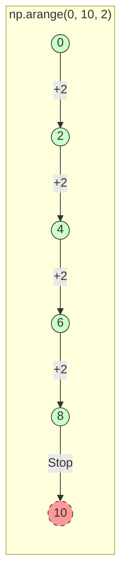
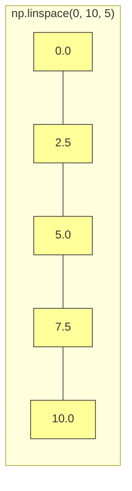
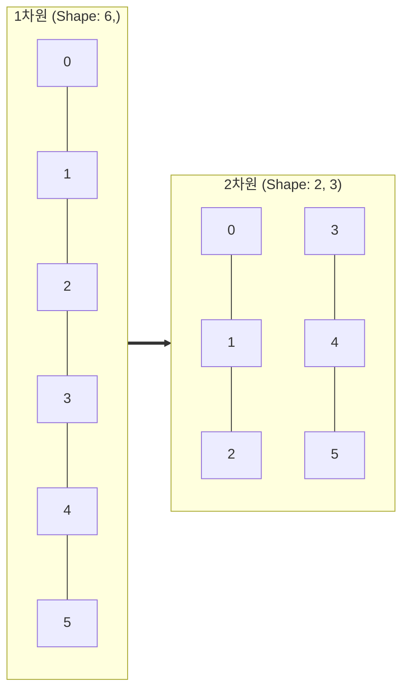

# 3주차 3강: 수열 생성과 모양 변경 (Ranges & Reshape)

> **학습목표**: `arange`와 `linspace`로 데이터를 생성하고, `reshape`를 통해 자유자재로 모양(차원)을 바꾸는 방법을 익힙니다. 이 3가지는 데이터 분석의 가장 기초적인 "삼총사"입니다.

## 3.3.1. 규칙적인 수열: `np.arange()`
**"징검다리 건너기 (Step)"**

시작점에서 도착점 전까지, 정해진 보폭(Step)으로 껑충껑충 뛰어갑니다.


<br>

---

<br>

### [문법] `np.arange(시작, 끝, 보폭)`
*   **시작 (Start)**: 여기서부터 출발!
*   **끝 (Stop)**: 여기까지 가는데, **이 숫자는 포함하지 않아요.** (도착지점 바로 앞에서 멈춤)
*   **보폭 (Step)**: 몇 칸씩 건너뛸까요?


<br>

---

<br>

### [그림 1] 개구리 점프
개구리가 0번 잎에서 시작해서 10번 잎을 향해 2칸씩 뜁니다. (10번에는 도착하지 못해요!)



```python
import numpy as np

# 0부터 9까지 1씩 증가 (기본)
print(np.arange(10))        # [0 1 2 3 4 5 6 7 8 9]

# 1부터 9까지 2씩 건너뛰기
print(np.arange(1, 10, 2))  # [1 3 5 7 9]
```

<br>

---

<br>

## 3.3.2. 구간 나누기: `np.linspace()`
**"케이크 똑같이 자르기 (Count)"**

시작점과 끝점을 포함해서, 원하는 조각 개수만큼 정확하게 나눕니다.

### [문법] `np.linspace(시작, 끝, 개수)`
*   **시작 (Start)**: 케이크 왼쪽 끝
*   **끝 (Stop)**: 케이크 오른쪽 끝 (**포함됩니다!**)
*   **개수 (Count)**: 몇 개의 점으로 나눌까요?


<br>

---

<br>

### [그림 2] 케이크 자르기
0cm부터 10cm까지, 점 5개를 찍어서 등분합니다.



```python
# 0부터 100까지 5등분
print(np.linspace(0, 100, 5))
# [  0.  25.  50.  75. 100.]
```

<br>


> **비교**: `arange`는 보폭(Step)을 정해주고, `linspace`는 개수(Count)를 정해줍니다. 그래프를 그릴 때는 주로 `linspace`를 사용해 X축 데이터를 부드럽게 생성합니다.

### 3.3.2.1. 시각화: 사인 곡선 그리기

`linspace`를 이용해 수학 그래프를 아주 쉽게 그릴 수 있습니다.

```python
import numpy as np
import matplotlib.pyplot as plt

# 0부터 2pi(약 6.28)까지 100개의 점을 찍습니다.
x = np.linspace(0, 2 * np.pi, 100)
y = np.sin(x)

plt.plot(x, y)
plt.title("Sine Wave using linspace")
plt.grid(True)
plt.show()
```

<br>

---

<br>

## 3.3.3. 모양 바꾸기: `reshape()`
**"긴 찰흙 뱀을 반듯한 사각형으로 빚기"**

보통 `arange`로 만든 1줄짜리 긴 배열을, 마트의 계란판처럼 행과 열이 있는 형태로 바꿀 때 사용합니다.

### [규칙] 총 개수는 변하지 않아요!
길이가 12인 찰흙은 `3x4=12` 또는 `2x6=12`로만 만들 수 있습니다. `3x5=15`로는 못 만들어요 (찰흙이 모자라니까요!).


<br>

---

<br>

### [그림 3] 1줄 서기 -> 2줄 서기
0부터 5까지 한 줄로 서있던 숫자들이, 2줄 3칸 대형으로 다시 섭니다.



```python
# 1. 0부터 11까지 숫자를 만듭니다 (총 12개)
arr = np.arange(12)
print(arr)
# [ 0  1  2  3  4  5  6  7  8  9 10 11]

# 2. 3행 4열로 모양을 바꿉니다 (3 x 4 = 12 OK!)
matrix = arr.reshape(3, 4)
print(matrix)
# [[ 0  1  2  3]
#  [ 4  5  6  7]
#  [ 8  9 10 11]]

# 3. 꿀팁: -1을 쓰면 자동 계산!
# "행은 네가 알아서 계산하고(-1), 열은 4개로 맞춰줘"
auto_matrix = arr.reshape(-1, 4) 
# 결과는 위와 똑같이 (3, 4)가 됩니다.
```

> **요약**:
> 1.  `arange`: **몇 칸씩** 갈래? (Step)
> 2.  `linspace`: **몇 개로** 나눌래? (Count)
> 3.  `reshape`: **모양**을 바꿔줘! (단, 개수는 맞아야 함)

<br>

---

<br>

## 정리 (Summary)

이 강의에서 배운 핵심 내용을 요약해 봅시다.

*   **[핵심 1]**: `arange`는 **보폭(Step)**을 지정해 수열을 만들고, `linspace`는 **개수(Count)**를 지정해 균등하게 나눕니다.
*   **[핵심 2]**: `reshape`는 데이터의 총 개수를 유지하면서 **차원과 모양**을 바꿉니다.
*   **[핵심 3]**: `-1`을 활용하면 나머지 차원을 자동으로 계산해주어 편리합니다.
