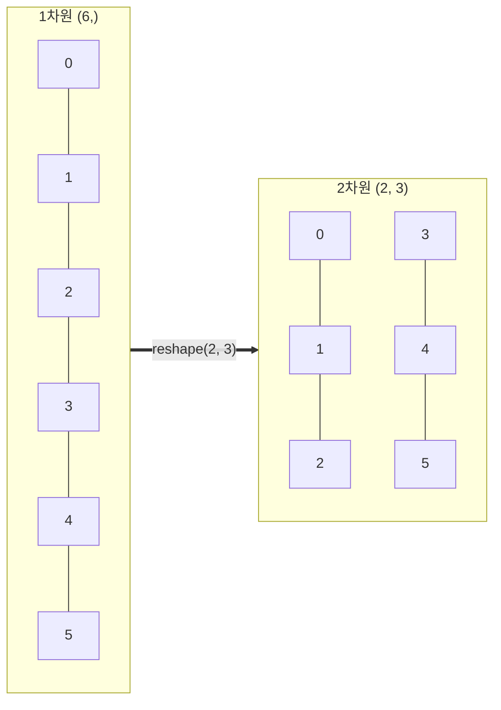
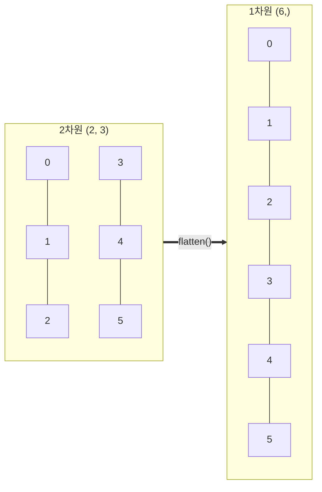

# 4주차 1강: 모양 바꾸기 (Reshape & Flatten)

> **학습목표**: 데이터의 개수(Size)는 유지하면서, 차원과 모양(Shape)을 자유자재로 바꾸는 `reshape`와 `flatten`을 마스터합니다.

## 4.1.1. 헤쳐모여! 모양 바꾸기 (`reshape`)

데이터의 순서는 그대로 둔 채, 줄 세우는 방식만 바꿉니다. 1열 횡대로 서 있는 군인들을 3열 명령에 맞춰 다시 세우는 것과 같습니다.


<br>

---

<br>

### [그림 1] 1차원 -> 2차원 변환
길이가 6인 1차원 배열을 2행 3열의 2차원 행렬로 변환합니다.



```python
import numpy as np

# 0부터 11까지 (총 12개)
arr = np.arange(12)
print("기본:", arr)

# 3행 4열로 변신! (3 x 4 = 12)
grid = arr.reshape(3, 4)
print("3x4 행렬:\n", grid)
```

> **주의**: 바꿀 모양의 **총 원소 개수**가 원본과 똑같아야 합니다! (12개를 3x5=15 모양으로 바꿀 순 없어요)

<br>

---

<br>

## 4.1.2. 마법의 숫자 `-1` (Auto Calculate)

"4열로 서라. 몇 줄이 될지는 알아서 계산해!"

행이나 열 중 하나를 `-1`로 지정하면, 남은 차원의 크기를 컴퓨터가 **자동으로 계산**해줍니다. 귀찮은 나눗셈을 안 해도 됩니다.

```python
# 전체 12개인데, 4열로 맞추고 싶어. 행은 네가 알아서 계산해(-1).
auto_grid = arr.reshape(-1, 4)
print(auto_grid.shape) 
# (3, 4) -> 12 / 4 = 3행이 자동으로 계산됨!
```

| 코드             | 의미                         |
| :--------------- | :--------------------------- |
| `reshape(3, 4)`  | 3행 4열로 만들어라 (명시적)  |
| `reshape(-1, 4)` | 4열로 만들어라 (행은 자동)   |
| `reshape(3, -1)` | 3행으로 만들어라 (열은 자동) |

<br>

---

<br>

## 4.1.3. 납작하게 펴기 (`flatten`)

다차원 입체 행렬을 다시 1차원 평면으로 쭉 폅니다. **딥러닝**에서 이미지 데이터를 1줄로 입력할 때 필수적으로 사용됩니다.

### [그림 2] 2차원 -> 1차원 변환
2행 3열 행렬을 다시 길이 6의 1차원 배열로 폅니다.



```python
# 3x4 행렬을 다시 1줄로
flat_arr = grid.flatten()
print("다시 1줄로:", flat_arr)
# [ 0  1  2  3  4  5  6  7  8  9 10 11]
```

<br>

---

<br>

## 정리 (Summary)

이 강의에서 배운 핵심 내용을 요약해 봅시다.

*   **[핵심 1]**: `reshape(행, 열)`은 데이터의 개수를 유지한 채 **모양(차원)**만 바꿉니다.
*   **[핵심 2]**: `-1`을 사용하면 남은 차원의 크기를 **자동으로 계산**해 줍니다. (치트키)
*   **[핵심 3]**: `flatten()`은 다차원 배열을 **1차원**으로 쭉 펴줍니다.
