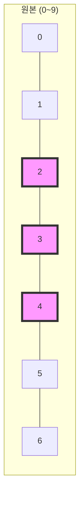
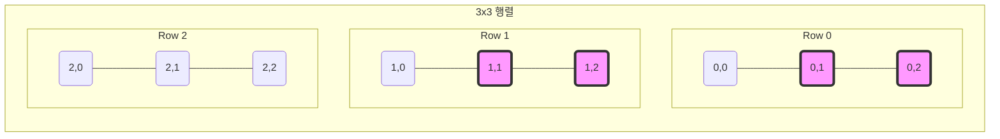

# 4주차 5강: 데이터 자르기 (Slicing)

> **학습목표**: 거대한 데이터셋에서 내가 원하는 부분만 쏙쏙 골라내는 슬라이싱(Slicing) 기술을 익힙니다. 1차원 리스트부터 2차원 행렬까지 자유자재로 다뤄봅시다.

## 4.2.1. 1차원 자르기 (Slicing 1D)

**"김밥 썰기"**

긴 김밥(1차원 배열)에서 원하는 구간을 칼로 자릅니다.
문법은 `[시작:끝]`입니다. (**끝 인덱스는 포함되지 않음**)


<br>

---

<br>

### [그림 1] 인덱스 2부터 5 전까지 자르기 `[2:5]`
2번, 3번, 4번 칸만 가져옵니다.



```python
import numpy as np

arr = np.arange(10) # [0, 1, 2, 3, 4, 5, 6, 7, 8, 9]

# 2번부터 5번 전까지 (2, 3, 4)
slice_arr = arr[2:5]
print(slice_arr) # [2 3 4]

# 처음부터 3번 전까지 (0, 1, 2)
head = arr[:3]

# 7번부터 끝까지 (7, 8, 9)
tail = arr[7:]
```

<br>

---

<br>

## 4.2.2. 2차원 자르기 (Slicing 2D)

**"색종이 오리기"**

행(가로)과 열(세로)을 동시에 잘라서, 사각형 모양의 조각을 떼어냅니다.
문법은 `[행 범위, 열 범위]` (콤마로 구분) 입니다.


<br>

---

<br>

### [그림 2] 부분 행렬 추출하기 `[0:2, 1:3]`
*   **행**: 0행부터 2행 전까지 (0, 1행)
*   **열**: 1열부터 3열 전까지 (1, 2열)



```python
matrix = np.array([
    [1, 2, 3],
    [4, 5, 6],
    [7, 8, 9]
])

# 행: 0~1, 열: 1~2
sub_matrix = matrix[0:2, 1:3]
print(sub_matrix)
# [[2 3]
#  [5 6]]
```


<br>

---

<br>

### 4.2.2.1. 실전 꿀팁: 문제집(X)과 정답지(y) 나누기

머신러닝 데이터를 준비할 때 가장 많이 쓰는 패턴입니다. 보통 엑셀 파일의 **마지막 열**이 정답(결과)인 경우가 많습니다.

```python
# 전체 데이터 (5행 4열이라고 가정)
data = np.random.rand(5, 4)

# 1. 문제집(X): 마지막 열 빼고 전부 다
X = data[:, :-1] 

# 2. 정답지(y): 마지막 열만 딱 하나
y = data[:, -1]
```

<br>


> **Tip**: -1은 "맨 뒤"를 의미하고, `:-1`은 "처음부터 맨 뒤 하나 전까지"를 의미합니다.

### 4.2.2.2. 시각화: 이미지 자르기 (Image Cropping)

이미지는 숫자로 이루어진 행렬입니다. 슬라이싱을 이용해 이미지의 일부분만 잘라낼 수 있습니다.
(여기서는 간단한 10x10 랜덤 이미지를 사용합니다)

```python
import numpy as np
import matplotlib.pyplot as plt

# 1. 10x10 픽셀의 랜덤 이미지 생성 (0~1 사이 값)
image = np.random.rand(10, 10)

# 2. 이미지의 가운데 부분(행 3~7, 열 3~7)만 잘라내기
cropped = image[3:7, 3:7]

# 3. 시각화
plt.figure(figsize=(10, 5))

plt.subplot(1, 2, 1) # 1행 2열 중 첫 번째
plt.imshow(image, cmap='gray')
plt.title("Original Image (10x10)")

plt.subplot(1, 2, 2) # 1행 2열 중 두 번째
plt.imshow(cropped, cmap='gray')
plt.title("Cropped Image (4x4)")

plt.show()
```
*   `plt.imshow()`: 행렬을 색깔이 있는 이미지로 보여줍니다.
*   `cmap='gray'`: 흑백 이미지로 표시합니다.

<br>

---

<br>

## 정리 (Summary)

이 강의에서 배운 핵심 내용을 요약해 봅시다.

*   **[핵심 1]**: 슬라이싱 `[시작:끝]`을 사용하면 원하는 구간의 데이터를 **복사하지 않고** 가져옵니다(View).
*   **[핵심 2]**: 2차원 배열은 `[행 범위, 열 범위]`로 직사각형 영역을 잘라낼 수 있습니다.
*   **[핵심 3]**: `:-1` 등의 문법을 활용하여 **문제집(Data)과 정답지(Label)**를 쉽게 분리할 수 있습니다.
