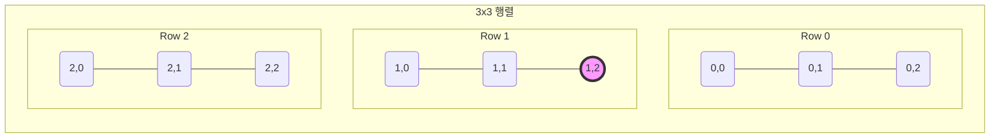
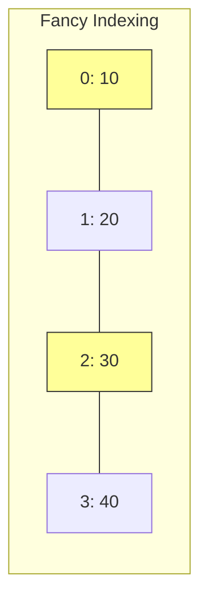

# 4주차 6강: 데이터 콕 집기 (Indexing)

> **학습목표**: 거대한 데이터 행렬 속에서 내가 원하는 **특정 위치**의 값을 정확하게 찾아내는 인덱싱(Indexing) 기술을 배웁니다.

## 4.3.1. 2차원 배열 인덱싱 (2D Coordinates)

**"아파트 호수 찾기"**

엑셀 시트나 행렬에서 특정 값을 가져오려면 **행(Row)**과 **열(Column)**의 좌표가 필요합니다.
문법은 `[행, 열]`입니다. (콤마로 구분)


<br>

---

<br>

### [그림 1] 1행 2열 값 찾기 `[1, 2]`
1번 행(2번째 줄)의 2번 열(3번째 칸) 값을 콕 집어냅니다.



```python
import numpy as np

apt = np.array([
    [101, 102, 103],
    [201, 202, 203],
    [301, 302, 303]
])

# 1행 2열 (203호)
target = apt[1, 2]
print("타겟:", target) # 203
```

<br>

---

<br>

## 4.3.2. 마이너스 인덱싱 (Negative Indexing)

**"뒤에서부터 세기"**

파이썬과 넘파이의 강력한 점은 끝에서부터 셀 수 있다는 것입니다.
*   `-1`: 맨 마지막
*   `-2`: 뒤에서 두 번째

```python
# 가장 마지막 행(-1)의, 가장 마지막 열(-1) => 303호
penthouse = apt[-1, -1]
print("펜트하우스:", penthouse) # 303
```

<br>

---

<br>

## 4.3.3. 팬시 인덱싱 (Fancy Indexing)

**"원하는 것만 쏙쏙 골라 담기"**

연속되지 않은 여러 개의 데이터를 동시에 가져오고 싶을 때 사용합니다.
대괄호 안에 **리스트(List)**를 넣어서 전달합니다.


<br>

---

<br>

### [그림 2] 불연속적인 데이터 선택 `[[0, 2]]`
0번(첫 번째)과 2번(세 번째) 데이터만 골라서 가져옵니다.



```python
arr = np.array([10, 20, 30, 40, 50])

# 0번과 2번 인덱스만 (10, 30)
indices = [0, 2]
picked = arr[indices]

print(picked) # [10 30]
```

> **활용**: 추천 시스템에서 유저가 좋아한 상품 ID 목록만 쏙 뽑아낼 때 유용합니다!

<br>

---

<br>

## 정리 (Summary)

이 강의에서 배운 핵심 내용을 요약해 봅시다.

*   **[핵심 1]**: 인덱싱 `[행, 열]`은 특정 좌표의 값을 **콕 집어서** 가져옵니다.
*   **[핵심 2]**: 마이너스 인덱스 `-1`은 **맨 뒤**에서부터 순서를 셉니다.
*   **[핵심 3]**: 인덱싱은 추출된 **값 자체**를 반환하며, 원본과 연결이 끊어진(Copy) 경우가 많습니다.
