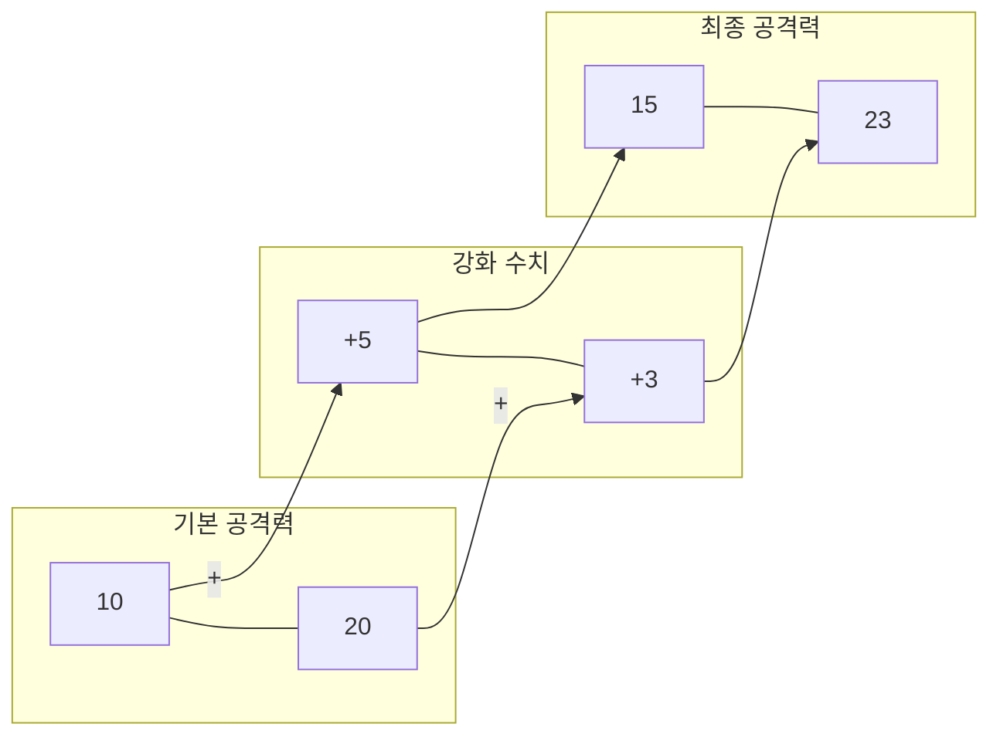

# 5주차 1강: 배열끼리의 연산 (Element-wise)

> **학습목표**: 반복문(for) 없이도 배열끼리 덧셈, 뺄셈, 곱셈, 나눗셈을 순식간에 처리하는 '요소별 연산'을 마스터합니다.


## 5.1.0. 왜 배열 연산을 쓰나요? (Why Array Operations?)

"그냥 `for` 반복문 돌리면 안 되나요?"

물론 됩니다. 하지만 데이터가 1만 개, 100만 개로 늘어나면 **속도 차이가 엄청납니다.**


<br>

---

<br>

### [비유] 가내수공업 vs 스마트 공장
*   **반복문 (Python List)**: 장인이 한 땀 한 땀 바느질함. (느리고 정교함)
*   **배열 연산 (Numpy Array)**: 공장 기계가 한 번에 `쿵!` 찍어냄. (엄청나게 빠르고 효율적)


<br>

---

<br>

### 배열 연산의 3가지 장점
1.  **압도적인 속도**: C언어로 만들어져 있어서, 파이썬 반복문보다 최대 **100배** 이상 빠릅니다.
2.  **간결한 코드**: `for i in range(len(data)): ...` 같은 복잡한 코드가 필요 없습니다.
3.  **수학적 표현**: `A + B`처럼 수식 그대로 코드로 옮길 수 있어 읽기 쉽습니다.

<br>

---

<br>

## 5.1.1. 끼리끼리 계산하기 (Element-wise)

Numpy의 가장 큰 특징은 **같은 위치에 있는 값끼리** 자동으로 연산된다는 점입니다. 이를 **Element-wise Operation**이라고 합니다.

### [그림 1] 용사의 공격력 강화
두 명의 용사가 각자 무기를 강화했습니다.
*   용사 A: 기본 10 + 강화 5
*   용사 B: 기본 20 + 강화 3



```python
import numpy as np

# 1. 기본 공격력
base_power = np.array([10, 20])

# 2. 강화 수치
bonus_power = np.array([5, 3])

# 3. 최종 공격력 (같은 위치끼리 더해짐)
total_power = base_power + bonus_power

print(total_power)
# [15 23]
```

> **장점**: 데이터가 100만 개라도 `for` 반복문 없이 `A + B` 한 줄이면 끝납니다. (C언어로 최적화되어 있어 속도가 엄청나게 빠릅니다!)

<br>

---

<br>

## 5.1.2. 사칙연산 (Arithmetic)

덧셈뿐만 아니라 뺄셈, 곱셈, 나눗셈도 모두 위치별로 적용됩니다.

```python
arr1 = np.array([10, 20, 30])
arr2 = np.array([2, 4, 5])

# 뺄셈 (데미지 감소)
print(arr1 - arr2) # [ 8 16 25]

# 곱셈 (공격력 2배 버프)
print(arr1 * arr2) # [20 80 150]

# 나눗셈 (공평하게 나누기)
print(arr1 / arr2) # [ 5.  5.  6.]
```

> **주의**: 기본적으로 두 배열의 **크기(Shape)가 같아야** 합니다.
> *   `[10, 20]` + `[1, 2, 3]` -> **에러 발생!** (짝이 안 맞음)
> *   단, 크기가 달라도 연산이 되는 경우가 있는데, 이를 **브로드캐스팅**이라고 합니다. (다음 강의에서 계속!)

<br>

---

<br>

## 정리 (Summary)

이 강의에서 배운 핵심 내용을 요약해 봅시다.

*   **[핵심 1]**: **벡터화 연산(Vectorization)** 덕분에 반복문 없이도 배열끼리 빠르게 계산됩니다.
*   **[핵심 2]**: **요소별 연산(Element-wise)**은 같은 위치에 있는 값끼리 1:1로 계산하는 방식입니다.
*   **[핵심 3]**: 유니버설 함수(ufunc)인 `add`, `sub`, `mul`, `div` 등을 사용하면 더 명시적입니다.
