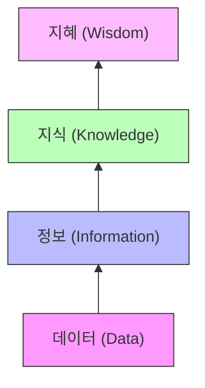

# 1주차 1강: 데이터 분석이란?

> **학습목표**: 데이터 분석의 정의와 필요성을 이해하고, DIKW 피라미드와 다양한 데이터 유형(정량/정성, 정형/비정형)을 구분할 수 있습니다.

## 1.1.1. 데이터 분석이란 무엇인가? (Why Data Analysis?)

> **데이터 분석(Data Analysis)**: 원석 같은 데이터를 가공하여 보석 같은 **통찰력(Insight)**을 발견하는 과정입니다.

우리가 살고 있는 세상은 데이터로 가득 차 있습니다. 여러분이 유튜브에서 영상을 볼 때, 인스타그램에서 '좋아요'를 누를 때, 편의점에서 물건을 살 때마다 데이터가 생성됩니다.

### 1.1.1.1. 데이터, 정보, 지식, 지혜 (DIKW 피라미드)
데이터가 가치를 가지려면 **가공**되어야 합니다. 이를 설명하는 모델이 **DIKW 피라미드**입니다.

1.  **데이터 (Data)**: 가공되지 않은 순수한 수치나 사실.
    -   *예시: 온라인 노트북 가격 100만 원, 오프라인 매장 가격 150만 원.*
2.  **정보 (Information)**: 데이터를 가공하여 의미를 부여한 것.
    -   *예시: 온라인 쇼핑몰이 오프라인 매장보다 노트북 가격이 더 저렴하다.*
3.  **지식 (Knowledge)**: 정보를 구조화하고 경험과 결합하여 내재화한 것.
    -   *예시: 나는 노트북을 온라인에서 구매할 것이다. (더 저렴하니까)*
4.  **지혜 (Wisdom)**: 지식을 바탕으로 도출한 창의적 아이디어이자 통찰력.
    -   *예시: 다른 전자제품들도 온라인 쇼핑이 오프라인보다 저렴할 것이다.*

### 1.1.1.2. 데이터의 유형 (Types of Data)
데이터는 그 형태와 성격에 따라 다음과 같이 나눌 수 있습니다.

| 구분     | 정량적 데이터 (Quantitative) | 정성적 데이터 (Qualitative)      |
| :------- | :--------------------------- | :------------------------------- |
| **형태** | 수치, 도형, 기호             | 문자, 언어, 설명                 |
| **특징** | 객관적, 계산 가능            | 주관적, 함축적 의미              |
| **예시** | 온도, 몸무게, 주가, 나이     | 영화 리뷰, 뉴스 기사, SNS 게시글 |

또한, 저장 형태에 따라 다음과 같이 분류합니다.

1.  **정형 데이터 (Structured)**: 엑셀이나 데이터베이스(DB)처럼 고정된 틀(행과 열)에 저장된 데이터. (연산 가능)
2.  **반정형 데이터 (Semi-structured)**: 형태는 있지만 연산이 불가능한 데이터. (HTML, XML, JSON 로그 등)
3.  **비정형 데이터 (Unstructured)**: 형태가 없고 구조화되지 않은 데이터. (텍스트, 이미지, 음성, 동영상 등)
    > **빅데이터 시대**에는 비정형 데이터의 비중이 급격히 늘어나고 있으며, 이를 분석하는 기술(AI, 텍스트 마이닝)이 중요해지고 있습니다.

### 1.1.1.3. 왜 데이터 분석이 필요한가요?
게임에서 보스 몬스터를 잡으러 간다고 상상해 봅시다.
- **데이터가 없는 경우**: 아무 정보 없이 맨몸으로 돌진합니다. (승률 희박 📉)
- **데이터가 있는 경우**: 보스의 약점 속성, 패턴, 체력 수치를 알고 공략합니다. (승률 상승 📈)

이처럼 데이터 분석은 **불확실한 미래를 예측하고, 더 나은 의사결정을 내리기 위한 나침반** 역할을 합니다.

이러한 데이터 분석방법에 대하여 파이썬 코드를 통하여 학습해 보도록 하겠습니다.
