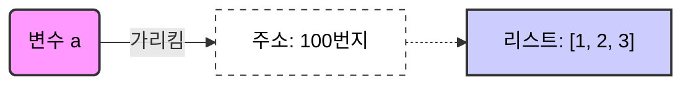
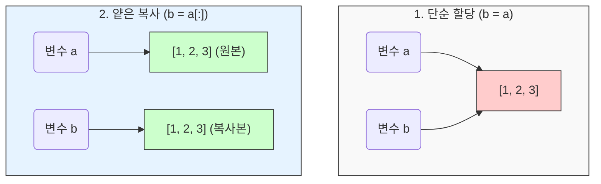
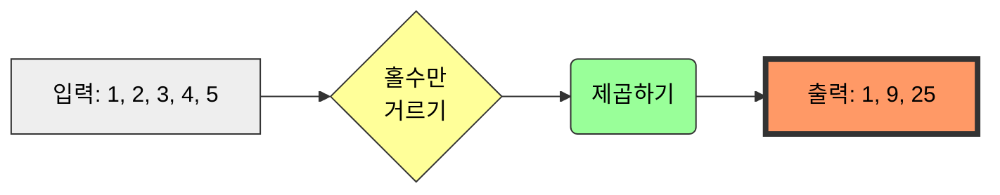
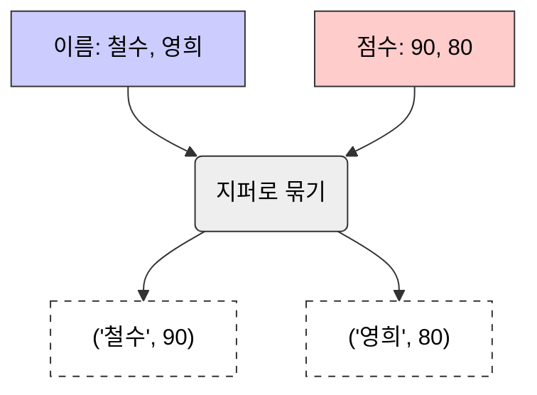
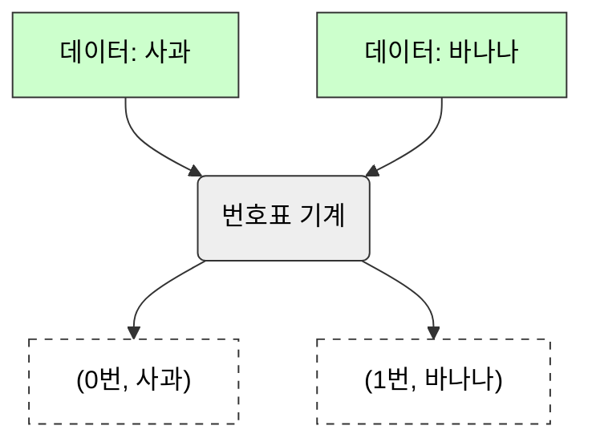

# 3주차 1강: 파이썬 리스트 심화 (Python List Deep Dive)

> **학습목표**: 파이썬 리스트의 메모리 구조를 이해하고, 효율적인 데이터 처리를 위한 고급 기능(List Comprehension, zip, enumerate)을 마스터합니다.

## 3.1.1. 리스트의 본질: 참조주소의 배열 (Array of References)

파이썬 리스트는 단순히 값을 담는 상자가 아닙니다. 값들이 저장된 **메모리 주소(Reference)**를 담고 있는 주소록과 같습니다.


<br>

---

<br>

### [그림 1] 변수와 리스트의 관계
변수 `a`는 `[1, 2, 3]`이라는 리스트가 어디에 있는지 알려주는 **이정표(메모리 주소)**만 가지고 있습니다.



**설명**:
*   우리가 `a = [1, 2, 3]`이라고 쓰면, 컴퓨터는 메모리 어딘가(예: 100번지)에 `[1, 2, 3]`을 저장합니다.
*   변수 `a`는 그 **100번지라는 주소**만 기억합니다.
*   만약 `b = a`라고 하면, `b`도 똑같이 **100번지**를 가리키게 됩니다. (값이 복사되는 게 아니라 주소만 복사됨!)

<br>

---

<br>

### [그림 2] 할당(Assignment) vs 복사(Copy)
리스트를 단순히 대입하면 **주소만** 복사됩니다(같은 방을 씀). 진짜 별개의 복사본을 만들려면 슬라이싱 `[:]`이나 `copy()`를 써야 합니다.




<br>

---

<br>

### 3.1.1.1. 코드 예시
리스트를 다른 변수에 할당할 때 주의해야 합니다.

```python
a = [1, 2, 3]
b = a        # 주소만 복사됨 (같은 객체를 가리킴)
b[0] = 99

print(a) # [99, 2, 3] -> 원본도 같이 바뀝니다! 😱
```

**해결책**: 슬라이싱 `[:]`이나 `copy()` 메서드를 사용하세요.
```python
b = a[:]     # 새로운 리스트로 복제 (얕은 복사)
```

<br>

---

<br>

## 3.1.2. 필수 메서드 완전 정복 (Methods)

데이터 분석 전처리에 자주 쓰이는 메서드들입니다.

| 메서드         | 설명          | 예시                | 비고                            |
| :------------- | :------------ | :------------------ | :------------------------------ |
| `append(x)`    | 끝에 추가     | `ls.append(4)`      | 가장 빠름 (O(1))                |
| `extend(iter)` | 리스트 합치기 | `ls.extend([5, 6])` | `+` 연산과 유사                 |
| `insert(i, x)` | 중간에 삽입   | `ls.insert(1, 'A')` | 느림 (뒤의 요소 밀림, O(N))     |
| `pop(i)`       | 꺼내고 삭제   | `value = ls.pop()`  | 스택(Stack) 구조 구현 시 사용   |
| `remove(x)`    | 값으로 삭제   | `ls.remove('A')`    | 앞에서부터 첫 번째 찾은 값 삭제 |
| `sort()`       | 정렬          | `ls.sort()`         | 원본 자체를 변경 (In-place)     |

<br>

---

<br>

### 3.1.2.1. 메서드 실습 코드

```python
# 1. 리스트 생성
hero = ['아이언맨', '토르']

# 2. 추가 (append)
hero.append('헐크')
print(hero) 
# ['아이언맨', '토르', '헐크']

# 3. 확장 (extend) - 리스트를 붙이기
hero.extend(['블랙위도우', '호크아이'])
print(hero) 
# ['아이언맨', '토르', '헐크', '블랙위도우', '호크아이']

# 4. 삽입 (insert) - 원하는 위치에
hero.insert(0, '스파이더맨') # 0번(맨 앞)에 삽입
print(hero)
# ['스파이더맨', '아이언맨', '토르', '헐크', '블랙위도우', '호크아이']

# 5. 삭제 (remove) - 값으로 찾아서
hero.remove('토르')
print(hero)
# ['스파이더맨', '아이언맨', '헐크', '블랙위도우', '호크아이']

# 6. 꺼내기 (pop) - 맨 뒤에서
last = hero.pop()
print(f"방출된 영웅: {last}") # 호크아이
print(hero)
# ['스파이더맨', '아이언맨', '헐크', '블랙위도우']

# 7. 정렬 (sort)
hero.sort()
print(hero) # 가나다 순 정렬
# ['블랙위도우', '스파이더맨', '아이언맨', '헐크']
```

<br>

---

<br>

## 3.1.3. 파이썬의 꽃: 리스트 컴프리헨션 (List Comprehension)

반복문(for)을 아주 짧고 우아하게 줄여쓰는 파이썬만의 문법입니다. **데이터 전처리 속도**도 일반 반복문보다 빠릅니다.

### [그림 2] 리스트 컴프리헨션의 원리
마치 공장에서 재료를 넣으면 자동으로 가공되어 나오는 컨베이어 벨트와 같습니다.




<br>

---

<br>

### 기본 문법
`[표현식 for 항목 in 반복가능객체 if 조건]`

```python
# 1. 일반적인 반복문 (느리고 깁니다)
numbers = [1, 2, 3, 4, 5]
squares = []
for n in numbers:
    if n % 2 == 1: # 홀수라면
        squares.append(n ** 2)

# 2. 리스트 컴프리헨션 (빠르고 짧습니다!)
squares = [n ** 2 for n in numbers if n % 2 == 1]
print(squares) # [1, 9, 25]
```
> **Tip**: 처음에는 낯설지만, 익숙해지면 가장 강력한 무기가 됩니다. Numpy로 넘어가기 전 필수 코스입니다.

<br>

---

<br>

## 3.1.4. 유용한 내장 함수 (zip & enumerate)

### 3.1.4.1. zip(): 지퍼처럼 잠그기
여러 개의 리스트를 순서대로 하나씩 짝지어서 묶어줍니다.

### [그림 3] zip() 함수의 동작
두 개의 리스트가 지퍼처럼 맞물려 하나의 쌍(Tuple)이 됩니다.



```python
names = ['철수', '영희']
scores = [90, 80]

for name, score in zip(names, scores):
    print(f"{name}: {score}")
```


<br>

---

<br>

### 3.1.4.2. enumerate(): 번호표 붙이기

리스트의 값만 꺼내는 것이 아니라, 그 값이 **몇 번째인지(인덱스)**도 같이 알려줍니다.

### [그림 4] enumerate() 함수의 동작
은행 번호표처럼 데이터에 순서대로 번호를 붙여서 내보냅니다.



```python
fruits = ['사과', '바나나']

for i, fruit in enumerate(fruits):
    print(f"{i}번 과일: {fruit}")
# 0번 과일: 사과
# 1번 과일: 바나나 ...
```

<br>

---

<br>

## 정리 (Summary)

이 강의에서 배운 핵심 내용을 요약해 봅시다.

*   **[핵심 1]**: 리스트는 **수정 가능(Mutable)**하고 순서가 있는 데이터 모음입니다.
*   **[핵심 2]**: 메모리 주소를 **참조(Reference)**하므로, 복사할 때 주의해야 합니다. (얕은 복사 vs 깊은 복사)
*   **[핵심 3]**: **리스트 컴프리헨션(List Comprehension)**을 쓰면 코드가 간결하고 빨라집니다.
