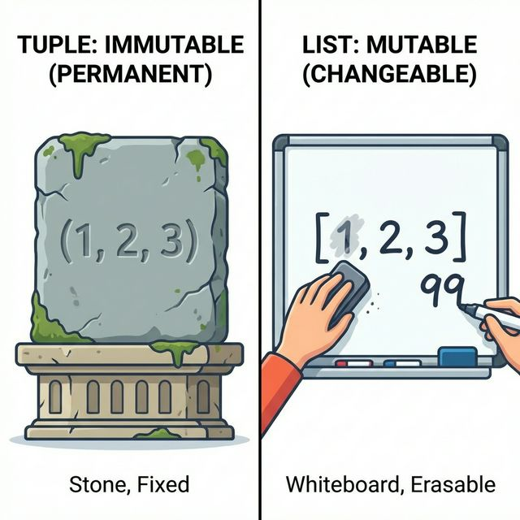
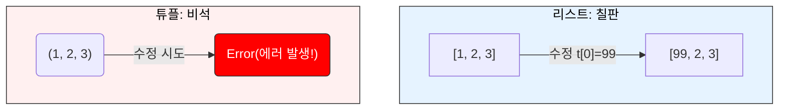
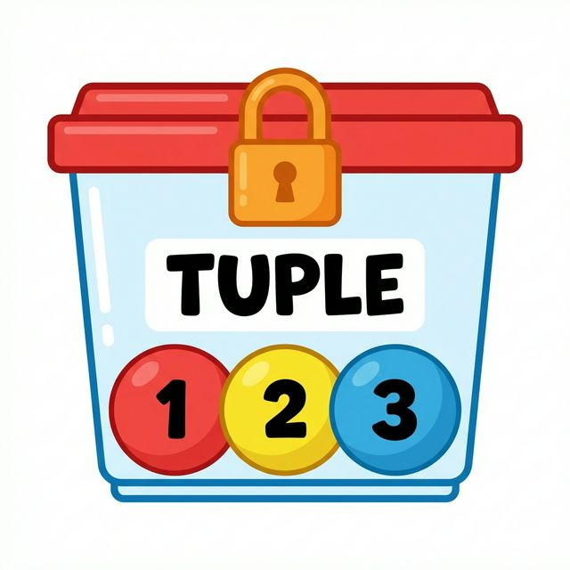
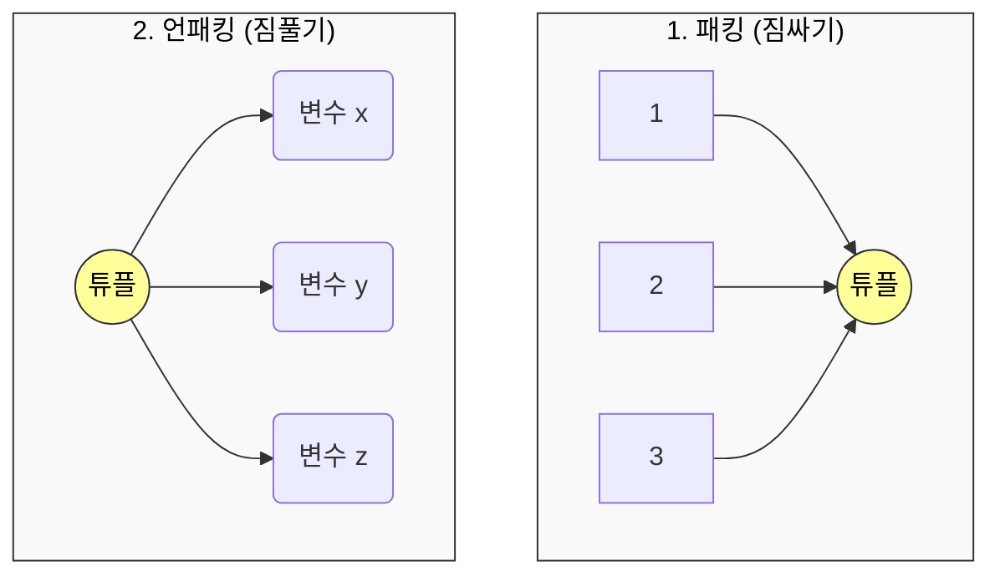
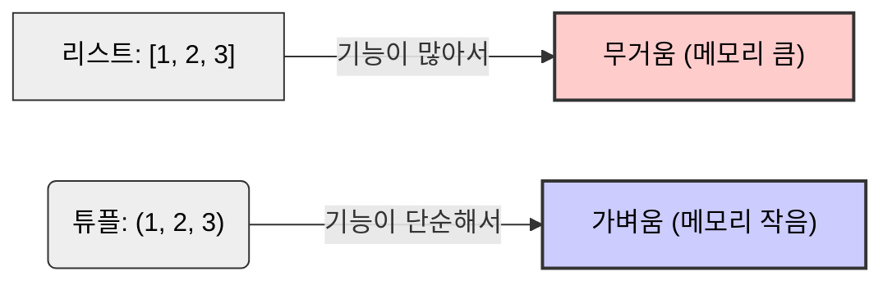

# 3주차 2강: 파이썬 튜플 심화 (Python Tuple Deep Dive)

> **학습목표**: 튜플의 불변성(Immutability)이 왜 중요한지 이해하고, 패킹과 언패킹을 활용하여 코드를 간결하게 작성하는 방법을 배웁니다.

## 3.2.1. 튜플의 특징: 절대 변하지 않는 약속 (Immutable)

튜플은 리스트와 비슷해 보이지만, **한 번 생성하면 수정할 수 없다**는 가장 큰 차이점이 있습니다.


<br>

---

<br>

### [그림 1] 리스트 vs 튜플의 차이
리스트는 자유롭게 내용을 바꿀 수 있는 **칠판**이라면, 튜플은 한 번 새기면 바꿀 수 없는 **비석**과 같습니다.





<br>

---

<br>

### 3.2.1.1. 불변성 (Immutability)이란?
'불변성'은 값이 변하지 않는다는 뜻입니다. 튜플은 생성되는 순간 그 안의 내용물이 고정되어 버립니다.

*   **읽기 전용 (Read Only)**: 값을 읽을 수는 있지만(`print(t[0])`), 수정하거나 삭제할 수는 없습니다.
*   **안전 장치**: 실수로 데이터가 변경되는 것을 막아줍니다.

```python
t = (1, 2, 3)
print(t[0]) # 1 (읽기는 가능)

# t[0] = 99 
# TypeError: 'tuple' object does not support item assignment (수정 불가능!)
```

<br>

---

<br>

### 3.2.1.2. 다른 언어의 상수(Constant)와 비교

*   **C/Java의 상수**: 변수 하나(`const int a = 10`)를 못 바꾸게 잠급니다.
*   **파이썬의 튜플**: 여러 개의 값을 묶어둔 **'데이터 보관함' 자체를 잠그는 것**과 같습니다.

### [그림 2] C/Java의 상수: 1개만 잠금
변수 상자에 자물쇠가 걸려있어 값을 바꿀 수 없습니다.


<br>

---

<br>

### [그림 3] 파이썬 튜플: 보관함을 잠금
변수는 자유롭지만, **데이터가 들어있는 상자(튜플)**가 잠겨있어 내용물을 바꿀 수 없습니다.



*   파이썬에는 변수 자체를 상수로 만드는 문법(`const`)은 없지만(관례적으로 대문자 사용), **튜플을 사용하면 데이터의 묶음(구조)을 안전하게 보호**할 수 있습니다.

<br>

---

<br>

### 3.2.1.3. 언제 튜플을 사용해야 하나요?
1.  **데이터 무결성 (Integrity)**: 프로그램 실행 중에 값이 바뀌면 안 되는 중요한 상수(설정값, 좌표 등)를 보호할 때.
2.  **구조체 대용 (Struct)**: 서로 다른 데이터 타입을 묶어서 의미 있는 단위로 만들 때. (예: `(이름, 나이, 키)` -> `('Alice', 25, 165.5)`)
3.  **딕셔너리 키 (Key)**: 리스트는 키로 쓸 수 없지만, 튜플은 쓸 수 있습니다. (Hashable하기 때문)

<br>

---

<br>

## 3.2.2. 패킹과 언패킹 (Packing & Unpacking)

파이썬에서 가장 우아한 문법 중 하나입니다.

### [그림 4] 패킹과 언패킹의 원리
**패킹**은 여러 물건을 가방 하나에 싸는 것이고, **언패킹**은 가방에서 물건을 꺼내 각자 나누어 가지는 것입니다.



<br>

---

<br>

### 3.2.2.1. 패킹 (Packing)
여러 개의 값을 하나의 튜플로 묶는 것입니다. 괄호 `()`를 생략해도 자동으로 튜플이 됩니다.

```python
a = 1, 2, 3
print(a) # (1, 2, 3)
```

<br>

---

<br>

### 3.2.2.2. 언패킹 (Unpacking)
튜플에 묶인 값을 여러 변수에 한 번에 할당합니다.

```python
x, y, z = (10, 20, 30)
print(y) # 20
```

> **활용 예시**: 두 변수의 값 교환하기 (Swap)
> ```python
> a = 10
> b = 20
> a, b = b, a # (20, 10)이라는 튜플을 만들었다가 다시 품
> print(a, b) # 20 10
> ```

<br>

---

<br>

## 3.2.3. 효율성: 리스트 vs 튜플

튜플은 리스트보다 메모리를 적게 차지하고, 생성 속도도 약간 더 빠릅니다.

### [그림 5] 메모리 효율성 비교
같은 데이터를 담아도 튜플이 더 가볍습니다.



```python
import sys

ls = [1, 2, 3, 4, 5]
tp = (1, 2, 3, 4, 5)

print(sys.getsizeof(ls)) # 리스트 크기 (Byte) - 예: 104
print(sys.getsizeof(tp)) # 튜플 크기 (더 작음) - 예: 80
```

> **결론**: 수정할 필요가 없는 데이터라면, 리스트 대신 **튜플**을 사용하는 것이 파이썬스러운(Pythonic) 코드입니다.

<br>

---

<br>

## 정리 (Summary)

이 강의에서 배운 핵심 내용을 요약해 봅시다.

*   **[핵심 1]**: 튜플은 **수정 불가능(Immutable)**한 리스트입니다. (데이터 보호)
*   **[핵심 2]**: 리스트보다 **메모리를 적게 쓰고 속도가 빠릅니다.**
*   **[핵심 3]**: **패킹과 언패킹**을 통해 여러 변수를 한 번에 다룰 수 있습니다.
