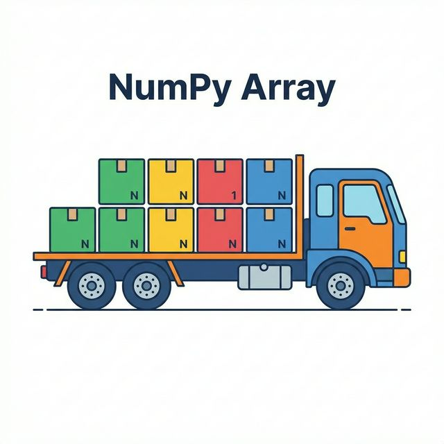
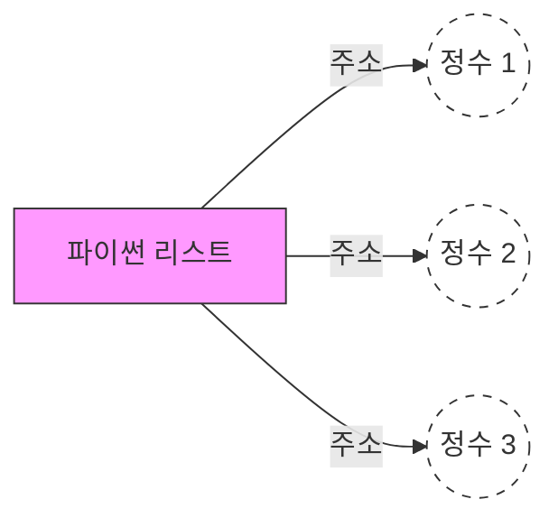
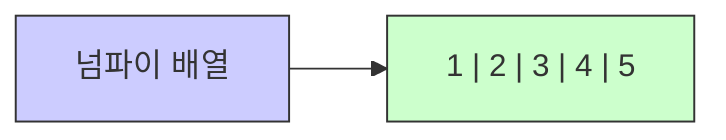

# 3주차 1강: Numpy란 무엇인가? (Introduction)

> **학습목표**: 대용량 데이터 처리를 위한 Numpy의 필요성을 이해하고, 리스트와 배열의 차이점 및 벡터/행렬의 개념을 시각적으로 학습합니다.


## 3.1.1. 파이썬 리스트 vs 넘파이 배열 (List vs Array)

> **Numpy (Numerical Python)**: 파이썬에서 **과학 계산**을 위해 만들어진 핵심 라이브러리입니다.


<br>

---

<br>

## 왜 굳이 `numpy array`를 또 배워야 할까요?

우리는 이미 파이썬 `list`를 배웠습니다. 


<br>

---

<br>

### 그 이유를 `이사짐 나르기`로 비유해 봅니다.
- **파이썬 리스트**: **승용차**입니다. 

  사람도 태우고, 짐도 싣고, 반려견도 태울 수 있습니다(다양한 자료형 허용). 하지만 짐을 많이 싣기엔 느리고 비효율적입니다.


[그림: 파이썬 리스트 - 승용차]


- **넘파이 배열**: **대형 화물 트럭**입니다. 

  오직 "규격화된 화물(동일한 자료형)"만 실을 수 있지만, 엄청나게 많은 양을 **매우 빠르게** 나를 수 있습니다.

[그림: 넘파이 배열 - 화물 트럭]



<br>

---

<br>

### 3.1.1.2. 구조적 차이와 속도 (Memory Layout)

기계(컴퓨터) 입장에서는 데이터가 저장된 방식이 속도를 결정합니다.
복잡한 그림 대신, 간단한 모형으로 비교해 봅시다.


<br>

---

<br>

#### [그림 1] 파이썬 리스트의 구조 (Data Scatter)
데이터가 메모리 여기저기에 흩어져 있습니다.


*   **비효율**: 데이터를 찾으러 여기저기 이동해야 합니다. (Pointer Chasing)
*   **유연함**: 아무거나 담을 수 있습니다.


<br>

---

<br>

#### [그림 2] 넘파이 배열의 구조 (Continuous Memory)
데이터가 한 곳에 빈틈없이 붙어 있습니다.


*   **고효율**: 한 번에 덩어리째 읽어서 계산합니다. (Cache Friendly)
*   **고속**: 이것이 바로 **벡터화 연산(Vectorization)**의 비결입니다.


<br>

---

<br>

## 3.1.3. 설치 및 불러오기

Matplotlib과 마찬가지로 설치 후 `np`라는 별칭으로 불러옵니다.

```bash
pip install numpy
```

```python
import numpy as np
print(np.__version__) # 버전 확인
```

이제 우리는 **슈퍼카(Numpy)**의 시동을 걸 준비가 되었습니다. 화려한 데이터 핸들링 기술을 익혀봅시다. 🏎️

<br>

---

<br>

## 정리 (Summary)

이 강의에서 배운 핵심 내용을 요약해 봅시다.

*   **[핵심 1]**: Numpy는 대량의 데이터를 빠르게 처리하는 **수치 계산 라이브러리**입니다. (C언어 기반)
*   **[핵심 2]**: 파이썬 리스트보다 **메모리를 적게 쓰고 속도가 훨씬 빠릅니다.**
*   **[핵심 3]**: 모든 요소가 **같은 데이터 타입(dtype)**이어야 한다는 규칙이 있습니다.
