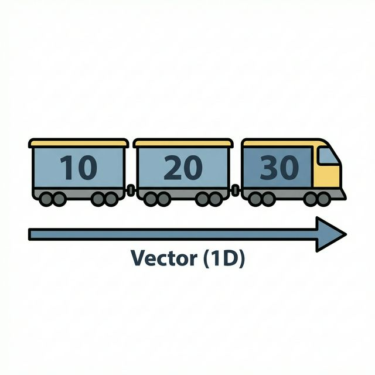
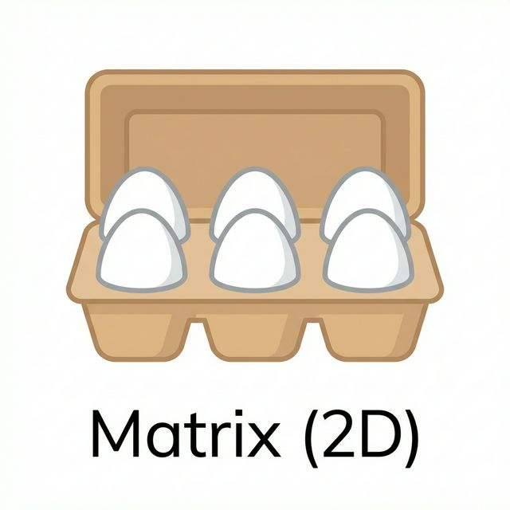
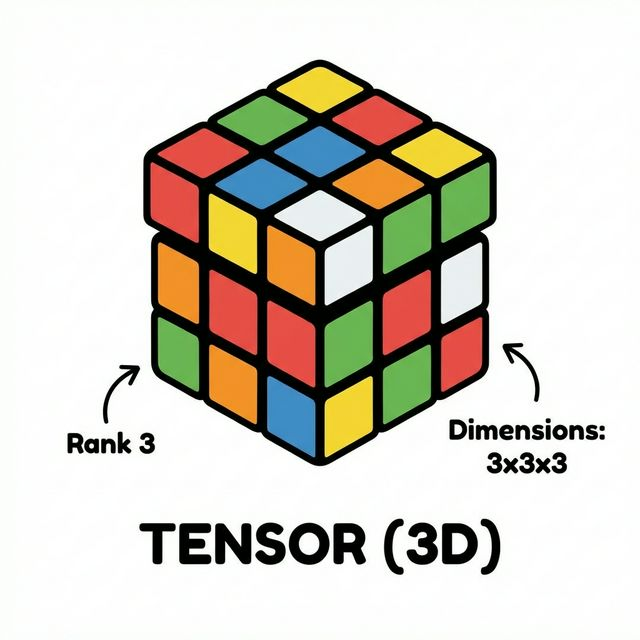

# 3주차 2강: 벡터와 행렬 (Vector & Matrix)

> **학습목표**: 데이터 분석의 기본 단위인 스칼라, 벡터, 행렬, 텐서의 개념을 명확히 이해하고, 이를 시각적인 비유를 통해 쉽게 기억합니다.

## 3.2.1. 데이터의 형태 (The Shape of Data)

데이터 분석에서는 데이터를 모양에 따라 부르는 특별한 이름이 있습니다. 어렵게 생각하지 마세요! 우리 주변의 사물로 쉽게 이해할 수 있습니다.

 

---

 

### 3.2.1.1. 스칼라 (Scalar, 0D)
**방향이 없는 단 하나의 숫자**입니다.

*   **비유**: 점 하나 (.), 동전 한 닢, 내 통장 잔고(숫자 하나)
*   **예시**: `HP = 100`, `나이 = 25`, `점수 = 90`

---

### 3.2.1.2. 벡터 (Vector, 1D)
**숫자들이 한 줄로 길게 늘어선 것**입니다. (1차원 배열)
하나의 행(Row) 또는 하나의 열(Column)로 구성됩니다.

*   **비유**: **기차 (Train)** 🚂
    *   기차는 여러 칸이 **일렬로** 연결되어 있습니다.
    *   첫 번째 칸, 두 번째 칸처럼 **순서(Index)**가 있습니다.
*   **예시**: `[국어점수, 수학점수, 영어점수]`, `[1월 매출, 2월 매출, 3월 매출]`
*   **특징**: 같은 종류의 데이터가 일렬로 나열된 형태입니다.

---

### 3.2.1.3. 행렬 (Matrix, 2D)
**숫자들이 사각형 모양으로 행과 열을 맞춰 늘어선 것**입니다. (2차원 배열)
가로줄을 **행(Row)**, 세로줄을 **열(Column)**이라고 합니다.

*   **비유**: **계란 판 (Egg Carton)** 🥚, **판 초콜릿**, **엑셀 시트**
    *   가로 6구, 세로 5구처럼 **가로x세로** 구조를 가집니다.
    *   몇 번째 줄, 몇 번째 칸인지를 나타내는 두 개의 좌표가 필요합니다.
*   **예시**: `학생 5명의 국/영/수 점수표` (5행 3열), `이미지 픽셀 데이터` (가로x세로 픽셀)
*   **특징**: 표(Table) 형태의 데이터는 대부분 행렬입니다.

---

### 3.2.1.4. 텐서 (Tensor, 3D+)
**행렬이 여러 장 겹쳐 있는 입체적인 형태**입니다. (3차원 이상)

*   **비유**: **큐브 (Rubik's Cube)** 🧊, **책이 쌓인 모습**
    *   면(Face), 행(Row), 열(Column)의 세 가지 축(Axis)이 있습니다.
*   **예시**: `컬러 이미지` (가로 x 세로 x RGB 3채널), `동영상` (시간 x 가로 x 세로)
*   **특징**: 딥러닝(Deep Learning)에서는 이 텐서를 기본 단위로 사용합니다.

---

## 3.2.2. 차원 요약 (Dimension Summary)

|    이름    | 차원 (Dimension) | 모양 (Shape) |    비유     | 예시 코드                        |
| :--------: | :--------------: | :----------: | :---------: | :------------------------------- |
| **스칼라** |        0D        |     `()`     |     점      | `10`                             |
|  **벡터**  |        1D        |    `(3,)`    |  선 (기차)  | `[1, 2, 3]`                      |
|  **행렬**  |        2D        |   `(2, 3)`   | 면 (계란판) | `[[1, 2, 3], [4, 5, 6]]`         |
|  **텐서**  |       3D+        | `(2, 2, 3)`  | 입체 (큐브) | `[[[1,2],[3,4]], [[5,6],[7,8]]]` |

> **핵심**: 데이터의 차원이 늘어날수록, 우리는 더 복잡하고 풍부한 정보를 표현할 수 있습니다. Numpy는 이 모든 차원의 데이터를 자유자재로 다루는 마법의 도구입니다. 🪄

 

---

 

## 정리 (Summary)

이 강의에서 배운 핵심 내용을 요약해 봅시다.

*   **[핵심 1]**: **스칼라(0D)** → **벡터(1D)** → **행렬(2D)** → **텐서(3D+)**로 차원이 확장됩니다.
*   **[핵심 2]**: `ndim`은 차원의 수, `shape`은 배열의 모양(행, 열)을 나타냅니다.
*   **[핵심 3]**: 데이터 분석에서는 주로 **2차원 행렬(Matrix)**을 다룹니다.
