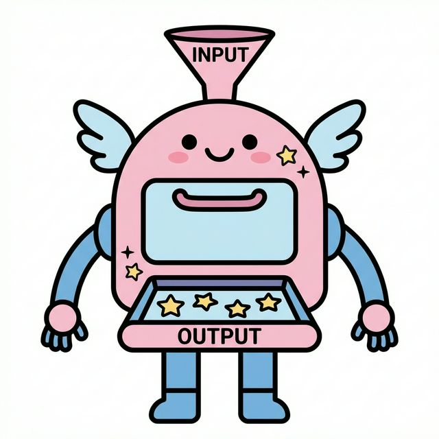
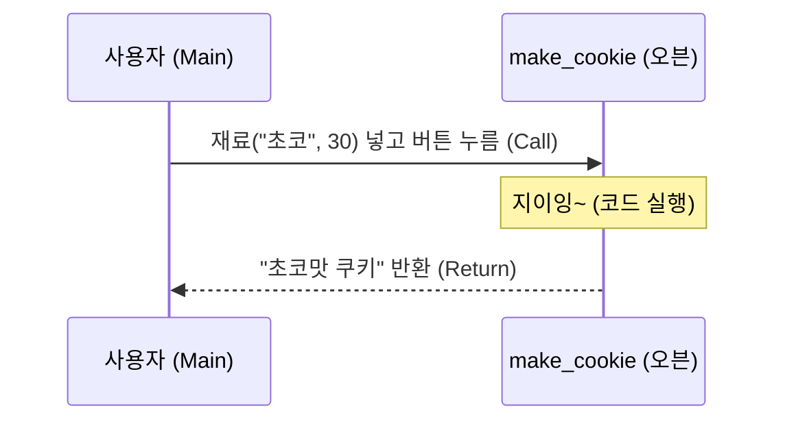
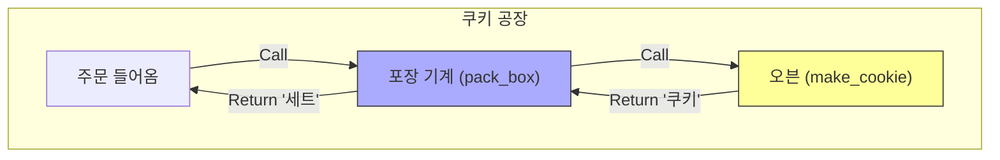

# 5주차 1강: 파이썬 함수 (Python Functions)

> **학습 목표**
> 1.  **함수(Function)**의 개념을 "마법 요리 로봇"에 비유하여 쉽게 이해합니다.
> 2.  **입력(Input)**과 **출력(Output)**의 흐름을 파악합니다.
> 3.  함수끼리 서로 부르는 **호출 관계(Call Flow)**를 그림으로 익힙니다.


---


## 5.1.1. 함수란 무엇인가요? (The Magic Oven)

함수(Function)는 **"재료를 넣으면, 요리를 만들어주는 마법 오븐"**과 같습니다.


### [그림 1] 마법 요리 로봇 (Magic Oven)

*   **Input (입력)**: 밀가루, 설탕 (재료)
*   **Function (함수)**: 오븐이 재료를 섞고 굽는 과정 (기계 내부)
*   **Return (반환)**: 맛있는 쿠키 (결과물)




<br>

---

<br>

### 왜 함수를 쓰나요?
매번 밀가루 반죽하고, 설탕 넣고, 오븐 온도 맞추고... 귀찮지 않나요?
함수를 만들어두면 **"오븐아, 쿠키 구워줘!"** 한 마디면 끝납니다. (코드 재사용)

<br>

---

<br>

## 5.1.2. 함수의 구조 (Structure)

마법 오븐을 코드로 만들어 봅시다.

```python
def make_cookie(dough, sugar):  # 오븐 이름과 재료 구멍(매개변수)
    # --- 오븐 내부 (Indent) ---
    print("반죽을 섞습니다...")
    print("맛있게 굽습니다...")
    cookie = dough + "맛 쿠키"
    # -----------------------
    return cookie               # 완성된 쿠키 내보내기 (반환값)
```

1.  **`def`**: "자, 이제 오븐을 설계하겠다!" (Definition)
2.  **`make_cookie`**: 오븐의 이름 (함수명)
3.  **`(dough, sugar)`**: 재료 투입구 (매개변수, Parameter)
4.  **`return`**: 완성품 배출구 (반환값, Return Value)

<br>

---

<br>

## 5.1.3. 함수 호출하기 (Call)

오븐을 설계도만 그려놓고 안 쓰면 의미가 없겠죠? 실제로 작동시켜 봅시다.

```python
# 초코맛 쿠키 만들기
my_snack = make_cookie("초코", 30) 
print(f"내가 만든 간식: {my_snack}")
# 출력: 내가 만든 간식: 초코맛 쿠키
```


<br>

---

<br>

### [그림 2] 함수 호출 흐름

주문(Call) -> 요리(Execution) -> 배달(Return)



<br>

---

<br>

## 5.1.4. 함수끼리 부르기 (Function Call Chain)

함수 안에서 또 다른 함수를 부를 수도 있습니다. 마치 **"쿠키 공장"**처럼요!


### 시나리오: 쿠키 선물 세트 만들기
1.  `make_cookie`: 쿠키를 굽는 기계
2.  `pack_box`: 쿠키를 상자에 담는 기계 (여기서 `make_cookie`를 사용!)

```python
def make_cookie(flavor):
    return f"{flavor} 쿠키"

def pack_box(flavor):
    print("상자를 준비합니다.")
    # 쿠키 기계에게 일을 시킵니다!
    cookie = make_cookie(flavor) 
    print(f"{cookie}를 상자에 담았습니다!")
    return "선물 세트 완성"

# 공장 가동!
result = pack_box("딸기")
print(result)
```


<br>

---

<br>

### [그림 3] 공장의 작업 흐름
Main이 `pack_box`를 부르고, `pack_box`가 다시 `make_cookie`를 부릅니다.



<br>

---

<br>

## 정리 (Summary)

이 강의에서 배운 핵심 내용을 요약해 봅시다.

*   **[핵심 1]**: **함수(Function)**는 코드를 재사용 가능한 부품으로 만드는 마법 상자입니다.
*   **[핵심 2]**: `def`로 정의하고, `return`으로 결과값을 반환합니다.
*   **[핵심 3]**: 함수를 사용하면 코드의 **가독성**이 좋아지고 **유지보수**가 쉬워집니다.
