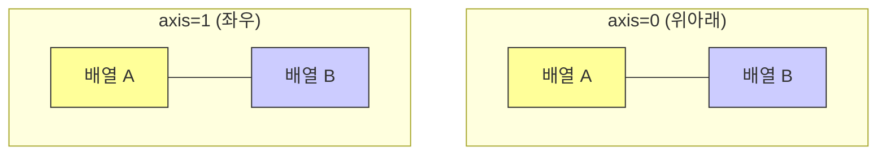
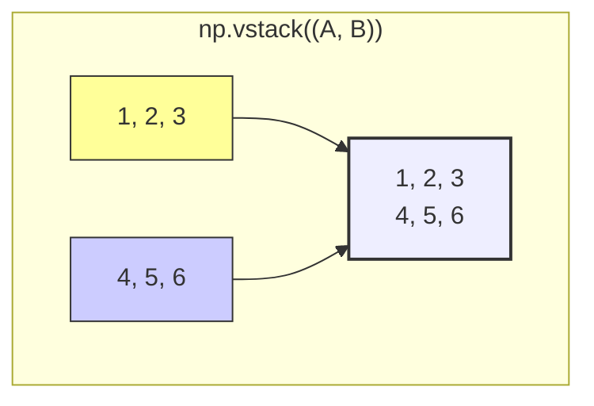
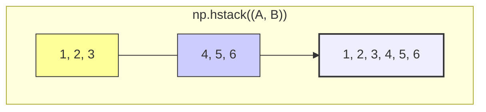

# 4주차 3강: 배열 합치기 (Concatenation)

> **학습목표**: 여러 개의 배열을 하나로 합치는 가장 기본적인 방법인 `concatenate`, `vstack`, `hstack`을 마스터합니다.

## 6.5.1. 가장 기본: `np.concatenate()`

`concatenate`는 "사슬처럼 연결하다"는 뜻입니다. **축(Axis)**을 지정하여 가로로 붙일지, 세로로 붙일지 결정할 수 있는 만능 함수입니다.


<br>

---

<br>

### 문법
`np.concatenate((배열1, 배열2, ...), axis=0)`
*   반드시 배열들을 **튜플 `()`** 로 묶어서 전달해야 합니다.
*   `axis=0`: 위아래로 붙이기 (기본값)
*   `axis=1`: 옆으로 붙이기


<br>

---

<br>

### [그림 1] Axis에 따른 결합 방향
*   **Axis 0 (행 방향)**: 아파트 층을 쌓듯이 위로 쌓습니다.
*   **Axis 1 (열 방향)**: 기차를 연결하듯이 옆으로 붙입니다.



<br>

---

<br>

## 6.5.2. 수직으로 쌓기: `np.vstack()`

**"Vertical Stack"** (수직 스택)

배열을 **위아래(수직)**로 쌓아 올립니다. `concatenate(axis=0)`과 똑같지만, 이름이 직관적이라 더 자주 쓰입니다.
*   블록 쌓기, 햄버거 쌓기를 상상하세요!


<br>

---

<br>

### [그림 2] vstack 동작 원리



```python
import numpy as np

a = np.array([1, 2, 3])
b = np.array([4, 5, 6])

# 위아래로 합체!
res = np.vstack((a, b))
print(res)
# [[1 2 3]
#  [4 5 6]]
```

<br>

---

<br>

## 6.5.3. 수평으로 쌓기: `np.hstack()`

**"Horizontal Stack"** (수평 스택)

배열을 **옆(수평)**으로 나란히 붙입니다. `concatenate(axis=1)`과 같습니다.
*   기차 연결하기, 파노라마 사진 붙이기를 상상하세요!


<br>

---

<br>

### [그림 3] hstack 동작 원리



```python
a = np.array([1, 2, 3])
b = np.array([4, 5, 6])

# 옆으로 합체!
res = np.hstack((a, b))
print(res)
# [1 2 3 4 5 6]
```

<br>

---

<br>

## 정리 (Summary)

이 강의에서 배운 핵심 내용을 요약해 봅시다.

*   **[핵심 1]**: `np.concatenate`는 `axis` 설정으로 방향을 정하는 만능 결합 함수입니다.
*   **[핵심 2]**: `np.vstack`은 **위아래(Vertical)**로 층을 쌓습니다. (행이 늘어남)
*   **[핵심 3]**: `np.hstack`은 **옆(Horizontal)**으로 길게 잇습니다. (열이 늘어남)
