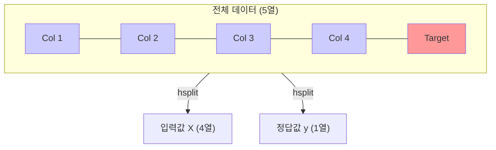
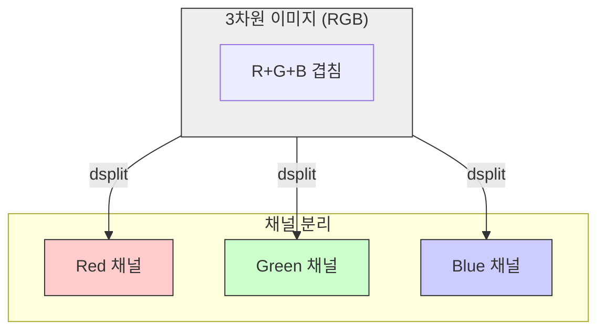

# 4주차 4강: 배열 나누기 (Splitting)

> **학습목표**: 합쳤던 배열을 다시 나누는 `split`, `vsplit`, `hsplit`뿐만 아니라, 불균등하게 나누는 `array_split`과 3차원 분할 `dsplit`까지 완벽하게 익힙니다.

## 6.7.1. 기본 나누기: `np.split()`

하나의 배열을 여러 조각으로 쪼갭니다. 가장 엄격한 함수입니다.
`numpy.split(배열, 나눌_개수_또는_인덱스, axis)`

> **주의**: `np.split`은 **똑같은 크기로 나누어 떨어지지 않으면 에러**가 발생합니다! (엄격함)


<br>

---

<br>

### [그림 1] 3등분 하기 (정확히 떨어짐)
길이가 6인 배열을 정확히 3개로 나눕니다.

```mermaid
graph TD
    subgraph Original ["원본 (6,)"]
        Arr[1, 2, 3, 4, 5, 6]
    end
    
    subgraph Split ["3등분 결과"]
        S1[1, 2]
        S2[3, 4]
        S3[5, 6]
    end
    
    Arr ==>|split(3)| S1
    Arr ==>|split(3)| S2
    Arr ==>|split(3)| S3
    
    style Arr fill:#eee,stroke:#333
    style S1 fill:#ff9,stroke:#333
    style S2 fill:#ff9,stroke:#333
    style S3 fill:#ff9,stroke:#333
```

```python
import numpy as np

arr = np.arange(6) # [0 1 2 3 4 5]

# 3개의 동일한 크기로 나누기
res = np.split(arr, 3)
print(res)
# [array([0, 1]), array([2, 3]), array([4, 5])]
```

<br>

---

<br>

## 6.7.2. 수직으로 자르기: `np.vsplit()`

**"Vertical Split"** (수직 분할)

케이크를 층별로 떼어내는 것과 같습니다. **행 단위**로 자릅니다. `split(axis=0)`과 같습니다.
*   **용도**: 데이터를 100개씩 배치(Batch)로 나눌 때 유용합니다.

<br>

---

<br>

## 6.7.3. 수평으로 자르기: `np.hsplit()`

**"Horizontal Split"** (수평 분할)

식빵을 잘라서 샌드위치를 만드는 것처럼 **옆으로(열 단위)** 자릅니다. `split(axis=1)`과 같습니다.
*   **용도**: 하나의 표에서 **입력 데이터(X)**와 **정답 데이터(y)**를 분리할 때 자주 쓰입니다.


<br>

---

<br>

### [그림 2] X와 y 분리하기
5열짜리 데이터에서 앞 4열(X)과 뒤 1열(y)을 분리합니다.



```python
grid = np.arange(16).reshape(4, 4)

# 좌우로 2등분
left, right = np.hsplit(grid, 2)
print("왼쪽:\n", left)
print("오른쪽:\n", right)
```

<br>

---

<br>

## 6.7.4. 불균등하게 자르기: `np.array_split()`

**"유연한 나누기"**

`np.split`과 달리, **똑같이 나누어 떨어지지 않아도** 에러를 내지 않고 최대한 비슷하게 나눠줍니다.
남는 자투리는 앞쪽 배열들에 하나씩 더 얹어줍니다.


<br>

---

<br>

### [그림 3] 사탕 7개를 3명에게 나누기
7개를 3명에게 나누면 `2개, 2개, 2개`를 주고 `1개`가 남습니다. 남은 1개는 첫 번째 사람에게 줍니다.
결과: `3개 / 2개 / 2개`

```python
x = np.arange(7) # [0, 1, 2, 3, 4, 5, 6] (7개)

# 3개로 나누기 (7 나누기 3은 딱 떨어지지 않음)
res = np.array_split(x, 3)

print(res)
# [array([0, 1, 2]), array([3, 4]), array([5, 6])]
# (3개, 2개, 2개로 나뉨)
```

> **Tip**: 실전 데이터 분석에서는 데이터 개수가 딱 떨어지지 않는 경우가 많으므로 `split`보다 `array_split`이 더 안전할 수 있습니다.

<br>

---

<br>

## 6.7.5. 깊이로 자르기: `np.dsplit()`

**"Depth Split"** (깊이 분할)

3차원 배열(큐브)에서 **깊이(Depth, axis=2)** 방향으로 자릅니다. 마치 식빵을 슬라이스 치는 것과 같습니다.
이미지 처리(RGB 채널 분리) 등에서 사용됩니다.


<br>

---

<br>

### [그림 4] 컬러 이미지 채널 분리
(높이, 너비, 채널) 형태의 이미지에서 R, G, B 채널을 각각 분리합니다.



```python
# 2x2 크기의 3채널(RGB) 이미지라고 가정
img = np.random.randint(0, 255, (2, 2, 3))

# 채널별로 쪼개기
r, g, b = np.dsplit(img, 3)

print("Red shape:", r.shape) # (2, 2, 1)
```

<br>

---

<br>

## 정리 (Summary)

이 강의에서 배운 핵심 내용을 요약해 봅시다.

*   **[핵심 1]**: `np.split`은 공평하게 나누지만, 개수가 안 맞으면 에러가 납니다.
*   **[핵심 2]**: `np.array_split`은 개수가 안 맞아도 알아서 **유연하게(자투리 처리)** 나눠줍니다.
*   **[핵심 3]**: 방향에 따라 `vsplit`(수직), `hsplit`(수평), `dsplit`(깊이/3차원)을 골라 쓰면 됩니다.
