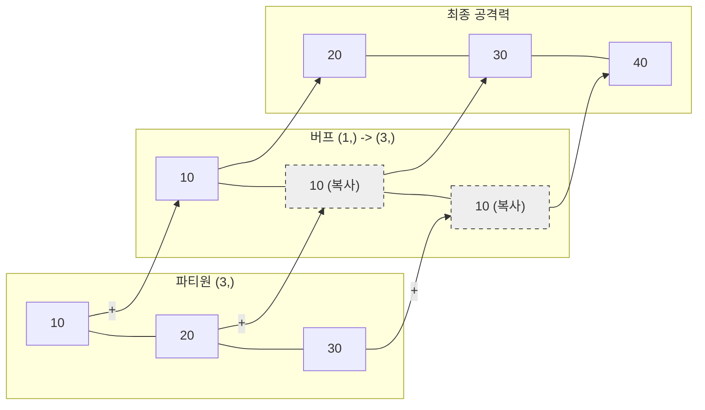

# 5주차 2강: 브로드캐스팅의 마법 (Broadcasting)

> **학습목표**: 크기가 다른 배열끼리 연산할 때, Numpy가 알아서 **형태를 맞춰주는(Shape Matching)** 브로드캐스팅의 원리를 시각적으로 이해합니다.


## 5.2.1. 광역 버프 시전 (Scalar Broadcasting)

**"작은 배열이 큰 배열에 맞춰 늘어납니다!"**

가장 흔한 경우는 숫자 하나(Scalar)를 배열 전체에 더하는 것입니다.
마치 게임에서 모든 파티원에게 **공격력 +10 광역 버프**를 거는 것과 같습니다.


<br>

---

<br>

### [그림 1] [10, 20, 30] + 10
숫자 10 하나만 더했는데, 마치 `[10, 10, 10]` 배열을 더한 것처럼 자동으로 복사되었습니다.



```python
import numpy as np

# 파티원 3명의 공격력
party = np.array([10, 20, 30])

# 광역 버프 (+10)
buff = 10

# [10, 20, 30] + 10
# => [10, 20, 30] + [10, 10, 10] (자동 변환!)
result = party + buff

print(result) # [20 30 40]
```

<br>

---

<br>

## 5.2.2. 팀별 버프 (Vector Broadcasting)

**"각 행마다 똑같은 벡터가 더해집니다!"**

2차원 행렬(Matrix)에 1차원 벡터(Vector)를 더하면, **각 행마다 벡터가 반복해서** 더해집니다.

### [그림 2] (3행 2열) + (1행 2열)
*   **행렬**: 3명의 용사가 각각 (힘, 민첩) 스탯을 가짐
*   **벡터**: 아이템 (힘+10, 민첩+5)
*   **결과**: 3명 모두에게 아이템 효과가 적용됨

```python
# 3명 용사의 (힘, 민첩)
stats = np.array([
    [100, 50], # 용사 1
    [120, 60], # 용사 2
    [110, 55]  # 용사 3
])

# 아이템 (힘+10, 민첩+5)
item = np.array([10, 5])

# 각 행마다 item이 [10, 5]로 복사되어 더해짐
new_stats = stats + item

print(new_stats)
# [[110  55]
#  [130  65]
#  [120  60]]
```

> **브로드캐스팅 규칙 (Rule)**:
> 1.  **뒤에서부터** 차원을 비교합니다.
> 2.  차원의 크기가 **같거나**, 둘 중 하나가 **1**이어야 합니다.


<br>

---

<br>

### 5.2.2.1. 시각화: 그라데이션 만들기 (Gradient)

브로드캐스팅을 시각적으로 가장 잘 보여주는 예시는 '그라데이션'입니다.
세로 방향 벡터(0~255)와 가로 방향 벡터(0~255)를 더하면, 밝기가 서서히 변하는 이미지가 만들어집니다.

```python
import numpy as np
import matplotlib.pyplot as plt

# 0부터 255까지 증가하는 1차원 배열 (100개 구간)
x = np.linspace(0, 255, 100)

# 가로 방향 (1행 100열)
horizontal = x.reshape(1, 100)

# 세로 방향 (100행 1열)
vertical = x.reshape(100, 1)

# 브로드캐스팅! (100,1) + (1,100) => (100,100)
# 가로 세로가 만나서 격자무늬 그라데이션이 생성됨
gradient = horizontal + vertical

# 시각화 (imshow)
plt.imshow(gradient, cmap='viridis')
plt.title("Broadcasting Gradient")
plt.colorbar()
plt.show()
```

<br>

---

<br>

## 정리 (Summary)

이 강의에서 배운 핵심 내용을 요약해 봅시다.

*   **[핵심 1]**: **브로드캐스팅(Broadcasting)**은 크기가 다른 배열끼리 연산할 때, 작은 쪽을 자동으로 늘려주는 기능입니다.
*   **[핵심 2]**: `(10, 3)` + `(3,)` 처럼 **뒤에서부터 차원이 일치**하거나 **1**이어야 합니다.
*   **[핵심 3]**: 불필요한 데이터 복사를 줄여주어 **메모리와 연산 효율**이 매우 좋습니다.
