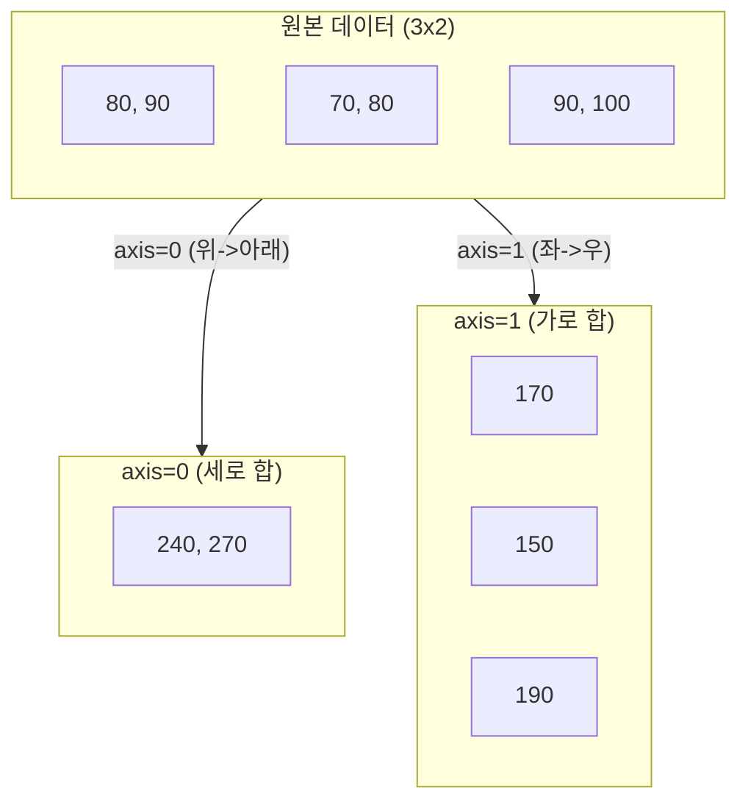

# 5주차 3강: 데이터 요약하기 (Aggregation)

> **학습목표**: 수많은 데이터를 하나하나 보는 대신, 합계(Sum)나 평균(Mean) 같은 '대표값'으로 요약하는 기술을 익힙니다. 특히 2차원 데이터에서 **축(Axis)** 방향을 이해하는 것이 핵심입니다.

## 5.3.1. 전체 요약 (Basic Statistics)

데이터 전체를 뭉뚱그려서 하나의 숫자로 만듭니다.

```python
import numpy as np

# 몬스터들이 입은 데미지 기록
damages = np.array([100, 230, 80, 450, 120])

print("총 데미지 (sum):", np.sum(damages))    # 980
print("평균 데미지 (mean):", np.mean(damages)) # 196.0
print("최대 데미지 (max):", np.max(damages))   # 450 (Critical!)
print("최소 데미지 (min):", np.min(damages))   # 80
```

<br>

---

<br>

## 5.3.2. 축(Axis)에 따른 요약

2차원 데이터(표)에서는 **어느 방향으로** 계산할지가 중요합니다.
*   **`axis=0`**: 위에서 아래로 누르기 (책 접기) -> **열(Column) 기준**
*   **`axis=1`**: 양전에서 가운데로 누르기 (부채 접기) -> **행(Row) 기준**

### [그림 1] Axis 방향 이해하기
*   `axis=0`: 모든 행을 압축하여 하나의 행으로 만듦 (세로 방향 연산)
*   `axis=1`: 모든 열을 압축하여 하나의 열로 만듦 (가로 방향 연산)




<br>

---

<br>

### 5.3.2.1. 시나리오: 학생 성적표 분석
```python
# 3명의 학생(A, B, C), 2과목(국어, 영어) 성적
scores = np.array([
    [80, 90], # 학생 A
    [70, 80], # 학생 B
    [90, 100] # 학생 C
])

# Q1. 각 학생의 총점은? (가로 방향 합 -> axis=1)
student_total = np.sum(scores, axis=1)
print("학생별 총점:", student_total) # [170 150 190]

# Q2. 과목별 평균 점수는? (세로 방향 평균 -> axis=0)
subject_mean = np.mean(scores, axis=0)
print("과목별 평균:", subject_mean) # [80. 90.]
```

> **암기 팁**:
> *   `axis=0`: "영(0)차!" 하고 위에서 아래로 찍어 누른다. (**행이 사라짐**)
> *   `axis=1`: "일(1)자"로 가로로 샌다. (**열이 사라짐**)

<br>

---

<br>

## 정리 (Summary)

이 강의에서 배운 핵심 내용을 요약해 봅시다.

*   **[핵심 1]**: 집계 함수(`sum`, `mean`, `max` 등)는 데이터를 요약하여 하나의 값으로 만듭니다.
*   **[핵심 2]**: `axis=0`은 **세로(열) 방향**, `axis=1`은 **가로(행) 방향**으로 연산을 수행합니다.
*   **[핵심 3]**: `min`/`max`는 값을 반환하고, `argmin`/`argmax`는 그 값이 있는 **위치(인덱스)**를 반환합니다.
