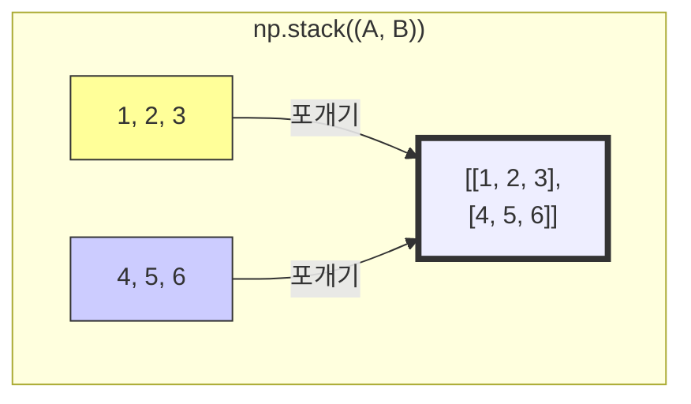

# 6주차 4강: 고급 배열 합치기 (Advanced Stacking)

> **학습목표**: 차원을 늘리면서 합치는 `stack`, 기둥처럼 세워서 합치는 `column_stack`, 그리고 단축 문법인 `np.c_`, `np.r_`을 익혀 고수처럼 데이터를 다룹니다.

## 6.6.1. 새로운 차원으로 쌓기: `np.stack()`

`concatenate`는 기존 차원을 유지하면서 붙이지만, `stack`은 **새로운 차원(축)을 하나 더 만들면서** 묶습니다.
*   비유: 종이(2D)를 겹쳐서 책(3D)을 만드는 과정


<br>

---

<br>

### [그림 1] stack 동작 원리 (axis=0)
1차원 배열 두 개를 겹쳐서 2차원으로 만듭니다.



<br>

---

<br>

## 6.6.2. 기둥 세우기: `np.column_stack()`

1차원 배열들을 마치 **기둥(Column)**처럼 세워서 옆으로 붙입니다.
`vstack`을 한 뒤 전치(Transpose)한 것과 비슷하거나, 2차원에서의 `hstack`과 비슷하게 동작하여 헷갈리기 쉽습니다.

*   **핵심**: 1차원 리스트들을 **세로로 세워** 표(DataFrame)를 만들 때 가장 많이 씁니다!

```python
import numpy as np

id_list = [1, 2, 3]
score_list = [80, 90, 75]

# 각각을 세로 기둥으로 세워서 합침
result = np.column_stack((id_list, score_list))

print(result)
# [[ 1 80]
#  [ 2 90]
#  [ 3 75]]
```

> **비교**: `row_stack()`도 있지만, 이는 `vstack()`과 사실상 같아서 잘 안 씁니다.

<br>

---

<br>

## 6.6.3. 마법의 단축키: `np.r_` & `np.c_`

함수 이름도 길고 괄호도 치기 귀찮을 때 쓰는 '초고수용 단축 문법'입니다.
대괄호 `[]`를 사용한다는 점이 특이합니다.

### 6.6.3.1. `np.r_` (Row-wise)
행(Row) 방향으로 합칩니다. `hstack`과 비슷하게 동작합니다 (1차원 기준).
*   **R**ow -> **R**ight (옆으로 길어짐)

```python
# Create directly
a = np.r_[1, 2, 3, 4, 5, 6]
print(a) # [1 2 3 4 5 6]
```


<br>

---

<br>

### 6.6.3.2. `np.c_` (Column-wise)
열(Column) 방향으로 합칩니다. `column_stack`과 똑같습니다.
*   **C**olumn -> 기둥 세우기

```python
a = np.array([1, 2, 3])
b = np.array([4, 5, 6])

# 두 배열을 기둥으로 세워 붙이기
res = np.c_[a, b]
print(res)
# [[1 4]
#  [2 5]
#  [3 6]]
```

<br>

---

<br>

## 정리 (Summary)

이 강의에서 배운 핵심 내용을 요약해 봅시다.

*   **[핵심 1]**: `np.stack()`은 차원을 하나 높이면서 배열을 포갭니다. (종이 묶기)
*   **[핵심 2]**: `np.column_stack()`은 1차원 배열을 **기둥(Column)**으로 세워서 합칩니다. (표 만들기 필수)
*   **[핵심 3]**: `np.c_[]`는 `column_stack`을 아주 짧게 쓸 수 있는 마법의 단축키입니다.
