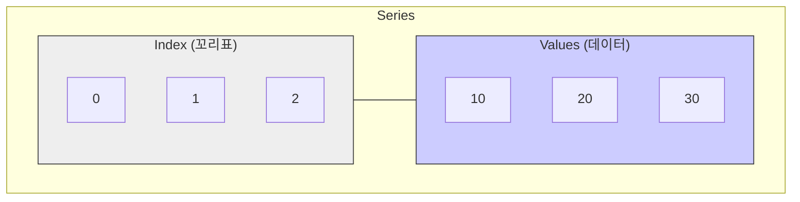

# 8주차 2강: 시리즈 (Series)

> **학습목표**: 판다스의 가장 기초 단위인 **시리즈(Series)**의 구조를 이해하고, 생성하는 방법과 인덱싱하는 방법을 익힙니다.

## 8.2.1. 시리즈란 무엇인가?

**시리즈(Series)**는 **"라벨(Label)이 붙은 1차원 데이터"**입니다.
*   Numpy의 1차원 배열(Array)과 비슷하지만, **인덱스(Index)**라는 꼬리표가 붙어 있다는 점이 다릅니다.
*   엑셀 표에서 **하나의 열(Column)**을 뚝 떼어낸 것과 같습니다.


<br>

---

<br>

### [그림 1] 시리즈의 구조
`값(Values)`과 `인덱스(Index)` 두 가지 핵심 요소로 구성됩니다.



<br>

---

<br>

## 8.2.2. 시리즈 만들기

### 1. 리스트로 만들기
가장 기본적인 방법입니다. 인덱스를 따로 지정하지 않으면 0부터 시작하는 정수가 자동으로 붙습니다.

```python
import pandas as pd

# 인덱스 자동 생성 (0, 1, 2, ...)
idx = pd.Series([10, 20, 30, 40, 50])
print(idx)
# 0    10
# 1    20
# 2    30
# 3    40
# 4    50
# dtype: int64
```


<br>

---

<br>

### 2. 인덱스 지정하기
내가 원하는 이름을 꼬리표로 붙일 수 있습니다.

```python
# 인덱스 직접 지정
s = pd.Series([90, 80, 70], index=['국어', '수학', '영어'])
print(s)
# 국어    90
# 수학    80
# 영어    70
# dtype: int64
```


<br>

---

<br>

### 3. 딕셔너리로 만들기
딕셔너리의 `Key`가 `Index`가 되고, `Value`가 `Data`가 됩니다. (가장 직관적!)

```python
score_dict = {'국어': 90, '수학': 80, '영어': 70}
s_dict = pd.Series(score_dict)
print(s_dict)
# 국어    90
# 수학    80
# 영어    70
# dtype: int64
```

<br>

---

<br>

## 8.2.3. 시리즈 인덱싱 (Indexing)

시리즈의 가장 큰 장점은 **"이름으로 데이터를 찾을 수 있다"**는 것입니다.

```python
print(s['국어'])  # 90 (라벨 Index로 접근)
print(s[0])     # 90 (위치 Position으로 접근 - 리스트처럼)
```

> **주의**: 인덱스가 정수(0, 1, 2...)인 경우, 라벨과 위치가 헷갈릴 수 있으니 주의해야 합니다. 명시적으로 `loc`(라벨), `iloc`(위치)를 쓰는 것이 좋습니다.

<br>

---

<br>

## 정리 (Summary)

이 강의에서 배운 핵심 내용을 요약해 봅시다.

*   **[핵심 1]**: **시리즈(Series)**는 인덱스(Index)와 값(Value)을 가진 1차원 데이터 구조입니다.
*   **[핵심 2]**: 리스트나 딕셔너리를 이용해 쉽게 만들 수 있으며, 데이터의 타입(dtype)이 함께 저장됩니다.
*   **[핵심 3]**: **라벨(이름)** 또는 **정수 위치(순서)** 두 가지 방법으로 데이터에 접근할 수 있습니다.
