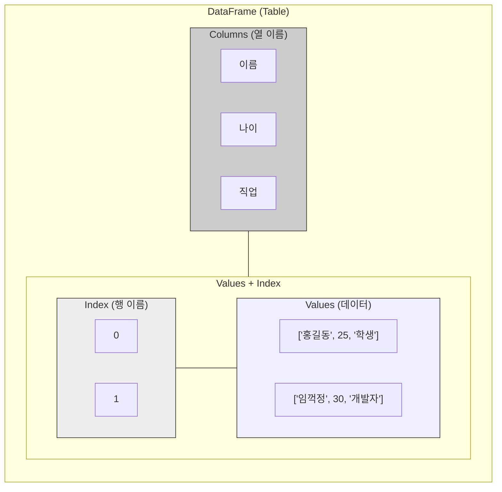

# 8주차 3강: 데이터프레임 (DataFrame)

> **학습목표**: 판다스의 핵심이자 데이터 분석의 기본 단위인 **데이터프레임(DataFrame)**의 구조를 이해하고, 생성하는 방법과 정보를 확인하는 기초 함수들을 익힙니다.

## 8.3.1. 데이터프레임이란?

**데이터프레임(DataFrame)**은 **"행과 열이 있는 2차원 표(Table)"**입니다.
*   엑셀 시트(Sheet)와 똑같이 생겼습니다.
*   **여러 개의 시리즈(Series)가 모여서** 만들어집니다. (각 열이 하나의 시리즈입니다)


<br>

---

<br>

### [그림 1] 데이터프레임 구조
3가지 핵심 요소인 `Index`(행 이름), `Columns`(열 이름), `Values`(데이터)로 구성됩니다.



<br>

---

<br>

## 8.3.2. 데이터프레임 만들기

### 1. 딕셔너리로 만들기 (가장 많이 씀!)
`Key`는 열 이름(Column)이 되고, `Value`는 데이터 리스트가 됩니다.

```python
import pandas as pd

data = {
    '이름': ['홍길동', '임꺽정', '성춘향'],
    '나이': [25, 30, 27],
    '도시': ['서울', '부산', '대구']
}

df = pd.DataFrame(data)
print(df)
#     이름  나이  도시
# 0  홍길동  25  서울
# 1  임꺽정  30  부산
# 2  성춘향  27  대구
```


<br>

---

<br>

### 2. 리스트의 리스트로 만들기
행 단위로 데이터를 넣을 때 사용합니다. 컬럼 이름을 따로 지정해줘야 합니다.

```python
data_list = [
    ['홍길동', 25, '서울'],
    ['임꺽정', 30, '부산']
]

df_list = pd.DataFrame(data_list, columns=['이름', '나이', '도시'])
```

<br>

---

<br>

## 8.3.3. 데이터프레임 뜯어보기 (Inspection)

데이터를 처음 불러왔을 때, 가장 먼저 해야 할 일은 **"데이터의 생김새"**를 파악하는 것입니다.

### 1. 모양 확인하기: `shape`
행이 몇 개고, 열이 몇 개인지 알려줍니다. (함수가 아니라 속성이라 `()`가 없습니다!)

```python
print(df.shape)  # (3, 3) -> 3행 3열
```


<br>

---

<br>

### 2. 데이터 일부 보기: `head()`, `tail()`
데이터가 너무 많을 때, 앞뒤 5개만 살짝 봅니다.

```python
print(df.head(2)) # 앞 2줄만 보기
print(df.tail(1)) # 뒤 1줄만 보기
```


<br>

---

<br>

### 3. 정보 요약: `info()`
데이터 타입(Dtype), 결측치(Non-Null Count), 메모리 사용량을 한눈에 보여줍니다. **가장 중요한 함수**입니다.

```python
df.info()
# <class 'pandas.core.frame.DataFrame'>
# RangeIndex: 3 entries, 0 to 2
# Data columns (total 3 columns):
#  #   Column  Non-Null Count  Dtype 
# ---  ------  --------------  ----- 
#  0   이름      3 non-null      object
#  1   나이      3 non-null      int64 
#  2   도시      3 non-null      object
```

### 4. 기술 통계: `describe()`
숫자형 데이터의 개수, 평균, 표준편차, 최솟값, 최댓값 등을 자동으로 계산해줍니다.

```python
print(df.describe())
#              나이
# count   3.000000
# mean   27.333333
# ...
```

<br>

---

<br>

## 정리 (Summary)

이 강의에서 배운 핵심 내용을 요약해 봅시다.

*   **[핵심 1]**: **데이터프레임(DataFrame)**은 행과 열이 있는 2차원 표이며, `Index`, `Columns`, `Values`로 구성됩니다.
*   **[핵심 2]**: 딕셔너리(`{'컬럼명': [값 목록]}`)를 이용해 직관적으로 생성할 수 있습니다.
*   **[핵심 3]**: `head()`, `info()`, `describe()` 3총사로 데이터의 구조와 통계 정보를 빠르게 파악하는 것이 분석의 첫걸음입니다.
