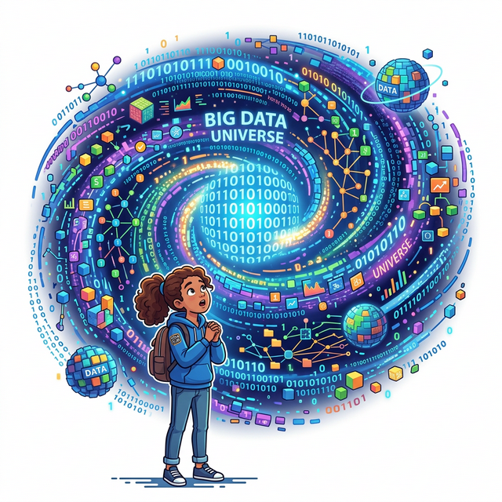
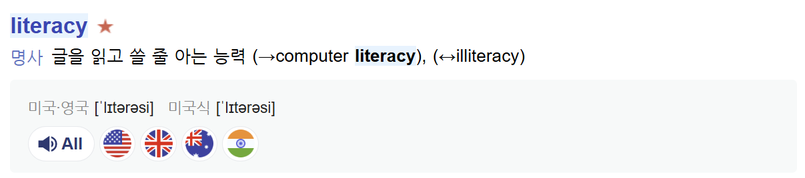

# 1.1.1 데이터 세상

## 학습목표
데이터 분석 및 학습 필요성에 대해서 알아 봅니다.

## 첫눈에 반하는 데이터의 세계
데이터는 우리 삶 곳곳에 스며들어 있습니다.

여러분이 지금 쥐고 있는 스마트폰, 방금 전 재생했던 넷플릭스 영화, 아침에 스크롤했던 인스타그램 피드까지 피드백. 이 모든 흔적들이 바로 '데이터'입니다. 보이지 않지만 세상을 움직이는 거대한 핏줄인 데이터 분석의 첫 번째 여정을 시작하겠습니다.

## 우리가 하루에 생산하는 데이터의 양
우리는 `매일` 데이터를 생산하고 있습니다.

여러분이 아침에 일어나서 카카오톡 문자를 하나 보낼 때마다 데이터가 생성됩니다. 전 세계 80억 인구가 하루에 쏟아내는 정보의 양은 영화 수백만 편을 24시간 내내 틀어놓는 분량과 맞먹습니다. 

데이터는 지금 이 순간에도 빛의 속도로 쌓이고 있습니다. 이렇게 쌓이는 데이터를 분석하지 않으면 우리는 거대한 데이터의 홍수 속에서 길을 잃고 말 것입니다.

## 기하급수적으로 폭발하는 디지털 우주
우리는 4차 산업혁명이라는 거대한 '디지털 우주' 한가운데 서 있습니다. 

0과 1로 이루어진 무수한 블록들이 모여서 완전히 새로운 세상을 만들어내고 있습니다.

이 디지털 우주에서 길을 잃지 않으려면 데이터를 읽어내는 지도가 반드시 필요합니다.

## 과거의 자원 vs 현재의 자원
100년 전 가장 비쌌던 자원은 땅속에서 캐내는 '석유'와 '금'이었습니다. 

그렇다면 오늘날 가장 비싼 자원은 무엇일까요? 바로 '데이터'입니다. 구글, 아마존, 메타(페이스북) 같은 전 세계 1등 기업들의 공통점은 기름을 캐는 것이 아니라 `데이터`를 `캔다`는 점입니다.

## 데이터 전쟁: 미국과 중국의 패권 경쟁

데이터가 곧 새로운 시대의 석유이자 무기이듯, 지금 이 순간 전 세계는 21세기 최강대국 자리를 두고 치열한 **'데이터 전쟁(Data War)'**을 벌이고 있습니다. 그 중심에는 AI와 빅데이터의 헤게모니를 쥐려는 미국과 중국이 있습니다.

1. **미국 (기술적 혁신과 자본의 독점)**: 구글, 메타, 마이크로소프트, 오픈AI 등 전 세계 플랫폼의 70% 이상을 장악한 미국은 막강한 자본력과 선도적인 AI 알고리즘 기술(안드로이드, GPT 등)을 통해 글로벌 데이터를 무차별적으로 빨아들이고 있습니다. 
2. **중국 (압도적 인구와 국가 주도의 데이터 집적)**: 알리바바, 텐센트, 틱톡 등을 보유한 중국은 14억이라는 압도적인 내수 인구의 개인정보를 사실상 국가가 강력하게 긁어모아 AI 학습에 쏟아붓고 있습니다. 안면 인식, 스마트 시티 구축 등에서 이미 세계 최고 수준의 데이터를 보유하고 있습니다.

이들은 자국의 데이터를 외부로 유출하지 않기 위해 '데이터 현지화' 법안을 경쟁적으로 통과시키고 서로의 플랫폼(틱톡 앱 퇴출 논란 등)을 규제하고 있습니다. 미래 사회에서 데이터를 가장 많고, 가장 정교하게 가진 국가가 다음 세대의 군사, 경제, 외교를 완벽히 지배하게 될 것이기 때문.

## 데이터 리터러시(Data Literacy)란?

글을 읽고 쓸 줄 아는 능력을 뜻하는 '리터러시(문해력)'라는 단어를 아시나요? 

현대 사회에서는 한글이나 영어를 읽는 것을 넘어, 차트와 숫자 속에 숨겨진 진짜 의미를 읽어내는 능력, 즉 **'데이터 리터러시'**가 필수 생존 기술이 되었습니다.

## 학습 요약

이 문서에서는 데이터가 더 이상 단순한 숫자의 나열이 아니라 세상을 움직이는 가장 핵심적인 자원임을 배웠습니다.

1. **지속적인 데이터 폭발**: 4차 산업혁명과 함께 매일 엄청난 양의 데이터가 끊임없이 양산되는 거대한 디지털 우주가 펼쳐지고 있습니다.
2. **미·중 데이터 패권 전쟁**: 전 세계의 플랫폼을 장악하여 빅데이터를 긁어모으는 미국과 압도적 인구를 쏟아부어 데이터를 축적하는 중국의 첨예한 갈등을 통해 데이터의 막강한 가치를 엿볼 수 있습니다.
3. **데이터 리터러시 역량**: 이러한 데이터 전쟁의 시대에서 정보의 홍수에 휩쓸리지 않으려면, 데이터 속에 숨겨진 진짜 가치와 패턴을 제대로 읽고 쓸 줄 아는 '데이터 리터러시(Data Literacy)' 능력을 반드시 갖추어야 합니다.

이제 우리는 수동적인 데이터 생산자에서 벗어나, 데이터를 적극적으로 재조립하고 해석하는 **분석가**의 눈을 가져야 할 때입니다.
