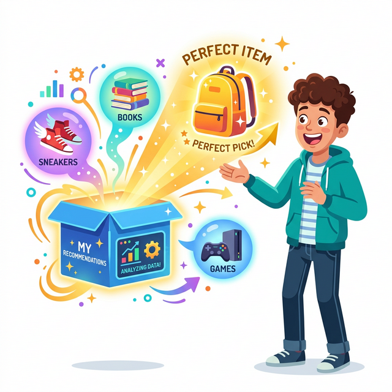
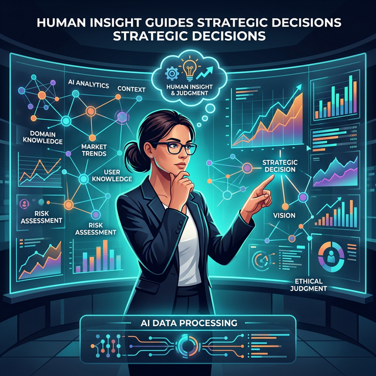

# 1.2.2 똑똑한 비서: 로보어드바이저
과거에는 돈이 아주 많은 부자들만 은행의 VIP 룸에서 전문가에게 주식 투자 상담을 받았습니다. 

하지만 이제는 수십 년치 전 세계 증권 주가 데이터를 학습한 로봇(로보어드바이저)이, 대학생인 여러분의 치킨값 2만 원도 가장 안전하게 굴려주는 맞춤형 투자 자문을 해줍니다.

## 산업 분석 2: 이커머스 (온라인 쇼핑몰)
쿠팡, 네이버 쇼핑, 아마존을 들어가면 "당신이 좋아할 만한 상품"이라며 놀랍도록 내가 평소 사고 싶었던 물건들만 귀신같이 띄워주는 경험, 해보신 적 있나요? 우연의 일치일까요? 절대로 아닙니다.

## 당신의 마음을 읽는 추천 알고리즘

쇼핑몰 AI는 여러분이 평소에 장바구니에 담았다가 삭제한 내역, 후기를 5초 넘게 들여다본 행동, 다른 유저들의 구매 패턴까지 수억 개의 데이터를 종합적으로 분석하여 내가 '진짜' 사고 싶은 물건을 1위부터 순서대로 보여줍니다. 

