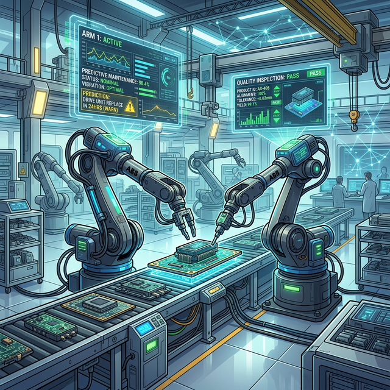
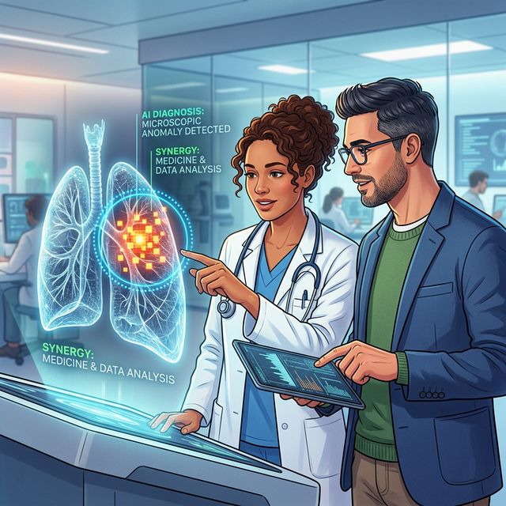

# 1.2.3 미래의 수요 예측
여름에 부산 해운대에 비가 올 확률이 80%라면 콜라가 많이 팔릴까요, 우산이 많이 팔릴까요? 이커머스 회사는 날씨 비정형 데이터, 작년 판매량 엑셀 데이터, 유동 인구 통계 데이터를 모두 결합해 지역별 물류창고에 미리 재고를 쌓아 놓고 '로켓배송'을 준비합니다. 

## 산업분석3 : 제조 및 스마트 팩토리

지금까지는 컴퓨터 화면 속에 있는 온라인 세상 이야기였습니다. 그렇다면 망치 소리와 모터가 돌아가는 투박하고 거친 공장(제조업)에서는 데이터 분석이 어떻게 쓰일까요? 여기서도 데이터는 마법 같은 기적을 만듭니다.

### 예지 보전: 기계가 아프기 전에 치료하기
자동차 엔진을 깎는 거대한 로봇 팔에는 수백 개의 작은 온도 및 진동 센서가 달려 있습니다. "로봇 3번 팔의 모터 진동 데이터 패턴이 평소보다 0.2mm 어긋나기 시작했습니다. 3주 뒤에 완전히 부서질 확률 95%입니다." 데이터를 통해 공장이 멈추는 대형 사고를 사전 방지합니다.

### 컴퓨터 비전: 매의 눈으로 불량품 검사
초콜릿이나 스마트폰 부품이 컨베이어 벨트를 타고 빠르게 지나갈 때, 과거에는 사람 수백 명이 서서 일일이 불량품을 골라냈습니다. 지금은 수백만 장의 불량품 사진 데이터를 학습한 AI 카메라가 사람보다 100배 빠른 속도로 불량품 픽셀 패턴을 찾아 핀셋으로 집어냅니다.

## 산업 분석 4: 의료 및 헬스케어 혁신
데이터 분석이 사람의 목숨을 구할 수도 있을까요? 의사와 약사, 그리고 데이터를 만지는 엔지니어의 만남은 현대 의학을 폭발적으로 진보시켰습니다. 스마트 헬스케어 산업은 IT 생태계의 가장 뜨거운 화두입니다.

### 암 진단을 돕는 의료 영상 데이터 (Medical AI)
암세포를 판별하는 엑스레이, MRI 사진 데이터를 수백만 장 모아 AI에게 "이건 정상, 이건 암세포야"라고 학습시킵니다. 이제 이 모델은 피곤한 사람의 눈으로 자칫 놓치기 쉬운 0.1mm의 미세한 초기 암세포 음영 데이터마저도 조기에 발견하여 생존율을 획기적으로 높여줍니다.

###  유전자 맞춤형 신약 개발
신약 하나를 개발하는 데에는 수천억 원의 돈과 10년이라는 막대한 긴 시간이 필요합니다. 하지만 파이썬 기반 데이터 분석 기술로 단백질 입자 구조 시뮬레이션 데이터를 초고속으로 계산하게 되면, 신약 개발 속도가 몇 년이나 획기적으로 단축될 수 있습니다.

###  내 손목 위의 건강 데이터 비서: 웨어러블 디바이스
여러분이 매일 착용하는 애플워치나 갤럭치워치는 단순한 시계가 아닙니다. 초 단위로 심박수, 혈중 산소 농도, 깊은 수면 시간을 체크하여 빅데이터화합니다. 이 생활 데이터 패턴들은 훗날 뇌졸중이나 돌연사를 미리 경고해 주는 생명의 데이터로 쓰입니다.

