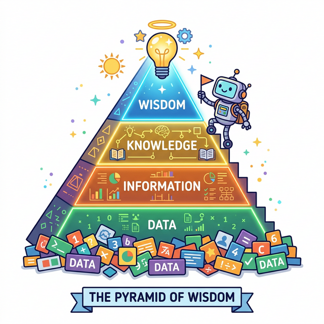

# 1.4.2 DIKW 피라미드란?

## 학습목표
본 장에서는 데이터가 우리에게 가치를 주는 '지혜'로 진화하는 과정을 나타낸 모델인 **DIKW 피라미드**에 대해 배웁니다. 

## DIKW 피라미드란?
데이터가 우리에게 가치를 주는 '지혜'로 진화하는 과정을 나타낸 모델을 **DIKW 피라미드**라고 부릅니다. 

맨 아래 넓은 바닥부터 Data (데이터) -> Information (정보) -> Knowledge (지식) -> Wisdom (지혜) 의 4단계 구조로 이루어져 있습니다.

## 피라미드 1단계: Data (순수 데이터)

피라미드의 가장 아랫부분인 **Data(데이터)**는 의미가 부여되지 않은 순수 객관적 사실이나 값입니다.
예를 들어 `A마트 10,000원`, `B마트 8,000원` 이라는 단순한 기호의 나열이 데이터입니다. 여기에는 아직 어떤 맥락이나 쓸모도 섞여 있지 않습니다.

## 피라미드 2단계: Information (정보)

순수 데이터들에 가공과 처리를 통해 '맥락(Context)'을 부여하면 **Information(정보)**이 됩니다.
`A마트 10,000원`, `B마트 8,000원`이라는 데이터에 맥락이 들어가면, "내가 사고 싶은 수박은 B마트가 2,000원 더 싸다!"라는 유의미한 깨달음(정보)으로 변신합니다.

## 피라미드 3단계: Knowledge (지식)

여러 정보들이 모이고 나의 경험과 학습이 결합되어 '패턴'을 발견한 단계가 **Knowledge(지식)**입니다.
"최근 3달 동안 지켜보니 B마트는 금요일마다 과일 타임 세일을 해서 항상 제일 저렴하네"라는 유의미한 패턴과 축적된 노하우가 지식이 됩니다.

## 피라미드 4단계: Wisdom (지혜)

가장 꼭대기인 **Wisdom(지혜)**은 지식을 바탕으로 미래를 예측하고 완벽한 판단을 내리는 통찰력입니다.
"금요일 퇴근길에 B마트에 들러 수박을 사면 가장 합리적인 소비가 될 것이니 금요일 약속을 취소하고 마트에 가야겠다"라는 '최종 의사결정'이 바로 지혜입니다.

## 정리
데이터 분석은 단순히 숫자를 계산하는 것이 아니라, 데이터(Data)를 정보(Information)로 가공하고, 지식(Knowledge)으로 축적하며, 최종적으로 지혜(Wisdom)로 승화시키는 과정입니다. 이 과정을 통해 우리는 데이터를 통해 미래를 예측하고 올바른 의사결정을 내릴 수 있습니다.