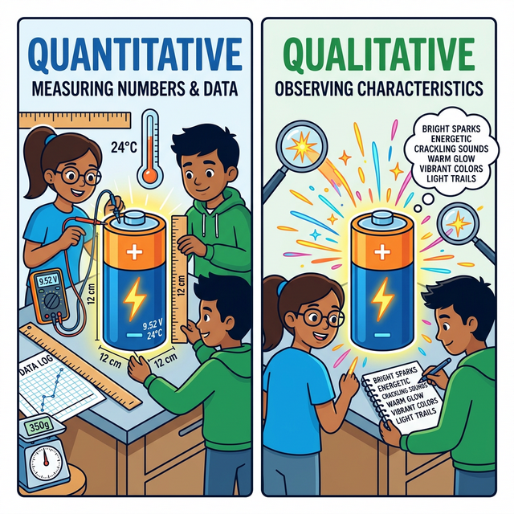
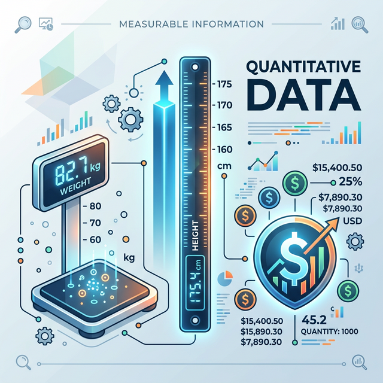
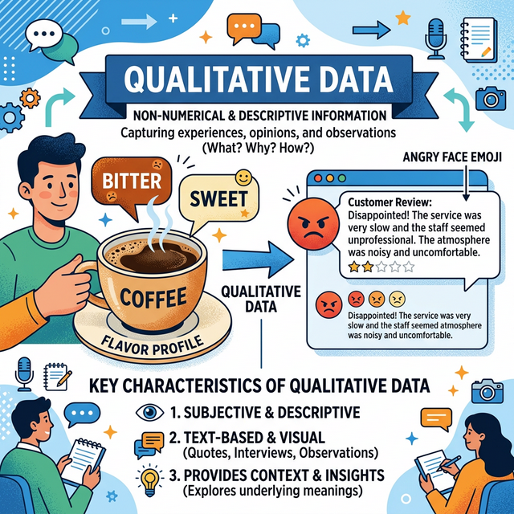

# 1.4.3 좋은 지혜는 좋은 데이터에서 출발한다

건축을 할 때 바닥의 기반암이 약하면 꼭대기의 성은 무너지고 맙니다. DIKW 피라미드도 마찬가지입니다. 

처음에 수집한 데이터(Data)가 쓰레기이거나 거짓말투성이라면, 아무리 뛰어난 기술로 가공해도 꼭대기의 지혜(Wisdom)는 무너진 오답이 되고 맙니다. (Garbage In, Garbage Out)

## 데이터종류

데이터는 크게 숫자로 깔끔하게 나타낼 수 있는 **'정량적(Quantitative) 데이터'**와 문장이나 느낌처럼 숫자로 표현하기 힘든 **'정성적(Qualitative) 데이터'** 두 가지로 쪼개집니다. 

이 두 가지를 구분할 줄 아는 것이 분석의 첫걸음입니다.

## 정량적(Quantitative) 데이터란?

'얼마나(How much/many)?'에 해당하는 데이터입니다. 자나 저울로 잴 수 있는 명확한 숫자를 말합니다.

- 내 키는 173.5cm이다.
- 이번 달 핸드폰 요금은 65,000원이다.
- 우리 반 학생 수는 총 30명이다.
  이런 데이터들은 파이썬이나 엑셀이 계산하기 매우 쉽습니다.

## 정성적(Qualitative) 데이터란?

숫자가 아니라 텍스트, 소리, 질감, 감정 등 상태나 특성을 문자와 형태로 묘사하는 데이터입니다.

- 이 커피는 맛이 씁쓸하고 향이 고소하다.
- 고객 리뷰: "배송이 너무 늦어서 짜증났어요. 다신 안 삼!"
- 이번 시즌 트렌드 색상은 차분한 베이지색이다.

## 현대 분석에서의 정성적 데이터의 중요성

과거 컴퓨터는 숫자(정량적)만 계산할 줄 알았지만, 지금은 챗GPT 같은 AI의 발달로 수십만 개의 '상품 리뷰 글(정성적 데이터)'을 분석해 "이 상품에 대한 사람들의 반응은 긍정 80%, 부정 20% 입니다"라고 변환해 냅니다. 

이를 텍스트 마이닝(Text Mining)이라고 부릅니다. 

## 데이터 나무의 가지치기: 정형 데이터의 세분화

방금 배운 '숫자형(정량적)' 데이터 안에서도 특징에 따라 이름표를 달리 붙여줍니다. 

우리가 컴퓨터에게 평균을 구하게 할 것인지, 아니면 그냥 개수만 세게 할 것인지 명확히 가르쳐줘야 컴퓨터가 헷갈리지 않기 때문입니다.

데이터 분석가는 크게 수치형(Numeric)과 범주형(Categorical)으로 나무를 나눕니다.

## 수치형 데이터 1: 연속형(Continuous)

끊어지지 않고 소수점 끝까지 무한하게 이어지는(연속되는) 숫자 데이터입니다.

- 사람의 키 (173cm, 173.5cm, 173.56cm...)
- 온도 (24.1도, -5.3도)

이러한 **연속형 데이터**는 더하거나 평균을 내는 덧셈, 뺄셈, 나눗셈 계산이 완벽하게 성립합니다.

## 수치형 데이터 2: 이산형(Discrete)

주사위를 굴릴 때 나오는 눈의 수처럼, 1개, 2개, 3개 딱딱 셀 수 있게 끊어지는 숫자입니다.

- 우리 집 강아지 마리 수 (1.5마리는 불가능하죠?)
- 홈페이지 방문자 수 (1,024명)

이러한 **이산형 데이터** 역시 평균이나 총합을 구하는 계산이 전부 가능합니다.

## 범주형 데이터 1: 명목형(Nominal)

범주형은 말 그대로 카테고리(범주)를 나누는 데이터입니다. 첫 번째로 **명목형(Nominal)**은 '순서와 높낮이가 없는 순수한 구분'을 위해 번호를 매긴 것입니다.

- 혈액형 (A, B, O, AB)
- 성별 (남=1, 여=2)

여기서 남자가 1, 여자가 2라고 해서 여자가 남자보다 2배 더 높다는 뜻이 아닙니다. 단순히 구분을 위해 표기한 숫자에 불과합니다.