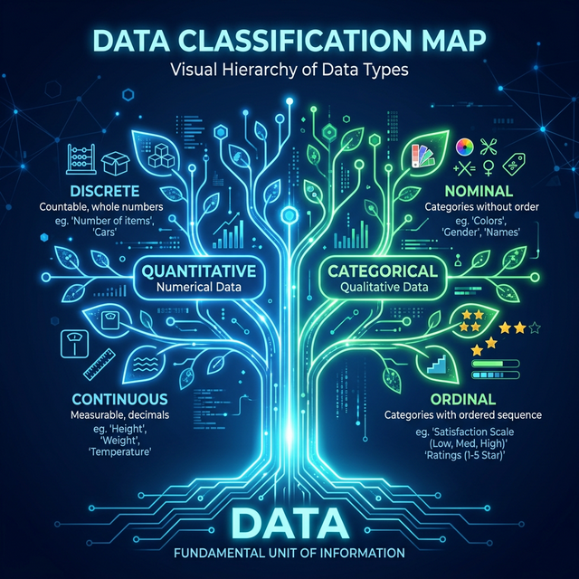

# 1.4.4 데이터의 중요성과 세분화

## 학습목표
본 장에서는 텍스트 마이닝을 통한 정성적 데이터 분석의 중요성을 짚어보고, 정량적(수치형) 데이터의 세분화된 나무 구조인 **연속형(Continuous)/이산형(Discrete)**과 컴퓨터가 카테고리를 인식하는 **명목형(Nominal)**의 개념을 명확히 분류하고 이해합니다.
## 현대 분석에서의 정성적 데이터의 중요성

과거 컴퓨터는 숫자(정량적)만 계산할 줄 알았지만, 지금은 챗GPT 같은 AI의 발달로 수십만 개의 '상품 리뷰 글(정성적 데이터)'을 분석해 "이 상품에 대한 사람들의 반응은 긍정 80%, 부정 20% 입니다"라고 변환해 냅니다. 

이를 텍스트 마이닝(Text Mining)이라고 부릅니다. 

## 데이터 나무의 가지치기: 정형 데이터의 세분화

방금 배운 '숫자형(정량적)' 데이터 안에서도 특징에 따라 이름표를 달리 붙여줍니다. 

우리가 컴퓨터에게 평균을 구하게 할 것인지, 아니면 그냥 개수만 세게 할 것인지 명확히 가르쳐줘야 컴퓨터가 헷갈리지 않기 때문입니다.

데이터 분석가는 크게 수치형(Numeric)과 범주형(Categorical)으로 나무를 나눕니다.

## 수치형 데이터 1: 연속형(Continuous)

끊어지지 않고 소수점 끝까지 무한하게 이어지는(연속되는) 숫자 데이터입니다.

- 사람의 키 (173cm, 173.5cm, 173.56cm...)
- 온도 (24.1도, -5.3도)

이러한 **연속형 데이터**는 더하거나 평균을 내는 덧셈, 뺄셈, 나눗셈 계산이 완벽하게 성립합니다.

## 수치형 데이터 2: 이산형(Discrete)

주사위를 굴릴 때 나오는 눈의 수처럼, 1개, 2개, 3개 딱딱 셀 수 있게 끊어지는 숫자입니다.

- 우리 집 강아지 마리 수 (1.5마리는 불가능하죠?)
- 홈페이지 방문자 수 (1,024명)

이러한 **이산형 데이터** 역시 평균이나 총합을 구하는 계산이 전부 가능합니다.

## 범주형 데이터 1: 명목형(Nominal)

범주형은 말 그대로 카테고리(범주)를 나누는 데이터입니다. 첫 번째로 **명목형(Nominal)**은 '순서와 높낮이가 없는 순수한 구분'을 위해 번호를 매긴 것입니다.

- 혈액형 (A, B, O, AB)
- 성별 (남=1, 여=2)

여기서 남자가 1, 여자가 2라고 해서 여자가 남자보다 2배 더 높다는 뜻이 아닙니다. 단순히 구분을 위해 표기한 숫자에 불과합니다.

## 정리
컴퓨터는 사람처럼 데이터를 척 보고 스스로 "아 눈금자 수치구나", "아 성별이구나"라고 눈치껏 알아채지 못합니다. 

- **정성적 데이터의 도약**: 과거에는 버려지거나 다루기 힘들었던 리뷰(정성적 데이터)들이, 현재 AI 기술(텍스트 마이닝)의 발달로 기업의 가장 강력한 비즈니스 무기로 진화하고 있습니다.
- **세분화된 데이터의 뼈대**: 데이터는 소수점으로 끝없이 이어지는 **연속형(키, 온도)**과, 딱딱 떨어지게 셀 수 있는 **이산형(강아지 수, 방문자 수)**으로 나뉩니다. 또한 순서나 우위 없이 오직 구분을 위해 이름표(숫자)를 붙인 방식을 **명목형(성별, 혈액형)** 데이터라고 부릅니다.

내 손에 쥐어진 데이터가 이 거대한 데이터 트리(Data Tree)의 어느 나뭇가지에 위치하는지 정확히 짚어낼 수 있어야만, 컴퓨터에게 "단순히 숫자를 모두 더해라" 혹은 "가장 많은 빈도를 찾아라"라는 올바른 계산 명령을 내릴 수 있습니다.
