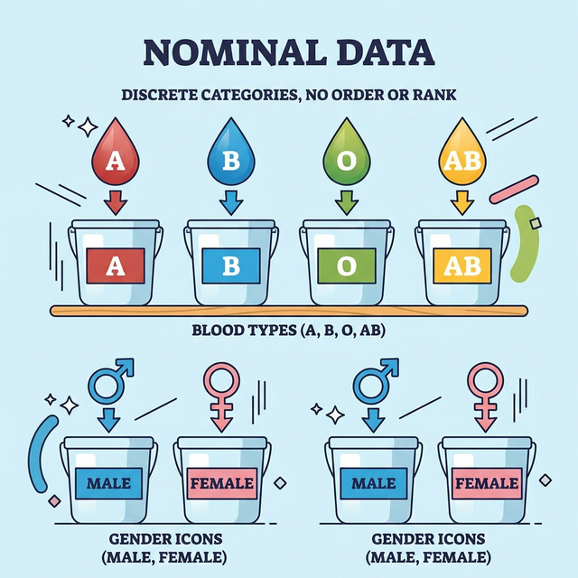
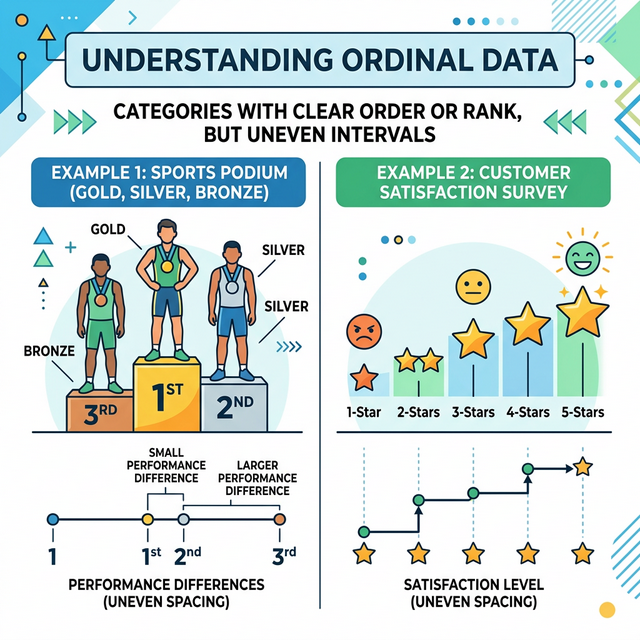

# 1.5.1 개요 및 도입

## 주의! 명목형 숫자는 계산하면 안 돼요
데이터 분석 초보자들이 가장 많이 하는 실수가 바로 이 명목형 숫자를 더하거나 평균을 내버리는 것입니다.

서울(1번), 대전(2번), 부산(3번)이라는 번호표를 보고, (1+2)/2= 1.5번(경기도?) 라는 말도 안 되는 평균값을 도출하면 치명적인 오류가 발생하게 됩니다.

## 범주형 데이터 2: 서열형(Ordinal)
두 번째 범주형은 순서나 '서열(Hierarchy)'이 명확하게 존재하는 카테고리인 **서열형(Ordinal)** 데이터입니다.
- 수능 등급 (1등급, 2등급, 3등급)
- 설문조사 만족도 (아주 불만=1, 불만=2, 보통=3, 만족=4, 아주 만족=5)

## 서열형 데이터의 간격은 다를 수 있다
1등급이 3등급보다 공부를 더 잘한다는 '순위'는 명확하지만, 그 '간격(차이)'이 숫자의 차이와 같지 않습니다.
예를 들어 육상 달리기에서 1등이 10초 만에 들어오고, 2등은 15초, 3등은 30초 만에 들어올 수 있습니다. 순위(1, 2, 3)는 정해졌지만 그들의 실력 차이를 완벽히 비례해서 계산할 수는 없는 데이터입니다.

