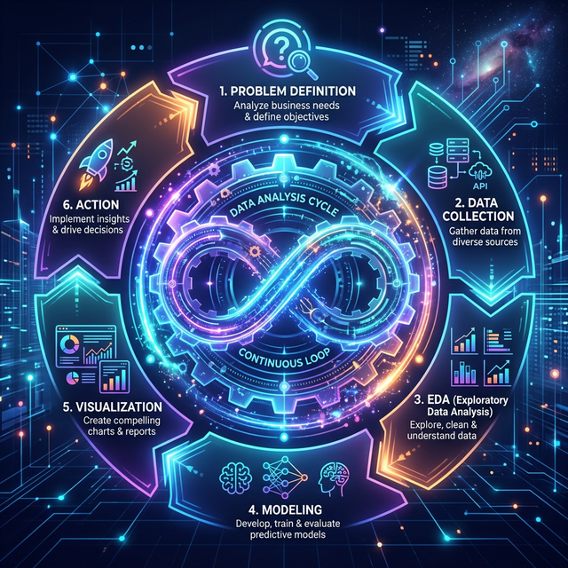

# 1.7.1 개요 및 도입

## 학습목표
본 장에서는 데이터 분석 과정을 요리 레시피처럼 체계적인 6단계 사이클(문제 정의, 수집 및 정제, EDA, 모델링, 시각화, 액션)로 이해하고, 그중 가장 첫 단추이자 결정적인 단계인 '구체적이고 날카로운 문제 정의(Goal Setting)'와 '데이터 수집(Data Preparation)'의 중요성을 파악합니다.
## 시작하며: 분석도 '요리 순서'와 똑같다
유명한 셰프가 맛있는 스테이크를 만들기 위해 레시피 순서를 지키듯, 데이터 분석가도 철저한 6단계 순서에 따라 움직입니다. 고기를 사 오기도 전에 불부터 켜면 안 되듯, 데이터를 모으기도 전에 AI 모델부터 돌리려고 하면 완벽하게 실패하게 됩니다.

## 데이터 분석 6단계 사이클

데이터 분석 6단계는 크게 **1) 문제 정의 -> 2) 데이터 수집 및 정제 -> 3) 탐색적 데이터 분석(EDA) -> 4) 데이터 모델링 -> 5) 결과 시각화 -> 6) 의사결정 및 액션** 이라는 하나의 둥근 톱니바퀴 사이클로 이루어져 있습니다.

## 단계: 문제 정의 (Goal Setting)
가장 중요하지만 초보자들이 가장 많이 빼먹는 단계입니다. "우리 쇼핑몰 고객 데이터를 분석해 보자!"는 틀린 문제 정의입니다. "왜 지난달 20대 여성 고객의 이탈률이 15% 뛰었는가?"처럼 **아주 날카롭고 구체적인 질문**을 던지는 것이 분석의 진짜 첫걸음입니다.

## 잘못된 질문 = 쓸모없는 대답
질문이 날카롭지 않으면 아무리 훌륭한 AI를 써도 바보 같은 결론이 나옵니다. 

"어떻게 하면 돈을 많이 벌까?"라고 물어보면 "열심히 일하세요"라는 뻔한 답이 나오지만, "어떤 시간대에 광고를 틀어야 30대 남성의 클릭률이 방어될까?"라고 물으면 정확한 타겟팅 수치와 해답을 얻을 수 있습니다.

## 단계: 데이터 수집 및 정제 (Data Preparation)
문제를 세웠다면 이제 사냥을 나갈 차례입니다. 엑셀 파일, 회사 데이터베이스(SQL), 인터넷 웹사이트 크롤링 등을 통해 흩어진 데이터를 한곳에 쓸어 담는 과정이 **'수집'**입니다. 하지만 막상 수집한 데이터는 흙 묻은 감자처럼 지저분합니다.

## 정리
데이터 분석은 결코 코딩이나 화려한 AI 기술에서 시작하지 않습니다. 분석의 성패는 컴퓨터 앞에 앉기 전, "우리가 진짜 풀어야 할 문제가 무엇인가?"를 고민하는 **1단계: 문제 정의**에서 90% 이상 결정됩니다.

- **날카로운 질문**: 막연한 질문은 쓸모없는 대답을 낳습니다. 뾰족한 질문을 던져야 정확한 통찰을 얻을 수 있습니다.
- **수집의 현실**: 야생에서 사냥해 온 원시 데이터는 결코 깨끗하지 않습니다. 이 흙 묻은 감자들을 어떻게 다뤄야 할지가 바로 다음 단계의 핵심 과제입니다.

정확한 나침반(문제)을 세웠고 흩어진 데이터(재료)를 모았다면, 이제 본격적인 손질을 시작할 차례입니다.
