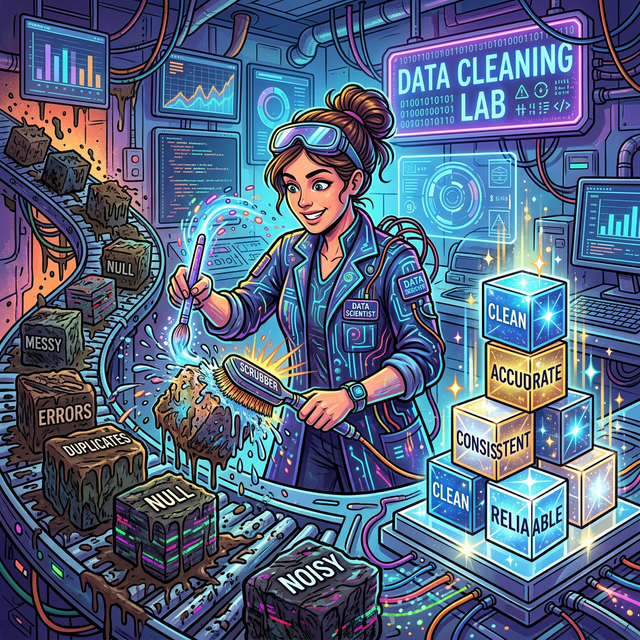
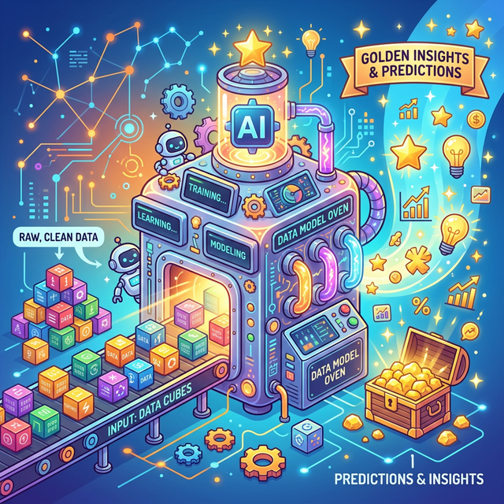

# 1.7.2 전처리: 데이터 분석가의 80% 시간

## 학습목표
본 장에서는 지저분한 원본 데이터를 깨끗하게 다듬는 **전처리(Data Cleaning)** 과정과, 그 데이터 속에 숨겨진 힌트를 찾아내는 **탐색적 데이터 분석(EDA)**의 역할을 배웁니다. 아울러 사람이 직접 규칙을 짜주던 전통적 코딩에서 벗어나, 기계가 스스로 패턴을 찾아내는 **데이터 모델링(머신러닝)**의 혁신적인 패러다임을 이해합니다.

## 데이터 전처리 (Data Cleaning)
수집한 데이터 안에는 오타, 빈칸(결측치), 터무니없는 값(이상치)이 잔뜩 들어있습니다. 
> **결측치(Missing Value)란?**  
> 데이터 수집 과정에서 누락되거나 기록되지 않아 값이 텅 비어있는(Null, NaN 등) 데이터를 말합니다. (예: 설문조사에서 '나이' 응답을 건너뛴 경우)
> 
> **이상치(Outlier)란?**  
> 전체 데이터의 일반적인 패턴이나 분포에서 비정상적으로 뚝 떨어져 있는 극단적인 값을 말합니다. (예: 평균 월급이 300만 원인 집단에 홀로 20억 원을 받는 사람이 섞여 있는 경우)

나이가 999살로 적혀 있거나 성별이 비어 있는 식입니다. 이것들을 씻고 껍질을 벗겨 깔끔하게 다듬는 과정을 **'데이터 정제(전처리)'**라고 하며, 분석가는 전체 업무 시간의 무려 80%를 이 씻는 작업에 씁니다.

## 탐색적 데이터 분석 (EDA)

재료 손질이 끝났다면 이제 탐정처럼 돋보기를 들고 데이터의 구석구석을 자유롭게 헤집어 볼 차례입니다. 

이를 **EDA (Exploratory Data Analysis)**라고 부릅니다. 

평균도 내보고, 막대그래프도 쓱쓱 그려보며 데이터가 가진 '고유의 성격과 패턴'을 파악하는 스케치 단계입니다.

## EDA의 목적: 보이지 않는 힌트 찾기
EDA를 규칙 없이 이것저것 찔러보는 것이라고 오해하면 안 됩니다. 

"어? 대체로 비가 오는 날에 우유 판매량이 떨어지네?"라는 아주 작고 사소한 패턴(힌트)을 직감적으로 잡아내어, 다음 단계인 `모델링에서 어떤 공식을 쓸지 결정하는 가장 창의적인 단계`입니다.

## 단계: 데이터 모델링 (Data Modeling)

이제 본격적인 머신러닝/AI의 등장입니다. 

정제된 데이터를 수학적 공식과 컴퓨터 알고리즘으로 만들어진 **'오븐(Model)'**에 집어넣습니다. 

그러면 이 똑똑한 기계는 데이터의 패턴을 모두 빨아들여 학습한 뒤, "내일의 우유 판매량은 500개일 것이다"라는 황금빛 예측(Prediction)을 구워냅니다.

## 기계가 규칙을 스스로 찾게 하다
전통적인 프로그래밍은 사람이 "만약 A면 B해라"라고 규칙을 다 짜주었습니다. 

그러나 데이터 모델링(머신러닝)은 수백만 개의 A와 B 정답지(데이터)를 통째로 기계에게 던져주어, **기계가 알아서 숨겨진 규칙을 찾아내도록** 훈련시키는 아주 마법 같은 과정입니다.

## 정리
분석의 2단계와 3단계는 화려하진 않지만 분석가의 땀과 직관이 가장 많이 들어가는 영역입니다.

- **전처리의 중요성**: 쓰레기를 넣으면 기계도 쓰레기를 구워냅니다 (GIGO). 실무 분석가의 시간 중 무려 80%가 이 씻고 다듬는 지루한 전처리 과정에 투입됩니다.
- **EDA의 창의성**: 수식과 코딩 이전에, 그래프와 평균값을 쓱쓱 보면서 데이터가 말해주는 아주 사소한 차이점(힌트)을 직감적으로 찾아내는 것이 EDA의 진정한 목적입니다.
- **모델링의 패러다임 전환**: 사람이 룰을 짜주던 시대에서, 기계에게 정답과 데이터를 던져주고 "네가 스스로 규칙을 찾아라"라고 명령하는 머신러닝의 시대로 넘어왔음을 명확히 이해해야 합니다.

잘 손질된 재료(전처리)와 분석가의 예리한 감각(EDA)이 더해져 비로소 인공지능 오븐(모델)은 가장 맛있는 예측 결과물을 구워낼 수 있습니다.
