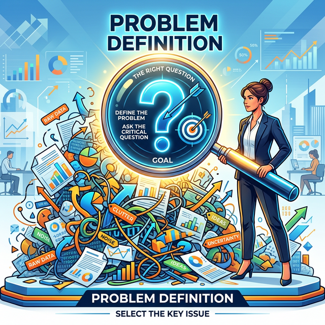

# 1.7.3 5단계: 결과 시각화 및 리포팅 (Delivery)

## 학습목표
본 장에서는 기계가 도출한 복잡한 수학적 결과를 일반인과 의사결정권자가 즉시 직관적으로 이해할 수 있게 번역하는 **도식화(시각화 및 스토리텔링)**의 힘과, 분석의 최종 도착지인 실제적인 **비즈니스 액션(Action)**의 중요성을 배웁니다. 또한 데이터 분석이 일회성이 아닌 무한한 나선형 사이클임을 깨닫습니다.

## 예측 결과 시각화
기계가 복잡한 수학 공식으로 예측을 해냈습니다. 

하지만 사장님(비전문가)에게 "회귀분석 R스퀘어 값이 0.9가 나왔습니다"라고 보고하면 아무도 이해하지 못합니다. 
> "회귀분석 R스퀘어 값이 0.9가 나왔습니다" -> "우리가 세운 예측 모델은 90%의 정확도로 미래를 맞출 수 있습니다!"

이것을 누구나 1초 만에 직관적으로 이해할 수 있는 아름다운 차트와 대시보드로 번역하는 과정이 **'시각화'**입니다.

## 스토리텔링의 마법
단순히 예쁜 차트를 그리는 것이 시각화의 끝이 아닙니다. 왜 이런 결과가 나왔는지, 그래서 어떤 의미가 있는지 **'스토리텔링(이야기)'**을 입혀 상대방의 마음을 움직이고 설득해 내는 과정이야말로 가장 뛰어난 분석가의 필수 역량입니다.

## 단계: 의사결정 및 액션 (Action)
사장님이 여러분의 훌륭한 시각화 보고서를 보고 무릎을 탁 칩니다. "좋아, 비 오는 날에는 매장 앞 우유 매대를 치우고 파전을 진열하자!" 이렇게 데이터가 현실 세계의 실제적인 **'행동(Action)'과 '가치 창출'**로 이어지는 이 마지막 단계가 없다면, 앞선 1~5단계는 모두 쓸모없는 헛수고입니다.

## 사이클은 멈추지 않는다
파전을 진열했더니 정말로 매출이 올랐는지, 아니면 예측이 틀렸는지 데이터를 다시 수집합니다. 그리고 다시 1단계(문제 정의)로 돌아가 더 날카로운 질문을 던집니다. 분석의 6단계는 일회성이 아니라 무한히 회전하며 발전하는 나선형 사이클입니다.

## 정리
데이터 분석의 대미를 장식하는 5단계와 6단계는 "그래서 어쩌라고?"라는 질문에 명확한 답을 내리는 과정입니다.

- **스토리텔링의 힘**: 0.9라는 R스퀘어 수치는 사장님을 설득할 수 없습니다. 화려한 수학 공식보다, 상대방의 마음을 움직이는 시각적이고 논리적인 **스토리텔링** 역량이 분석가의 진짜 몸값입니다.
- **가치 창출의 본질**: 아무리 위대한 AI 모델을 돌렸어도, 그것이 매장 앞 파전 매대 위치를 바꾸는 식의 실제적인 **행동(Action)**으로 이어지지 않는다면 그 분석은 실패한 것입니다.
- **무한한 사이클**: 6단계 액션이 끝나면 새로운 데이터가 쌓입니다. 우리는 이를 바탕으로 다시 1단계로 돌아가 더 깊은 통찰을 위한 질문을 던지게 됩니다. 

데이터 분석은 결여된 무언가를 채우고 비즈니스를 굴러가게 만드는 영원히 멈추지 않는 통찰의 바퀴입니다.
