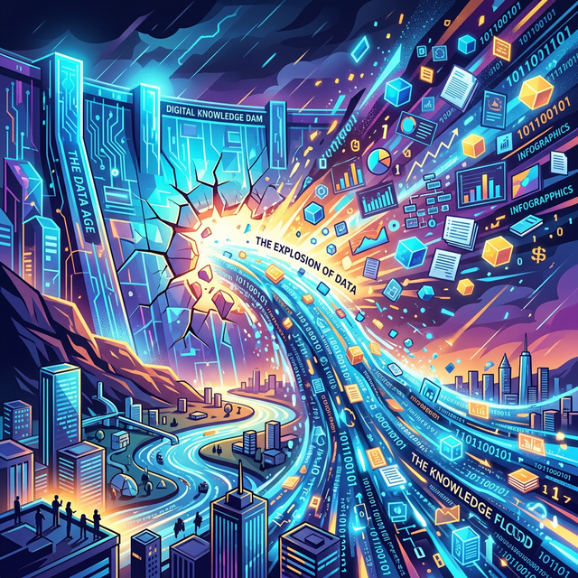

# 1.8.1 개요 및 도입

## 학습목표
본 장에서는 4차 산업혁명과 사물인터넷(IoT)의 발달로 촉발된 전 세계적인 데이터 폭발 현상을 이해하고, 이 거대한 '데이터 댐'의 붕괴가 현대 사회에 미치는 파급력과 **빅데이터(Big Data)**의 근본적인 개념을 재정립합니다.

## 들어가는 말: 터져버린 데이터 댐
과거에는 도서관에 가야만 지식을 얻을 수 있었습니다. 하지만 오늘날 스마트폰과 사물인터넷(IoT)이 보급되면서, 전 세계의 데이터 댐이 완전히 붕괴되었습니다. 

인류 역사상 그 어느 때보다 방대한 양의 '디지털 지식'이 쏟아져 내리고 있는 시대입니다.

## 폭발하는 데이터의 바다: 빅데이터(Big Data)

우리가 유튜브를 보고, 교통카드를 찍고, 친구에게 웃는 이모티콘을 보낼 때마다 눈에 보이지 않는 거대한 '데이터 발자국'이 1초에 수억 개씩 찍힙니다. 이처럼 감당할 수 없을 만큼 방대하고 복잡하게 얽혀 있는 거대한 데이터의 집합체를 우리는 **빅데이터(Big Data)**라고 부릅니다.

## 정리
우리는 인류 역사상 전례 없는 지식의 홍수, 이른바 '데이터 댐이 터져버린 전천후 디지털 시대'에 살고 있습니다.

- **데이터 폭발의 시대**: 과거처럼 책과 도서관에 정제된 지식만 있는 것이 아니라, 스마트폰 터치, 출퇴근 기록, 대화 내역 등 우리의 모든 일상이 폭발적인 데이터 발자국으로 남겨지고 있습니다.
- **빅데이터의 본질**: 이렇게 끝없이 쏟아지고 복잡하게 얽혀서 일반적인 컴퓨터로는 저장하거나 감당할 수 없는 거대한 정보의 바다를 '빅데이터'라고 부릅니다.

이 막대한 바다는 가라앉을 위기가 될 수도 있지만, 누군가에게는 새로운 기회를 건져 올릴 수 있는 무한한 자원의 보고(寶庫)입니다.
