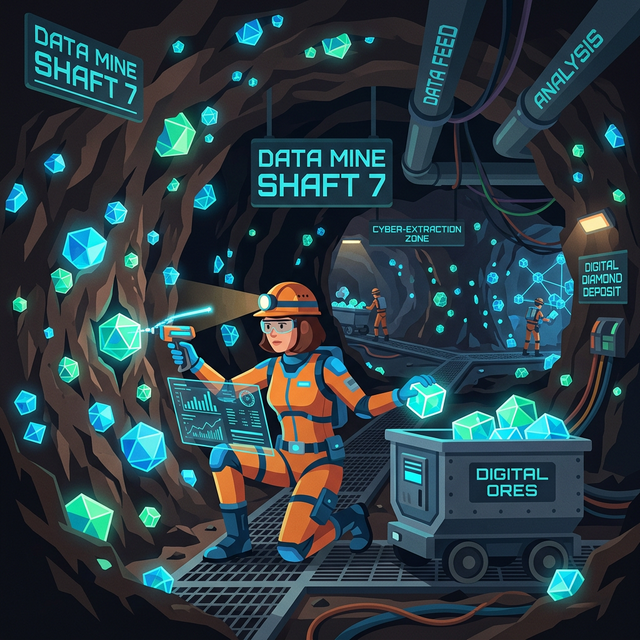
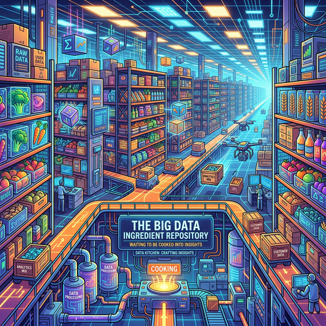

# 1.8.2 빅데이터와 데이터 분석의 관계 (광산과 광부)
빅데이터 그 자체는 아직 캐내지 않은 커다란 거친 '다이아몬드 광산'과 같습니다. 돌무더기를 그냥 놔두면 아무 쓸모가 없고 하드디스크 용량만 차지합니다.

광산(빅데이터) 속에 숨겨진 금가루(인사이트)를 찾아내기 위해 파이썬이라는 곡괭이를 들고 들어가는 광부가 바로 **데이터 분석가**입니다.

## 맛있는 요리를 위한 거대한 식재료 창고
다른 비유를 들어볼까요? 빅데이터는 세상의 모든 식재료가 산처럼 쌓여 있는 '무한대의 식자재 창고'입니다. 

그리고 데이터 분석은 그 재료들 중 가장 신선한 토마토와 양파를 골라내어 '최고급 파스타'라는 결론(지혜)을 만들어내는 **현대판 마법 요리 기술**입니다.

