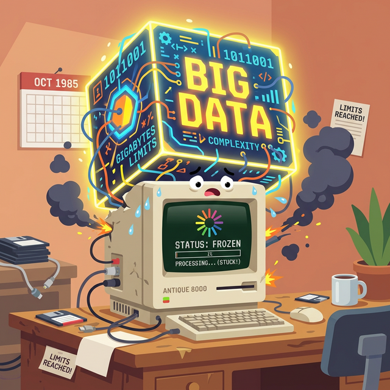
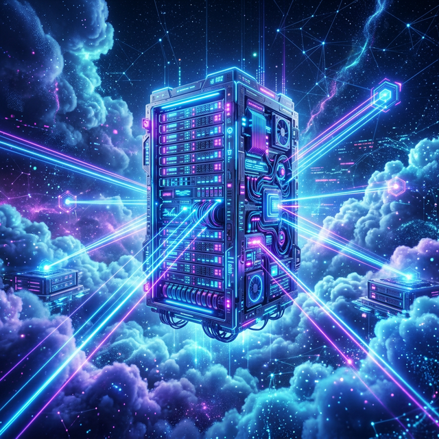

# 1.8.3 기존 분석을 가로막던 장벽

## 학습목표
본 장에서는 과거 방대한 양의 빅데이터 분석을 주저앉혔던 하드웨어의 한계점(컴퓨팅 파워 부족)을 알아보고, 이를 완벽하게 해결하여 현재의 인공지능(AI) 혁명을 촉발시킨 두 가지 핵심 인프라 기술인 **클라우드 컴퓨팅(Cloud Computing)**과 **GPU 연산**의 역할을 명확히 이해합니다.

불과 10년 전만 해도 이 거대한 빅데이터를 다루는 것은 불가능에 가까웠습니다. 데이터가 너무 많아서 일반 컴퓨터 여러 대를 엮어도 며칠 동안 계산이 끝나지 않고 멈춰버렸기 때문입니다. 방대한 재료는 모였지만 불을 지필 가스레인지(컴퓨팅 파워)가 턱없이 부족했습니다.

## 클라우드 컴퓨팅과 GPU의 구원
이 한계를 돌파하게 해 준 일등 공신이 바로 아마존(AWS), 구글(GCP) 같은 **클라우드 서버**와 엔비디아(NVIDIA)의 **GPU 칩셋**입니다. 수천, 수만 대의 컴퓨터 파워를 버튼 하나로 빌려 쓰고, 수만 개의 연산을 동시에 처리하면서 빅데이터 시대의 진정한 봉인이 해제되었습니다.

## 정리
뛰어난 분석 이론과 방대한 데이터가 존재했음에도 불구하고, 과거의 분석가들은 턱없이 부족한 컴퓨터의 연산 속도라는 물리적 장벽에 부딪혀 좌절했습니다.

- **컴퓨팅 파워의 한계 돌파**: 이 답답한 병목을 시원하게 뚫어준 구원투수가 바로 거대한 서버를 인터넷으로 빌려 쓰는 '클라우드 컴퓨팅(Cloud Computing)'과 수만 개의 단순 계산을 동시에 처리해 내는 엔비디아의 'GPU 칩셋'입니다.
- **빅데이터 르네상스**: 누구나 대형 슈퍼컴퓨터를 구매하지 않고도 AWS, GCP 등의 버튼 하나만 클릭하면 클릭 몇 번으로 무한대에 가까운 계산 능력을 대여할 수 있는 시대가 열렸습니다.

하드웨어와 인프라의 극적인 진화 덕분에, 잠들어 있던 머신러닝 알고리즘과 거대한 데이터 광산이 비로소 활화산처럼 폭발할 수 있는 진정한 기술의 대통합 시대가 도래했습니다.
