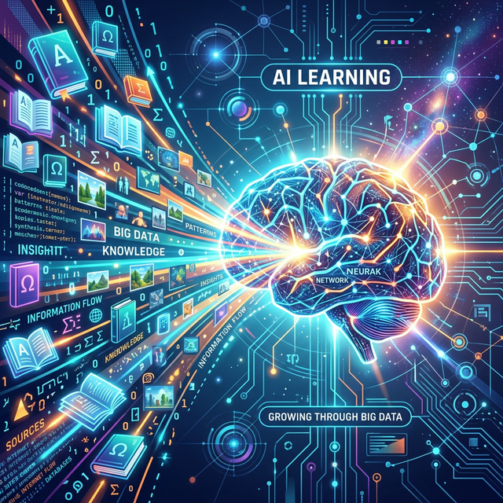
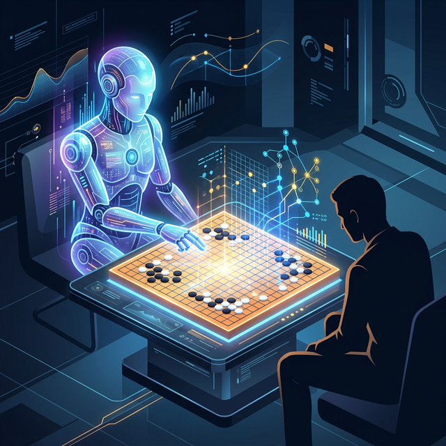

# 1.9.1 개요 및 도입

## 빅데이터와 인공지능(AI)은 단짝 친구!
데이터 분석을 통해 수작업으로 금가루를 캐다 보면, 사람의 머리나 기초적인 파이썬 공식만으로는 도저히 패턴을 찾아낼 수 없을 만큼 차원과 변수가 복잡해지는 순간이 옵니다. 이때 인간의 뇌신경 구조를 모방하여 스스로 패턴을 찾는 **인공지능(AI)**이 무대 위로 등장합니다.

## 밥과 로봇: AI는 빅데이터를 먹고 자란다

수만, 수십만 장의 고양이 사진과 강아지 사진(빅데이터)을 AI에게 쉼 없이 보여주고 학습시킵니다. "이게 고양이 털이야, 이건 강아지 귀야"를 기계가 스스로 깨치게 만드는 것입니다. 즉, **빅데이터는 인공지능을 완벽하게 키워내는 유일하고도 가장 맛있는 밥(교과서)**입니다!

## 사람이 할 수 없는 영역 (알파고의 등장)
2016년, 이세돌 9단과 바둑 대결을 펼친 '알파고'를 기억하시나요? 알파고는 인간이 평생을 살아도 다 두지 못할 3천만 판 이상의 바둑 기보(빅데이터)를 순식간에 혼자 두고 학습했습니다. 방대한 양의 데이터 확보가 AI의 지능을 얼마나 인간 이상으로 폭발시킬 수 있는지 보여준 강력한 사례입니다.

