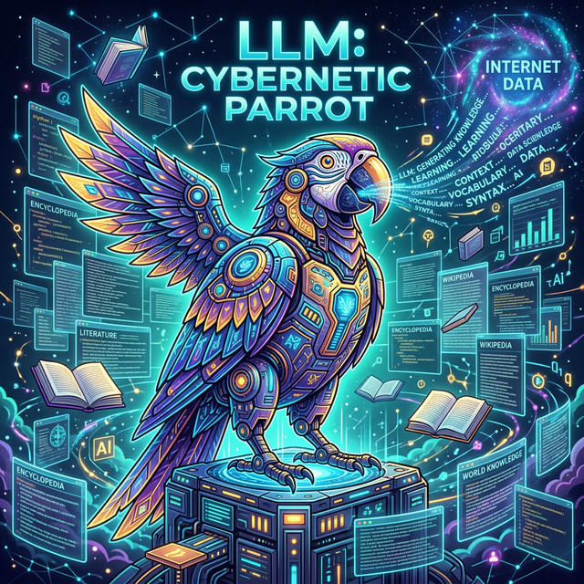

# 1.9.2 AI가 만드는 넷플릭스 유니버스

## 학습목표
본 장에서는 정해진 선택지 중에서 정답만 골라내던 과거의 '판별형 AI'에서, 무에서 유를 창조하는 최신 **'생성형 AI(Generative AI)'**로의 극적인 진화 과정을 파악합니다. 나아가 챗GPT와 같은 대화형 AI의 심장인 **대규모 언어 모델(LLM)**의 기본 개념과 그 파급력을 이해합니다.

여러분이 넷플릭스를 켜면 메인 화면이 사람마다 모두 다릅니다. 이 AI 추천 시스템은 전 세계 2억 명의 유저들이 '어떤 장면에서 일시 정지를 눌렀는지', '어느 편 영상에서 하차했는지'를 초 단위 빅데이터로 분석하여 귀신같이 내 취향에 맞는 영화 표지를 합성해 띄워줍니다. 

## 인공지능의 진화: 판별형에서 생성형으로
알파고 시대의 AI는 주어진 사진을 보고 "이건 암세포입니다" 혹은 "이건 강아지입니다"라고 기존의 정답을 가려내는 **판별형 AI**에 가깝습니다. 하지만 최근 2~3년 사이, 인류 역사상 가장 놀라운 진화인 **생성형 AI(Generative AI)**의 빗장이 열리기 시작했습니다.

## 생성형 AI란 무엇인가?
만들어져 있는 것 중 정답을 고르는 것이 아니라, 세상에 없던 새로운 그림을 1초 만에 뚝딱 그려내고(미드저니, 달리), 단 한 번도 쓰인 적 없는 새로운 작곡을 하며, 소설을 써 내려가는 '창조적인 기계'를 말합니다. 이 생성형 AI 열풍의 중심에 바로 챗GPT가 있습니다.

## 챗GPT와 LLM(대규모 언어 모델)의 정체
최근 전 세계의 일자리를 위협할 만큼 똑똑해진 챗GPT는 도대체 정체가 무엇일까요?
이 기술의 뼈대를 **LLM (Large Language Model, 대규모 언어 모델)**이라고 부릅니다. 말 그대로 엄청나게 거대한 언어 지식을 흡수한 모델입니다.

## 정리
인공지능의 역사는 치열한 진보의 연속이었습니다.

- **패러다임의 진화**: "이것은 암세포인가, 아닌가?"를 가려주던 보조자 역할(판별형 AI)에서 벗어나, 이제 인공지능은 아예 세상에 없던 새로운 그림과 음악, 소설을 창조해 내는 '생성형 AI(Generative AI)' 시대로 접어들었습니다.
- **문명을 뒤흔든 LLM**: 이 생성형 혁명에 정점을 찍은 기술이 바로 챗GPT(ChatGPT)의 핵심인 **대규모 언어 모델(LLM)**입니다.

인간의 가장 고유한 영역이라 믿었던 '창의성'마저 모방해 내는 이 놀라운 기술의 실체와 뼈대를 마주하면서, 우리는 데이터 분석과 AI가 뭉쳐서 만들어낸 가장 거대한 마법인 LLM의 세계로 성큼 들어서게 되었습니다.
