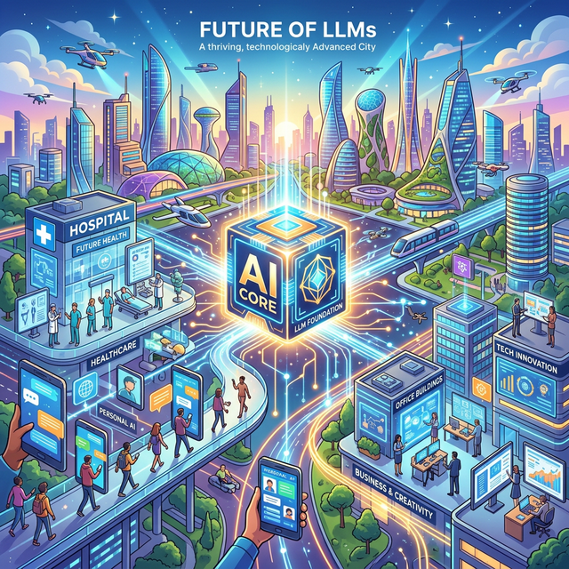

# 1.9.3 거대한 앵무새 모델 (LLM의 원리)
인터넷에 존재하는 전 세계의 수십억 권 분량 위키백과, 뉴스 기사, 카페 글(텍스트 빅데이터)을 통째로 이 AI에게 욱여넣습니다. 그리고 "다음에 올 가장 자연스러운 단어가 무엇일까?"를 확률적으로 계속 찍어 맞히도록 훈련받은 아주 똑똑하고 말문이 트인 '슈퍼 초거대 앵무새'가 바로 LLM입니다.

## 맥락을 이해하는 기계
과거 챗봇인 '심심이'는 정해진 문장에만 대답할 줄 알았습니다. 하지만 LLM은 말의 '맥락'을 꿰뚫습니다. "나는 배가 고파서 냉장고를..."이라는 문장을 주면 뒤에 "...열었다"라는 확률적 조합을 인간보다 더 창의적이고 빠르고 정확하게 완성해 냅니다.

## 미래를 연결하는 LLM 유니버스

이제 LLM은 단순히 채팅창 안에 머물지 않습니다. 여러분의 핸드폰 비서가 되고, 회사에서는 자동으로 이메일을 요약해 답장을 써주며, 병원에서는 의사를 보조해 환자의 10년 치 진료 기록을 단 3초 만에 요약해 줍니다. 인간의 모든 지적 노동이 LLM과 연결되는 미래 도시가 코앞으로 다가왔습니다.

## 놀라운 반전: 모든 것은 '데이터 분석'이었다
이 화려한 AI와 챗GPT도 결국 1~3교시 과정 내내 우리가 반복했던 **"데이터 수집 -> 전처리(결측치 제거) -> 모델 학습"** 이라는 빅데이터 분석 6단계 사이클을 무식할 정도로 엄청나게 크고 거대하게 돌린 결과물에 불과합니다. 원리는 완벽히 동일합니다.

