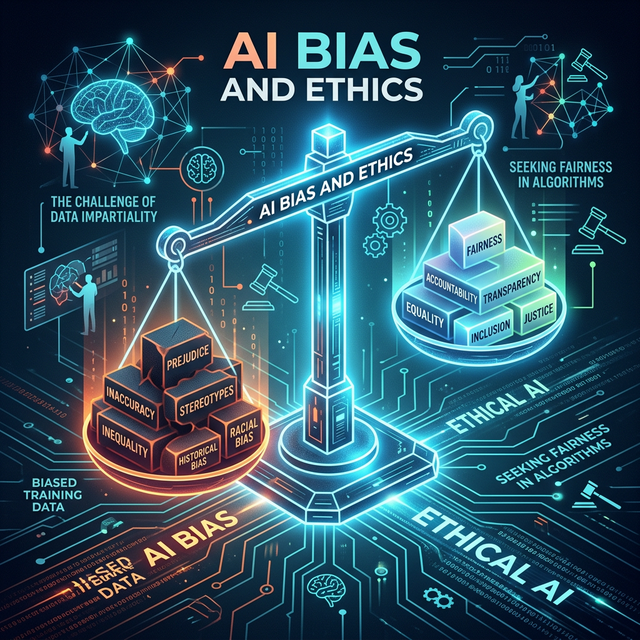
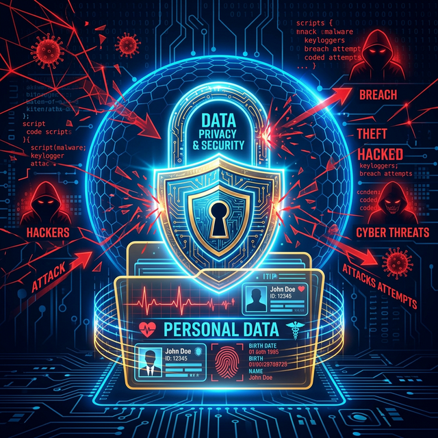

# 1.10.2 윤리 문제: AI의 편향성 (Bias)

## 학습목표
본 장에서는 방대한 데이터가 초래할 수 있는 치명적인 알레르기 반응인 'AI의 편향성(Bias)'과 '프라이버시 침해'의 윤리적 딜레마를 학습합니다. 나아가 데이터와 AI가 융합되어 폭발하는 미래 산업(메타버스, 디지털 트윈, 자율주행)의 놀라운 청사진을 엿봅니다.

빅데이터 시대의 어두운 면도 짚고 넘어가야 합니다. 백인 남성의 얼굴 데이터만 잔뜩 학습한 인공지능 안면인식 카메라는 흑인이나 동양인의 얼굴을 도둑범으로 잘못 식별하는 끔찍한 윤리적 오류(편향성)를 범하기도 합니다.

## 불법 수집과 개인정보(Privacy) 침해
나의 쇼핑 장바구니 리스트와 심박수 데이터는 누구의 소유일까요? 기업들이 개인의 피같이 소중한 사생활 데이터를 몰래 수집하여 무단으로 AI를 학습시키는 프라이버시 침해 문제는, 현재 전 세계 각국 정부가 가장 치열하게 싸우며 법을 만들고 있는 빅이슈입니다. 

## 분석가에게 요구되는 높은 윤리 의식
여러분이 훗날 멋진 분석가가 되어 1,000만 명의 개인정보에 접근할 수 있는 권한을 얻게 된다면 어떻게 해야 할까요? 한 줄의 코드로 세상에 편견을 조장하거나 누군가의 삶을 베어버릴 수 있는 무서운 무기이기에, 데이터 분석가에게는 고도의 깐깐한 도덕성과 정보 보호 윤리가 요구됩니다.

## 미래 산업 스케치 1: 메타버스와 디지털 트윈
데이터와 AI가 융합된 미래는 어떤 모습일까요? 도로와 횡단보도의 물리적인 교통 데이터를 통째로 복사해서 컴퓨터 가상현실(메타버스)에 똑같은 '쌍둥이 도시(디지털 트윈)'를 지어버립니다. 이를 통해 10년 뒤의 교통체증 발생 위치를 미리 시뮬레이션하고 대비할 수 있습니다.

## 미래 산업 스케치 2: 자율주행 자동차
테슬라 자동차가 운전대 없이 거리를 활보할 수 있는 이유는, 차에 달린 8개의 카메라가 1초에 수백 장씩 찍어 올리는 이미지 빅데이터를 중앙 신경망 AI가 실시간 연산하여 차선과 사람을 정확히 인지하기 때문입니다. 데이터 전송 속도가 0.1초라도 딜레이되면 엄청난 사고가 벌어지겠죠. 5G 통신 기술과 빅데이터의 절묘한 만남입니다.

## 정리
우리가 매일 사용하는 첨단 AI 기술의 이면에는 데이터를 다루는 자가 반드시 짊어져야 할 무거운 윤리적 책임이 도사리고 있습니다.

- **편향의 경계**: 쓰레기 데이터를 먹은 AI는 차별과 편견이라는 독을 내뿜습니다. 수천만 명의 운명을 좌우할 권한을 가진 분석가에게 가장 우선으로 요구되는 덕목은 깐깐한 도덕성과 정보 보호 의식입니다.
- **디지털 대통합의 미래**: 윤리적 안전장치가 마련된 데이터를 기반으로, 미래는 쌍둥이 가상 도시(디지털 트윈)를 짓고 스스로 달리는 5G 자율주행차를 제어하는 '초연결 융합의 시대'로 돌진하고 있습니다.

데이터의 투명성과 윤리를 통제할 수 있는 분석가만이 이 경이로운 미래 산업인 사이버 유토피아를 설계할 진정한 자격을 얻게 됩니다.
