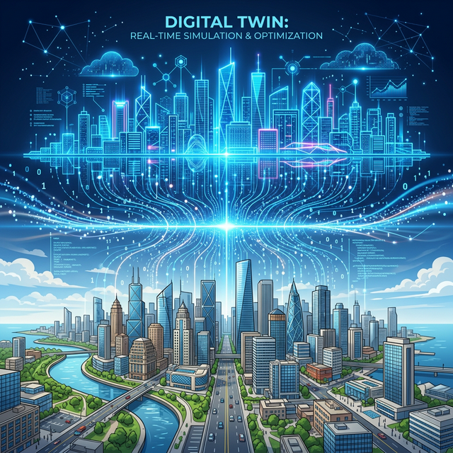

# 1.10.3 한계 없는 융합 생태계

## 학습목표
본 장에서는 지금까지 배운 빅데이터, 클라우드, AI 구조의 본질적 통찰을 바탕으로 전공과 직업의 경계가 무너진 '무한 융합 생태계'를 조망합니다. 파이썬(Python)이라는 절대 반지가 단순한 IT 기술을 넘어, 여러분의 고유한 전공 지식을 폭발시킬 마스터 키(Master Key)임을 굳게 다집니다.

과거의 직업은 정해진 파이프라인에서만 일했습니다. 하지만 이제는 요식업 사장님과 AI 엔지니어가, 패션 디자이너와 빅데이터 마케터가 국경 없이 만나 융합 생태계를 창조하고 엄청난 부가가치를 뿜어냅니다. 그 교집합에 서 있어야만 살아남습니다.

여러분은 파이썬이라는 언어를 단순히 '어려운 IT 자격증 따기용'으로만 생각하지 않길 바랍니다. 이것은 여러분의 본전공 지식 툴킷 위에 결합시켰을 때 폭발적인 시너지를 일으켜주는, 현대 사회 100만 명의 지문을 모두 알아내는 가장 강력한 스마트 열쇠(Master Key)입니다. 

이번 주 긴 1~4교시 오리엔테이션을 통해 데이터가 왜 필요하고 어떻게 진화되는지, 14주의 6단계 로드맵은 어떠한지, 그리고 종착역인 AI 시대에서 우리의 스탠스를 거시적으로 완벽히 조망했습니다. 모험을 떠날 동기부여가 잘 되셨나요?
다음 2주차부터는 머리 아픈 철학 대신 짜릿하고 명쾌한 구체적인 파이썬 코드 실습과 함께 본격적인 훈련소 훈련에 돌입하도록 하겠습니다. 대단히 감사합니다!

## 오리엔테이션 대단원 정리
지금까지 우리는 감당할 수 없을 만큼 쏟아지는 **빅데이터(Big Data)**의 시대적 배경과, 이를 다루기 위해 발전한 **클라우드 컴퓨팅 및 GPU** 기술의 맥락을 살펴보았습니다. 또한, 방대한 데이터를 거름 삼아 스스로 학습하고 진화한 **인공지능(AI)**, 특히 창조적 혁신을 이끄는 **생성형 AI(Generative AI)**와 **대규모 언어 모델(LLM)**의 원리를 이해했습니다. 

- **조종사의 3대 무기**: 뛰어난 AI 시대일수록 기계에 끌려다니지 않고 이를 통제하기 위해서는, 나만의 전문적인 **도메인 지식(Domain Knowledge)**, 정확한 지시를 내리는 **프롬프트 엔지니어링**, 그리고 AI의 거짓말(환각) 밎 편향성을 꿰뚫어 볼 수 있는 **데이터 리터러시와 윤리 의식**이 반드시 필요합니다. 
- **절대 반지, 파이썬**: 단순한 지식 스크랩을 넘어 메타버스와 디지털 트윈, 자율주행 등 한계 없는 미래 융합 생태계로 나아가기 위한 가장 기본적이고 강력한 마스터 키(Master Key)가 바로 여러분이 앞으로 배우게 될 **파이썬 연산 및 데이터 분석 기술**입니다. 

길었던 이론적 나침반 훈련을 모두 마쳤습니다. 다음 시간부터는 머리 아픈 철학을 벗어나, 우리 손에 직접 이 강력한 무기를 쥐여줄 명쾌한 **파이썬 기초 실습 훈련소**에 본격적으로 돌입해 보겠습니다. 대단히 수고하셨습니다!
