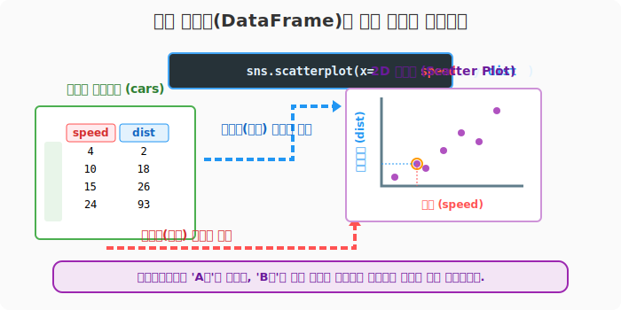
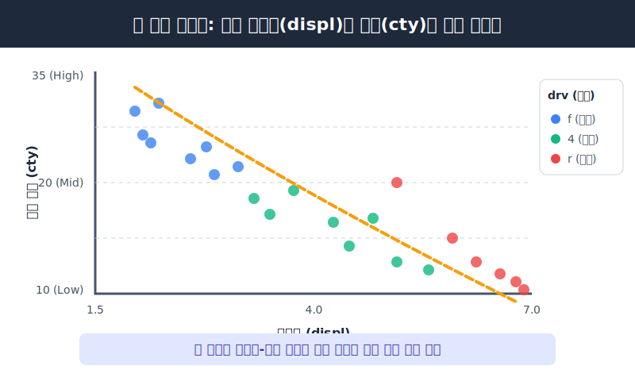

# 5.0.3 토이 데이터(Toy Data) 소환과 2D 맵핑 기초

앞서 설치한 `pydataset` 라이브러리를 사용하면 지루한 CSV 저장/불러오기 과정을 생략하고, 전 세계 데이터 사이언티스트들이 튜토리얼용으로 공통으로 사용하는 고품질 장난감 데이터(Toy Data)를 즉시 메모리에 올려서 시각화 실습에 집중할 수 있습니다.

> 💾 **[실습 파일 다운로드]**
> 본 강의의 전체 실습 코드를 직접 실행해 볼 수 있는 주피터 노트북 파일입니다. 아래 링크를 클릭하여 다운로드 후 VS Code에서 열어보세요.
> - [📥 toy_data_practice.ipynb 파일 다운로드](./toy_data_practice.ipynb) (클릭 또는 마우스 우클릭 후 '다른 이름으로 링크 저장')

## [실습] pydataset 전체 데이터셋 목록 확인

`pydataset` 안에는 무려 757종의 데이터가 들어 있습니다. 어떤 데이터가 있는지 `data()` 명령어로 탐색해 보겠습니다.

> **🚨 트러블슈팅: `ModuleNotFoundError` 에러가 발생할 때**
> 
> 실습 코드를 실행할 때 `No module named 'pydataset'`과 같은 에러가 뜬다면, 현재 사용 중인 파이썬 환경에 라이브러리가 없는 것입니다. 이럴 땐 코드 최상단 셀이나 터미널에서 아래 명령을 한 번 실행하여 패키지를 설치해 주세요.
> 
> `%pip install pydataset matplotlib seaborn pandas`

```python
from pydataset import data 

# 함수의 인자를 비워두면, 제공하는 전체 데이터셋 목록표가 DataFrame으로 나옵니다.
all_data = data()
print(all_data.head())
```
**[출력 결과]**
```text
      dataset_id                                              title
0  AirPassengers       Monthly Airline Passenger Numbers 1949-1960
1        BJsales                 Sales Data with Leading Indicator
2            BOD                         Biochemical Oxygen Demand
3   Formaldehyde                     Determination of Formaldehyde
4   HairEyeColor         Hair and Eye Color of Statistics Students
```

---

## [실습] `cars` (자동차 제동거리) 데이터 뽑아오기

가장 기초적인 인과관계를 나타내는 `cars` 데이터를 불러와서, `speed`(달리던 속도)와 `dist`(브레이크 밟고 멈출 때까지 미끄러진 제동거리)의 관계를 확인해 보겠습니다.

```python
# 'cars'라는 문자열을 넘기면, 해당 데이터가 2차원 표(DataFrame)로 뽑혀 나옵니다!
cars = data('cars')
print(cars.head())
```
**[출력 결과]**
```text
   speed  dist
1      4     2
2      4    10
3      7     4
4      7    22
5      8    16
```
> **수학적 의미 해석**: `speed` 4mph로 달리던 첫 번째 차는 브레이크를 밟고 2피트(ft)만에 멈췄고, `speed` 7mph로 달리던 네 번째 차는 무려 22피트나 미끄러졌음을 의미합니다.

## 차트 도화지(2D 공간)에 표 데이터 매핑(Mapping)하기

이 DataFrame을 `matplotlib`이나 `seaborn`에 넘겨주어 "스피드를 X축(가로)으로 삼고, 미끄러진 거리를 Y축(세로)으로 삼아 교차하는 지점에 점을 찍어줘!" 라고 선언하면 산점도(Scatter Plot)가 그려집니다.



```python
import matplotlib.pyplot as plt
import seaborn as sns

# Seaborn 마법 지팡이(템플릿)를 사용하여 점을 찍습니다.
# (데이터를 넣어도 되고, 판다스 시리즈 객체를 직접 지정해도 됩니다)
sns.scatterplot(x=cars['speed'], y=cars['dist'])

# 모니터에 지금까지 도화지에 그렸던 그림들을 출력하라!
plt.show() 
```

> **[시각화 꿀팁] 주피터 노트북 한글 폰트 & 화질 향상**
>
> 시각화 중 지역명 같은 한글이 네모(ㅁㅁ)로 깨진다면, 스크립트 최상단에 다음 환경설정 부적을 붙여주세요.
> ```python
> plt.rcParams['font.family'] = 'Malgun Gothic' # 윈도우(맑은고딕) / 맥(AppleGothic)
> plt.rcParams['axes.unicode_minus'] = False     # 마이너스(-) 기호 깨짐 방지
> %config InlineBackend.figure_format = 'retina' # 모니터 출력 화질 2배 강화
> ```

---

## [실습] `mpg` (다차원 자동차 연비) 데이터와 군집 시각화

조금 더 속성이 많은 `mpg` 데이터를 꺼내보겠습니다.

```python
mpg = data('mpg')
print(mpg.head())
```
**[출력 결과]**
```text
  manufacturer model  displ  year  cyl       trans drv  cty  hwy fl    class
1         audi    a4    1.8  1999    4    auto(l5)   f   18   29  p  compact
2         audi    a4    1.8  1999    4  manual(m5)   f   21   29  p  compact
...
```

- **displ (Displacement)**: 자동차 배기량 (엔진 크기)
- **cty (City)**: 도심 주행 연비 (1갤런당 달리는 거리)
- **drv (Drive)**: 구동 방식 (f: 전륜, r: 후륜, 4: 사륜)

단순히 배기량(X축)과 연비(Y축)만 점으로 그리지 않고, `seaborn`만의 강력한 기능인 **`hue` (색상 매핑)** 를 사용하여 **색상**이라는 3번째 차원을 그래프에 입힐 수 있습니다.

```python
# hue 옵션에 'drv(구동 방식)' 컬럼을 지정하면, 구동 방식별로 알아서 그룹핑하여 색상을 다르게 칠해줍니다!
sns.scatterplot(data=mpg, x='displ', y='cty', hue='drv')
plt.show()
```



- 점이 우하향으로 분포합니다. 즉, 엔진이 무식하게 클수록(배기량 증가) 기름을 엄청나게 먹는다(연비 최악)는 당연한 **자연의 법칙**을 눈으로 증명할 수 있습니다.
- 파란색(전륜, f) 차들이 주로 좌상단(가볍고 연비 좋음)에 몰려 있고, 초록색(사륜, 4) 차들이 우하단(무겁고 연비 나쁨)에 밀집해 있는 것을 알 수 있습니다.
