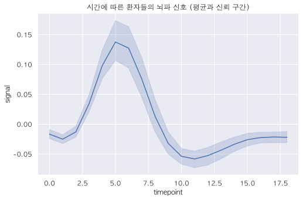
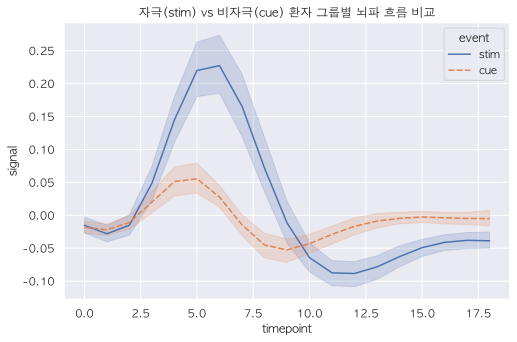

# 5.1.2 Seaborn 선 그래프와 신뢰 구간의 마법

> 💾 **[실습 파일 다운로드]**
> 본 강의의 전체 실습 코드를 직접 실행해 볼 수 있는 주피터 노트북 파일입니다. 아래 링크를 클릭하여 다운로드 후 VS Code에서 열어보세요.
> - [📥 seaborn_lineplot_practice.ipynb 파일 다운로드](./seaborn_lineplot_practice.ipynb) (클릭 또는 마우스 우클릭 후 '다른 이름으로 링크 저장')

앞서 배운 5.1.1장에서는 단순히 점 5개를 잇는 기본적인 `plt.plot()`을 배웠습니다. 

이번 장에서는 시간의 흐름(시계열 데이터)을 다룰 때 압도적인 위력을 발휘하는 **Seaborn의 `lineplot()`**을 배워보겠습니다.

## 선 그래프의 존재 이유 (시간의 흐름)


> **용도**: "1월부터 12월까지 비행기 탑승객 수(Y)가 **시간(X)**에 따라 어떻게 **변화(추세)**하고 있을까?"

산점도(Scatter Plot)가 두 점 사이의 관계를 나타낸다면, 선 그래프(Line Plot)는 데이터가 시간에 따라 어떻게 변해가는지 그 **추세(Trend)**를 한눈에 보여줍니다. 

주식 차트, 환율 변동, 기온 변화 등 연속적인 흐름을 그릴 때 반드시 사용해야 합니다.

---

## [실습 1] Seaborn `lineplot`의 숨겨진 힘: 신뢰 구간

만약 X축이 시간이고 Y축이 특정 값일 때, **같은 시간대에 여러 사람의 데이터가 중복해서 존재**한다면 어떻게 점을 이어야 할까요? 

단순히 점과 점을 이으면 거미줄처럼 엉망진창이 됩니다. 하지만 Seaborn은 놀라운 **통계적 마법**을 부립니다.


Seaborn은 내부적으로 알아서 같은 시간대의 여러 실험 데이터를 모아 **"평균(Mean)"을 굵은 선**으로 긋고, 그 상하 오차 범위를 계산하여 옅은 색의 **"신뢰 구간(Confidence Interval, CI) 그림자"**로 그려줍니다.

```python
import seaborn as sns
import matplotlib.pyplot as plt

# fmri: 수많은 환자들의 시간에 따른 뇌파 신호 데이터셋
fmri = sns.load_dataset("fmri")

plt.figure(figsize=(7, 5))
sns.set_theme(style="darkgrid")

# X축: 시간(timepoint), Y축: 뇌파 신호(signal)
sns.lineplot(data=fmri, x="timepoint", y="signal")

plt.title("시간에 따른 환자들의 뇌파 신호 (평균과 신뢰 구간)")
plt.show()
```



**[출력 원리 해석]**
그래프를 실행해보면, 파란 굵은 곡선 주변을 투명한 파란 하늘색 띠(그림자)가 감싸고 있습니다.
그림자가 좁은 곳은 "그 시간에 환자들의 뇌파가 거의 비슷했다"는 뜻이고, 
그림자가 넓은 곳은 "그 시간에 환자들마다 뇌파 차이가 극심하게 컸다"는 것을 시각적으로 단번에 알려주는 통계적 걸작입니다!

---

## [실습 2] `hue`와 `style`로 정보의 깊이 더하기

산점도에서 배웠던 **`hue`(색상)** 마법은 선 그래프에서도 유효합니다. 더 대단한 점은, 선의 종류(실선, 점선 등)를 구분해주는 **`style`** 옵션까지 자동으로 먹힌다는 점입니다!

```python
plt.figure(figsize=(8, 5))

# hue='event' : 자극을 받은 그룹(stim)과 안 받은 그룹(cue)의 선 색깔을 다르게 칠해라!
# style='event' : 두 그룹의 선 모양(실선 vs 점선)도 알아서 다르게 그려라!
sns.lineplot(data=fmri, x="timepoint", y="signal", hue="event", style="event")

plt.title("자극(stim) vs 비자극(cue) 환자 그룹별 뇌파 흐름 비교")
plt.show()
```



**[출력 원리 해석]**
`stim`(자극을 준) 환자 그룹은 파란색 실선으로 뇌파가 솟구치고, `cue`(자극을 주지 않은 통제군) 환자 그룹은 주황색 점선으로 잔잔하게 흐르는 모습이 한눈에 파악됩니다. 

선 하나 그렸을 뿐인데, 전문가 브리핑에 쓰여도 손색이 없을 만큼 완벽한 통계 차트가 생성되었습니다! 다음 장에서는 범주형 데이터를 크기순으로 쾅쾅 박아넣는 **막대그래프(Bar Plot)**를 그려보겠습니다.