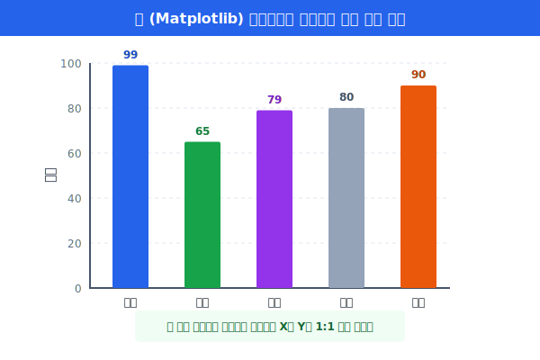
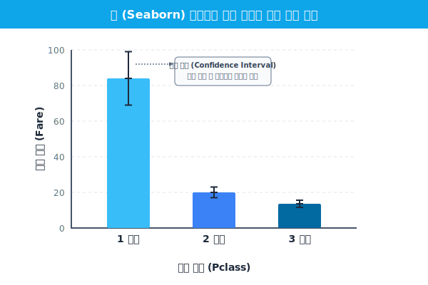

# 5.1.4 막대 그래프 (Bar Plot)의 원리

> 💾 **[실습 파일 다운로드]**
> 본 강의의 전체 실습 코드를 직접 실행해 볼 수 있는 주피터 노트북 파일입니다. 아래 링크를 클릭하여 다운로드 후 VS Code에서 열어보세요.
> - [📥 bar_plot_practice.ipynb 파일 다운로드](./bar_plot_practice.ipynb) (클릭 또는 마우스 우클릭 후 '다른 이름으로 링크 저장')

막대 그래프는 여러 **그룹(범주형 변수)**들의 크기, 판매량, 혹은 평균 수치 등을 비교할 때 가장 전 세계적으로 흔하게 사용하는 그래프입니다. 

## [실습 1] Matplotlib의 기본 막대그래프: `plt.bar()`

Matplotlib으로 직접 그릴 때는 X축 명찰 리스트와, Y축에 해당하는 정확한 값 리스트를 내가 직접 하나하나 입력해줘야 합니다.

```python
import matplotlib.pyplot as plt

# 데이터 직접 준비
name = ["영희", "철수", "동수", "미현", "현수"]
point = [99, 65, 79, 80, 90]

plt.figure(figsize=(6, 4))
# X에는 이름, Y(높이)에는 점수를 직접 지정합니다.
plt.bar(name, point, color=["blue", "green", "purple", "grey", "orange"])

plt.title('데이터분석 기말고사 점수')
plt.ylabel('점수')
plt.show()
```



만약 항목 이름이 매우 길면 가로 막대 그래프인 `plt.barh()`를 사용하면 글자가 겹치지 않아 좋습니다. 하지만 이런 방식은 원시 데이터(Raw Data)가 이미 말끔하게 집계되어 있을 때나 가능합니다. 

> 📌 **Q. 타이타닉 호 탑승객처럼 891명의 날것의 데이터가 있을 때는 어떻게 그려야 할까요?**
> 
> 💡 **A.** 두 가지 방법이 있습니다.
> 1. Pandas의 `groupby()` 등을 사용하여 직접 객실 등급별 평균 요금을 계산(집계)한 뒤 `plt.bar()`에 넣는다. (과정이 번거로움)
> 2. **Seaborn의 `barplot`을 사용한다.** (Raw 데이터를 통째로 넘기면 내부 통계 엔진이 알아서 평균과 오차를 계산부터 시각화까지 한 번에 처리해 줌!)

---

## [실습 2] Seaborn 막대그래프의 마법: `sns.barplot()`

앞서 5.2.4장에서 빈도수(인원수)를 세어 주는 `countplot`을 배웠습니다. 그렇다면 인원수가 아니라 그룹별 **평균값**을 구하고 싶을 때는 무엇을 쓸까요? 

> **용도**: "1등급 탑승객들의 **평균** 요금 달러 값과, 3등급 탑승객들의 **평균** 요금 달러 값을 막대그래프로 비교해줘!"

`barplot`은 그룹별(범주형)로 여러 개의 숫자(수치형)들이 뭉쳐 있을 때, **내부적으로 알아서 그룹별 평균을 구해서** 그 높이만큼 막대를 자동으로 세워줍니다.


```python
import seaborn as sns
import matplotlib.pyplot as plt

df = sns.load_dataset('titanic')

plt.figure(figsize=(6, 4))

# X에는 범주형(객실 등급), Y에는 수치형(운임 요금)을 넣습니다.
sns.barplot(data=df, x='pclass', y='fare')

plt.title("타이타닉 객실 등급별 평균 운임 요금")
plt.xlabel("객실 등급 (Pclass)")
plt.ylabel("평균 요금 (Fare)")

plt.show()
```



**[출력 원리 해석]**
- **막대의 높이 (평균)**: 1등급 요금 막대는 높이가 압도적으로 $80 위치에 솟아오르고, 3등급 요금 막대는 $13 부근에 짧게 그려집니다. 우리가 직접 평균값을 계산하지 않았는데도 Seaborn이 알아서 대신 구해 그려줍니다.
- **오차 막대 (Error Bar, 검은색 침)**: 막대 꼭대기에 꽂힌 까만색 바늘을 볼 수 있습니다. 이 검은 선은 **데이터의 오차(편차/신뢰구간)**를 보여줍니다. 1등급 막대에 꽂힌 침이 유독 상하로 길다는 뜻은, "1등급 승객들 내부에서도 요금을 10달러 낸 사람과 500달러 낸 사람 등 요금 차이(불평등)가 엄청 심하다!"라는 것을 시각적으로 알려주는 핵심 단서입니다.

---

## 🚨 최후의 요약: `countplot` VS `barplot`

마지막으로 초보자들이 가장 자주 헷갈리는 두 막대그래프를 확실히 구분합시다.

1. **`countplot(x=범주형)`** 
    - 역할: "**몇 명(몇 번)**이야?" 빈도수를 구합니다.
    - Y값 입력 여부: **X값 하나만 입력**하면 Y축(Count)은 기계가 알아서 세어줍니다.
2. **`barplot(x=범주형, y=수치형)`** 
    - 역할: "그래서 그룹별로 **평균 점수(요금등)**가 몇 점인데?"
    - Y값 입력 여부: **반드시 X와 Y 변수를 둘 다 입력**해야 합니다. 그러면 기계가 Y값들의 평균을 구해 그려줍니다.