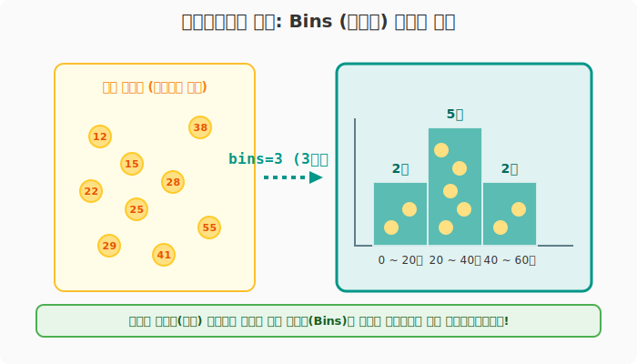
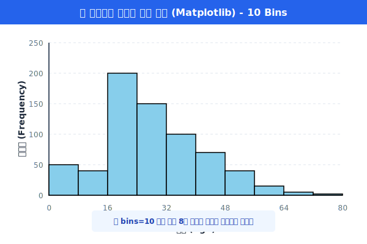
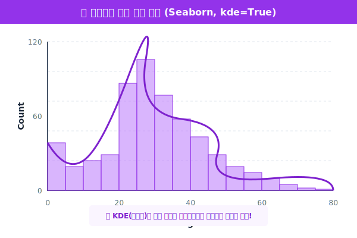
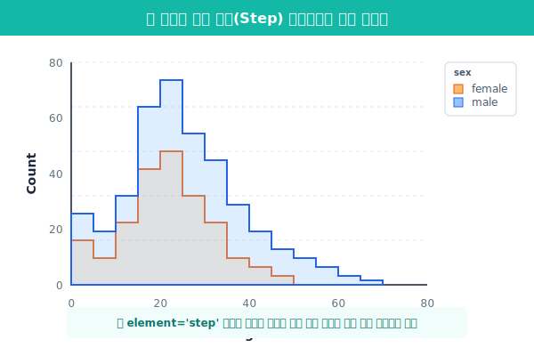

# 5.1.5 히스토그램 (Histogram) 완벽 해부

> 💾 **[실습 파일 다운로드]**
> 본 강의의 전체 실습 코드를 직접 실행해 볼 수 있는 주피터 노트북 파일입니다. 아래 링크를 클릭하여 다운로드 후 VS Code에서 열어보세요.
> - [📥 histogram_practice.ipynb 파일 다운로드](./histogram_practice.ipynb) (클릭 또는 마우스 우클릭 후 '다른 이름으로 링크 저장')

상자그림(Box Plot)이 데이터를 위에서 내려다보며 사분위수를 잘라서 보여준다면, **히스토그램(Histogram)**은 데이터들이 어느 점수대에 가장 많이 몰려있는지 산봉우리 모양으로 보여주는 그래프입니다.

## [실습 1] 히스토그램의 심장: Bins (양동이)

> **용도**: "타이타닉 탑승객들의 나이(`age`)가 20대가 많은지, 30대가 많은지 인구 분포를 보고 싶어."

수치형 데이터(예: 나이, 요금, 키)는 완전히 제각각이므로, 카운트플롯(`countplot`)처럼 하나하나 세는 것이 불가능합니다. 그래서 일정한 크기의 **구간(Bin, 양동이)**을 만들고, 그 구간에 들어가는 사람 수를 막대의 높이로 쌓아 올립니다.



```python
import seaborn as sns
import matplotlib.pyplot as plt

df = sns.load_dataset('titanic')

plt.figure(figsize=(6, 4))
# 막대 테두리를 검정(black)으로 해야 막대끼리 구분되어 예쁩니다.
plt.hist(df['age'].dropna(), bins=10, edgecolor='black', color='skyblue')

plt.title("타이타닉 탑승객 나이 분포 (Matplotlib)")
plt.xlabel("나이(Age)")
plt.ylabel("인원수(Frequency)")
plt.show()
```



**[출력 원리 해석]**
`bins=10` 옵션을 주었기 때문에, 0세부터 80세까지의 나이를 10개의 구간(양동이)으로 쪼갰습니다. (예: 0~8세 통, 8~16세 통...). 가운데 위치한 20대 후반 양동이 막대가 가장 높게 위로 솟아오른 것을 보아, 당시 20대 청년 승객이 가장 많았음을 한눈에 알 수 있습니다.

---

## [실습 2] 최신 트렌드: Seaborn의 `sns.histplot`과 KDE

최근 실무에서는 거친 막대 모양의 `plt.hist()`보다는, 똑같은 기능을 훨씬 세련되고 아름답게 제공하는 Seaborn의 `sns.histplot()`을 압도적으로 많이 사용합니다.

```python
plt.figure(figsize=(7, 5))
sns.set_theme(style="darkgrid")

# bins 대신 binwidth(양동이 하나의 너비)를 직접 지정할 수도 있습니다.
# kde=True 옵션은 막대들을 감싸는 부드러운 산봉우리 곡선을 함께 그려줍니다.
sns.histplot(data=df, x='age', binwidth=5, kde=True, color='purple')

plt.title("타이타닉 승객 나이 분포 (Seaborn)")
plt.show()
```



**[KDE (Kernel Density Estimation) 곡선이란?]**
막대그래프는 구간을 어떻게 자르느냐(`bins`)에 따라 모양이 우락부락하게 변해버리는 단점이 있습니다. 이를 보완하기 위해 막대들의 끝을 부드럽게 이어서 연속된 둥근 산봉우리처럼 등고선을 그려주는 것이 **KDE 곡선(커널 밀도 추정)**입니다. 이를 켜면 분포의 전체적인 뼈대 흐름을 훨씬 직관적으로 파악할 수 있습니다.

---

## [실습 3] 다중 그룹 겹쳐 그리기 (`hue`)

남성과 여성의 나이 분포를 비교하고 싶다면? Seaborn의 전매특허인 `hue` 마법을 또 쓸 수 있습니다! 두 개의 산봉우리가 겹치는 아름다운 그래프가 생성됩니다.

```python
plt.figure(figsize=(8, 5))

# hue='sex' : 성별로 색을 나눈다.
# element='step' : 겹친 부분을 계단식 선으로 깔끔하게 그려준다.
sns.histplot(data=df, x='age', hue='sex', element='step', linewidth=2)

plt.title("남녀별 나이 분포 겹쳐 그리기")
plt.show()
```



히스토그램은 데이터의 정규분포(종 모양) 허브를 파악하기 위한 최고의 무기입니다. 다음 장에서는 전체 중 내가 차지하는 파이를 보여주는 **파이 차트(Pie Chart)**의 올바른 사용법과 치명적 단점을 짚고 넘어갑니다.