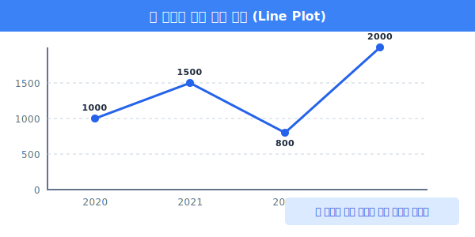
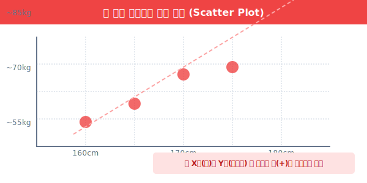
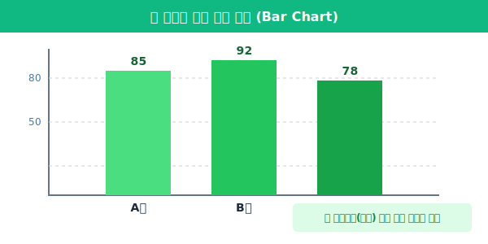
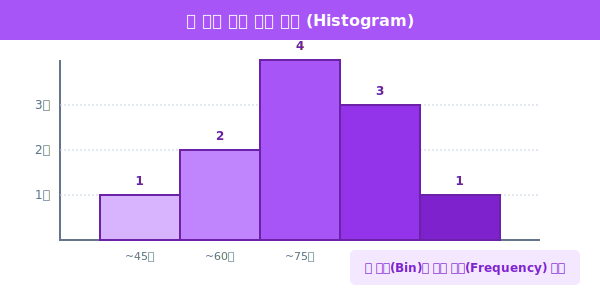
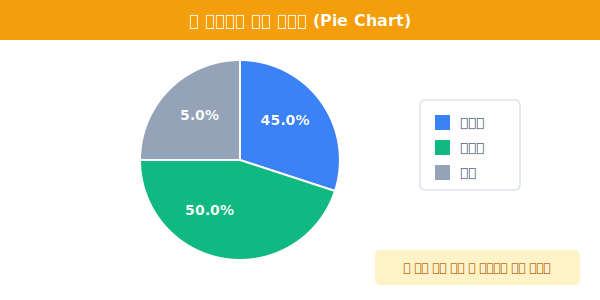

# 5.1.1 데이터 시각화 기초

## 5.1.1 데이터 시각화 개요

### ① 왜 시각화를 먼저 배울까요? (Why Visualization?)

> **데이터 시각화(Data Visualization)**: 데이터의 숨겨진 패턴과 이야기를 찾아내는 **탐정의 돋보기**입니다.

숫자는 거짓말을 할 수 있지만, 그리면 진실이 드러납니다. 유명한 **앤스콤의 4분할(Anscombe's Quartet)** 사례처럼, 네 그룹의 데이터가 평균과 분산, 상관계수까지 완벽하게 동일하더라도 막상 점을 찍어보면(산점도) 그 형태가 우상향 직선, 곡선, 이상치가 있는 형태 등으로 완전히 다릅니다. 이처럼 숫자에 매몰되지 않고 데이터가 가진 진짜 모습을 즉각적으로 파악하기 위해 우리는 파이썬의 꽃, 시각화를 분석 도구 중 가장 먼저 배웁니다.


---

### ② 시각화 패키지 생태계 핵심 요약

파이썬 환경에서는 모니터에 그림을 그리기 위해 크게 2가지 도구를 혼합하여 사용합니다.

- **Matplotlib (`plt`)**: 모든 차트의 도화지와 뼈대를 제공하는 파이썬의 가장 근본적인 시각화 도구. 세밀한 조절에 쓰입니다.
- **Seaborn (`sns`)**: 복잡한 통계적 차트(예: 평균, 오차, 분포 등)를 단 한 줄의 코드로 예쁘게 그려주는 현대적인 고급 템플릿입니다.

---

### ③ 5대 핵심 시각화 차트와 파이썬 기초 예제

데이터 분석 실무에서 가장 많이 쓰이는 5가지 기본 형태의 시각화 방법과, 그것들을 그리는 기초 파이썬 코드를 확인해 보겠습니다. 자세한 원리는 이후 단원들에서 파고들 예정이므로, 지금은 "아! 이렇게 코드를 짜면 이런 종류의 차트가 나오는구나"라는 감각만 익히시면 됩니다.

#### 1. 선 그래프 (Line Plot)
- **용도**: 시간의 흐름에 따른 데이터의 **추세(Trend)와 변화량** 확인 (예: 연도별 기온 변화, 주식 차트)
- **도구**: 시간 순으로 연결될 데이터들을 꺾은선으로 잇습니다.

```python
import matplotlib.pyplot as plt

# 1. 시계열(시간) 데이터 준비
years = [2020, 2021, 2022, 2023]
prices = [1000, 1500, 800, 2000]

# 2. 선 그리기
plt.plot(years, prices, color='blue', marker='o', linestyle='-')
plt.title('연도별 자산 가치 추세 (Line Plot)')
plt.show()
```




#### 2. 산점도 (Scatter Plot)
- **용도**: 두 변수 간의 **상관관계(상호 연관성)** 확인 (예: 광고비-매출액 관계, 키-몸무게 관계)
- **도구**: 수많은 점 데이터를 허공에 흩뿌리듯(scatter) 찍어 분포를 파악합니다.

```python
import matplotlib.pyplot as plt

# 1. 두 변수(X, Y) 데이터
heights = [160, 165, 170, 175, 180]
weights = [55, 60, 68, 70, 85]

# 2. 점 흩뿌리기
plt.scatter(heights, weights, color='red', s=100) # s는 점의 크기
plt.title('키와 몸무게의 선형 관계 (Scatter Plot)')
plt.show()
```




#### 3. 막대 그래프 (Bar Chart)
- **용도**: 서로 다른 **범주(Category) 간 데이터의 크기 비교** (예: 서울 vs 부산 인구수, 팀별 매출액)
- **도구**: 숫자의 양을 막대기의 높이나 길이로 나타내 직관적 비교를 수행합니다.

```python
import seaborn as sns
import matplotlib.pyplot as plt

# Seaborn을 통한 막대그래프: x는 범주, y는 수치
teams = ['A팀', 'B팀', 'C팀']
scores = [85, 92, 78]

sns.barplot(x=teams, y=scores, palette='viridis')
plt.title('부서별 평가 점수 비교 (Bar Chart)')
plt.show()
```




#### 4. 히스토그램 (Histogram)
- **용도**: 한 종류의 수치 데이터가 **어느 구간에 얼마나 몰려있는지(분포 밀집도)** 확인 (예: 전국 학생 성적 분포도)
- **도구**: 데이터를 일정한 간격의 바구니(Bins)로 나누어 해당 구간의 개수(Frequency)를 기둥으로 쌓아올립니다. 막대그래프와 달리 기둥들이 붙어있습니다.

```python
import matplotlib.pyplot as plt

# 수많은 임의의 점수 데이터 분포
math_scores = [35, 60, 65, 65, 70, 75, 80, 85, 85, 90, 95]

# bins=5: 데이터를 5개 구간(통)으로 썰어서 개수를 세어라!
plt.hist(math_scores, bins=5, color='purple', edgecolor='black')
plt.title('수학 점수 밀집 분포 (Histogram)')
plt.show()
```



#### 5. 파이 차트 (Pie Chart)
- **용도**: 전체 중 특정 대상이 차지하는 **비율(Proportion)**과 **소속감** 확인 (예: 득표율, 시장 점유율)
- **도구**: 원판을 항목의 비율만큼 조각(Slice) 케이크형태로 잘라냅니다. (값을 정확히 단번에 비교하기는 어려워 통계학적으로는 막대그래프를 더 선호하기도 합니다.)

```python
import matplotlib.pyplot as plt

labels = ['아이폰', '갤럭시', '기타']
sizes = [45, 50, 5] # 총합 비율

# 파이 나누기 (autopct: 퍼센트 출력 형식 지정)
plt.pie(sizes, labels=labels, autopct='%1.1f%%', startangle=90)
plt.title('스마트폰 시장 점유율 (Pie Chart)')
plt.show()
```




---

### ④ 애니메이션으로 보는 시각화 동작 원리

다음은 실제로 데이터(숫자 배열)가 모니터 세상에서 점과 선으로 바뀌는 렌더링 과정을 단순화한 애니메이션입니다. 파이썬에게 $X$, $Y$ 배열을 주면 파이썬은 투명한 2차원 공간을 열고 그곳에 데이터를 투영하는 원리입니다.


위 기초 개념과 예제 코드의 골격을 기억하시나요? 그렇다면 훌륭합니다! 다음 모듈부터는 이 그래프들을 자유자재로 다루며 데이터를 요리하는 Pandas와 어떻게 궁합을 맞추는지 생태계를 깊게 파헤쳐 보겠습니다.